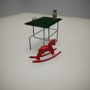
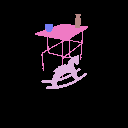
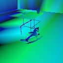
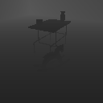
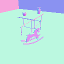

# Command API

**This document contains all commands currently available in TDW. For a usage guide, [read this](command_api_guide.md).**

# Table of Contents

**Command**

| Command | Description |
| --- | --- |
| [`add_magnebot`](#add_magnebot) | Add a Magnebot to the scene. For further documentation, see: Documentation/misc_frontend/robots.md For a high-level API, see: <ulink url="https://github.com/alters-mit/magnebot">https://github.com/alters-mit/magnebot</ulink> |
| [`apply_force`](#apply_force) | Apply a force into the world to an target position. The force will impact any objects between the origin and the target position. |
| [`create_avatar`](#create_avatar) | Create an avatar (agent). |
| [`create_empty_environment`](#create_empty_environment) | Create an empty environment. This must be called after load_scene.  |
| [`create_vr_rig`](#create_vr_rig) | Create an Oculus VR rig. For more information, see: Documentation/misc_frontend/vr.md |
| [`destroy_all_objects`](#destroy_all_objects) | Destroy all objects and avatars in the scene.  |
| [`do_nothing`](#do_nothing) | Do nothing. Useful for benchmarking.  |
| [`enable_reflection_probes`](#enable_reflection_probes) | Enable or disable the reflection probes in the scene. By default, the reflection probes are enabled. Disabling the reflection probes will yield less realistic images but will improve the speed of the simulation. |
| [`load_scene`](#load_scene) | Loads a new locally-stored scene. Unloads an existing scene (if any). This command must be sent before create_exterior_walls or create_empty_environment This command does not need to be sent along with an add_scene command. |
| [`pause_editor`](#pause_editor) | Pause Unity Editor.  |
| [`rotate_hdri_skybox_by`](#rotate_hdri_skybox_by) | Rotate the HDRI skybox by a given value and the sun light by the same value in the opposite direction, to maintain alignment. |
| [`send_nav_mesh_path`](#send_nav_mesh_path) | Tell the build to send data of a path on the NavMesh from the origin to the destination.  |
| [`set_ambient_intensity`](#set_ambient_intensity) | Set how much the ambient light fom the source affects the scene. Low values will darken the scene overall, to simulate evening /night light levels. |
| [`set_download_timeout`](#set_download_timeout) | Set the timeout after which an Asset Bundle Command (e.g. add_object) will retry a download. The default timeout is 30 minutes, which should always be sufficient. Send this command only if your computer or Internet connection is very slow. |
| [`set_floorplan_roof`](#set_floorplan_roof) | Show or hide the roof of a floorplan scene. This command only works if the current scene is a floorplan added via the add_scene command: "floorplan_1a", "floorplan_4b", etc.  |
| [`set_gravity_vector`](#set_gravity_vector) | Set the gravity vector in the scene. |
| [`set_hdri_skybox_exposure`](#set_hdri_skybox_exposure) | Set the exposure of the HDRI skybox to a given value. |
| [`set_physics_solver_iterations`](#set_physics_solver_iterations) | Set the number of physics solver iterations, which affects the overall accuracy of the physics engine. |
| [`set_render_quality`](#set_render_quality) | Set the render quality level. The highest render quality level enables near-photorealism runtime rendering. The lowest render quality has "flat" rendering, no shadows, etc. The lower the render quality, the faster the simulation will run, especially in scenes with complex lighting. |
| [`set_screen_size`](#set_screen_size) | Set the screen size. Any images the build creates will also be this size. |
| [`set_shadow_strength`](#set_shadow_strength) | Set the shadow strength of all lights in the scene. This only works if you already sent load_scene or add_scene. |
| [`set_sleep_threshold`](#set_sleep_threshold) | Set the global Rigidbody "sleep threshold", the mass-normalized energy threshold below which objects start going to sleep. A "sleeping" object is completely still until moved again by a force (object impact, force command, etc.) |
| [`set_socket_timeout`](#set_socket_timeout) | Set the timeout duration for the socket used to communicate with the controller. Occasionally, the build's socket will stop receiving messages from the controller. This is an inevitable consequence of how synchronous receive-response sockets work. When this happens, it will wait until the socket times out, close the socket, and alert the controller that it needs to re-send its message. The timeout duration shouldn't be less than the time required to send/receive commands, or the build will never receive anything! You should only send this command if it takes longer than the default timeout to send/receive commands. |
| [`set_target_framerate`](#set_target_framerate) | Set the target render framerate of the build. For more information: <ulink url="https://docs.unity3d.com/ScriptReference/Application-targetFrameRate.html">https://docs.unity3d.com/ScriptReference/Application-targetFrameRate.html</ulink> |
| [`set_time_step`](#set_time_step) | Set Time.fixedDeltaTime (Unity's physics step, as opposed to render time step). NOTE: Doubling the time_step is NOT equivalent to advancing two physics steps. For more information, see: <ulink url="https://docs.unity3d.com/Manual/TimeFrameManagement.html">https://docs.unity3d.com/Manual/TimeFrameManagement.html</ulink> |
| [`step_physics`](#step_physics) | Step through the physics without triggering new avatar output, or new commands. |
| [`terminate`](#terminate) | Terminate the build. |
| [`unload_asset_bundles`](#unload_asset_bundles) | Unloads all AssetBundles. Send this command only after destroying all objects in the scene. This command should be used only to free up memory. After sending it, you will need to re-download any objects you want to add to a scene.  |

**Asset Bundle Command**

| Command | Description |
| --- | --- |
| [`add_scene`](#add_scene) | Add a scene to TDW. Unloads the current scene if any (including any created by the load_scene command).  |

**Add Object Command**

| Command | Description |
| --- | --- |
| [`add_hdri_skybox`](#add_hdri_skybox) | Add a single HDRI skybox to the scene. It is highly recommended that the values of all parameters match those in the record metadata. If you assign your own values, the lighting will probably be strange.  |
| [`add_humanoid`](#add_humanoid) | Add a humanoid model to the scene.  |
| [`add_humanoid_animation`](#add_humanoid_animation) | Load an animation clip asset bundle into memory.  |
| [`add_robot`](#add_robot) | Add a robot to the scene. For further documentation, see: Documentation/misc_frontend/robots.md  |

**Add Material Command**

| Command | Description |
| --- | --- |
| [`add_material`](#add_material) | Load a material asset bundle into memory. If you want to set the visual material of something in TDW (e.g. set_visual_material), you must first send this command.  |
| [`send_material_report`](#send_material_report) | Tell the build to send a report of a material asset bundle. Each report will be a separate LogMessage.  |

**Add Model Command**

| Command | Description |
| --- | --- |
| [`add_object`](#add_object) | Add a single object from a model library or from a local asset bundle to the scene.  |
| [`send_model_report`](#send_model_report) | Tell the build to send a report of a model asset bundle. Each report will be a separate LogMessage.  |

**Avatar Command**

| Command | Description |
| --- | --- |
| [`destroy_avatar`](#destroy_avatar) | Destroy an avatar.  |
| [`enable_avatar_transparency`](#enable_avatar_transparency) | Enable transparency (the "alpha" channel, or "a" value in the color) on the avatar's visual materials. To set the color of an avatar, send set_avatar_color |
| [`follow_object`](#follow_object) | Teleport the avatar to a position relative to a target. This must be sent per-frame to continuously follow the target. |
| [`rotate_avatar_by`](#rotate_avatar_by) | Rotate the avatar by a given angle around a given axis.  |
| [`rotate_avatar_to`](#rotate_avatar_to) | Set the rotation quaternion of the avatar.  |
| [`rotate_avatar_to_euler_angles`](#rotate_avatar_to_euler_angles) | Set the rotation of the avatar with Euler angles.  |
| [`scale_avatar`](#scale_avatar) | Scale the avatar's size by a factor from its current scale. |
| [`set_avatar_collision_detection_mode`](#set_avatar_collision_detection_mode) | Set the collision mode of all of the avatar's Rigidbodies. This doesn't need to be sent continuously, but does need to be sent per avatar.  |
| [`set_avatar_color`](#set_avatar_color) | Set the color of an avatar. To allow transparency (the "alpha" channel, or "a" value in the color), first send enable_avatar_transparency |
| [`set_avatar_forward`](#set_avatar_forward) | Set the forward directional vector of the avatar.  |
| [`set_camera_clipping_planes`](#set_camera_clipping_planes) | Set the near and far clipping planes of the avatar's camera. |
| [`set_field_of_view`](#set_field_of_view) | Set the field of view of all active cameras of the avatar. If you don't want certain cameras to be modified: Send toggle_image_sensor to deactivate the associated ImageSensor component. Then send this command. Then send toggle_image_sensor again.  |
| [`set_pass_masks`](#set_pass_masks) | Set which types of images the avatar will render. By default, the avatar will render, but not send, these images. See send_images in the Command API.  |
| [`teleport_avatar_to`](#teleport_avatar_to) | Teleport the avatar to a position.  |

**Add Audio Sensor Command**

| Command | Description |
| --- | --- |
| [`add_audio_sensor`](#add_audio_sensor) | Add an AudioSensor component to the avatar, if it does not already have one. |
| [`add_environ_audio_sensor`](#add_environ_audio_sensor) | Add a ResonanceAudioListener component to the avatar, if it does not already have one. |

**Avatar Rigidbody Command**

| Command | Description |
| --- | --- |
| [`apply_force_to_avatar`](#apply_force_to_avatar) | Apply a force to the avatar.  |
| [`move_avatar_forward_by`](#move_avatar_forward_by) | Apply a force along the avatar's forward directional vector.  |
| [`move_avatar_to`](#move_avatar_to) | Move the position of the avatar's rigidbody. This is very similar to teleport_avatar_to, but it is a physics-based motion, and will comply with physics interpolation.  |
| [`set_avatar_drag`](#set_avatar_drag) | Set the drag of the avatar's Rigidbody. Both drag and angular_drag can be safely changed on-the-fly.  |
| [`set_avatar_kinematic_state`](#set_avatar_kinematic_state) | Set an avatars's Rigidbody to be kinematic or not. A kinematic object won't respond to PhysX physics.  |
| [`set_avatar_mass`](#set_avatar_mass) | Set the mass of an avatar. |
| [`set_avatar_physic_material`](#set_avatar_physic_material) | Set the physic material of the avatar's main body collider and apply friction and bounciness values. Friction and bounciness don't affect physics as much as drag and angular_drag (see set_avatar_drag). LOW friction values and HIGH bounciness means that the avatar won't "climb" up other objects. |
| [`turn_avatar_by`](#turn_avatar_by) | Apply a relative torque to the avatar.  |

**Avatar Type Command**

| Command | Description |
| --- | --- |
| [`set_avatar_rigidbody_constraints`](#set_avatar_rigidbody_constraints) | Set the rigidbody constraints of a Sticky Mitten Avatar.  |

**Nav Mesh Avatar Command**

| Command | Description |
| --- | --- |
| [`set_nav_mesh_avatar`](#set_nav_mesh_avatar) | Set the pathfinding parameters of a NavMeshAvatar. You should send this command before beginning navigation, but it can also be adjusted on-the-fly. |
| [`set_nav_mesh_avatar_destination`](#set_nav_mesh_avatar_destination) | Set the target destination of a NavMeshAvatar. |

**Simple Body Command**

| Command | Description |
| --- | --- |
| [`change_avatar_body`](#change_avatar_body) | Change the body of a SimpleBodyAvatar. |

**Sticky Mitten Avatar Command**

| Command | Description |
| --- | --- |
| [`rotate_head_by`](#rotate_head_by) | Rotate the head by a given axis of rotation by a given angle. The angle is clamped as follows: pitch: -55 to 55. roll: -55 to 55. yaw: -85 to 85.  |
| [`rotate_waist`](#rotate_waist) | Rotate the waist of a StickyMittenAvatar.  |
| [`set_sticky_mitten_profile`](#set_sticky_mitten_profile) | Set the parameters of the avatar, arms, and mittens.  |

**Arm Joint Command**

| Command | Description |
| --- | --- |
| [`stop_arm_joint`](#stop_arm_joint) | Set the target angle of a joint to the current angle, stopping rotation. If the arm can't support the mass of the object(s) it's holding, this command won't override the overall "strength" of the arm; the arm will still fall until it can support itself.  |

**Bend Arm Joint Command**

| Command | Description |
| --- | --- |
| [`bend_arm_joint_by`](#bend_arm_joint_by) | Bend the arm joint by an angle. The angle is added to the current joint angle.  |
| [`bend_arm_joint_to`](#bend_arm_joint_to) | Bend the arm joint to the target angle.  |

**Joint Angular Drag Command**

| Command | Description |
| --- | --- |
| [`adjust_joint_angular_drag_by`](#adjust_joint_angular_drag_by) | Adjust the angular drag of a joint of a Sticky Mitten Avatar by a delta. A higher angular drag will cause the joint to bend slower.  |
| [`set_joint_angular_drag`](#set_joint_angular_drag) | Set the angular drag of a joint of a Sticky Mitten Avatar. A higher angular drag will cause the joint to bend slower.  |

**Joint Spring Command**

| Command | Description |
| --- | --- |
| [`adjust_joint_damper_by`](#adjust_joint_damper_by) | Adjust the current damper of a joint of a Sticky Mitten Avatar by a given delta. A higher damper value will cause the joint to slow down faster.  |
| [`adjust_joint_force_by`](#adjust_joint_force_by) | Adjust the current force of a joint of a Sticky Mitten Avatar by a given delta.  |
| [`set_joint_damper`](#set_joint_damper) | Set the damper of a joint of a Sticky Mitten Avatar. A higher damper value will cause the joint to slow down faster.  |
| [`set_joint_force`](#set_joint_force) | Set the force of a joint of a Sticky Mitten Avatar.  |

**Use Mitten Command**

| Command | Description |
| --- | --- |
| [`put_down`](#put_down) | Put down all objects held by the mitten.  |
| [`set_stickiness`](#set_stickiness) | Set the stickiness of one sub-mitten of the mitten.  |

**Pick Up Command**

| Command | Description |
| --- | --- |
| [`pick_up`](#pick_up) | Pick up all objects that any sticky side of the mitten is touching.  |
| [`pick_up_proximity`](#pick_up_proximity) | Pick up all objects within an emitted volume defined by a radius and a distance. See Sticky Mitten Avatar documentation for more information.  |

**Sensor Container Command**

| Command | Description |
| --- | --- |
| [`enable_image_sensor`](#enable_image_sensor) | Turn a sensor on or off. The command set_pass_masks will override this command (i.e. it will turn on a camera that has been turned off), |
| [`focus_on_object`](#focus_on_object) | Set the post-process depth of field focus distance to equal the distance between the avatar and an object. This won't adjust the angle or position of the avatar's camera.  |
| [`look_at`](#look_at) | Look at an object (rotate the image sensor to center the object in the frame). |
| [`look_at_avatar`](#look_at_avatar) | Look at another avatar (rotate the image sensor to center the avatar in the frame). |
| [`look_at_position`](#look_at_position) | Look at a worldspace position (rotate the image sensor to center the position in the frame). |
| [`reset_sensor_container_rotation`](#reset_sensor_container_rotation) | Reset the rotation of the avatar's sensor container. |
| [`rotate_sensor_container_by`](#rotate_sensor_container_by) | Rotate the sensor container of the avatar by a given angle along a given axis. |
| [`rotate_sensor_container_to`](#rotate_sensor_container_to) | Set the rotation quaternion of the avatar's sensor container. |
| [`set_anti_aliasing`](#set_anti_aliasing) | Set the anti-aliasing mode for the avatar's camera.  |
| [`translate_sensor_container_by`](#translate_sensor_container_by) | Translate the sensor container relative to the avatar by a given directional vector. |

**Create Reverb Space Command**

| Command | Description |
| --- | --- |
| [`set_reverb_space_expert`](#set_reverb_space_expert) | Create a ResonanceAudio Room, sized to the dimensions of the current room environment. All values are passed in as parameters. |
| [`set_reverb_space_simple`](#set_reverb_space_simple) | Create a ResonanceAudio Room, sized to the dimensions of the current room environment. Reflectivity (early reflections) and reverb brightness (late reflections) calculated automatically based on size of space and percentage filled with objects. |

**Flex Container Command**

| Command | Description |
| --- | --- |
| [`create_flex_container`](#create_flex_container) | Create a Flex Container. The ID of this container is the quantity of containers in the scene prior to adding it.  |
| [`destroy_flex_container`](#destroy_flex_container) | Destroy an existing Flex container. Only send this command after destroying all Flex objects in the scene.  |

**Global Boolean Command**

| Command | Description |
| --- | --- |
| [`set_img_pass_encoding`](#set_img_pass_encoding) | Toggle the _img pass of all avatars' cameras to be either png or jpg. True = png, False = jpg, Initial value = True (png) |
| [`set_legacy_shaders`](#set_legacy_shaders) | Set whether TDW should use legacy shaders. Prior to TDW v1.8 there was a bug and this command would result in lower image quality. Since then, TDW has far better rendering quality (at no speed penalty). Send this command only if you began your project in an earlier version of TDW and need to ensure that the rendering doesn't change. Initial value = False. (TDW will correctly set each object's shaders.) |
| [`set_post_process`](#set_post_process) | Toggle whether post-processing is enabled in the scene. Disabling post-processing will make rendered images "flatter". Initial value = True (post-processing is enabled) |
| [`simulate_physics`](#simulate_physics) | Toggle whether to simulate physics per list of sent commands (i.e. per frame). If false, the simulation won't step the physics forward. Initial value = True (simulate physics per frame). |

**Load From Resources**

**Load Game Object From Resources**

| Command | Description |
| --- | --- |
| [`load_flex_fluid_from_resources`](#load_flex_fluid_from_resources) | Load a FlexFluidPrimitive from resources.  |
| [`load_flex_fluid_source_from_resources`](#load_flex_fluid_source_from_resources) | Load a FlexFluidSource mesh from resources.  |
| [`load_primitive_from_resources`](#load_primitive_from_resources) | Load a primitive object from resources. |

**Nav Mesh Command**

| Command | Description |
| --- | --- |
| [`bake_nav_mesh`](#bake_nav_mesh) | Bake the NavMesh, enabling Unity pathfinding. This must be sent before any other Nav Mesh Commands, and after creating the scene environment (e.g. the procedurally generated room).  |
| [`send_is_on_nav_mesh`](#send_is_on_nav_mesh) | Given a position, try to get the nearest position on the NavMesh.  |

**Object Command**

| Command | Description |
| --- | --- |
| [`add_trigger_collider`](#add_trigger_collider) | Add a trigger collider to an object. Trigger colliders are non-physics colliders that will merely detect if they intersect with something. You can use this to detect whether one object is inside another. The side, position, and rotation of the trigger collider always matches that of the parent object. Per trigger event, the trigger collider will send output data depending on which of the enter, stay, and exit booleans are True.  |
| [`destroy_object`](#destroy_object) | Destroy an object.  |
| [`make_nav_mesh_obstacle`](#make_nav_mesh_obstacle) | Make a specific object a NavMesh obstacle. If it is already a NavMesh obstacle, change its properties. An object is already a NavMesh obstacle if you've sent the bake_nav_mesh or make_nav_mesh_obstacle command.  |
| [`object_look_at`](#object_look_at) | Set the object's rotation such that its forward directional vector points towards another object's position. |
| [`object_look_at_position`](#object_look_at_position) | Set the object's rotation such that its forward directional vector points towards another position. |
| [`rotate_object_by`](#rotate_object_by) | Rotate an object by a given angle around a given axis. |
| [`rotate_object_to`](#rotate_object_to) | Set the rotation quaternion of the object. |
| [`rotate_object_to_euler_angles`](#rotate_object_to_euler_angles) | Set the rotation of the object with Euler angles.  |
| [`scale_object`](#scale_object) | Scale the object by a factor from its current scale. |
| [`set_color`](#set_color) | Set the albedo RGBA color of an object.  |
| [`set_graspable`](#set_graspable) | Make an object graspable for a VR rig with Oculus touch controllers.  |
| [`set_physic_material`](#set_physic_material) | Set the physic material of an object and apply friction and bounciness values to the object. These settings can be overriden by sending the command again, or by assigning a semantic material via set_semantic_material_to. |
| [`teleport_object`](#teleport_object) | Teleport an object to a new position. |

**Flex Object Command**

| Command | Description |
| --- | --- |
| [`apply_forces_to_flex_object_base64`](#apply_forces_to_flex_object_base64) | Apply a directional force to the FlexActor object.  |
| [`apply_force_to_flex_object`](#apply_force_to_flex_object) | Apply a directional force to the FlexActor object.  |
| [`assign_flex_container`](#assign_flex_container) | Assign the FlexContainer of the object.  |
| [`destroy_flex_object`](#destroy_flex_object) | Destroy the Flex object. This will leak memory (due to a bug in the Flex library that we can't fix), but will leak <emphasis>less</emphasis> memory than destroying a Flex-enabled object with <computeroutput>destroy_object</computeroutput>.  |
| [`rotate_flex_object_by`](#rotate_flex_object_by) | Rotate a Flex object by a given angle around a given axis.  |
| [`rotate_flex_object_by_quaternion`](#rotate_flex_object_by_quaternion) | Rotate a Flex object by a given quaternion.  |
| [`rotate_flex_object_to`](#rotate_flex_object_to) | Rotate a Flex object to a new rotation.  |
| [`set_flex_object_mass`](#set_flex_object_mass) | Set the mass of the Flex object. The mass is distributed equally across all particles. Thus the particle mass equals mass divided by number of particles.  |
| [`set_flex_particles_mass`](#set_flex_particles_mass) | Set the mass of all particles in the Flex object. Thus, the total object mass equals the number of particles times the particle mass.  |
| [`set_flex_particle_fixed`](#set_flex_particle_fixed) | Fix the particle in the Flex object, such that it does not move.  |
| [`teleport_and_rotate_flex_object`](#teleport_and_rotate_flex_object) | Teleport a Flex object to a new position and rotation.  |
| [`teleport_flex_object`](#teleport_flex_object) | Teleport a Flex object to a new position.  |

**Object Type Command**

| Command | Description |
| --- | --- |
| [`add_constant_force`](#add_constant_force) | Add a constant force to an object. Every frame, this force will be applied to the Rigidbody. Unlike other force commands, this command will provide gradual acceleration rather than immediate impulse; it is thus more useful for animation than a deterministic physics simulation. |
| [`add_fixed_joint`](#add_fixed_joint) | Attach the object to a parent object using a FixedJoint. |
| [`apply_force_at_position`](#apply_force_at_position) | Apply a force to an object from a position. From Unity documentation: For realistic effects position should be approximately in the range of the surface of the rigidbody. Note that when position is far away from the center of the rigidbody the applied torque will be unrealistically large. |
| [`apply_force_magnitude_to_object`](#apply_force_magnitude_to_object) | Apply a force of a given magnitude along the forward directional vector of the object. |
| [`apply_force_to_object`](#apply_force_to_object) | Applies a directional force to the object's rigidbody. |
| [`apply_torque_to_object`](#apply_torque_to_object) | Apply a torque to the object's rigidbody. |
| [`set_color_in_substructure`](#set_color_in_substructure) | Set the color of a specific child object in the model's substructure. See: ModelRecord.substructure in the ModelLibrarian API. |
| [`set_kinematic_state`](#set_kinematic_state) | Set an object's Rigidbody to be kinematic or not. A kinematic object won't respond to PhysX physics. |
| [`set_mass`](#set_mass) | Set the mass of an object. |
| [`set_object_collision_detection_mode`](#set_object_collision_detection_mode) | Set the collision mode of an objects's Rigidbody. This doesn't need to be sent continuously, but does need to be sent per object.  |
| [`set_object_drag`](#set_object_drag) | Set the drag of an object's RigidBody. Both drag and angular_drag can be safely changed on-the-fly. |
| [`set_primitive_visual_material`](#set_primitive_visual_material) | Set the material of an object created via load_primitive_from_resources  |
| [`set_semantic_material_to`](#set_semantic_material_to) | Sets or creates the semantic material category of an object.  |
| [`show_collider_hulls`](#show_collider_hulls) | Show the collider hulls of the object.  |

**Humanoid Command**

| Command | Description |
| --- | --- |
| [`destroy_humanoid`](#destroy_humanoid) | Destroy a humanoid.  |
| [`play_humanoid_animation`](#play_humanoid_animation) | Play a motion capture animation on a humanoid. The animation must already be in memory via the add_humanoid_animation command. |
| [`stop_humanoid_animation`](#stop_humanoid_animation) | Stop a motion capture animation on a humanoid. |

**Sub Object Command**

| Command | Description |
| --- | --- |
| [`set_motor`](#set_motor) | Set the target velocity and force of a motor.  |
| [`set_spring`](#set_spring) | Set the target position of a spring.  |
| [`set_sub_object_light`](#set_sub_object_light) | Turn a light on or off.  |

**Visual Material Command**

| Command | Description |
| --- | --- |
| [`set_texture_scale`](#set_texture_scale) | Set the scale of the tiling of the material's main texture. |
| [`set_visual_material`](#set_visual_material) | Set a visual material of an object or one of its sub-objects.  |

**Play Audio Data Command**

| Command | Description |
| --- | --- |
| [`play_audio_data`](#play_audio_data) | Play a sound, using audio sample data sent over from the controller. |
| [`play_point_source_data`](#play_point_source_data) | Make this object a ResonanceAudioSoundSource and play the audio data. |

**Set Flex Actor**

| Command | Description |
| --- | --- |
| [`create_flex_fluid_object`](#create_flex_fluid_object) | Create or adjust a FlexArrayActor as a fluid object.  |
| [`create_flex_fluid_source_actor`](#create_flex_fluid_source_actor) | Create or adjust a FlexSourceActor as a fluid "hose pipe" source.  |
| [`set_flex_cloth_actor`](#set_flex_cloth_actor) | Create or adjust a FlexClothActor for the object.  |
| [`set_flex_soft_actor`](#set_flex_soft_actor) | Create or adjust a FlexSoftActor for the object.  |
| [`set_flex_solid_actor`](#set_flex_solid_actor) | Create or adjust a FlexSolidActor for the object.  |

**Show Hide Object**

| Command | Description |
| --- | --- |
| [`hide_object`](#hide_object) | Hide the object. |
| [`show_object`](#show_object) | Show the object. |

**Painting Command**

| Command | Description |
| --- | --- |
| [`create_painting`](#create_painting) | Create a blank "painting" in the scene. |
| [`destroy_painting`](#destroy_painting) | Destroy an existing painting. |

**Adjust Painting Command**

| Command | Description |
| --- | --- |
| [`hide_painting`](#hide_painting) | Hide a visible painting. |
| [`rotate_painting_by`](#rotate_painting_by) | Rotate a painting by a given angle around a given axis. |
| [`rotate_painting_to_euler_angles`](#rotate_painting_to_euler_angles) | Set the rotation of the painting with Euler angles.  |
| [`scale_painting`](#scale_painting) | Scale a painting by a factor. |
| [`set_painting_texture`](#set_painting_texture) | Apply a texture to a pre-existing painting.  |
| [`show_painting`](#show_painting) | Show a painting that was hidden. |
| [`teleport_painting`](#teleport_painting) | Teleport a painting to a new position. |

**Position Marker Command**

| Command | Description |
| --- | --- |
| [`add_position_marker`](#add_position_marker) | Create a non-physics, non-interactive marker at a position in the scene.  |
| [`remove_position_markers`](#remove_position_markers) | Remove all position markers from the scene.  |

**Post Process Command**

| Command | Description |
| --- | --- |
| [`set_ambient_occlusion_intensity`](#set_ambient_occlusion_intensity) | Set the intensity (darkness) of the Ambient Occlusion effect. |
| [`set_ambient_occlusion_thickness_modifier`](#set_ambient_occlusion_thickness_modifier) | Set the Thickness Modifer for the Ambient Occlusion effect<ndash /> controls "spread" of the effect out from corners. |
| [`set_aperture`](#set_aperture) | Set the depth-of-field aperture in post processing volume.  |
| [`set_contrast`](#set_contrast) | Set the contrast value of the post-processing color grading. |
| [`set_focus_distance`](#set_focus_distance) | Set the depth-of-field focus distance in post processing volume.  |
| [`set_post_exposure`](#set_post_exposure) | Set the post-exposure value of the post-processing. A higher value will create a brighter image. We don't recommend values less than 0, or greater than 2. |
| [`set_saturation`](#set_saturation) | Set the saturation value of the post-processing color grading. |
| [`set_screen_space_reflections`](#set_screen_space_reflections) | Turn ScreenSpaceReflections on or off. |
| [`set_vignette`](#set_vignette) | Enable or disable the vignette, which darkens the image at the edges. |

**Proc Gen Room Command**

| Command | Description |
| --- | --- |
| [`convexify_proc_gen_room`](#convexify_proc_gen_room) | Set all environment colliders (walls, ceilings, and floor) to convex. This command only affects existing objects, and won't continuously convexify new objects. You should only use this command when using Flex objects, as some objects with convex colliders won't behave as expected.  |
| [`create_proc_gen_ceiling`](#create_proc_gen_ceiling) | Create a ceiling for the procedurally generated room. The ceiling is divided into 1x1 "tiles", which can be manipulated with Proc Gen Ceiling Tiles Commands (see below).  |
| [`destroy_proc_gen_ceiling`](#destroy_proc_gen_ceiling) | Destroy all ceiling tiles in a procedurally-generated room. |
| [`set_proc_gen_ceiling_color`](#set_proc_gen_ceiling_color) | Set the albedo RGBA color of the ceiling.  |
| [`set_proc_gen_ceiling_height`](#set_proc_gen_ceiling_height) | Set the height of all ceiling tiles in a proc-gen room. |
| [`set_proc_gen_ceiling_texture_scale`](#set_proc_gen_ceiling_texture_scale) | Set the scale of the tiling of the ceiling material's main texture. |
| [`set_proc_gen_reflection_probe`](#set_proc_gen_reflection_probe) | Toggle the reflection probe in a procedurally generated room. By default, the reflection probe is active. Deactivating the reflection probe will yield less realistic images but better framerates.  |
| [`set_proc_gen_walls_color`](#set_proc_gen_walls_color) | Set the albedo RGBA color of the walls. |
| [`set_proc_gen_walls_texture_scale`](#set_proc_gen_walls_texture_scale) | Set the texture scale of all walls in a proc-gen room. |

**Proc Gen Ceiling Tiles Command**

| Command | Description |
| --- | --- |
| [`create_proc_gen_ceiling_tiles`](#create_proc_gen_ceiling_tiles) | Create new ceiling tiles in a procedurally generated room. If you just want to fill the ceiling with tiles, send the command create_ceiling instead.  |
| [`destroy_proc_gen_ceiling_tiles`](#destroy_proc_gen_ceiling_tiles) | Destroy ceiling tiles from a procedurally-created ceiling.  |

**Proc Gen Floor Command**

| Command | Description |
| --- | --- |
| [`set_proc_gen_floor_color`](#set_proc_gen_floor_color) | Set the albedo RGBA color of the floor.  |
| [`set_proc_gen_floor_texture_scale`](#set_proc_gen_floor_texture_scale) | Set the scale of the tiling of the floor material's main texture. |

**Proc Gen Material Command**

| Command | Description |
| --- | --- |
| [`set_proc_gen_ceiling_material`](#set_proc_gen_ceiling_material) | Set the material of a procedurally-generated ceiling.  |
| [`set_proc_gen_floor_material`](#set_proc_gen_floor_material) | Set the material of a procedurally-generated floor.  |
| [`set_proc_gen_walls_material`](#set_proc_gen_walls_material) | Set the material of all procedurally-generated walls.  |

**Proc Gen Walls Command**

| Command | Description |
| --- | --- |
| [`create_exterior_walls`](#create_exterior_walls) | Create the exterior walls. This must be called before all other ProcGenRoomCommands.  |
| [`create_interior_walls`](#create_interior_walls) | Create the interior walls.  |
| [`set_proc_gen_walls_scale`](#set_proc_gen_walls_scale) | Set the scale of proc-gen wall sections. |

**Robot Command**

| Command | Description |
| --- | --- |
| [`destroy_robot`](#destroy_robot) | Destroy a robot in the scene. |
| [`parent_avatar_to_robot`](#parent_avatar_to_robot) | Parent an avatar to a robot. The avatar's position and rotation will always be relative to the robot. Usually you'll want to do this to add a camera to the robot. |
| [`set_immovable`](#set_immovable) | Set whether or not the root object of the robot is immovable. Its joints will still be moveable. |
| [`teleport_robot`](#teleport_robot) | Teleport the robot to a new position and rotation. This is a sudden movement that might disrupt the physics simulation. You should only use this command if you really need to (for example, if the robot falls over). |

**Magnebot Command**

| Command | Description |
| --- | --- |
| [`detach_from_magnet`](#detach_from_magnet) | Detach an object from a Magnebot magnet. |
| [`set_magnet_targets`](#set_magnet_targets) | Set the objects that the Magnebot magnet will try to pick up. |

**Robot Joint Command**

| Command | Description |
| --- | --- |
| [`set_robot_joint_drive`](#set_robot_joint_drive) | Set static joint drive parameters for a robot joint. Use the StaticRobot output data to determine which drives (x, y, and z) the joint has and what their default values are. |
| [`set_robot_joint_mass`](#set_robot_joint_mass) | Set the mass of a robot joint. To get the default mass, see the StaticRobot output data. |

**Robot Joint Target Command**

| Command | Description |
| --- | --- |
| [`set_prismatic_target`](#set_prismatic_target) | Set the target position of a prismatic robot joint. Per frame, the joint will move towards the target until it is either no longer possible to do so (i.e. due to physics) or because it has reached the target position. |
| [`set_revolute_target`](#set_revolute_target) | Set the target angle of a revolute robot joint. Per frame, the joint will revolve towards the target until it is either no longer possible to do so (i.e. due to physics) or because it has reached the target angle. |
| [`set_spherical_target`](#set_spherical_target) | Set the target angles (x, y, z) of a spherical robot joint. Per frame, the joint will revolve towards the targets until it is either no longer possible to do so (i.e. due to physics) or because it has reached the target angles. |

**Singleton Subscriber Command**

| Command | Description |
| --- | --- |
| [`send_collisions`](#send_collisions) | Send collision data for all objects and avatars <emphasis>currently</emphasis> in the scene.  |
| [`send_log_messages`](#send_log_messages) | Send log messages to the controller.  |

**Send Data Command**

| Command | Description |
| --- | --- |
| [`send_magnebots`](#send_magnebots) | Send data for each Magnebot in the scene.  |
| [`send_robots`](#send_robots) | Send dynamic data (position, rotation, velocity, etc.) of each robot and each robot's body parts in the scene. See also: send_static_robots  |
| [`send_static_robots`](#send_static_robots) | Send static data that doesn't update per frame (such as segmentation colors) for each robot in the scene. See also: send_robots  |
| [`send_substructure`](#send_substructure) | Send visual material substructure data for a single object.  |

**Send Avatars Command**

| Command | Description |
| --- | --- |
| [`send_avatars`](#send_avatars) | Send data for avatars in the scene.  |
| [`send_avatar_segmentation_colors`](#send_avatar_segmentation_colors) | Send avatar segmentation color data.  |
| [`send_camera_matrices`](#send_camera_matrices) | Send camera matrix data for each camera.  |
| [`send_id_pass_grayscale`](#send_id_pass_grayscale) | Send the average grayscale value of an _id pass.  |
| [`send_id_pass_segmentation_colors`](#send_id_pass_segmentation_colors) | Send all unique colors in an _id pass.  |
| [`send_images`](#send_images) | Send images and metadata.  |
| [`send_image_sensors`](#send_image_sensors) | Send data about each of the avatar's ImageSensors.  |
| [`send_screen_positions`](#send_screen_positions) | Given a list of worldspace positions, return the screenspace positions according to each of the avatar's camera.  |

**Send Overlap Command**

| Command | Description |
| --- | --- |
| [`send_overlap_box`](#send_overlap_box) | Check which objects a box-shaped space overlaps with.  |
| [`send_overlap_capsule`](#send_overlap_capsule) | Check which objects a capsule-shaped space overlaps with.  |
| [`send_overlap_sphere`](#send_overlap_sphere) | Check which objects a sphere-shaped space overlaps with.  |

**Send Raycast Command**

| Command | Description |
| --- | --- |
| [`send_raycast`](#send_raycast) | Cast a ray from the origin to the destination.  |
| [`send_spherecast`](#send_spherecast) | Cast a sphere along a direction and return the results. The can be multiple hits, each of which will be sent to the controller as Raycast data.  |

**Send Single Data Command**

| Command | Description |
| --- | --- |
| [`send_composite_objects`](#send_composite_objects) | Send data for every composite object in the scene.  |
| [`send_environments`](#send_environments) | Receive data about the environment(s) in the scene. Only send this command after initializing the environment in one of two ways: 1) create_exterior_walls, 2) load_streamed_scene  |
| [`send_humanoids`](#send_humanoids) | Send transform (position, rotation, etc.) data for humanoids in the scene.  |
| [`send_junk`](#send_junk) | Send junk data.  |
| [`send_keyboard`](#send_keyboard) | Request keyboard input data.  |
| [`send_version`](#send_version) | Receive data about the build version.  |
| [`send_vr_rig`](#send_vr_rig) | Send data for a VR Rig currently in the scene.  |

**Send Objects Block Command**

| Command | Description |
| --- | --- |
| [`send_flex_particles`](#send_flex_particles) | Send Flex particles data.  |
| [`send_meshes`](#send_meshes) | Send mesh data. All requested objects MUST have readable meshes; otherwise, this command will throw unhandled C++ errors. To determine whether an object has a readable mesh, check if: record.flex == True For more information, read: Documentation/python/librarian/model_librarian.md  |

**Send Objects Data Command**

| Command | Description |
| --- | --- |
| [`send_audio_sources`](#send_audio_sources) | Send data regarding whether each object in the scene is currently playing a sound.  |
| [`send_bounds`](#send_bounds) | Send rotated bounds data of objects in the scene.  |
| [`send_rigidbodies`](#send_rigidbodies) | Send Rigidbody (velocity, mass, etc.) data of objects in the scene.  |
| [`send_segmentation_colors`](#send_segmentation_colors) | Send segmentation color data for objects in the scene.  |
| [`send_transforms`](#send_transforms) | Send Transform (position and rotation) data of objects in the scene.  |
| [`send_volumes`](#send_volumes) | Send spatial volume data of objects in the scene. Volume is calculated from the physics colliders; it is an approximate value.  |

**Vr Command**

| Command | Description |
| --- | --- |
| [`attach_avatar_to_vr_rig`](#attach_avatar_to_vr_rig) | Attach an avatar (A_Img_Caps_Kinematic) to the VR rig in the scene. This avatar will work like all others, i.e it can send images and other data. The avatar will match the position and rotation of the VR rig's head. By default, this feature is disabled because it slows down the simulation's FPS.  |
| [`destroy_vr_rig`](#destroy_vr_rig) | Destroy the current VR rig.  |
| [`teleport_vr_rig`](#teleport_vr_rig) | Teleport the VR rig to a new position.  |

# Command

Abstract class for a message sent from the controller to the build.

***

## **`add_magnebot`**

Add a Magnebot to the scene. For further documentation, see: Documentation/misc_frontend/robots.md For a high-level API, see: <ulink url="https://github.com/alters-mit/magnebot">https://github.com/alters-mit/magnebot</ulink>


```python
{"$type": "add_magnebot"}
```

```python
{"$type": "add_magnebot", "id": 0, "position": {"x": 0, "y": 0, "z": 0}, "rotation": {"x": 0, "y": 0, "z": 0}}
```

| Parameter | Type | Description | Default |
| --- | --- | --- | --- |
| `"id"` | int | The unique ID of the Magnebot. | 0 |
| `"position"` | Vector3 | The initial position of the Magnebot. | {"x": 0, "y": 0, "z": 0} |
| `"rotation"` | Vector3 | The initial rotation of the Magnebot in Euler angles. | {"x": 0, "y": 0, "z": 0} |

***

## **`apply_force`**

Apply a force into the world to an target position. The force will impact any objects between the origin and the target position.


```python
{"$type": "apply_force", "origin": {"x": 1.1, "y": 0.0, "z": 0}, "target": {"x": 1.1, "y": 0.0, "z": 0}, "magnitude": 0.125}
```

| Parameter | Type | Description | Default |
| --- | --- | --- | --- |
| `"origin"` | Vector3 | The origin of the force. | |
| `"target"` | Vector3 | The target position of the force. | |
| `"magnitude"` | float | The magnitude of the force. | |

***

## **`create_avatar`**

Create an avatar (agent).


```python
{"$type": "create_avatar", "type": "A_Img_Caps"}
```

```python
{"$type": "create_avatar", "type": "A_Img_Caps", "id": "a"}
```

| Parameter | Type | Description | Default |
| --- | --- | --- | --- |
| `"type"` | AvatarType | Name of prefab. | |
| `"id"` | string | ID of this avatar. Must be unique. | "a" |

#### AvatarType

A type of avatar that can be created in TDW.

| Value | Description |
| --- | --- |
| `"A_Img_Caps"` | An avatar with a capsule body. |
| `"A_StickyMitten_Baby"` | Baby avatar with arms and sticky mittens. See: Documentation/misc_frontend/sticky_mitten_avatar.md |
| `"A_StickyMitten_Adult"` | Adult avatar with arms and sticky mittens. See: Documentation/misc_frontend/sticky_mitten_avatar.md |
| `"A_Simple_Body"` | An avatar that can toggle between multiple simply body types. See: change_avatar_body in the Command API. |
| `"A_Img_Caps_Kinematic"` | An avatar without a body; a "floating camera". |
| `"A_Nav_Mesh"` | A NavMeshAvatar, which can respond to Unity's built in pathfinding system. See "Nav Mesh Commands" in the Command API. |

***

## **`create_empty_environment`**

Create an empty environment. This must be called after load_scene. 

- <font style="color:magenta">**Debug-only**: This command is only intended for use as a debug tool or diagnostic tool. It is not compatible with ordinary TDW usage.</font>

```python
{"$type": "create_empty_environment"}
```

```python
{"$type": "create_empty_environment", "center": {"x": 0, "y": 0, "z": 0}, "bounds": {"x": 10, "y": 10, "z": 10}}
```

| Parameter | Type | Description | Default |
| --- | --- | --- | --- |
| `"center"` | Vector3 | Centerpoint of this environment. | {"x": 0, "y": 0, "z": 0} |
| `"bounds"` | Vector3 | Spatial bounds (width, height, length) of the environment. | {"x": 10, "y": 10, "z": 10} |

***

## **`create_vr_rig`**

Create an Oculus VR rig. For more information, see: Documentation/misc_frontend/vr.md


```python
{"$type": "create_vr_rig"}
```

***

## **`destroy_all_objects`**

Destroy all objects and avatars in the scene. 

- <font style="color:orange">**Expensive**: This command is computationally expensive.</font>
- <font style="color:green">**Cached in memory**: When this object is destroyed, the asset bundle remains in memory.If you want to recreate the object, the build will be able to instantiate it more or less instantly. To free up memory, send the command `unload_asset_bundles`.</font>

```python
{"$type": "destroy_all_objects"}
```

***

## **`do_nothing`**

Do nothing. Useful for benchmarking. 

- <font style="color:magenta">**Debug-only**: This command is only intended for use as a debug tool or diagnostic tool. It is not compatible with ordinary TDW usage.</font>

```python
{"$type": "do_nothing"}
```

***

## **`enable_reflection_probes`**

Enable or disable the reflection probes in the scene. By default, the reflection probes are enabled. Disabling the reflection probes will yield less realistic images but will improve the speed of the simulation.


```python
{"$type": "enable_reflection_probes"}
```

```python
{"$type": "enable_reflection_probes", "enable": True}
```

| Parameter | Type | Description | Default |
| --- | --- | --- | --- |
| `"enable"` | bool | If True, the reflection probes will be enabled. | True |

***

## **`load_scene`**

Loads a new locally-stored scene. Unloads an existing scene (if any). This command must be sent before create_exterior_walls or create_empty_environment This command does not need to be sent along with an add_scene command.


```python
{"$type": "load_scene", "scene_name": "ProcGenScene"}
```

| Parameter | Type | Description | Default |
| --- | --- | --- | --- |
| `"scene_name"` | LocalScene | Name of the scene to load. | |

#### LocalScene

The filename of a locally-stored scene.

| Value | Description |
| --- | --- |
| `"ProcGenScene"` | The default ProcGen scene. |
| `"PointLightScene"` | This is identical to ProcGenScene but with an extra point light. |

***

## **`pause_editor`**

Pause Unity Editor. 

- <font style="color:magenta">**Debug-only**: This command is only intended for use as a debug tool or diagnostic tool. It is not compatible with ordinary TDW usage.</font>

```python
{"$type": "pause_editor"}
```

***

## **`rotate_hdri_skybox_by`**

Rotate the HDRI skybox by a given value and the sun light by the same value in the opposite direction, to maintain alignment.


```python
{"$type": "rotate_hdri_skybox_by", "angle": 0.125}
```

| Parameter | Type | Description | Default |
| --- | --- | --- | --- |
| `"angle"` | float | The value to rotate the HDRI skybox by. Skyboxes are always rotated in a positive direction; values are clamped between 0 and 360, and any negative values are forced positive. | |

***

## **`send_nav_mesh_path`**

Tell the build to send data of a path on the NavMesh from the origin to the destination. 

- <font style="color:blue">**Requires a NavMesh**: This command requires a NavMesh.Scenes created via `add_scene` already have NavMeshes.Proc-gen scenes don't; send `bake_nav_mesh` to create one.</font>
- <font style="color:green">**Sends data**: This command instructs the build to send output data.</font>

    - <font style="color:green">**Type:** [`NavMeshPath`](output_data.md#NavMeshPath)</font>

```python
{"$type": "send_nav_mesh_path", "origin": {"x": 1.1, "y": 0.0, "z": 0}, "destination": {"x": 1.1, "y": 0.0, "z": 0}}
```

```python
{"$type": "send_nav_mesh_path", "origin": {"x": 1.1, "y": 0.0, "z": 0}, "destination": {"x": 1.1, "y": 0.0, "z": 0}, "id": 0}
```

| Parameter | Type | Description | Default |
| --- | --- | --- | --- |
| `"origin"` | Vector3 | The origin of the path. | |
| `"destination"` | Vector3 | The destination of the path. | |
| `"id"` | int | The ID of the path. The output data will contain a matching ID. | 0 |

***

## **`set_ambient_intensity`**

Set how much the ambient light fom the source affects the scene. Low values will darken the scene overall, to simulate evening /night light levels.


```python
{"$type": "set_ambient_intensity"}
```

```python
{"$type": "set_ambient_intensity", "intensity": 1.0}
```

| Parameter | Type | Description | Default |
| --- | --- | --- | --- |
| `"intensity"` | float | The intensity of the ambient lighting in the scene. | 1.0 |

***

## **`set_download_timeout`**

Set the timeout after which an Asset Bundle Command (e.g. add_object) will retry a download. The default timeout is 30 minutes, which should always be sufficient. Send this command only if your computer or Internet connection is very slow.


```python
{"$type": "set_download_timeout"}
```

```python
{"$type": "set_download_timeout", "timeout": 1800, "retry": True}
```

| Parameter | Type | Description | Default |
| --- | --- | --- | --- |
| `"timeout"` | int | The time in seconds until the asset bundle download request will timeout. | 1800 |
| `"retry"` | bool | If true, if a download times out, the build will try to download it again. | True |

***

## **`set_floorplan_roof`**

Show or hide the roof of a floorplan scene. This command only works if the current scene is a floorplan added via the add_scene command: "floorplan_1a", "floorplan_4b", etc. 

- <font style="color:orange">**Expensive**: This command is computationally expensive.</font>
- <font style="color:magenta">**Debug-only**: This command is only intended for use as a debug tool or diagnostic tool. It is not compatible with ordinary TDW usage.</font>

```python
{"$type": "set_floorplan_roof"}
```

```python
{"$type": "set_floorplan_roof", "show": True}
```

| Parameter | Type | Description | Default |
| --- | --- | --- | --- |
| `"show"` | bool | If true, show the roof. | True |

***

## **`set_gravity_vector`**

Set the gravity vector in the scene.


```python
{"$type": "set_gravity_vector"}
```

```python
{"$type": "set_gravity_vector", "gravity": {"x": 0, "y": -9.81, "z": 0}}
```

| Parameter | Type | Description | Default |
| --- | --- | --- | --- |
| `"gravity"` | Vector3 | The gravity vector. | {"x": 0, "y": -9.81, "z": 0} |

***

## **`set_hdri_skybox_exposure`**

Set the exposure of the HDRI skybox to a given value.


```python
{"$type": "set_hdri_skybox_exposure", "exposure": 0.125}
```

| Parameter | Type | Description | Default |
| --- | --- | --- | --- |
| `"exposure"` | float | The value to set the HDRI exposure to. | |

***

## **`set_physics_solver_iterations`**

Set the number of physics solver iterations, which affects the overall accuracy of the physics engine.


```python
{"$type": "set_physics_solver_iterations"}
```

```python
{"$type": "set_physics_solver_iterations", "iterations": 12}
```

| Parameter | Type | Description | Default |
| --- | --- | --- | --- |
| `"iterations"` | int | Number of physics solver iterations. A higher number means better physics accuracy and somewhat reduced framerate. | 12 |

***

## **`set_render_quality`**

Set the render quality level. The highest render quality level enables near-photorealism runtime rendering. The lowest render quality has "flat" rendering, no shadows, etc. The lower the render quality, the faster the simulation will run, especially in scenes with complex lighting.


```python
{"$type": "set_render_quality"}
```

```python
{"$type": "set_render_quality", "render_quality": 5}
```

| Parameter | Type | Description | Default |
| --- | --- | --- | --- |
| `"render_quality"` | int | Render quality. 5=Best. | 5 |

***

## **`set_screen_size`**

Set the screen size. Any images the build creates will also be this size.


```python
{"$type": "set_screen_size"}
```

```python
{"$type": "set_screen_size", "width": 256, "height": 256}
```

| Parameter | Type | Description | Default |
| --- | --- | --- | --- |
| `"width"` | int | Screen width in pixels. | 256 |
| `"height"` | int | Screen height in pixels. | 256 |

***

## **`set_shadow_strength`**

Set the shadow strength of all lights in the scene. This only works if you already sent load_scene or add_scene.


```python
{"$type": "set_shadow_strength"}
```

```python
{"$type": "set_shadow_strength", "strength": 0.582}
```

| Parameter | Type | Description | Default |
| --- | --- | --- | --- |
| `"strength"` | float | The shadow strength of each light in the scene. Must be between 0 and 1. | 0.582 |

***

## **`set_sleep_threshold`**

Set the global Rigidbody "sleep threshold", the mass-normalized energy threshold below which objects start going to sleep. A "sleeping" object is completely still until moved again by a force (object impact, force command, etc.)


```python
{"$type": "set_sleep_threshold"}
```

```python
{"$type": "set_sleep_threshold", "sleep_threshold": 0.005}
```

| Parameter | Type | Description | Default |
| --- | --- | --- | --- |
| `"sleep_threshold"` | float | When any object's speed is less than this number, it will go to "sleep" and stop moving. | 0.005 |

***

## **`set_socket_timeout`**

Set the timeout duration for the socket used to communicate with the controller. Occasionally, the build's socket will stop receiving messages from the controller. This is an inevitable consequence of how synchronous receive-response sockets work. When this happens, it will wait until the socket times out, close the socket, and alert the controller that it needs to re-send its message. The timeout duration shouldn't be less than the time required to send/receive commands, or the build will never receive anything! You should only send this command if it takes longer than the default timeout to send/receive commands.


```python
{"$type": "set_socket_timeout"}
```

```python
{"$type": "set_socket_timeout", "timeout": 5}
```

| Parameter | Type | Description | Default |
| --- | --- | --- | --- |
| `"timeout"` | int | The socket will timeout after this many seconds. The default value listed here is the default value for the build. This must be an integer. | 5 |

***

## **`set_target_framerate`**

Set the target render framerate of the build. For more information: <ulink url="https://docs.unity3d.com/ScriptReference/Application-targetFrameRate.html">https://docs.unity3d.com/ScriptReference/Application-targetFrameRate.html</ulink>


```python
{"$type": "set_target_framerate"}
```

```python
{"$type": "set_target_framerate", "framerate": 1000}
```

| Parameter | Type | Description | Default |
| --- | --- | --- | --- |
| `"framerate"` | int | The target framerate. | 1000 |

***

## **`set_time_step`**

Set Time.fixedDeltaTime (Unity's physics step, as opposed to render time step). NOTE: Doubling the time_step is NOT equivalent to advancing two physics steps. For more information, see: <ulink url="https://docs.unity3d.com/Manual/TimeFrameManagement.html">https://docs.unity3d.com/Manual/TimeFrameManagement.html</ulink>


```python
{"$type": "set_time_step"}
```

```python
{"$type": "set_time_step", "time_step": 0.01}
```

| Parameter | Type | Description | Default |
| --- | --- | --- | --- |
| `"time_step"` | float | Time.fixedDeltaTime | 0.01 |

***

## **`step_physics`**

Step through the physics without triggering new avatar output, or new commands.


```python
{"$type": "step_physics", "frames": 1}
```

| Parameter | Type | Description | Default |
| --- | --- | --- | --- |
| `"frames"` | int | Let the physics run for this many frames. | |

***

## **`terminate`**

Terminate the build.


```python
{"$type": "terminate"}
```

***

## **`unload_asset_bundles`**

Unloads all AssetBundles. Send this command only after destroying all objects in the scene. This command should be used only to free up memory. After sending it, you will need to re-download any objects you want to add to a scene. 

- <font style="color:orange">**Expensive**: This command is computationally expensive.</font>

```python
{"$type": "unload_asset_bundles"}
```

```python
{"$type": "unload_asset_bundles", "bundle_type": "models"}
```

| Parameter | Type | Description | Default |
| --- | --- | --- | --- |
| `"bundle_type"` | AssetBundleType | The type of asset bundle to unload from memory. | "models" |

#### AssetBundleType

The type of cached asset bundle.

| Value | Description |
| --- | --- |
| `"models"` | Model asset bundles. |
| `"materials"` | Visual material asset bundles. |
| `"scenes"` | Streamed scene asset bundles. |
| `"skyboxes"` | HDRI skybox asset bundles. |
| `"humanoids"` | Humanoid character asset bundles. |
| `"humanoid_animations"` | Humanoid animation asset bundles. |

# AssetBundleCommand

These commands load an asset bundle (if it hasn't been loaded already), and then instiniate an object from that asset bundle.

***

## **`add_scene`**

Add a scene to TDW. Unloads the current scene if any (including any created by the load_scene command). 

- <font style="color:orange">**Downloads an asset bundle**: This command will download an asset bundle from TDW's asset bundle library. The first time this command is sent during a simulation, it will be slow (because it needs to download the file). Afterwards, the file data will be cached until the simulation is terminated, and this command will be much faster. See: `python/librarian/scene_librarian.md`</font>
- <font style="color:orange">**Wrapper function**: The controller class has a wrapper function for this command that is usually easier than using the command itself. See: `get_add_scene` in the [Controller API](../python/controller.md).</font>

```python
{"$type": "add_scene", "name": "string", "url": "string"}
```

```python
{"$type": "add_scene", "name": "string", "url": "string", "convexify": False}
```

| Parameter | Type | Description | Default |
| --- | --- | --- | --- |
| `"convexify"` | bool | If true, make all the scene's colliders convex. Only set this to True if you are using NVIDIA Flex. | False |
| `"name"` | string | The name of the asset bundle. | |
| `"url"` | string | The location of the asset bundle. If the asset bundle is remote, this must be a valid URL. If the asset is a local file, this must begin with the prefix "file:///" | |

# AddObjectCommand

These commands load an asset bundle with a specific object (model, material, etc.).

***

## **`add_hdri_skybox`**

Add a single HDRI skybox to the scene. It is highly recommended that the values of all parameters match those in the record metadata. If you assign your own values, the lighting will probably be strange. 

- <font style="color:orange">**Downloads an asset bundle**: This command will download an asset bundle from TDW's asset bundle library. The first time this command is sent during a simulation, it will be slow (because it needs to download the file). Afterwards, the file data will be cached until the simulation is terminated, and this command will be much faster. See: `python/librarian/hdri_skybox_librarian.md`</font>
- <font style="color:orange">**Wrapper function**: The controller class has a wrapper function for this command that is usually easier than using the command itself. See: `get_add_hdri_skybox` in the [Controller API](../python/controller.md).</font>

```python
{"$type": "add_hdri_skybox", "exposure": 0.125, "initial_skybox_rotation": 0.125, "sun_elevation": 0.125, "sun_initial_angle": 0.125, "sun_intensity": 0.125, "name": "string", "url": "string"}
```

| Parameter | Type | Description | Default |
| --- | --- | --- | --- |
| `"exposure"` | float | The exposure value for this map. | |
| `"initial_skybox_rotation"` | float | The initial rotation of the HDRI map. | |
| `"sun_elevation"` | float | The elevation of the sun light, for this map image. | |
| `"sun_initial_angle"` | float | The initial rotation angle of the sun light, matching the initial rotation of this map. | |
| `"sun_intensity"` | float | The intensity value of the sun light for this map image. | |
| `"name"` | string | The name of the asset bundle. | |
| `"url"` | string | The location of the asset bundle. If the asset bundle is remote, this must be a valid URL. If the asset is a local file, this must begin with the prefix "file:///" | |

***

## **`add_humanoid`**

Add a humanoid model to the scene. 

- <font style="color:orange">**Downloads an asset bundle**: This command will download an asset bundle from TDW's asset bundle library. The first time this command is sent during a simulation, it will be slow (because it needs to download the file). Afterwards, the file data will be cached until the simulation is terminated, and this command will be much faster. See: `python/librarian/humanoid_librarian.md`</font>
- <font style="color:orange">**Wrapper function**: The controller class has a wrapper function for this command that is usually easier than using the command itself. See: `get_add_humanoid` in the [Controller API](../python/controller.md).</font>

```python
{"$type": "add_humanoid", "id": 1, "name": "string", "url": "string"}
```

```python
{"$type": "add_humanoid", "id": 1, "name": "string", "url": "string", "position": {"x": 0, "y": 0, "z": 0}, "rotation": {"x": 0, "y": 0, "z": 0}}
```

| Parameter | Type | Description | Default |
| --- | --- | --- | --- |
| `"id"` | int | The unique ID of the object. | |
| `"position"` | Vector3 | Position of the object. | {"x": 0, "y": 0, "z": 0} |
| `"rotation"` | Vector3 | Rotation of the object, in Euler angles. | {"x": 0, "y": 0, "z": 0} |
| `"name"` | string | The name of the asset bundle. | |
| `"url"` | string | The location of the asset bundle. If the asset bundle is remote, this must be a valid URL. If the asset is a local file, this must begin with the prefix "file:///" | |

***

## **`add_humanoid_animation`**

Load an animation clip asset bundle into memory. 

- <font style="color:orange">**Downloads an asset bundle**: This command will download an asset bundle from TDW's asset bundle library. The first time this command is sent during a simulation, it will be slow (because it needs to download the file). Afterwards, the file data will be cached until the simulation is terminated, and this command will be much faster. See: `python/librarian/add_humanoid_animation.md`</font>
- <font style="color:orange">**Wrapper function**: The controller class has a wrapper function for this command that is usually easier than using the command itself. See: `get_add_humanoid_animation` in the [Controller API](../python/controller.md).</font>

```python
{"$type": "add_humanoid_animation", "name": "string", "url": "string"}
```

| Parameter | Type | Description | Default |
| --- | --- | --- | --- |
| `"name"` | string | The name of the asset bundle. | |
| `"url"` | string | The location of the asset bundle. If the asset bundle is remote, this must be a valid URL. If the asset is a local file, this must begin with the prefix "file:///" | |

***

## **`add_robot`**

Add a robot to the scene. For further documentation, see: Documentation/misc_frontend/robots.md 

- <font style="color:orange">**Downloads an asset bundle**: This command will download an asset bundle from TDW's asset bundle library. The first time this command is sent during a simulation, it will be slow (because it needs to download the file). Afterwards, the file data will be cached until the simulation is terminated, and this command will be much faster. See: `python/librarian/robot_librarian.md`</font>
- <font style="color:orange">**Wrapper function**: The controller class has a wrapper function for this command that is usually easier than using the command itself. See: `get_add_robot` in the [Controller API](../python/controller.md).</font>

```python
{"$type": "add_robot", "name": "string", "url": "string"}
```

```python
{"$type": "add_robot", "name": "string", "url": "string", "id": 0, "position": {"x": 0, "y": 0, "z": 0}, "rotation": {"x": 0, "y": 0, "z": 0}}
```

| Parameter | Type | Description | Default |
| --- | --- | --- | --- |
| `"id"` | int | The unique ID of the robot. | 0 |
| `"position"` | Vector3 | The initial position of the robot. | {"x": 0, "y": 0, "z": 0} |
| `"rotation"` | Vector3 | The initial rotation of the robot in Euler angles. | {"x": 0, "y": 0, "z": 0} |
| `"name"` | string | The name of the asset bundle. | |
| `"url"` | string | The location of the asset bundle. If the asset bundle is remote, this must be a valid URL. If the asset is a local file, this must begin with the prefix "file:///" | |

# AddMaterialCommand

These commands add material asset bundles to the scene.

***

## **`add_material`**

Load a material asset bundle into memory. If you want to set the visual material of something in TDW (e.g. set_visual_material), you must first send this command. 

- <font style="color:orange">**Downloads an asset bundle**: This command will download an asset bundle from TDW's asset bundle library. The first time this command is sent during a simulation, it will be slow (because it needs to download the file). Afterwards, the file data will be cached until the simulation is terminated, and this command will be much faster. See: `python/librarian/material_librarian.md`</font>
- <font style="color:orange">**Wrapper function**: The controller class has a wrapper function for this command that is usually easier than using the command itself. See: `get_add_material` in the [Controller API](../python/controller.md).</font>

```python
{"$type": "add_material", "name": "string", "url": "string"}
```

| Parameter | Type | Description | Default |
| --- | --- | --- | --- |
| `"name"` | string | The name of the asset bundle. | |
| `"url"` | string | The location of the asset bundle. If the asset bundle is remote, this must be a valid URL. If the asset is a local file, this must begin with the prefix "file:///" | |

***

## **`send_material_report`**

Tell the build to send a report of a material asset bundle. Each report will be a separate LogMessage. 

- <font style="color:magenta">**Debug-only**: This command is only intended for use as a debug tool or diagnostic tool. It is not compatible with ordinary TDW usage.</font>
- <font style="color:green">**Sends data**: This command instructs the build to send output data.</font>

    - <font style="color:green">**Exactly once**</font>

    - <font style="color:green">**Type:** [`LogMessage`](output_data.md#LogMessage)</font>
- <font style="color:orange">**Downloads an asset bundle**: This command will download an asset bundle from TDW's asset bundle library. The first time this command is sent during a simulation, it will be slow (because it needs to download the file). Afterwards, the file data will be cached until the simulation is terminated, and this command will be much faster. See: `python/librarian/material_librarian.md`</font>

```python
{"$type": "send_material_report", "name": "string", "url": "string"}
```

| Parameter | Type | Description | Default |
| --- | --- | --- | --- |
| `"name"` | string | The name of the asset bundle. | |
| `"url"` | string | The location of the asset bundle. If the asset bundle is remote, this must be a valid URL. If the asset is a local file, this must begin with the prefix "file:///" | |

# AddModelCommand

These commands add model asset bundles to the scene.

***

## **`add_object`**

Add a single object from a model library or from a local asset bundle to the scene. 

- <font style="color:orange">**Downloads an asset bundle**: This command will download an asset bundle from TDW's asset bundle library. The first time this command is sent during a simulation, it will be slow (because it needs to download the file). Afterwards, the file data will be cached until the simulation is terminated, and this command will be much faster. See: `python/librarian/model_librarian.md`</font>
- <font style="color:orange">**Wrapper function**: The controller class has a wrapper function for this command that is usually easier than using the command itself. See: `get_add_object` in the [Controller API](../python/controller.md).</font>

```python
{"$type": "add_object", "id": 1, "name": "string", "url": "string"}
```

```python
{"$type": "add_object", "id": 1, "name": "string", "url": "string", "position": {"x": 0, "y": 0, "z": 0}, "rotation": {"x": 0, "y": 0, "z": 0}, "scale_factor": 1, "category": ""}
```

| Parameter | Type | Description | Default |
| --- | --- | --- | --- |
| `"position"` | Vector3 | Position of the object. | {"x": 0, "y": 0, "z": 0} |
| `"rotation"` | Vector3 | Rotation of the object, in Euler angles. | {"x": 0, "y": 0, "z": 0} |
| `"id"` | int | The unique ID of the object. | |
| `"scale_factor"` | float | The default scale factor of a model. | 1 |
| `"category"` | string | The model category. | "" |
| `"name"` | string | The name of the asset bundle. | |
| `"url"` | string | The location of the asset bundle. If the asset bundle is remote, this must be a valid URL. If the asset is a local file, this must begin with the prefix "file:///" | |

***

## **`send_model_report`**

Tell the build to send a report of a model asset bundle. Each report will be a separate LogMessage. 

- <font style="color:magenta">**Debug-only**: This command is only intended for use as a debug tool or diagnostic tool. It is not compatible with ordinary TDW usage.</font>
- <font style="color:green">**Sends data**: This command instructs the build to send output data.</font>

    - <font style="color:green">**Exactly once**</font>

    - <font style="color:green">**Type:** [`LogMessage`](output_data.md#LogMessage)</font>
- <font style="color:orange">**Downloads an asset bundle**: This command will download an asset bundle from TDW's asset bundle library. The first time this command is sent during a simulation, it will be slow (because it needs to download the file). Afterwards, the file data will be cached until the simulation is terminated, and this command will be much faster. See: `python/librarian/model_librarian.md`</font>

```python
{"$type": "send_model_report", "id": 1, "name": "string", "url": "string"}
```

```python
{"$type": "send_model_report", "id": 1, "name": "string", "url": "string", "scale_factor": 1, "category": ""}
```

| Parameter | Type | Description | Default |
| --- | --- | --- | --- |
| `"id"` | int | The unique ID of the object. | |
| `"scale_factor"` | float | The default scale factor of a model. | 1 |
| `"category"` | string | The model category. | "" |
| `"name"` | string | The name of the asset bundle. | |
| `"url"` | string | The location of the asset bundle. If the asset bundle is remote, this must be a valid URL. If the asset is a local file, this must begin with the prefix "file:///" | |

# AvatarCommand

Manipulate an avatar.

***

## **`destroy_avatar`**

Destroy an avatar. 

- <font style="color:orange">**Expensive**: This command is computationally expensive.</font>

```python
{"$type": "destroy_avatar"}
```

```python
{"$type": "destroy_avatar", "avatar_id": "a"}
```

| Parameter | Type | Description | Default |
| --- | --- | --- | --- |
| `"avatar_id"` | string | The ID of the avatar. | "a" |

***

## **`enable_avatar_transparency`**

Enable transparency (the "alpha" channel, or "a" value in the color) on the avatar's visual materials. To set the color of an avatar, send set_avatar_color


```python
{"$type": "enable_avatar_transparency"}
```

```python
{"$type": "enable_avatar_transparency", "avatar_id": "a"}
```

| Parameter | Type | Description | Default |
| --- | --- | --- | --- |
| `"avatar_id"` | string | The ID of the avatar. | "a" |

***

## **`follow_object`**

Teleport the avatar to a position relative to a target. This must be sent per-frame to continuously follow the target.


```python
{"$type": "follow_object"}
```

```python
{"$type": "follow_object", "object_id": 0, "position": {"x": 0, "y": 0, "z": 0}, "rotation": False, "avatar_id": "a"}
```

| Parameter | Type | Description | Default |
| --- | --- | --- | --- |
| `"object_id"` | int | The ID of the object that the avatar will follow. | 0 |
| `"position"` | Vector3 | The relative position to the avatar to the object. | {"x": 0, "y": 0, "z": 0} |
| `"rotation"` | bool | If True, set the avatar's rotation to the object's rotation. | False |
| `"avatar_id"` | string | The ID of the avatar. | "a" |

***

## **`rotate_avatar_by`**

Rotate the avatar by a given angle around a given axis. 

- <font style="color:orange">**Non-physics motion**: This command ignores the build's physics engine. If you send this command during a physics simulation (i.e. to a non-kinematic avatar), the physics might glitch.</font>

```python
{"$type": "rotate_avatar_by", "angle": 0.125}
```

```python
{"$type": "rotate_avatar_by", "angle": 0.125, "axis": "yaw", "is_world": True, "avatar_id": "a"}
```

| Parameter | Type | Description | Default |
| --- | --- | --- | --- |
| `"axis"` | Axis | The axis of rotation. | "yaw" |
| `"angle"` | float | The angle of rotation. | |
| `"is_world"` | bool | If true, the avatar will rotate via "global" directions and angles. If false, the avatar will rotate locally. | True |
| `"avatar_id"` | string | The ID of the avatar. | "a" |

#### Axis

An axis of rotation.

| Value | Description |
| --- | --- |
| `"pitch"` | Nod your head "yes". |
| `"yaw"` | Shake your head "no". |
| `"roll"` | Put your ear to your shoulder. |

***

## **`rotate_avatar_to`**

Set the rotation quaternion of the avatar. 

- <font style="color:orange">**Non-physics motion**: This command ignores the build's physics engine. If you send this command during a physics simulation (i.e. to a non-kinematic avatar), the physics might glitch.</font>

```python
{"$type": "rotate_avatar_to", "rotation": {"w": 0.6, "x": 3.5, "y": -45, "z": 0}}
```

```python
{"$type": "rotate_avatar_to", "rotation": {"w": 0.6, "x": 3.5, "y": -45, "z": 0}, "avatar_id": "a"}
```

| Parameter | Type | Description | Default |
| --- | --- | --- | --- |
| `"rotation"` | Quaternion | The rotation quaternion. | |
| `"avatar_id"` | string | The ID of the avatar. | "a" |

***

## **`rotate_avatar_to_euler_angles`**

Set the rotation of the avatar with Euler angles. 

- <font style="color:teal">**Euler angles**: Rotational behavior can become unpredictable if the Euler angles of an object are adjusted more than once. Consider sending this command only to initialize the orientation. See: [Rotation documentation)(../misc_frontend/rotation.md)</font>
- <font style="color:orange">**Non-physics motion**: This command ignores the build's physics engine. If you send this command during a physics simulation (i.e. to a non-kinematic avatar), the physics might glitch.</font>

```python
{"$type": "rotate_avatar_to_euler_angles", "euler_angles": {"x": 1.1, "y": 0.0, "z": 0}}
```

```python
{"$type": "rotate_avatar_to_euler_angles", "euler_angles": {"x": 1.1, "y": 0.0, "z": 0}, "avatar_id": "a"}
```

| Parameter | Type | Description | Default |
| --- | --- | --- | --- |
| `"euler_angles"` | Vector3 | The new Euler angles of the avatar. | |
| `"avatar_id"` | string | The ID of the avatar. | "a" |

***

## **`scale_avatar`**

Scale the avatar's size by a factor from its current scale.


```python
{"$type": "scale_avatar"}
```

```python
{"$type": "scale_avatar", "scale_factor": {"x": 1, "y": 1, "z": 1}, "avatar_id": "a"}
```

| Parameter | Type | Description | Default |
| --- | --- | --- | --- |
| `"scale_factor"` | Vector3 | Multiply the scale of the avatar by this vector. (For example, if scale_factor is (2,2,2), then the avatar's current size will double.) | {"x": 1, "y": 1, "z": 1} |
| `"avatar_id"` | string | The ID of the avatar. | "a" |

***

## **`set_avatar_collision_detection_mode`**

Set the collision mode of all of the avatar's Rigidbodies. This doesn't need to be sent continuously, but does need to be sent per avatar. 

- <font style="color:magenta">**Debug-only**: This command is only intended for use as a debug tool or diagnostic tool. It is not compatible with ordinary TDW usage.</font>

```python
{"$type": "set_avatar_collision_detection_mode"}
```

```python
{"$type": "set_avatar_collision_detection_mode", "mode": "continuous_dynamic", "avatar_id": "a"}
```

| Parameter | Type | Description | Default |
| --- | --- | --- | --- |
| `"mode"` | DetectionMode | The collision detection mode. | "continuous_dynamic" |
| `"avatar_id"` | string | The ID of the avatar. | "a" |

#### DetectionMode

The detection mode.

| Value | Description |
| --- | --- |
| `"continuous_dynamic"` | (From Unity documentation:) Prevent this Rigidbody from passing through static mesh geometry, and through other Rigidbodies which have continuous collision detection enabled, when it is moving fast. This is the slowest collision detection mode, and should only be used for selected fast moving objects. |
| `"continuous_speculative"` | (From Unity documentation:) This is a collision detection mode that can be used on both dynamic and kinematic objects. It is generally cheaper than other CCD modes. It also handles angular motion much better. However, in some cases, high speed objects may still tunneling through other geometries. |
| `"discrete"` | (From Unity documentation: This is the fastest mode.) |
| `"continuous"` | (From Unity documentation: Collisions will be detected for any static mesh geometry in the path of this Rigidbody, even if the collision occurs between two FixedUpdate steps. Static mesh geometry is any MeshCollider which does not have a Rigidbody attached. This also prevent Rigidbodies set to ContinuousDynamic mode from passing through this Rigidbody. |

***

## **`set_avatar_color`**

Set the color of an avatar. To allow transparency (the "alpha" channel, or "a" value in the color), first send enable_avatar_transparency


```python
{"$type": "set_avatar_color", "color": {"r": 0.219607845, "g": 0.0156862754, "b": 0.6901961, "a": 1.0}}
```

```python
{"$type": "set_avatar_color", "color": {"r": 0.219607845, "g": 0.0156862754, "b": 0.6901961, "a": 1.0}, "avatar_id": "a"}
```

| Parameter | Type | Description | Default |
| --- | --- | --- | --- |
| `"color"` | Color | The color of the avatar. | |
| `"avatar_id"` | string | The ID of the avatar. | "a" |

***

## **`set_avatar_forward`**

Set the forward directional vector of the avatar. 

- <font style="color:orange">**Non-physics motion**: This command ignores the build's physics engine. If you send this command during a physics simulation (i.e. to a non-kinematic avatar), the physics might glitch.</font>

```python
{"$type": "set_avatar_forward"}
```

```python
{"$type": "set_avatar_forward", "forward": {"x": 0, "y": 0, "z": 1}, "avatar_id": "a"}
```

| Parameter | Type | Description | Default |
| --- | --- | --- | --- |
| `"forward"` | Vector3 | The new forward directional vector. | {"x": 0, "y": 0, "z": 1} |
| `"avatar_id"` | string | The ID of the avatar. | "a" |

***

## **`set_camera_clipping_planes`**

Set the near and far clipping planes of the avatar's camera.


```python
{"$type": "set_camera_clipping_planes"}
```

```python
{"$type": "set_camera_clipping_planes", "near": 0.1, "far": 100, "avatar_id": "a"}
```

| Parameter | Type | Description | Default |
| --- | --- | --- | --- |
| `"near"` | float | The distance of the near clipping plane. | 0.1 |
| `"far"` | float | The distance of the far clipping plane. | 100 |
| `"avatar_id"` | string | The ID of the avatar. | "a" |

***

## **`set_field_of_view`**

Set the field of view of all active cameras of the avatar. If you don't want certain cameras to be modified: Send toggle_image_sensor to deactivate the associated ImageSensor component. Then send this command. Then send toggle_image_sensor again. 

- <font style="color:darkcyan">**Depth of Field**: This command modifies the post-processing depth of field. See: [Depth of Field and Image Blurriness](../misc_frontend/depth_of_field_and_image_blurriness.md).</font>

```python
{"$type": "set_field_of_view"}
```

```python
{"$type": "set_field_of_view", "field_of_view": 35, "avatar_id": "a"}
```

| Parameter | Type | Description | Default |
| --- | --- | --- | --- |
| `"field_of_view"` | float | The field of view. | 35 |
| `"avatar_id"` | string | The ID of the avatar. | "a" |

***

## **`set_pass_masks`**

Set which types of images the avatar will render. By default, the avatar will render, but not send, these images. See send_images in the Command API. 

- <font style="color:orange">**Expensive**: This command is computationally expensive.</font>

```python
{"$type": "set_pass_masks", "pass_masks": ["_img"]}
```

```python
{"$type": "set_pass_masks", "pass_masks": ["_img"], "avatar_id": "a"}
```

| Parameter | Type | Description | Default |
| --- | --- | --- | --- |
| `"pass_masks"` | PassMask[] | The avatar will render each of these passes per frame. | |
| `"avatar_id"` | string | The ID of the avatar. | "a" |

#### PassMask

| Value | Description |
| --- | --- |
| `_img` |  Standard rendering of the scene. |
| `_id` |  The segmentation colors of each object. |
| `_category` |  The segmentation colors of each semantic object category (note that both jugs on the table have the same color). |
| `_mask` |  Similar to `_id` and `_category` but every object has the same color. |
| `_depth` |  Depth values per pixel. The image looks strange because it is using color rather than grayscale to encode more precisely. To decode the image, use [`TDWUtils.get_depth_values()`](../python/tdw_utils.md). |
| `_depth_simple` |  Depth values per pixel. This grayscale image is less precise than the `_depth` pass but is easier to use and doesn't require a conversion function, making it somewhat faster. The depth values aren't normalized. |
| `_normals` |  Surfaces are colored according to their orientation in relation to the camera. |
| `_flow` |  Pixels are colored according to their motion in relation to the camera. |
| `_albedo` |  Only color and texture, as if lit with only ambient light. |

***

## **`teleport_avatar_to`**

Teleport the avatar to a position. 

- <font style="color:orange">**Non-physics motion**: This command ignores the build's physics engine. If you send this command during a physics simulation (i.e. to a non-kinematic avatar), the physics might glitch.</font>

```python
{"$type": "teleport_avatar_to", "position": {"x": 1.1, "y": 0.0, "z": 0}}
```

```python
{"$type": "teleport_avatar_to", "position": {"x": 1.1, "y": 0.0, "z": 0}, "avatar_id": "a"}
```

| Parameter | Type | Description | Default |
| --- | --- | --- | --- |
| `"position"` | Vector3 | The position to teleport to. | |
| `"avatar_id"` | string | The ID of the avatar. | "a" |

# AddAudioSensorCommand

These commands add a type of audio sensor to the avatar.

***

## **`add_audio_sensor`**

Add an AudioSensor component to the avatar, if it does not already have one.


```python
{"$type": "add_audio_sensor"}
```

```python
{"$type": "add_audio_sensor", "avatar_id": "a"}
```

| Parameter | Type | Description | Default |
| --- | --- | --- | --- |
| `"avatar_id"` | string | The ID of the avatar. | "a" |

***

## **`add_environ_audio_sensor`**

Add a ResonanceAudioListener component to the avatar, if it does not already have one.


```python
{"$type": "add_environ_audio_sensor"}
```

```python
{"$type": "add_environ_audio_sensor", "avatar_id": "a"}
```

| Parameter | Type | Description | Default |
| --- | --- | --- | --- |
| `"avatar_id"` | string | The ID of the avatar. | "a" |

# AvatarRigidbodyCommand

These commands affect the Rigidbody of the Avatar. Note: For the Sticky Mitten Avatar, the Rigidbody being manipulated is the torso.

***

## **`apply_force_to_avatar`**

Apply a force to the avatar. 

- <font style="color:green">**Physics motion**: This command uses rigidbody physics. If you send this command to a kinematic avatar, nothing will happen. If you're running a physics simulation, you should _only_ send commands with this tag to move and rotate an avatar.</font>

```python
{"$type": "apply_force_to_avatar", "magnitude": 0.125}
```

```python
{"$type": "apply_force_to_avatar", "magnitude": 0.125, "direction": {"x": 0, "y": 0, "z": 1}, "avatar_id": "a"}
```

| Parameter | Type | Description | Default |
| --- | --- | --- | --- |
| `"direction"` | Vector3 | The direction of the force. | {"x": 0, "y": 0, "z": 1} |
| `"magnitude"` | float | The magnitude of the force. | |
| `"avatar_id"` | string | The ID of the avatar. | "a" |

***

## **`move_avatar_forward_by`**

Apply a force along the avatar's forward directional vector. 

- <font style="color:green">**Physics motion**: This command uses rigidbody physics. If you send this command to a kinematic avatar, nothing will happen. If you're running a physics simulation, you should _only_ send commands with this tag to move and rotate an avatar.</font>

```python
{"$type": "move_avatar_forward_by", "magnitude": 0.125}
```

```python
{"$type": "move_avatar_forward_by", "magnitude": 0.125, "avatar_id": "a"}
```

| Parameter | Type | Description | Default |
| --- | --- | --- | --- |
| `"magnitude"` | float | The magnitude of the force. | |
| `"avatar_id"` | string | The ID of the avatar. | "a" |

***

## **`move_avatar_to`**

Move the position of the avatar's rigidbody. This is very similar to teleport_avatar_to, but it is a physics-based motion, and will comply with physics interpolation. 

- <font style="color:green">**Physics motion**: This command uses rigidbody physics. If you send this command to a kinematic avatar, nothing will happen. If you're running a physics simulation, you should _only_ send commands with this tag to move and rotate an avatar.</font>

```python
{"$type": "move_avatar_to", "position": {"x": 1.1, "y": 0.0, "z": 0}}
```

```python
{"$type": "move_avatar_to", "position": {"x": 1.1, "y": 0.0, "z": 0}, "avatar_id": "a"}
```

| Parameter | Type | Description | Default |
| --- | --- | --- | --- |
| `"position"` | Vector3 | The new position of the avatar. | |
| `"avatar_id"` | string | The ID of the avatar. | "a" |

***

## **`set_avatar_drag`**

Set the drag of the avatar's Rigidbody. Both drag and angular_drag can be safely changed on-the-fly. 

- <font style="color:green">**Physics motion**: This command uses rigidbody physics. If you send this command to a kinematic avatar, nothing will happen. If you're running a physics simulation, you should _only_ send commands with this tag to move and rotate an avatar.</font>

```python
{"$type": "set_avatar_drag"}
```

```python
{"$type": "set_avatar_drag", "drag": 0, "angular_drag": 0.05, "avatar_id": "a"}
```

| Parameter | Type | Description | Default |
| --- | --- | --- | --- |
| `"drag"` | float | Set the drag of the Rigidbody. A higher drag value will cause the avatar slow down faster. | 0 |
| `"angular_drag"` | float | Set the angular drag of the Rigidbody. A higher angular drag will cause the avatar's rotation to slow down faster. | 0.05 |
| `"avatar_id"` | string | The ID of the avatar. | "a" |

***

## **`set_avatar_kinematic_state`**

Set an avatars's Rigidbody to be kinematic or not. A kinematic object won't respond to PhysX physics. 

- <font style="color:magenta">**Debug-only**: This command is only intended for use as a debug tool or diagnostic tool. It is not compatible with ordinary TDW usage.</font>

```python
{"$type": "set_avatar_kinematic_state"}
```

```python
{"$type": "set_avatar_kinematic_state", "is_kinematic": False, "use_gravity": False, "avatar_id": "a"}
```

| Parameter | Type | Description | Default |
| --- | --- | --- | --- |
| `"is_kinematic"` | bool | If true, the Rigidbody will be kinematic, and won't respond to physics. | False |
| `"use_gravity"` | bool | If true, the object will respond to gravity. | False |
| `"avatar_id"` | string | The ID of the avatar. | "a" |

***

## **`set_avatar_mass`**

Set the mass of an avatar.


```python
{"$type": "set_avatar_mass", "mass": 0.125}
```

```python
{"$type": "set_avatar_mass", "mass": 0.125, "avatar_id": "a"}
```

| Parameter | Type | Description | Default |
| --- | --- | --- | --- |
| `"mass"` | float | The new mass of the avatar. | |
| `"avatar_id"` | string | The ID of the avatar. | "a" |

***

## **`set_avatar_physic_material`**

Set the physic material of the avatar's main body collider and apply friction and bounciness values. Friction and bounciness don't affect physics as much as drag and angular_drag (see set_avatar_drag). LOW friction values and HIGH bounciness means that the avatar won't "climb" up other objects.


```python
{"$type": "set_avatar_physic_material", "dynamic_friction": 0.125, "static_friction": 0.125, "bounciness": 0.125}
```

```python
{"$type": "set_avatar_physic_material", "dynamic_friction": 0.125, "static_friction": 0.125, "bounciness": 0.125, "avatar_id": "a"}
```

| Parameter | Type | Description | Default |
| --- | --- | --- | --- |
| `"dynamic_friction"` | float | Friction when the avatar is already moving. A higher value means that the avatar will come to rest very quickly. Must be between 0 and 1. | |
| `"static_friction"` | float | Friction when the avatar is not moving. A higher value means that a lot of force will be needed to make the avatar start moving. Must be between 0 and 1. | |
| `"bounciness"` | float | The bounciness of the avatar. A higher value means that the avatar will bounce without losing much energy. Must be between 0 and 1. | |
| `"avatar_id"` | string | The ID of the avatar. | "a" |

***

## **`turn_avatar_by`**

Apply a relative torque to the avatar. 

- <font style="color:green">**Physics motion**: This command uses rigidbody physics. If you send this command to a kinematic avatar, nothing will happen. If you're running a physics simulation, you should _only_ send commands with this tag to move and rotate an avatar.</font>

```python
{"$type": "turn_avatar_by", "torque": 0.125}
```

```python
{"$type": "turn_avatar_by", "torque": 0.125, "avatar_id": "a"}
```

| Parameter | Type | Description | Default |
| --- | --- | --- | --- |
| `"torque"` | float | The magnitude of the torque around the y axis. | |
| `"avatar_id"` | string | The ID of the avatar. | "a" |

# AvatarTypeCommand

These commands work only for the specified avatar subclass.

***

## **`set_avatar_rigidbody_constraints`**

Set the rigidbody constraints of a Sticky Mitten Avatar. 

- <font style="color:orange">**Deprecated**: This command has been deprecated. In the next major TDW update (1.x.0), this command will be removed.</font>

```python
{"$type": "set_avatar_rigidbody_constraints"}
```

```python
{"$type": "set_avatar_rigidbody_constraints", "rotate": True, "translate": True, "avatar_id": "a"}
```

| Parameter | Type | Description | Default |
| --- | --- | --- | --- |
| `"rotate"` | bool | If true, let the avatar rotate. | True |
| `"translate"` | bool | If true, let the avatar translate. | True |
| `"avatar_id"` | string | The ID of the avatar. | "a" |

# NavMeshAvatarCommand

These commands allow a NavMeshAvatar to utilize Unity's built-in pathfinding system (see "Nav Mesh Command").

***

## **`set_nav_mesh_avatar`**

Set the pathfinding parameters of a NavMeshAvatar. You should send this command before beginning navigation, but it can also be adjusted on-the-fly.


```python
{"$type": "set_nav_mesh_avatar"}
```

```python
{"$type": "set_nav_mesh_avatar", "speed": 3.5, "angular_speed": 120, "acceleration": 8, "stopping_distance": 0.1, "avatar_id": "a"}
```

| Parameter | Type | Description | Default |
| --- | --- | --- | --- |
| `"speed"` | float | The maximum speed of the avatar. | 3.5 |
| `"angular_speed"` | float | The maximum angular speed of the avatar. | 120 |
| `"acceleration"` | float | The maximum acceleration of the avatar. | 8 |
| `"stopping_distance"` | float | At this distance or less from the destination, the avatar has "arrived". | 0.1 |
| `"avatar_id"` | string | The ID of the avatar. | "a" |

***

## **`set_nav_mesh_avatar_destination`**

Set the target destination of a NavMeshAvatar.


```python
{"$type": "set_nav_mesh_avatar_destination", "destination": {"x": 1.1, "y": 0.0, "z": 0}}
```

```python
{"$type": "set_nav_mesh_avatar_destination", "destination": {"x": 1.1, "y": 0.0, "z": 0}, "avatar_id": "a"}
```

| Parameter | Type | Description | Default |
| --- | --- | --- | --- |
| `"destination"` | Vector3 | The destination position. Must be within the NavMesh. | |
| `"avatar_id"` | string | The ID of the avatar. | "a" |

# SimpleBodyCommand

These commands are only valid for a SimpleBodyAvatar.

***

## **`change_avatar_body`**

Change the body of a SimpleBodyAvatar.


```python
{"$type": "change_avatar_body", "body_type": "Cube"}
```

```python
{"$type": "change_avatar_body", "body_type": "Cube", "avatar_id": "a"}
```

| Parameter | Type | Description | Default |
| --- | --- | --- | --- |
| `"body_type"` | SimpleBodyType | The body type of the avatar. | |
| `"avatar_id"` | string | The ID of the avatar. | "a" |

#### SimpleBodyType

Enum of body types for a SimpleBodyAvatar.

| Value | Description |
| --- | --- |
| `"Cube"` |  |
| `"Capsule"` |  |
| `"Cylinder"` |  |
| `"Sphere"` |  |

# StickyMittenAvatarCommand

These commands are only valid for a StickyMittenAvatar.

***

## **`rotate_head_by`**

Rotate the head by a given axis of rotation by a given angle. The angle is clamped as follows: pitch: -55 to 55. roll: -55 to 55. yaw: -85 to 85. 

- <font style="color:orange">**Deprecated**: This command has been deprecated. In the next major TDW update (1.x.0), this command will be removed.</font>

```python
{"$type": "rotate_head_by", "axis": "pitch", "angle": 0.125}
```

```python
{"$type": "rotate_head_by", "axis": "pitch", "angle": 0.125, "avatar_id": "a"}
```

| Parameter | Type | Description | Default |
| --- | --- | --- | --- |
| `"axis"` | Axis | The axis of rotation. | |
| `"angle"` | float | The angle of rotation. | |
| `"avatar_id"` | string | The ID of the avatar. | "a" |

#### Axis

An axis of rotation.

| Value | Description |
| --- | --- |
| `"pitch"` | Nod your head "yes". |
| `"yaw"` | Shake your head "no". |
| `"roll"` | Put your ear to your shoulder. |

***

## **`rotate_waist`**

Rotate the waist of a StickyMittenAvatar. 

- <font style="color:orange">**Deprecated**: This command has been deprecated. In the next major TDW update (1.x.0), this command will be removed.</font>

```python
{"$type": "rotate_waist", "rotation": {"x": 1.1, "y": 0.0, "z": 0}}
```

```python
{"$type": "rotate_waist", "rotation": {"x": 1.1, "y": 0.0, "z": 0}, "avatar_id": "a"}
```

| Parameter | Type | Description | Default |
| --- | --- | --- | --- |
| `"rotation"` | Vector3 | The rotation in Euler angles. | |
| `"avatar_id"` | string | The ID of the avatar. | "a" |

***

## **`set_sticky_mitten_profile`**

Set the parameters of the avatar, arms, and mittens. 

- <font style="color:orange">**Deprecated**: This command has been deprecated. In the next major TDW update (1.x.0), this command will be removed.</font>

```python
{"$type": "set_sticky_mitten_profile", "profile": {"mass": 80.0, "arm_left": {"shoulder_pitch": {"mass": 20.0, "damper": 200.0, "force": 10.0, "angular_drag": 5}, "shoulder_yaw": {"mass": 1.0, "damper": 20.0, "force": 50.0, "angular_drag": 5}, "shoulder_roll": {"mass": 1.0, "damper": 20.0, "force": 50.0, "angular_drag": 5}, "elbow": {"mass": 1.0, "damper": 10.0, "force": 50.0, "angular_drag": 5}, "wrist_roll": {"mass": 1.0, "damper": 10.0, "force": 35.0, "angular_drag": 5}, "wrist_pitch": {"mass": 1.0, "damper": 10.0, "force": 35.0, "angular_drag": 5}}, "arm_right": {"shoulder_pitch": {"mass": 20.0, "damper": 200.0, "force": 10.0, "angular_drag": 5}, "shoulder_yaw": {"mass": 1.0, "damper": 20.0, "force": 50.0, "angular_drag": 5}, "shoulder_roll": {"mass": 1.0, "damper": 20.0, "force": 50.0, "angular_drag": 5}, "elbow": {"mass": 1.0, "damper": 10.0, "force": 50.0, "angular_drag": 5}, "wrist_roll": {"mass": 1.0, "damper": 10.0, "force": 35.0, "angular_drag": 5}, "wrist_pitch": {"mass": 1.0, "damper": 10.0, "force": 35.0, "angular_drag": 5}}}}
```

```python
{"$type": "set_sticky_mitten_profile", "profile": {"mass": 80.0, "arm_left": {"shoulder_pitch": {"mass": 20.0, "damper": 200.0, "force": 10.0, "angular_drag": 5}, "shoulder_yaw": {"mass": 1.0, "damper": 20.0, "force": 50.0, "angular_drag": 5}, "shoulder_roll": {"mass": 1.0, "damper": 20.0, "force": 50.0, "angular_drag": 5}, "elbow": {"mass": 1.0, "damper": 10.0, "force": 50.0, "angular_drag": 5}, "wrist_roll": {"mass": 1.0, "damper": 10.0, "force": 35.0, "angular_drag": 5}, "wrist_pitch": {"mass": 1.0, "damper": 10.0, "force": 35.0, "angular_drag": 5}}, "arm_right": {"shoulder_pitch": {"mass": 20.0, "damper": 200.0, "force": 10.0, "angular_drag": 5}, "shoulder_yaw": {"mass": 1.0, "damper": 20.0, "force": 50.0, "angular_drag": 5}, "shoulder_roll": {"mass": 1.0, "damper": 20.0, "force": 50.0, "angular_drag": 5}, "elbow": {"mass": 1.0, "damper": 10.0, "force": 50.0, "angular_drag": 5}, "wrist_roll": {"mass": 1.0, "damper": 10.0, "force": 35.0, "angular_drag": 5}, "wrist_pitch": {"mass": 1.0, "damper": 10.0, "force": 35.0, "angular_drag": 5}}}, "avatar_id": "a"}
```

| Parameter | Type | Description | Default |
| --- | --- | --- | --- |
| `"profile"` | StickyMittenProfile | The profile. | |
| `"avatar_id"` | string | The ID of the avatar. | "a" |

# ArmJointCommand

These commands affect a single joint, around a single rotational axis, of a Sticky Mitten Avatar.

***

## **`stop_arm_joint`**

Set the target angle of a joint to the current angle, stopping rotation. If the arm can't support the mass of the object(s) it's holding, this command won't override the overall "strength" of the arm; the arm will still fall until it can support itself. 

- <font style="color:orange">**Deprecated**: This command has been deprecated. In the next major TDW update (1.x.0), this command will be removed.</font>

```python
{"$type": "stop_arm_joint", "joint": "shoulder_left", "axis": "pitch"}
```

```python
{"$type": "stop_arm_joint", "joint": "shoulder_left", "axis": "pitch", "avatar_id": "a"}
```

| Parameter | Type | Description | Default |
| --- | --- | --- | --- |
| `"joint"` | StickyMittenAvatarJoint | The type of joint. This will be parsed into an enum. | |
| `"axis"` | Axis | The axis of rotation. Must be valid; see Sticky Mitten Avatar documentation. | |
| `"avatar_id"` | string | The ID of the avatar. | "a" |

#### Axis

An axis of rotation.

| Value | Description |
| --- | --- |
| `"pitch"` | Nod your head "yes". |
| `"yaw"` | Shake your head "no". |
| `"roll"` | Put your ear to your shoulder. |

#### StickyMittenAvatarJoint

A joint in a Stick Mitten Avatar.

| Value | Description |
| --- | --- |
| `"shoulder_left"` | Valid axes: pitch, yaw. |
| `"elbow_left"` | Valid axis: pitch. |
| `"wrist_left"` | Valid axis: pitch. |
| `"shoulder_right"` | Valid axes: pitch, yaw. |
| `"elbow_right"` | Valid axis: pitch. |
| `"wrist_right"` | Valid axis: pitch. |

# BendArmJointCommand

These commands bend arm joints of a Sticky Mitten Avatar.

***

## **`bend_arm_joint_by`**

Bend the arm joint by an angle. The angle is added to the current joint angle. 

- <font style="color:orange">**Deprecated**: This command has been deprecated. In the next major TDW update (1.x.0), this command will be removed.</font>

```python
{"$type": "bend_arm_joint_by", "angle": 0.125, "joint": "shoulder_left", "axis": "pitch"}
```

```python
{"$type": "bend_arm_joint_by", "angle": 0.125, "joint": "shoulder_left", "axis": "pitch", "avatar_id": "a"}
```

| Parameter | Type | Description | Default |
| --- | --- | --- | --- |
| `"angle"` | float | The target angle. | |
| `"joint"` | StickyMittenAvatarJoint | The type of joint. This will be parsed into an enum. | |
| `"axis"` | Axis | The axis of rotation. Must be valid; see Sticky Mitten Avatar documentation. | |
| `"avatar_id"` | string | The ID of the avatar. | "a" |

#### Axis

An axis of rotation.

| Value | Description |
| --- | --- |
| `"pitch"` | Nod your head "yes". |
| `"yaw"` | Shake your head "no". |
| `"roll"` | Put your ear to your shoulder. |

#### StickyMittenAvatarJoint

A joint in a Stick Mitten Avatar.

| Value | Description |
| --- | --- |
| `"shoulder_left"` | Valid axes: pitch, yaw. |
| `"elbow_left"` | Valid axis: pitch. |
| `"wrist_left"` | Valid axis: pitch. |
| `"shoulder_right"` | Valid axes: pitch, yaw. |
| `"elbow_right"` | Valid axis: pitch. |
| `"wrist_right"` | Valid axis: pitch. |

***

## **`bend_arm_joint_to`**

Bend the arm joint to the target angle. 

- <font style="color:orange">**Deprecated**: This command has been deprecated. In the next major TDW update (1.x.0), this command will be removed.</font>

```python
{"$type": "bend_arm_joint_to", "angle": 0.125, "joint": "shoulder_left", "axis": "pitch"}
```

```python
{"$type": "bend_arm_joint_to", "angle": 0.125, "joint": "shoulder_left", "axis": "pitch", "avatar_id": "a"}
```

| Parameter | Type | Description | Default |
| --- | --- | --- | --- |
| `"angle"` | float | The target angle. | |
| `"joint"` | StickyMittenAvatarJoint | The type of joint. This will be parsed into an enum. | |
| `"axis"` | Axis | The axis of rotation. Must be valid; see Sticky Mitten Avatar documentation. | |
| `"avatar_id"` | string | The ID of the avatar. | "a" |

#### Axis

An axis of rotation.

| Value | Description |
| --- | --- |
| `"pitch"` | Nod your head "yes". |
| `"yaw"` | Shake your head "no". |
| `"roll"` | Put your ear to your shoulder. |

#### StickyMittenAvatarJoint

A joint in a Stick Mitten Avatar.

| Value | Description |
| --- | --- |
| `"shoulder_left"` | Valid axes: pitch, yaw. |
| `"elbow_left"` | Valid axis: pitch. |
| `"wrist_left"` | Valid axis: pitch. |
| `"shoulder_right"` | Valid axes: pitch, yaw. |
| `"elbow_right"` | Valid axis: pitch. |
| `"wrist_right"` | Valid axis: pitch. |

# JointAngularDragCommand

Set the angular drag of a joint of a Sticky Mitten Avatar.

***

## **`adjust_joint_angular_drag_by`**

Adjust the angular drag of a joint of a Sticky Mitten Avatar by a delta. A higher angular drag will cause the joint to bend slower. 

- <font style="color:orange">**Deprecated**: This command has been deprecated. In the next major TDW update (1.x.0), this command will be removed.</font>

```python
{"$type": "adjust_joint_angular_drag_by", "joint": "shoulder_left", "axis": "pitch"}
```

```python
{"$type": "adjust_joint_angular_drag_by", "joint": "shoulder_left", "axis": "pitch", "delta": 0, "avatar_id": "a"}
```

| Parameter | Type | Description | Default |
| --- | --- | --- | --- |
| `"delta"` | float | Adjust the current angular drag of the joint by this delta. By default, the angular joints of all joints is 0. | 0 |
| `"joint"` | StickyMittenAvatarJoint | The type of joint. This will be parsed into an enum. | |
| `"axis"` | Axis | The axis of rotation. Must be valid; see Sticky Mitten Avatar documentation. | |
| `"avatar_id"` | string | The ID of the avatar. | "a" |

#### Axis

An axis of rotation.

| Value | Description |
| --- | --- |
| `"pitch"` | Nod your head "yes". |
| `"yaw"` | Shake your head "no". |
| `"roll"` | Put your ear to your shoulder. |

#### StickyMittenAvatarJoint

A joint in a Stick Mitten Avatar.

| Value | Description |
| --- | --- |
| `"shoulder_left"` | Valid axes: pitch, yaw. |
| `"elbow_left"` | Valid axis: pitch. |
| `"wrist_left"` | Valid axis: pitch. |
| `"shoulder_right"` | Valid axes: pitch, yaw. |
| `"elbow_right"` | Valid axis: pitch. |
| `"wrist_right"` | Valid axis: pitch. |

***

## **`set_joint_angular_drag`**

Set the angular drag of a joint of a Sticky Mitten Avatar. A higher angular drag will cause the joint to bend slower. 

- <font style="color:orange">**Deprecated**: This command has been deprecated. In the next major TDW update (1.x.0), this command will be removed.</font>

```python
{"$type": "set_joint_angular_drag", "joint": "shoulder_left", "axis": "pitch"}
```

```python
{"$type": "set_joint_angular_drag", "joint": "shoulder_left", "axis": "pitch", "angular_drag": 0, "avatar_id": "a"}
```

| Parameter | Type | Description | Default |
| --- | --- | --- | --- |
| `"angular_drag"` | float | The angular drag for the joint. | 0 |
| `"joint"` | StickyMittenAvatarJoint | The type of joint. This will be parsed into an enum. | |
| `"axis"` | Axis | The axis of rotation. Must be valid; see Sticky Mitten Avatar documentation. | |
| `"avatar_id"` | string | The ID of the avatar. | "a" |

#### Axis

An axis of rotation.

| Value | Description |
| --- | --- |
| `"pitch"` | Nod your head "yes". |
| `"yaw"` | Shake your head "no". |
| `"roll"` | Put your ear to your shoulder. |

#### StickyMittenAvatarJoint

A joint in a Stick Mitten Avatar.

| Value | Description |
| --- | --- |
| `"shoulder_left"` | Valid axes: pitch, yaw. |
| `"elbow_left"` | Valid axis: pitch. |
| `"wrist_left"` | Valid axis: pitch. |
| `"shoulder_right"` | Valid axes: pitch, yaw. |
| `"elbow_right"` | Valid axis: pitch. |
| `"wrist_right"` | Valid axis: pitch. |

# JointSpringCommand

These commands adjust the values of the joint spring (force and damper).

***

## **`adjust_joint_damper_by`**

Adjust the current damper of a joint of a Sticky Mitten Avatar by a given delta. A higher damper value will cause the joint to slow down faster. 

- <font style="color:orange">**Deprecated**: This command has been deprecated. In the next major TDW update (1.x.0), this command will be removed.</font>

```python
{"$type": "adjust_joint_damper_by", "delta": 0.125, "joint": "shoulder_left", "axis": "pitch"}
```

```python
{"$type": "adjust_joint_damper_by", "delta": 0.125, "joint": "shoulder_left", "axis": "pitch", "avatar_id": "a"}
```

| Parameter | Type | Description | Default |
| --- | --- | --- | --- |
| `"delta"` | float | Adjust the current damper of the joint by this delta. | |
| `"joint"` | StickyMittenAvatarJoint | The type of joint. This will be parsed into an enum. | |
| `"axis"` | Axis | The axis of rotation. Must be valid; see Sticky Mitten Avatar documentation. | |
| `"avatar_id"` | string | The ID of the avatar. | "a" |

#### Axis

An axis of rotation.

| Value | Description |
| --- | --- |
| `"pitch"` | Nod your head "yes". |
| `"yaw"` | Shake your head "no". |
| `"roll"` | Put your ear to your shoulder. |

#### StickyMittenAvatarJoint

A joint in a Stick Mitten Avatar.

| Value | Description |
| --- | --- |
| `"shoulder_left"` | Valid axes: pitch, yaw. |
| `"elbow_left"` | Valid axis: pitch. |
| `"wrist_left"` | Valid axis: pitch. |
| `"shoulder_right"` | Valid axes: pitch, yaw. |
| `"elbow_right"` | Valid axis: pitch. |
| `"wrist_right"` | Valid axis: pitch. |

***

## **`adjust_joint_force_by`**

Adjust the current force of a joint of a Sticky Mitten Avatar by a given delta. 

- <font style="color:orange">**Deprecated**: This command has been deprecated. In the next major TDW update (1.x.0), this command will be removed.</font>

```python
{"$type": "adjust_joint_force_by", "delta": 0.125, "joint": "shoulder_left", "axis": "pitch"}
```

```python
{"$type": "adjust_joint_force_by", "delta": 0.125, "joint": "shoulder_left", "axis": "pitch", "avatar_id": "a"}
```

| Parameter | Type | Description | Default |
| --- | --- | --- | --- |
| `"delta"` | float | Adjust the current force of the joint by this delta. | |
| `"joint"` | StickyMittenAvatarJoint | The type of joint. This will be parsed into an enum. | |
| `"axis"` | Axis | The axis of rotation. Must be valid; see Sticky Mitten Avatar documentation. | |
| `"avatar_id"` | string | The ID of the avatar. | "a" |

#### Axis

An axis of rotation.

| Value | Description |
| --- | --- |
| `"pitch"` | Nod your head "yes". |
| `"yaw"` | Shake your head "no". |
| `"roll"` | Put your ear to your shoulder. |

#### StickyMittenAvatarJoint

A joint in a Stick Mitten Avatar.

| Value | Description |
| --- | --- |
| `"shoulder_left"` | Valid axes: pitch, yaw. |
| `"elbow_left"` | Valid axis: pitch. |
| `"wrist_left"` | Valid axis: pitch. |
| `"shoulder_right"` | Valid axes: pitch, yaw. |
| `"elbow_right"` | Valid axis: pitch. |
| `"wrist_right"` | Valid axis: pitch. |

***

## **`set_joint_damper`**

Set the damper of a joint of a Sticky Mitten Avatar. A higher damper value will cause the joint to slow down faster. 

- <font style="color:orange">**Deprecated**: This command has been deprecated. In the next major TDW update (1.x.0), this command will be removed.</font>

```python
{"$type": "set_joint_damper", "damper": 0.125, "joint": "shoulder_left", "axis": "pitch"}
```

```python
{"$type": "set_joint_damper", "damper": 0.125, "joint": "shoulder_left", "axis": "pitch", "avatar_id": "a"}
```

| Parameter | Type | Description | Default |
| --- | --- | --- | --- |
| `"damper"` | float | The new damper value. | |
| `"joint"` | StickyMittenAvatarJoint | The type of joint. This will be parsed into an enum. | |
| `"axis"` | Axis | The axis of rotation. Must be valid; see Sticky Mitten Avatar documentation. | |
| `"avatar_id"` | string | The ID of the avatar. | "a" |

#### Axis

An axis of rotation.

| Value | Description |
| --- | --- |
| `"pitch"` | Nod your head "yes". |
| `"yaw"` | Shake your head "no". |
| `"roll"` | Put your ear to your shoulder. |

#### StickyMittenAvatarJoint

A joint in a Stick Mitten Avatar.

| Value | Description |
| --- | --- |
| `"shoulder_left"` | Valid axes: pitch, yaw. |
| `"elbow_left"` | Valid axis: pitch. |
| `"wrist_left"` | Valid axis: pitch. |
| `"shoulder_right"` | Valid axes: pitch, yaw. |
| `"elbow_right"` | Valid axis: pitch. |
| `"wrist_right"` | Valid axis: pitch. |

***

## **`set_joint_force`**

Set the force of a joint of a Sticky Mitten Avatar. 

- <font style="color:orange">**Deprecated**: This command has been deprecated. In the next major TDW update (1.x.0), this command will be removed.</font>

```python
{"$type": "set_joint_force", "force": 0.125, "joint": "shoulder_left", "axis": "pitch"}
```

```python
{"$type": "set_joint_force", "force": 0.125, "joint": "shoulder_left", "axis": "pitch", "avatar_id": "a"}
```

| Parameter | Type | Description | Default |
| --- | --- | --- | --- |
| `"force"` | float | The new force. | |
| `"joint"` | StickyMittenAvatarJoint | The type of joint. This will be parsed into an enum. | |
| `"axis"` | Axis | The axis of rotation. Must be valid; see Sticky Mitten Avatar documentation. | |
| `"avatar_id"` | string | The ID of the avatar. | "a" |

#### Axis

An axis of rotation.

| Value | Description |
| --- | --- |
| `"pitch"` | Nod your head "yes". |
| `"yaw"` | Shake your head "no". |
| `"roll"` | Put your ear to your shoulder. |

#### StickyMittenAvatarJoint

A joint in a Stick Mitten Avatar.

| Value | Description |
| --- | --- |
| `"shoulder_left"` | Valid axes: pitch, yaw. |
| `"elbow_left"` | Valid axis: pitch. |
| `"wrist_left"` | Valid axis: pitch. |
| `"shoulder_right"` | Valid axes: pitch, yaw. |
| `"elbow_right"` | Valid axis: pitch. |
| `"wrist_right"` | Valid axis: pitch. |

# UseMittenCommand

These commands utilize a StickyMitten.

***

## **`put_down`**

Put down all objects held by the mitten. 

- <font style="color:orange">**Deprecated**: This command has been deprecated. In the next major TDW update (1.x.0), this command will be removed.</font>

```python
{"$type": "put_down", "is_left": True}
```

```python
{"$type": "put_down", "is_left": True, "avatar_id": "a"}
```

| Parameter | Type | Description | Default |
| --- | --- | --- | --- |
| `"is_left"` | bool | If true, use the left mitten. If false, use the right mitten. | |
| `"avatar_id"` | string | The ID of the avatar. | "a" |

***

## **`set_stickiness`**

Set the stickiness of one sub-mitten of the mitten. 

- <font style="color:orange">**Deprecated**: This command has been deprecated. In the next major TDW update (1.x.0), this command will be removed.</font>

```python
{"$type": "set_stickiness", "sub_mitten": "palm", "sticky": True, "is_left": True}
```

```python
{"$type": "set_stickiness", "sub_mitten": "palm", "sticky": True, "is_left": True, "show": True, "avatar_id": "a"}
```

| Parameter | Type | Description | Default |
| --- | --- | --- | --- |
| `"sub_mitten"` | StickySubMittenType | The sub-mitten of the mitten. | |
| `"sticky"` | bool | If true, the sub-mitten will be sticky. | |
| `"show"` | bool | If true, colorize the sides of the mitten that are sticky. | True |
| `"is_left"` | bool | If true, use the left mitten. If false, use the right mitten. | |
| `"avatar_id"` | string | The ID of the avatar. | "a" |

#### StickySubMittenType

Types of sub-mittens.

| Value | Description |
| --- | --- |
| `"palm"` | The palm of the mitten. Default sticky = true |
| `"back"` | The backhand of the mitten. Default sticky = false |
| `"side"` | The sides of the mitten. Default sticky = false |

# PickUpCommand

These commands involve picking something up with a StickyMitten. Any objects that are part of an arm, or that are already being picked up, are ignored.

***

## **`pick_up`**

Pick up all objects that any sticky side of the mitten is touching. 

- <font style="color:orange">**Deprecated**: This command has been deprecated. In the next major TDW update (1.x.0), this command will be removed.</font>

```python
{"$type": "pick_up", "grip": 0.125, "is_left": True}
```

```python
{"$type": "pick_up", "grip": 0.125, "is_left": True, "object_ids": [], "avatar_id": "a"}
```

| Parameter | Type | Description | Default |
| --- | --- | --- | --- |
| `"grip"` | float | Define the mitten's "grip" on an object. The greater the grip, the more force is needed to break the connection between the mitten and the object(s). | |
| `"object_ids"` | int[] | The ID of the target object(s). If this an empty list, all objects in range will be picked up. Otherwise, only these objects will be picked up (if in range). | [] |
| `"is_left"` | bool | If true, use the left mitten. If false, use the right mitten. | |
| `"avatar_id"` | string | The ID of the avatar. | "a" |

***

## **`pick_up_proximity`**

Pick up all objects within an emitted volume defined by a radius and a distance. See Sticky Mitten Avatar documentation for more information. 

- <font style="color:orange">**Expensive**: This command is computationally expensive.</font>
- <font style="color:orange">**Deprecated**: This command has been deprecated. In the next major TDW update (1.x.0), this command will be removed.</font>

```python
{"$type": "pick_up_proximity", "distance": 0.125, "grip": 0.125, "is_left": True}
```

```python
{"$type": "pick_up_proximity", "distance": 0.125, "grip": 0.125, "is_left": True, "radius": 0.125, "object_ids": [], "avatar_id": "a"}
```

| Parameter | Type | Description | Default |
| --- | --- | --- | --- |
| `"radius"` | float | The radius of the zone of detection. | 0.125 |
| `"distance"` | float | The desired object must be within this distance of the mitten. | |
| `"grip"` | float | Define the mitten's "grip" on an object. The greater the grip, the more force is needed to break the connection between the mitten and the object(s). | |
| `"object_ids"` | int[] | The ID of the target object(s). If this an empty list, all objects in range will be picked up. Otherwise, only these objects will be picked up (if in range). | [] |
| `"is_left"` | bool | If true, use the left mitten. If false, use the right mitten. | |
| `"avatar_id"` | string | The ID of the avatar. | "a" |

# SensorContainerCommand

These commands adjust an avatar's image sensor container. All avatars have at least one sensor, which is named "SensorContainer". Sticky Mitten Avatars have an additional sensor named "FollowCamera". For a list of all image sensors attached to an avatar, send send_image_sensors.

***

## **`enable_image_sensor`**

Turn a sensor on or off. The command set_pass_masks will override this command (i.e. it will turn on a camera that has been turned off),


```python
{"$type": "enable_image_sensor"}
```

```python
{"$type": "enable_image_sensor", "enable": True, "sensor_name": "SensorContainer", "avatar_id": "a"}
```

| Parameter | Type | Description | Default |
| --- | --- | --- | --- |
| `"enable"` | bool | If true, enable the image sensor. | True |
| `"sensor_name"` | string | The name of the target sensor. | "SensorContainer" |
| `"avatar_id"` | string | The ID of the avatar. | "a" |

***

## **`focus_on_object`**

Set the post-process depth of field focus distance to equal the distance between the avatar and an object. This won't adjust the angle or position of the avatar's camera. 

- <font style="color:darkcyan">**Depth of Field**: This command modifies the post-processing depth of field. See: [Depth of Field and Image Blurriness](../misc_frontend/depth_of_field_and_image_blurriness.md).</font>

```python
{"$type": "focus_on_object", "object_id": 1}
```

```python
{"$type": "focus_on_object", "object_id": 1, "use_centroid": False, "sensor_name": "SensorContainer", "avatar_id": "a"}
```

| Parameter | Type | Description | Default |
| --- | --- | --- | --- |
| `"object_id"` | int | The ID of the object. | |
| `"use_centroid"` | bool | If true, look at the centroid of the object. This is computationally expensive. If false, look at the position of the object (y=0). | False |
| `"sensor_name"` | string | The name of the target sensor. | "SensorContainer" |
| `"avatar_id"` | string | The ID of the avatar. | "a" |

***

## **`look_at`**

Look at an object (rotate the image sensor to center the object in the frame).


```python
{"$type": "look_at", "object_id": 1, "use_centroid": True}
```

```python
{"$type": "look_at", "object_id": 1, "use_centroid": True, "sensor_name": "SensorContainer", "avatar_id": "a"}
```

| Parameter | Type | Description | Default |
| --- | --- | --- | --- |
| `"object_id"` | int | The ID of the object we want the avatar to look at. | |
| `"use_centroid"` | bool | If true, look at the centroid of the object. If false, look at the position of the object (y=0). | |
| `"sensor_name"` | string | The name of the target sensor. | "SensorContainer" |
| `"avatar_id"` | string | The ID of the avatar. | "a" |

***

## **`look_at_avatar`**

Look at another avatar (rotate the image sensor to center the avatar in the frame).


```python
{"$type": "look_at_avatar", "target_avatar_id": "string", "use_centroid": True}
```

```python
{"$type": "look_at_avatar", "target_avatar_id": "string", "use_centroid": True, "sensor_name": "SensorContainer", "avatar_id": "a"}
```

| Parameter | Type | Description | Default |
| --- | --- | --- | --- |
| `"target_avatar_id"` | string | The ID of the avatar we want this avatar to look at. | |
| `"use_centroid"` | bool | If true, look at the centroid of the avatar. If false, look at the position of the avatar (y=0). | |
| `"sensor_name"` | string | The name of the target sensor. | "SensorContainer" |
| `"avatar_id"` | string | The ID of the avatar. | "a" |

***

## **`look_at_position`**

Look at a worldspace position (rotate the image sensor to center the position in the frame).


```python
{"$type": "look_at_position", "position": {"x": 1.1, "y": 0.0, "z": 0}}
```

```python
{"$type": "look_at_position", "position": {"x": 1.1, "y": 0.0, "z": 0}, "sensor_name": "SensorContainer", "avatar_id": "a"}
```

| Parameter | Type | Description | Default |
| --- | --- | --- | --- |
| `"position"` | Vector3 | The worldspace position that the avatar should look at. | |
| `"sensor_name"` | string | The name of the target sensor. | "SensorContainer" |
| `"avatar_id"` | string | The ID of the avatar. | "a" |

***

## **`reset_sensor_container_rotation`**

Reset the rotation of the avatar's sensor container.


```python
{"$type": "reset_sensor_container_rotation"}
```

```python
{"$type": "reset_sensor_container_rotation", "sensor_name": "SensorContainer", "avatar_id": "a"}
```

| Parameter | Type | Description | Default |
| --- | --- | --- | --- |
| `"sensor_name"` | string | The name of the target sensor. | "SensorContainer" |
| `"avatar_id"` | string | The ID of the avatar. | "a" |

***

## **`rotate_sensor_container_by`**

Rotate the sensor container of the avatar by a given angle along a given axis.


```python
{"$type": "rotate_sensor_container_by", "axis": "pitch", "angle": 0.125}
```

```python
{"$type": "rotate_sensor_container_by", "axis": "pitch", "angle": 0.125, "sensor_name": "SensorContainer", "avatar_id": "a"}
```

| Parameter | Type | Description | Default |
| --- | --- | --- | --- |
| `"axis"` | Axis | The axis of rotation. | |
| `"angle"` | float | The angle of rotation. | |
| `"sensor_name"` | string | The name of the target sensor. | "SensorContainer" |
| `"avatar_id"` | string | The ID of the avatar. | "a" |

#### Axis

An axis of rotation.

| Value | Description |
| --- | --- |
| `"pitch"` | Nod your head "yes". |
| `"yaw"` | Shake your head "no". |
| `"roll"` | Put your ear to your shoulder. |

***

## **`rotate_sensor_container_to`**

Set the rotation quaternion of the avatar's sensor container.


```python
{"$type": "rotate_sensor_container_to", "rotation": {"w": 0.6, "x": 3.5, "y": -45, "z": 0}}
```

```python
{"$type": "rotate_sensor_container_to", "rotation": {"w": 0.6, "x": 3.5, "y": -45, "z": 0}, "sensor_name": "SensorContainer", "avatar_id": "a"}
```

| Parameter | Type | Description | Default |
| --- | --- | --- | --- |
| `"rotation"` | Quaternion | The rotation quaternion. | |
| `"sensor_name"` | string | The name of the target sensor. | "SensorContainer" |
| `"avatar_id"` | string | The ID of the avatar. | "a" |

***

## **`set_anti_aliasing`**

Set the anti-aliasing mode for the avatar's camera. 

- <font style="color:orange">**Expensive**: This command is computationally expensive.</font>

```python
{"$type": "set_anti_aliasing", "mode": "fast"}
```

```python
{"$type": "set_anti_aliasing", "mode": "fast", "sensor_name": "SensorContainer", "avatar_id": "a"}
```

| Parameter | Type | Description | Default |
| --- | --- | --- | --- |
| `"mode"` | AntiAliasingMode | The anti-aliasing mode. | |
| `"sensor_name"` | string | The name of the target sensor. | "SensorContainer" |
| `"avatar_id"` | string | The ID of the avatar. | "a" |

#### AntiAliasingMode

The anti-aliasing mode for the camera.

| Value | Description |
| --- | --- |
| `"fast"` | A computionally fast technique with lower image quality results. |
| `"none"` | No antialiasing. |
| `"subpixel"` | A higher quality, more expensive technique than fast. |
| `"temporal"` | The highest-quality technique. Expensive. Adds motion blurring based on camera history. By default, all cameras in TDW are set to temporal. If you are frequently teleporting the avatar (and camera), do NOT use this mode. |

***

## **`translate_sensor_container_by`**

Translate the sensor container relative to the avatar by a given directional vector.


```python
{"$type": "translate_sensor_container_by"}
```

```python
{"$type": "translate_sensor_container_by", "move_by": {"x": 0, "y": 0, "z": 0}, "sensor_name": "SensorContainer", "avatar_id": "a"}
```

| Parameter | Type | Description | Default |
| --- | --- | --- | --- |
| `"move_by"` | Vector3 | How much to translate the container's local position by. | {"x": 0, "y": 0, "z": 0} |
| `"sensor_name"` | string | The name of the target sensor. | "SensorContainer" |
| `"avatar_id"` | string | The ID of the avatar. | "a" |

# CreateReverbSpaceCommand

Base class to create a ResonanceAudio Room, sized to the dimensions of the current room environment.

***

## **`set_reverb_space_expert`**

Create a ResonanceAudio Room, sized to the dimensions of the current room environment. All values are passed in as parameters.


```python
{"$type": "set_reverb_space_expert"}
```

```python
{"$type": "set_reverb_space_expert", "reflectivity": 1.0, "reverb_brightness": 0.5, "reverb_gain": 0, "reverb_time": 1.0, "env_id": -1, "reverb_floor_material": "parquet", "reverb_ceiling_material": "acousticTile", "reverb_front_wall_material": "smoothPlaster", "reverb_back_wall_material": "smoothPlaster", "reverb_left_wall_material": "smoothPlaster", "reverb_right_wall_material": "smoothPlaster"}
```

| Parameter | Type | Description | Default |
| --- | --- | --- | --- |
| `"reflectivity"` | float | Strength of early reflections in a Resonance Audio Room, to simulate the size and shape of the room. | 1.0 |
| `"reverb_brightness"` | float | Balance the amount of low or high frequencies by providing different reverb decay rates at different frequencies. | 0.5 |
| `"reverb_gain"` | float | Adjust room effect loudness, compared to direct sound coming from Resonance Audio sources in a scene. | 0 |
| `"reverb_time"` | float | Increases or decreases reverb length; the value is a multiplier on the reverb time calculated from the surface materials and room dimensions of the room. | 1.0 |
| `"env_id"` | int | The ID of the environment (room) to enable reverberation in. If -1, the reverb space will encapsulate the entire scene instead of a single room. | -1 |
| `"reverb_floor_material"` | SurfaceMaterial | The surface material of the reverb space floor. | "parquet" |
| `"reverb_ceiling_material"` | SurfaceMaterial | The surface material of the reverb space ceiling. | "acousticTile" |
| `"reverb_front_wall_material"` | SurfaceMaterial | The surface material of the reverb space front wall. | "smoothPlaster" |
| `"reverb_back_wall_material"` | SurfaceMaterial | The surface material of the reverb space back wall. | "smoothPlaster" |
| `"reverb_left_wall_material"` | SurfaceMaterial | The surface material of the reverb space left wall. | "smoothPlaster" |
| `"reverb_right_wall_material"` | SurfaceMaterial | The surface material of the reverb space right wall. | "smoothPlaster" |

#### SurfaceMaterial

List of surface material types.

| Value | Description |
| --- | --- |
| `"smoothPlaster"` |  |
| `"roughPlaster"` |  |
| `"glass"` |  |
| `"parquet"` |  |
| `"marble"` |  |
| `"grass"` |  |
| `"concrete"` |  |
| `"brick"` |  |
| `"tile"` |  |
| `"acousticTile"` |  |
| `"metal"` |  |
| `"wood"` |  |

***

## **`set_reverb_space_simple`**

Create a ResonanceAudio Room, sized to the dimensions of the current room environment. Reflectivity (early reflections) and reverb brightness (late reflections) calculated automatically based on size of space and percentage filled with objects.


```python
{"$type": "set_reverb_space_simple"}
```

```python
{"$type": "set_reverb_space_simple", "min_room_volume": 27.0, "max_room_volume": 1000.0, "env_id": -1, "reverb_floor_material": "parquet", "reverb_ceiling_material": "acousticTile", "reverb_front_wall_material": "smoothPlaster", "reverb_back_wall_material": "smoothPlaster", "reverb_left_wall_material": "smoothPlaster", "reverb_right_wall_material": "smoothPlaster"}
```

| Parameter | Type | Description | Default |
| --- | --- | --- | --- |
| `"min_room_volume"` | float | Minimum possible volume of a room (i.e. 1 x 1 x 1 room). | 27.0 |
| `"max_room_volume"` | float | Maximum room volume <ndash /> purely for range-setting for reflectivity calculation. | 1000.0 |
| `"env_id"` | int | The ID of the environment (room) to enable reverberation in. If -1, the reverb space will encapsulate the entire scene instead of a single room. | -1 |
| `"reverb_floor_material"` | SurfaceMaterial | The surface material of the reverb space floor. | "parquet" |
| `"reverb_ceiling_material"` | SurfaceMaterial | The surface material of the reverb space ceiling. | "acousticTile" |
| `"reverb_front_wall_material"` | SurfaceMaterial | The surface material of the reverb space front wall. | "smoothPlaster" |
| `"reverb_back_wall_material"` | SurfaceMaterial | The surface material of the reverb space back wall. | "smoothPlaster" |
| `"reverb_left_wall_material"` | SurfaceMaterial | The surface material of the reverb space left wall. | "smoothPlaster" |
| `"reverb_right_wall_material"` | SurfaceMaterial | The surface material of the reverb space right wall. | "smoothPlaster" |

#### SurfaceMaterial

List of surface material types.

| Value | Description |
| --- | --- |
| `"smoothPlaster"` |  |
| `"roughPlaster"` |  |
| `"glass"` |  |
| `"parquet"` |  |
| `"marble"` |  |
| `"grass"` |  |
| `"concrete"` |  |
| `"brick"` |  |
| `"tile"` |  |
| `"acousticTile"` |  |
| `"metal"` |  |
| `"wood"` |  |

# FlexContainerCommand

These commands affect an NVIDIA Flex container.

***

## **`create_flex_container`**

Create a Flex Container. The ID of this container is the quantity of containers in the scene prior to adding it. 

- <font style="color:orange">**Expensive**: This command is computationally expensive.</font>
- <font style="color:blue">**NVIDIA Flex**: This command initializes Flex, or requires Flex to be initialized. See: [Flex documentation](../misc_frontend/flex.md)</font>

```python
{"$type": "create_flex_container"}
```

```python
{"$type": "create_flex_container", "radius": 0.1875, "solid_rest": 0.125, "fluid_rest": 0.1125, "static_friction": 0.5, "dynamic_friction": 0.5, "particle_friction": 0.5, "collision_distance": 0.0625, "substep_count": 3, "iteration_count": 8, "damping": 1, "drag": 0.0, "shape_collision_margin": 0.0, "planes": [], "cohesion": 0.025, "surface_tension": 0.0, "viscocity": 0.001, "vorticity": 0.0, "buoyancy": 1.0, "adhesion": 0.0, "anisotropy_scale": 2.0, "max_particles": 10000, "max_neighbors": 100, "sleep_threshold": 0.0}
```

| Parameter | Type | Description | Default |
| --- | --- | --- | --- |
| `"radius"` | float | The maximum interaction radius for particles. | 0.1875 |
| `"solid_rest"` | float | The distance non-fluid particles attempt to maintain from each other, must be in the range (0, radius]. | 0.125 |
| `"fluid_rest"` | float | The distance fluid particles are spaced at the rest density, must be in the range (0, radius], typically 50%-70% of radius. | 0.1125 |
| `"static_friction"` | float | The coefficient of static friction used when colliding against shapes. | 0.5 |
| `"dynamic_friction"` | float | The coefficient of dynamic friction used when colliding against shapes. | 0.5 |
| `"particle_friction"` | float | The coefficient of friction used when colliding particles. | 0.5 |
| `"collision_distance"` | float | The Distance particles maintain against shapes. Note that for robust collision against triangle meshes this distance should be greater than zero. | 0.0625 |
| `"substep_count"` | int | The time dt will be divided into the number of sub-steps given by this parameter. | 3 |
| `"iteration_count"` | int | The number of solver iterations to perform per-substep. | 8 |
| `"damping"` | float | The viscous drag force. This applies a force proportional, and opposite to, the particle velocity. | 1 |
| `"drag"` | float | The drag force applied to cloth particles. | 0.0 |
| `"shape_collision_margin"` | float | Increases the radius used during contact finding against kinematic shapes. | 0.0 |
| `"planes"` | Vector4 [] | Defines the boundary planes within which the particles can move. | [] |
| `"cohesion"` | float | Controls how strongly particles hold each other together. | 0.025 |
| `"surface_tension"` | float | Controls how strongly particles attempt to minimize surface area. | 0.0 |
| `"viscocity"` | float | Smoothes particle velocity using XSPH viscocity. | 0.001 |
| `"vorticity"` | float | Increases vorticity by appying rotational foces to particles. | 0.0 |
| `"buoyancy"` | float | Gravity is scaled by this value for fluid particles. | 1.0 |
| `"adhesion"` | float | Controls how strongly particles stick to surfaces they hit. | 0.0 |
| `"anisotropy_scale"` | float | Controls level of anisotropy when rendering ellipsoids. Useful for fluids. | 2.0 |
| `"max_particles"` | int | Maximum number of particles for the container. | 10000 |
| `"max_neighbors"` | int | Maximum number of neighbors for the container. | 100 |
| `"sleep_threshold"` | float | Particles with a velocity magnitude greater than this threshold will be considered fixed. | 0.0 |

***

## **`destroy_flex_container`**

Destroy an existing Flex container. Only send this command after destroying all Flex objects in the scene. 

- <font style="color:blue">**NVIDIA Flex**: This command initializes Flex, or requires Flex to be initialized. See: [Flex documentation](../misc_frontend/flex.md)</font>

```python
{"$type": "destroy_flex_container"}
```

```python
{"$type": "destroy_flex_container", "id": 0}
```

| Parameter | Type | Description | Default |
| --- | --- | --- | --- |
| `"id"` | int | The ID of the existing container. | 0 |

# GlobalBooleanCommand

Command with a single toggle-able boolean that affects the build globally. These commands always have a default value, and are cached as singleton instances.

***

## **`set_img_pass_encoding`**

Toggle the _img pass of all avatars' cameras to be either png or jpg. True = png, False = jpg, Initial value = True (png)


```python
{"$type": "set_img_pass_encoding", "value": True}
```

| Parameter | Type | Description | Default |
| --- | --- | --- | --- |
| `"value"` | bool | Boolean value. | |

***

## **`set_legacy_shaders`**

Set whether TDW should use legacy shaders. Prior to TDW v1.8 there was a bug and this command would result in lower image quality. Since then, TDW has far better rendering quality (at no speed penalty). Send this command only if you began your project in an earlier version of TDW and need to ensure that the rendering doesn't change. Initial value = False. (TDW will correctly set each object's shaders.)


```python
{"$type": "set_legacy_shaders", "value": True}
```

| Parameter | Type | Description | Default |
| --- | --- | --- | --- |
| `"value"` | bool | Boolean value. | |

***

## **`set_post_process`**

Toggle whether post-processing is enabled in the scene. Disabling post-processing will make rendered images "flatter". Initial value = True (post-processing is enabled)


```python
{"$type": "set_post_process", "value": True}
```

| Parameter | Type | Description | Default |
| --- | --- | --- | --- |
| `"value"` | bool | Boolean value. | |

***

## **`simulate_physics`**

Toggle whether to simulate physics per list of sent commands (i.e. per frame). If false, the simulation won't step the physics forward. Initial value = True (simulate physics per frame).


```python
{"$type": "simulate_physics", "value": True}
```

| Parameter | Type | Description | Default |
| --- | --- | --- | --- |
| `"value"` | bool | Boolean value. | |

# LoadFromResources

Load something of type T from resources.

# LoadGameObjectFromResources

Load a GameObject from resources.

***

## **`load_flex_fluid_from_resources`**

Load a FlexFluidPrimitive from resources. 

- <font style="color:blue">**NVIDIA Flex**: This command initializes Flex, or requires Flex to be initialized. See: [Flex documentation](../misc_frontend/flex.md)</font>

```python
{"$type": "load_flex_fluid_from_resources", "id": 1}
```

```python
{"$type": "load_flex_fluid_from_resources", "id": 1, "position": {"x": 0, "y": 0, "z": 0}, "orientation": {"x": 0, "y": 0, "z": 0}}
```

| Parameter | Type | Description | Default |
| --- | --- | --- | --- |
| `"position"` | Vector3 | Position of the object. | {"x": 0, "y": 0, "z": 0} |
| `"orientation"` | Vector3 | Orientation of the object, in Euler angles. | {"x": 0, "y": 0, "z": 0} |
| `"id"` | int | The unique ID of the object. | |

***

## **`load_flex_fluid_source_from_resources`**

Load a FlexFluidSource mesh from resources. 

- <font style="color:blue">**NVIDIA Flex**: This command initializes Flex, or requires Flex to be initialized. See: [Flex documentation](../misc_frontend/flex.md)</font>

```python
{"$type": "load_flex_fluid_source_from_resources", "id": 1}
```

```python
{"$type": "load_flex_fluid_source_from_resources", "id": 1, "position": {"x": 0, "y": 0, "z": 0}, "orientation": {"x": 0, "y": 0, "z": 0}}
```

| Parameter | Type | Description | Default |
| --- | --- | --- | --- |
| `"position"` | Vector3 | Position of the object. | {"x": 0, "y": 0, "z": 0} |
| `"orientation"` | Vector3 | Orientation of the object, in Euler angles. | {"x": 0, "y": 0, "z": 0} |
| `"id"` | int | The unique ID of the object. | |

***

## **`load_primitive_from_resources`**

Load a primitive object from resources.


```python
{"$type": "load_primitive_from_resources", "primitive_type": "Cylinder", "id": 1}
```

```python
{"$type": "load_primitive_from_resources", "primitive_type": "Cylinder", "id": 1, "position": {"x": 0, "y": 0, "z": 0}, "orientation": {"x": 0, "y": 0, "z": 0}}
```

| Parameter | Type | Description | Default |
| --- | --- | --- | --- |
| `"primitive_type"` | PrimitiveType | The type of primitive. | |
| `"position"` | Vector3 | Position of the object. | {"x": 0, "y": 0, "z": 0} |
| `"orientation"` | Vector3 | Orientation of the object, in Euler angles. | {"x": 0, "y": 0, "z": 0} |
| `"id"` | int | The unique ID of the object. | |

#### PrimitiveType

Types of primitives, which correspond to filenames.

| Value | Description |
| --- | --- |
| `"Cylinder"` |  |
| `"Cube"` |  |
| `"Sphere"` |  |
| `"Plane"` |  |

# NavMeshCommand

These commands utilize Unity's built-in NavMesh pathfinding system. Send bake_nav_mesh before sending any other Nav Mesh Commands.

***

## **`bake_nav_mesh`**

Bake the NavMesh, enabling Unity pathfinding. This must be sent before any other Nav Mesh Commands, and after creating the scene environment (e.g. the procedurally generated room). 

- <font style="color:orange">**Expensive**: This command is computationally expensive.</font>

```python
{"$type": "bake_nav_mesh"}
```

```python
{"$type": "bake_nav_mesh", "voxel_size": 0.1666667, "carve_type": "all"}
```

| Parameter | Type | Description | Default |
| --- | --- | --- | --- |
| `"voxel_size"` | float | The voxel size. A lower value means higher fidelity and a longer bake. | 0.1666667 |
| `"carve_type"` | CarveType | How each object in the scene will "carve" holes in the NavMesh. | "all" |

#### CarveType

How objects in the scene will "carve" the NavMesh.

| Value | Description |
| --- | --- |
| `"all"` | Each object will carve a large hole in the NavMesh. If an object moves, the hole will move too. This is the most performance-intensive option. |
| `"stationary"` | Each object will initially carve a large hole in the NavMesh. If an objects moves, it won't "re-carve" the NavMesh. A small hole will remain in its original position. |
| `"none"` | Each object will carve small holes in the NavMesh. If an objects moves, it won't "re-carve" the NavMesh. A small hole will remain in its original position. |

***

## **`send_is_on_nav_mesh`**

Given a position, try to get the nearest position on the NavMesh. 

- <font style="color:blue">**Requires a NavMesh**: This command requires a NavMesh.Scenes created via `add_scene` already have NavMeshes.Proc-gen scenes don't; send `bake_nav_mesh` to create one.</font>
- <font style="color:green">**Sends data**: This command instructs the build to send output data.</font>

    - <font style="color:green">**Exactly once**</font>

    - <font style="color:green">**Type:** [`IsOnNavMesh`](output_data.md#IsOnNavMesh)</font>

```python
{"$type": "send_is_on_nav_mesh", "position": {"x": 1.1, "y": 0.0, "z": 0}}
```

```python
{"$type": "send_is_on_nav_mesh", "position": {"x": 1.1, "y": 0.0, "z": 0}, "max_distance": 1.0}
```

| Parameter | Type | Description | Default |
| --- | --- | --- | --- |
| `"position"` | Vector3 | The position being tested. Its y value will be normalized to the y value of the NavMesh at the (x, z) coordinate. | |
| `"max_distance"` | float | Radius of the search for a valid point. A large value will result in an expensive calculation; try to keep the value below 5. | 1.0 |

# ObjectCommand

Manipulate an object that is already in the scene.

***

## **`add_trigger_collider`**

Add a trigger collider to an object. Trigger colliders are non-physics colliders that will merely detect if they intersect with something. You can use this to detect whether one object is inside another. The side, position, and rotation of the trigger collider always matches that of the parent object. Per trigger event, the trigger collider will send output data depending on which of the enter, stay, and exit booleans are True. 

- <font style="color:green">**Sends data**: This command instructs the build to send output data.</font>

    - <font style="color:green">**Type:** [`TriggerCollision`](output_data.md#TriggerCollision)</font>

```python
{"$type": "add_trigger_collider", "id": 1}
```

```python
{"$type": "add_trigger_collider", "id": 1, "shape": "cube", "enter": False, "stay": False, "exit": False, "trigger_id": 0, "scale": {"x": 1, "y": 1, "z": 1}, "position": {"x": 0, "y": 0, "z": 0}, "rotation": {"x": 0, "y": 0, "z": 0}}
```

| Parameter | Type | Description | Default |
| --- | --- | --- | --- |
| `"shape"` | TriggerShape | The shape of the collider. | "cube" |
| `"enter"` | bool | If True, this collider will listen for enter events. | False |
| `"stay"` | bool | If True, this collider will listen for stay events. | False |
| `"exit"` | bool | If True, this collider will listen for exit events. | False |
| `"trigger_id"` | int | The ID of this trigger collider. This can be used to differentiate between multiple trigger colliders attached to the same object. | 0 |
| `"scale"` | Vector3 | The scale of the trigger collider. | {"x": 1, "y": 1, "z": 1} |
| `"position"` | Vector3 | The position of the trigger collider relative to the parent object. | {"x": 0, "y": 0, "z": 0} |
| `"rotation"` | Vector3 | The rotation of the trigger collider in Euler angles relative to the parent object. | {"x": 0, "y": 0, "z": 0} |
| `"id"` | int | The unique object ID. | |

#### TriggerShape

The shape of the trigger collider.

| Value | Description |
| --- | --- |
| `"cube"` |  |
| `"sphere"` |  |

***

## **`destroy_object`**

Destroy an object. 

- <font style="color:orange">**Expensive**: This command is computationally expensive.</font>
- <font style="color:green">**Cached in memory**: When this object is destroyed, the asset bundle remains in memory.If you want to recreate the object, the build will be able to instantiate it more or less instantly. To free up memory, send the command `unload_asset_bundles`.</font>

```python
{"$type": "destroy_object", "id": 1}
```

| Parameter | Type | Description | Default |
| --- | --- | --- | --- |
| `"id"` | int | The unique object ID. | |

***

## **`make_nav_mesh_obstacle`**

Make a specific object a NavMesh obstacle. If it is already a NavMesh obstacle, change its properties. An object is already a NavMesh obstacle if you've sent the bake_nav_mesh or make_nav_mesh_obstacle command. 

- <font style="color:blue">**Requires a NavMesh**: This command requires a NavMesh.Scenes created via `add_scene` already have NavMeshes.Proc-gen scenes don't; send `bake_nav_mesh` to create one.</font>

```python
{"$type": "make_nav_mesh_obstacle", "id": 1}
```

```python
{"$type": "make_nav_mesh_obstacle", "id": 1, "carve_type": "all", "scale": 1}
```

| Parameter | Type | Description | Default |
| --- | --- | --- | --- |
| `"carve_type"` | CarveType | How the object will "carve" holes in the NavMesh. | "all" |
| `"scale"` | float | The scale of the obstacle relative to the size of the object. Set this lower to account for the additional space that the object will carve. | 1 |
| `"id"` | int | The unique object ID. | |

#### CarveType

How objects in the scene will "carve" the NavMesh.

| Value | Description |
| --- | --- |
| `"all"` | Each object will carve a large hole in the NavMesh. If an object moves, the hole will move too. This is the most performance-intensive option. |
| `"stationary"` | Each object will initially carve a large hole in the NavMesh. If an objects moves, it won't "re-carve" the NavMesh. A small hole will remain in its original position. |
| `"none"` | Each object will carve small holes in the NavMesh. If an objects moves, it won't "re-carve" the NavMesh. A small hole will remain in its original position. |

***

## **`object_look_at`**

Set the object's rotation such that its forward directional vector points towards another object's position.


```python
{"$type": "object_look_at", "other_object_id": 1, "id": 1}
```

| Parameter | Type | Description | Default |
| --- | --- | --- | --- |
| `"other_object_id"` | int | The ID of the object that this object should look at. | |
| `"id"` | int | The unique object ID. | |

***

## **`object_look_at_position`**

Set the object's rotation such that its forward directional vector points towards another position.


```python
{"$type": "object_look_at_position", "position": {"x": 1.1, "y": 0.0, "z": 0}, "id": 1}
```

| Parameter | Type | Description | Default |
| --- | --- | --- | --- |
| `"position"` | Vector3 | The target position that the object will look at. | |
| `"id"` | int | The unique object ID. | |

***

## **`rotate_object_by`**

Rotate an object by a given angle around a given axis.


```python
{"$type": "rotate_object_by", "angle": 0.125, "id": 1}
```

```python
{"$type": "rotate_object_by", "angle": 0.125, "id": 1, "axis": "yaw", "is_world": True, "use_centroid": False}
```

| Parameter | Type | Description | Default |
| --- | --- | --- | --- |
| `"axis"` | Axis | The axis of rotation. | "yaw" |
| `"angle"` | float | The angle of rotation. | |
| `"is_world"` | bool | If true, the object will rotate via "global" directions and angles. If false, the object will rotate locally. | True |
| `"use_centroid"` | bool | If false, rotate around the bottom-center position of the object. If true, rotate around the bottom-center position of the object and then teleport the object to its centroid (such that it rotates around the centroid). This overrides is_world | False |
| `"id"` | int | The unique object ID. | |

#### Axis

An axis of rotation.

| Value | Description |
| --- | --- |
| `"pitch"` | Nod your head "yes". |
| `"yaw"` | Shake your head "no". |
| `"roll"` | Put your ear to your shoulder. |

***

## **`rotate_object_to`**

Set the rotation quaternion of the object.


```python
{"$type": "rotate_object_to", "rotation": {"w": 0.6, "x": 3.5, "y": -45, "z": 0}, "id": 1}
```

```python
{"$type": "rotate_object_to", "rotation": {"w": 0.6, "x": 3.5, "y": -45, "z": 0}, "id": 1, "physics": False, "use_centroid": False}
```

| Parameter | Type | Description | Default |
| --- | --- | --- | --- |
| `"rotation"` | Quaternion | The rotation quaternion. | |
| `"physics"` | bool | This should almost always be False (the default). If True, apply a "physics-based" rotation to the object. This only works if the object has a rigidbody (i.e. is a model from a model library) and is slightly slower than a non-physics rotation. Set this to True only if you are having persistent and rare physics glitches. | False |
| `"use_centroid"` | bool | If false, rotate around the bottom-center position of the object. If true, rotate around the bottom-center position of the object and then teleport the object to its centroid (such that it rotates around the centroid). | False |
| `"id"` | int | The unique object ID. | |

***

## **`rotate_object_to_euler_angles`**

Set the rotation of the object with Euler angles. 

- <font style="color:teal">**Euler angles**: Rotational behavior can become unpredictable if the Euler angles of an object are adjusted more than once. Consider sending this command only to initialize the orientation. See: [Rotation documentation)(../misc_frontend/rotation.md)</font>

```python
{"$type": "rotate_object_to_euler_angles", "euler_angles": {"x": 1.1, "y": 0.0, "z": 0}, "id": 1}
```

```python
{"$type": "rotate_object_to_euler_angles", "euler_angles": {"x": 1.1, "y": 0.0, "z": 0}, "id": 1, "use_centroid": False}
```

| Parameter | Type | Description | Default |
| --- | --- | --- | --- |
| `"euler_angles"` | Vector3 | The new Euler angles of the object. | |
| `"use_centroid"` | bool | If false, rotate around the bottom-center position of the object. If true, rotate around the bottom-center position of the object and then teleport the object to its centroid (such that it rotates around the centroid). | False |
| `"id"` | int | The unique object ID. | |

***

## **`scale_object`**

Scale the object by a factor from its current scale.


```python
{"$type": "scale_object", "id": 1}
```

```python
{"$type": "scale_object", "id": 1, "scale_factor": {"x": 1, "y": 1, "z": 1}}
```

| Parameter | Type | Description | Default |
| --- | --- | --- | --- |
| `"scale_factor"` | Vector3 | Multiply the scale of the object by this vector. (For example, if scale_factor is (2,2,2), then the object's current size will double.) | {"x": 1, "y": 1, "z": 1} |
| `"id"` | int | The unique object ID. | |

***

## **`set_color`**

Set the albedo RGBA color of an object. 

- <font style="color:orange">**Expensive**: This command is computationally expensive.</font>

```python
{"$type": "set_color", "color": {"r": 0.219607845, "g": 0.0156862754, "b": 0.6901961, "a": 1.0}, "id": 1}
```

| Parameter | Type | Description | Default |
| --- | --- | --- | --- |
| `"color"` | Color | The new albedo RGBA color of the object. | |
| `"id"` | int | The unique object ID. | |

***

## **`set_graspable`**

Make an object graspable for a VR rig with Oculus touch controllers. 

- <font style="color:green">**VR**: This command will only work if you've already sent `create_vr_rig`.</font>

```python
{"$type": "set_graspable", "id": 1}
```

| Parameter | Type | Description | Default |
| --- | --- | --- | --- |
| `"id"` | int | The unique object ID. | |

***

## **`set_physic_material`**

Set the physic material of an object and apply friction and bounciness values to the object. These settings can be overriden by sending the command again, or by assigning a semantic material via set_semantic_material_to.


```python
{"$type": "set_physic_material", "dynamic_friction": 0.125, "static_friction": 0.125, "bounciness": 0.125, "id": 1}
```

| Parameter | Type | Description | Default |
| --- | --- | --- | --- |
| `"dynamic_friction"` | float | Friction when the object is already moving. A higher value means that the object will come to rest very quickly. Must be between 0 and 1. | |
| `"static_friction"` | float | Friction when the object is not moving. A higher value means that a lot of force will be needed to make the object start moving. Must be between 0 and 1. | |
| `"bounciness"` | float | The bounciness of the object. A higher value means that the object will bounce without losing much energy. Must be between 0 and 1. | |
| `"id"` | int | The unique object ID. | |

***

## **`teleport_object`**

Teleport an object to a new position.


```python
{"$type": "teleport_object", "position": {"x": 1.1, "y": 0.0, "z": 0}, "id": 1}
```

```python
{"$type": "teleport_object", "position": {"x": 1.1, "y": 0.0, "z": 0}, "id": 1, "physics": False}
```

| Parameter | Type | Description | Default |
| --- | --- | --- | --- |
| `"position"` | Vector3 | New position of the object. | |
| `"physics"` | bool | This should almost always be False (the default). If True, apply a "physics-based" teleportation to the object. This only works if the object has a rigidbody (i.e. is a model from a model library) and is slightly slower than a non-physics teleport. Set this to True only if you are having persistent and rare physics glitches. | False |
| `"id"` | int | The unique object ID. | |

# FlexObjectCommand

These commands apply only to objects that already have FlexActor components.

***

## **`apply_forces_to_flex_object_base64`**

Apply a directional force to the FlexActor object. 

- <font style="color:blue">**NVIDIA Flex**: This command initializes Flex, or requires Flex to be initialized. See: [Flex documentation](../misc_frontend/flex.md)</font>

```python
{"$type": "apply_forces_to_flex_object_base64", "forces_and_ids_base64": "string", "id": 1}
```

| Parameter | Type | Description | Default |
| --- | --- | --- | --- |
| `"forces_and_ids_base64"` | string | A list of directional forces [x,y,z] and ids of particles to which each force is applied. Format is [[f1_x, f1_y, f1_z, f1_id], [f2_x, f2_y, f2_z, f2_id], ...]. | |
| `"id"` | int | The unique object ID. | |

***

## **`apply_force_to_flex_object`**

Apply a directional force to the FlexActor object. 

- <font style="color:blue">**NVIDIA Flex**: This command initializes Flex, or requires Flex to be initialized. See: [Flex documentation](../misc_frontend/flex.md)</font>

```python
{"$type": "apply_force_to_flex_object", "force": {"x": 1.1, "y": 0.0, "z": 0}, "id": 1}
```

```python
{"$type": "apply_force_to_flex_object", "force": {"x": 1.1, "y": 0.0, "z": 0}, "id": 1, "particle": -1}
```

| Parameter | Type | Description | Default |
| --- | --- | --- | --- |
| `"force"` | Vector3 | The directional force. | |
| `"particle"` | int | The particle index. Must be smaller than the total number of particles in the Flex actor. If -1, force is applied to all object particles. | -1 |
| `"id"` | int | The unique object ID. | |

***

## **`assign_flex_container`**

Assign the FlexContainer of the object. 

- <font style="color:blue">**NVIDIA Flex**: This command initializes Flex, or requires Flex to be initialized. See: [Flex documentation](../misc_frontend/flex.md)</font>

```python
{"$type": "assign_flex_container", "container_id": 1, "id": 1}
```

```python
{"$type": "assign_flex_container", "container_id": 1, "id": 1, "fluid_container": False, "fluid_type": "water"}
```

| Parameter | Type | Description | Default |
| --- | --- | --- | --- |
| `"container_id"` | int | The unique ID of the container. | |
| `"fluid_container"` | bool | Is this a fluid container? | False |
| `"fluid_type"` | string | Type of fluid to use for this container. | "water" |
| `"id"` | int | The unique object ID. | |

***

## **`destroy_flex_object`**

Destroy the Flex object. This will leak memory (due to a bug in the Flex library that we can't fix), but will leak <emphasis>less</emphasis> memory than destroying a Flex-enabled object with <computeroutput>destroy_object</computeroutput>. 

- <font style="color:blue">**NVIDIA Flex**: This command initializes Flex, or requires Flex to be initialized. See: [Flex documentation](../misc_frontend/flex.md)</font>
- <font style="color:green">**Cached in memory**: When this object is destroyed, the asset bundle remains in memory.If you want to recreate the object, the build will be able to instantiate it more or less instantly. To free up memory, send the command `unload_asset_bundles`.</font>

```python
{"$type": "destroy_flex_object", "id": 1}
```

| Parameter | Type | Description | Default |
| --- | --- | --- | --- |
| `"id"` | int | The unique object ID. | |

***

## **`rotate_flex_object_by`**

Rotate a Flex object by a given angle around a given axis. 

- <font style="color:blue">**NVIDIA Flex**: This command initializes Flex, or requires Flex to be initialized. See: [Flex documentation](../misc_frontend/flex.md)</font>

```python
{"$type": "rotate_flex_object_by", "angle": 0.125, "id": 1}
```

```python
{"$type": "rotate_flex_object_by", "angle": 0.125, "id": 1, "axis": "yaw", "is_world": True}
```

| Parameter | Type | Description | Default |
| --- | --- | --- | --- |
| `"axis"` | Axis | The axis of rotation. | "yaw" |
| `"angle"` | float | The angle of rotation. | |
| `"is_world"` | bool | If true, the object will rotate via "global" directions and angles. If false, the object will rotate locally. | True |
| `"id"` | int | The unique object ID. | |

#### Axis

An axis of rotation.

| Value | Description |
| --- | --- |
| `"pitch"` | Nod your head "yes". |
| `"yaw"` | Shake your head "no". |
| `"roll"` | Put your ear to your shoulder. |

***

## **`rotate_flex_object_by_quaternion`**

Rotate a Flex object by a given quaternion. 

- <font style="color:blue">**NVIDIA Flex**: This command initializes Flex, or requires Flex to be initialized. See: [Flex documentation](../misc_frontend/flex.md)</font>

```python
{"$type": "rotate_flex_object_by_quaternion", "rotation": {"w": 0.6, "x": 3.5, "y": -45, "z": 0}, "id": 1}
```

| Parameter | Type | Description | Default |
| --- | --- | --- | --- |
| `"rotation"` | Quaternion | Rotate the object by this quaternion. | |
| `"id"` | int | The unique object ID. | |

***

## **`rotate_flex_object_to`**

Rotate a Flex object to a new rotation. 

- <font style="color:blue">**NVIDIA Flex**: This command initializes Flex, or requires Flex to be initialized. See: [Flex documentation](../misc_frontend/flex.md)</font>

```python
{"$type": "rotate_flex_object_to", "rotation": {"w": 0.6, "x": 3.5, "y": -45, "z": 0}, "id": 1}
```

| Parameter | Type | Description | Default |
| --- | --- | --- | --- |
| `"rotation"` | Quaternion | The new rotation of the object. | |
| `"id"` | int | The unique object ID. | |

***

## **`set_flex_object_mass`**

Set the mass of the Flex object. The mass is distributed equally across all particles. Thus the particle mass equals mass divided by number of particles. 

- <font style="color:orange">**Expensive**: This command is computationally expensive.</font>
- <font style="color:blue">**NVIDIA Flex**: This command initializes Flex, or requires Flex to be initialized. See: [Flex documentation](../misc_frontend/flex.md)</font>

```python
{"$type": "set_flex_object_mass", "mass": 0.125, "id": 1}
```

| Parameter | Type | Description | Default |
| --- | --- | --- | --- |
| `"mass"` | float | Set the mass of the Flex object to this value. | |
| `"id"` | int | The unique object ID. | |

***

## **`set_flex_particles_mass`**

Set the mass of all particles in the Flex object. Thus, the total object mass equals the number of particles times the particle mass. 

- <font style="color:orange">**Expensive**: This command is computationally expensive.</font>
- <font style="color:blue">**NVIDIA Flex**: This command initializes Flex, or requires Flex to be initialized. See: [Flex documentation](../misc_frontend/flex.md)</font>

```python
{"$type": "set_flex_particles_mass", "mass": 0.125, "id": 1}
```

| Parameter | Type | Description | Default |
| --- | --- | --- | --- |
| `"mass"` | float | Set the mass of all particles in the Flex object to this value. | |
| `"id"` | int | The unique object ID. | |

***

## **`set_flex_particle_fixed`**

Fix the particle in the Flex object, such that it does not move. 

- <font style="color:blue">**NVIDIA Flex**: This command initializes Flex, or requires Flex to be initialized. See: [Flex documentation](../misc_frontend/flex.md)</font>

```python
{"$type": "set_flex_particle_fixed", "is_fixed": True, "particle_id": 1, "id": 1}
```

| Parameter | Type | Description | Default |
| --- | --- | --- | --- |
| `"is_fixed"` | bool | Set whether particle is fixed or not. | |
| `"particle_id"` | int | The ID of the particle. | |
| `"id"` | int | The unique object ID. | |

***

## **`teleport_and_rotate_flex_object`**

Teleport a Flex object to a new position and rotation. 

- <font style="color:blue">**NVIDIA Flex**: This command initializes Flex, or requires Flex to be initialized. See: [Flex documentation](../misc_frontend/flex.md)</font>

```python
{"$type": "teleport_and_rotate_flex_object", "position": {"x": 1.1, "y": 0.0, "z": 0}, "rotation": {"w": 0.6, "x": 3.5, "y": -45, "z": 0}, "id": 1}
```

| Parameter | Type | Description | Default |
| --- | --- | --- | --- |
| `"position"` | Vector3 | The new position of the object. | |
| `"rotation"` | Quaternion | The new rotation of the object. | |
| `"id"` | int | The unique object ID. | |

***

## **`teleport_flex_object`**

Teleport a Flex object to a new position. 

- <font style="color:blue">**NVIDIA Flex**: This command initializes Flex, or requires Flex to be initialized. See: [Flex documentation](../misc_frontend/flex.md)</font>

```python
{"$type": "teleport_flex_object", "position": {"x": 1.1, "y": 0.0, "z": 0}, "id": 1}
```

| Parameter | Type | Description | Default |
| --- | --- | --- | --- |
| `"position"` | Vector3 | The new position of the object. | |
| `"id"` | int | The unique object ID. | |

# ObjectTypeCommand

These commands affect only objects of a specific type.

***

## **`add_constant_force`**

Add a constant force to an object. Every frame, this force will be applied to the Rigidbody. Unlike other force commands, this command will provide gradual acceleration rather than immediate impulse; it is thus more useful for animation than a deterministic physics simulation.


```python
{"$type": "add_constant_force", "id": 1}
```

```python
{"$type": "add_constant_force", "id": 1, "force": {"x": 0, "y": 0, "z": 0}, "relative_force": {"x": 0, "y": 0, "z": 0}, "torque": {"x": 0, "y": 0, "z": 0}, "relative_torque": {"x": 0, "y": 0, "z": 0}}
```

| Parameter | Type | Description | Default |
| --- | --- | --- | --- |
| `"force"` | Vector3 | The vector of a force to be applied in world space. | {"x": 0, "y": 0, "z": 0} |
| `"relative_force"` | Vector3 | The vector of a force to be applied in the object's local space. | {"x": 0, "y": 0, "z": 0} |
| `"torque"` | Vector3 | The vector of a torque, applied in world space. | {"x": 0, "y": 0, "z": 0} |
| `"relative_torque"` | Vector3 | The vector of a torque, applied in local space. | {"x": 0, "y": 0, "z": 0} |
| `"id"` | int | The unique object ID. | |

***

## **`add_fixed_joint`**

Attach the object to a parent object using a FixedJoint.


```python
{"$type": "add_fixed_joint", "parent_id": 1, "id": 1}
```

```python
{"$type": "add_fixed_joint", "parent_id": 1, "id": 1, "break_force": -1, "break_torque": -1}
```

| Parameter | Type | Description | Default |
| --- | --- | --- | --- |
| `"parent_id"` | int | The ID of the parent object. | |
| `"break_force"` | float | The break force. If -1, defaults to infinity. | -1 |
| `"break_torque"` | float | The break torque. If -1, defaults to infinity. | -1 |
| `"id"` | int | The unique object ID. | |

***

## **`apply_force_at_position`**

Apply a force to an object from a position. From Unity documentation: For realistic effects position should be approximately in the range of the surface of the rigidbody. Note that when position is far away from the center of the rigidbody the applied torque will be unrealistically large.


```python
{"$type": "apply_force_at_position", "id": 1}
```

```python
{"$type": "apply_force_at_position", "id": 1, "force": {"x": 0, "y": 0, "z": 0}, "position": {"x": 0, "y": 0, "z": 0}}
```

| Parameter | Type | Description | Default |
| --- | --- | --- | --- |
| `"force"` | Vector3 | The vector of a force to be applied in world space. | {"x": 0, "y": 0, "z": 0} |
| `"position"` | Vector3 | The origin of the force in world coordinates. | {"x": 0, "y": 0, "z": 0} |
| `"id"` | int | The unique object ID. | |

***

## **`apply_force_magnitude_to_object`**

Apply a force of a given magnitude along the forward directional vector of the object.


```python
{"$type": "apply_force_magnitude_to_object", "magnitude": 0.125, "id": 1}
```

| Parameter | Type | Description | Default |
| --- | --- | --- | --- |
| `"magnitude"` | float | The magnitude of the force. | |
| `"id"` | int | The unique object ID. | |

***

## **`apply_force_to_object`**

Applies a directional force to the object's rigidbody.


```python
{"$type": "apply_force_to_object", "id": 1}
```

```python
{"$type": "apply_force_to_object", "id": 1, "force": {"x": 0, "y": 0, "z": 1}}
```

| Parameter | Type | Description | Default |
| --- | --- | --- | --- |
| `"force"` | Vector3 | The directional force. | {"x": 0, "y": 0, "z": 1} |
| `"id"` | int | The unique object ID. | |

***

## **`apply_torque_to_object`**

Apply a torque to the object's rigidbody.


```python
{"$type": "apply_torque_to_object", "id": 1}
```

```python
{"$type": "apply_torque_to_object", "id": 1, "torque": {"x": 1, "y": 1, "z": 1}}
```

| Parameter | Type | Description | Default |
| --- | --- | --- | --- |
| `"torque"` | Vector3 | The torque force. | {"x": 1, "y": 1, "z": 1} |
| `"id"` | int | The unique object ID. | |

***

## **`set_color_in_substructure`**

Set the color of a specific child object in the model's substructure. See: ModelRecord.substructure in the ModelLibrarian API.


```python
{"$type": "set_color_in_substructure", "color": {"r": 0.219607845, "g": 0.0156862754, "b": 0.6901961, "a": 1.0}, "object_name": "string", "id": 1}
```

| Parameter | Type | Description | Default |
| --- | --- | --- | --- |
| `"color"` | Color | Set the object to this color. | |
| `"object_name"` | string | The name of the sub-object. | |
| `"id"` | int | The unique object ID. | |

***

## **`set_kinematic_state`**

Set an object's Rigidbody to be kinematic or not. A kinematic object won't respond to PhysX physics.


```python
{"$type": "set_kinematic_state", "id": 1}
```

```python
{"$type": "set_kinematic_state", "id": 1, "is_kinematic": False, "use_gravity": False}
```

| Parameter | Type | Description | Default |
| --- | --- | --- | --- |
| `"is_kinematic"` | bool | If true, the Rigidbody will be kinematic, and won't respond to physics. | False |
| `"use_gravity"` | bool | If true, the object will respond to gravity. | False |
| `"id"` | int | The unique object ID. | |

***

## **`set_mass`**

Set the mass of an object.


```python
{"$type": "set_mass", "mass": 0.125, "id": 1}
```

| Parameter | Type | Description | Default |
| --- | --- | --- | --- |
| `"mass"` | float | The new mass of the object. | |
| `"id"` | int | The unique object ID. | |

***

## **`set_object_collision_detection_mode`**

Set the collision mode of an objects's Rigidbody. This doesn't need to be sent continuously, but does need to be sent per object. 

- <font style="color:magenta">**Debug-only**: This command is only intended for use as a debug tool or diagnostic tool. It is not compatible with ordinary TDW usage.</font>

```python
{"$type": "set_object_collision_detection_mode", "id": 1}
```

```python
{"$type": "set_object_collision_detection_mode", "id": 1, "mode": "continuous_dynamic"}
```

| Parameter | Type | Description | Default |
| --- | --- | --- | --- |
| `"mode"` | DetectionMode | The collision detection mode. | "continuous_dynamic" |
| `"id"` | int | The unique object ID. | |

#### DetectionMode

The detection mode.

| Value | Description |
| --- | --- |
| `"continuous_dynamic"` | (From Unity documentation:) Prevent this Rigidbody from passing through static mesh geometry, and through other Rigidbodies which have continuous collision detection enabled, when it is moving fast. This is the slowest collision detection mode, and should only be used for selected fast moving objects. |
| `"continuous_speculative"` | (From Unity documentation:) This is a collision detection mode that can be used on both dynamic and kinematic objects. It is generally cheaper than other CCD modes. It also handles angular motion much better. However, in some cases, high speed objects may still tunneling through other geometries. |
| `"discrete"` | (From Unity documentation: This is the fastest mode.) |
| `"continuous"` | (From Unity documentation: Collisions will be detected for any static mesh geometry in the path of this Rigidbody, even if the collision occurs between two FixedUpdate steps. Static mesh geometry is any MeshCollider which does not have a Rigidbody attached. This also prevent Rigidbodies set to ContinuousDynamic mode from passing through this Rigidbody. |

***

## **`set_object_drag`**

Set the drag of an object's RigidBody. Both drag and angular_drag can be safely changed on-the-fly.


```python
{"$type": "set_object_drag", "id": 1}
```

```python
{"$type": "set_object_drag", "id": 1, "drag": 0, "angular_drag": 0.05}
```

| Parameter | Type | Description | Default |
| --- | --- | --- | --- |
| `"drag"` | float | Set the drag of the object's Rigidbody. A higher drag value will cause the object to slow down faster. | 0 |
| `"angular_drag"` | float | Set the angular drag of the object's Rigidbody. A higher angular drag will cause the object's rotation to slow down faster. | 0.05 |
| `"id"` | int | The unique object ID. | |

***

## **`set_primitive_visual_material`**

Set the material of an object created via load_primitive_from_resources 

- <font style="color:darkslategray">**Requires a material asset bundle**: To use this command, you must first download an load a material. Send the add_material command first.</font>

```python
{"$type": "set_primitive_visual_material", "name": "string", "id": 1}
```

| Parameter | Type | Description | Default |
| --- | --- | --- | --- |
| `"name"` | string | The name of the material. | |
| `"id"` | int | The unique object ID. | |

***

## **`set_semantic_material_to`**

Sets or creates the semantic material category of an object. 

- <font style="color:orange">**Expensive**: This command is computationally expensive.</font>

```python
{"$type": "set_semantic_material_to", "material_type": "Ceramic", "id": 1}
```

| Parameter | Type | Description | Default |
| --- | --- | --- | --- |
| `"material_type"` | SemanticMaterialType | The semantic material type. | |
| `"id"` | int | The unique object ID. | |

#### SemanticMaterialType

An enum value representation of a semantic material category.

| Value | Description |
| --- | --- |
| `"Ceramic"` |  |
| `"Concrete"` |  |
| `"Wood"` |  |
| `"Plastic"` |  |
| `"Metal"` |  |
| `"Stone"` |  |
| `"Fabric"` |  |
| `"Leather"` |  |
| `"Rubber"` |  |
| `"Paper"` |  |
| `"Organic"` |  |
| `"Glass"` |  |
| `"undefined"` | Never assign a semantic material to this type! |

***

## **`show_collider_hulls`**

Show the collider hulls of the object. 

- <font style="color:magenta">**Debug-only**: This command is only intended for use as a debug tool or diagnostic tool. It is not compatible with ordinary TDW usage.</font>

```python
{"$type": "show_collider_hulls", "id": 1}
```

| Parameter | Type | Description | Default |
| --- | --- | --- | --- |
| `"id"` | int | The unique object ID. | |

# HumanoidCommand

These commands affect humanoids currently in the scene. To add a humanoid, see add_humanoid in the Command API.

***

## **`destroy_humanoid`**

Destroy a humanoid. 

- <font style="color:green">**Cached in memory**: When this object is destroyed, the asset bundle remains in memory.If you want to recreate the object, the build will be able to instantiate it more or less instantly. To free up memory, send the command `unload_asset_bundles`.</font>

```python
{"$type": "destroy_humanoid", "id": 1}
```

| Parameter | Type | Description | Default |
| --- | --- | --- | --- |
| `"id"` | int | The unique object ID. | |

***

## **`play_humanoid_animation`**

Play a motion capture animation on a humanoid. The animation must already be in memory via the add_humanoid_animation command.


```python
{"$type": "play_humanoid_animation", "name": "string", "id": 1}
```

| Parameter | Type | Description | Default |
| --- | --- | --- | --- |
| `"name"` | string | Name of the animation clip to play. | |
| `"id"` | int | The unique object ID. | |

***

## **`stop_humanoid_animation`**

Stop a motion capture animation on a humanoid.


```python
{"$type": "stop_humanoid_animation", "id": 1}
```

| Parameter | Type | Description | Default |
| --- | --- | --- | --- |
| `"id"` | int | The unique object ID. | |

# SubObjectCommand

These commands can only be used for sub-objects of a composite object. Additionally, these commands may require the object to be a particular "machine type". To determine which objects are sub-objects of a given parent, send send_composite_objects to receive CompositeObjects output data.

***

## **`set_motor`**

Set the target velocity and force of a motor. 

- <font style="color:deepskyblue">**Sub-Object**: This command will only work with a sub-object of a Composite Object. The sub-object must be of the correct type. To determine which Composite Objects are currently in the scene, and the types of their sub-objects, send the `send_composite_objects` command.</font>

    - <font style="color:deepskyblue">**Type:** `motor`</font>

```python
{"$type": "set_motor", "target_velocity": 0.125, "force": 0.125, "id": 1}
```

| Parameter | Type | Description | Default |
| --- | --- | --- | --- |
| `"target_velocity"` | float | The target velocity of the motor. | |
| `"force"` | float | The force of the motor. | |
| `"id"` | int | The unique object ID. | |

***

## **`set_spring`**

Set the target position of a spring. 

- <font style="color:deepskyblue">**Sub-Object**: This command will only work with a sub-object of a Composite Object. The sub-object must be of the correct type. To determine which Composite Objects are currently in the scene, and the types of their sub-objects, send the `send_composite_objects` command.</font>

    - <font style="color:deepskyblue">**Type:** `spring`</font>

```python
{"$type": "set_spring", "target_position": 0.125, "id": 1}
```

| Parameter | Type | Description | Default |
| --- | --- | --- | --- |
| `"target_position"` | float | The target position of the spring, expressed as degrees in a circle. | |
| `"id"` | int | The unique object ID. | |

***

## **`set_sub_object_light`**

Turn a light on or off. 

- <font style="color:deepskyblue">**Sub-Object**: This command will only work with a sub-object of a Composite Object. The sub-object must be of the correct type. To determine which Composite Objects are currently in the scene, and the types of their sub-objects, send the `send_composite_objects` command.</font>

    - <font style="color:deepskyblue">**Type:** `light`</font>

```python
{"$type": "set_sub_object_light", "is_on": True, "id": 1}
```

| Parameter | Type | Description | Default |
| --- | --- | --- | --- |
| `"is_on"` | bool | If true, the light will be on. | |
| `"id"` | int | The unique object ID. | |

# VisualMaterialCommand

Commands that involve the visual material(s) of an object. See MongoDBRecord.ObjectMaterialData for data of the object's hierarchical substructure.

***

## **`set_texture_scale`**

Set the scale of the tiling of the material's main texture.


```python
{"$type": "set_texture_scale", "object_name": "string", "id": 1}
```

```python
{"$type": "set_texture_scale", "object_name": "string", "id": 1, "scale": {"x": 1, "y": 1}}
```

| Parameter | Type | Description | Default |
| --- | --- | --- | --- |
| `"scale"` | Vector2 | The tiling scale of the material. Generally (but by no means always), the default tiling scale of a texture is {"x": 1, "y": 1} | {"x": 1, "y": 1} |
| `"object_name"` | string | The name of the sub-object. | |
| `"id"` | int | The unique object ID. | |

***

## **`set_visual_material`**

Set a visual material of an object or one of its sub-objects. 

- <font style="color:darkslategray">**Requires a material asset bundle**: To use this command, you must first download an load a material. Send the add_material command first.</font>

```python
{"$type": "set_visual_material", "material_index": 1, "material_name": "string", "object_name": "string", "id": 1}
```

| Parameter | Type | Description | Default |
| --- | --- | --- | --- |
| `"material_index"` | int | The index of the material in the sub-object's list of materials. | |
| `"material_name"` | string | The name of the material. | |
| `"object_name"` | string | The name of the sub-object. | |
| `"id"` | int | The unique object ID. | |

# PlayAudioDataCommand

Make an object play audio data.

***

## **`play_audio_data`**

Play a sound, using audio sample data sent over from the controller.


```python
{"$type": "play_audio_data", "wav_data": "string", "num_frames": 1, "id": 1}
```

```python
{"$type": "play_audio_data", "wav_data": "string", "num_frames": 1, "id": 1, "frame_rate": 44100, "num_channels": 1}
```

| Parameter | Type | Description | Default |
| --- | --- | --- | --- |
| `"wav_data"` | string | Base64 string representation of an audio data byte array. | |
| `"num_frames"` | int | The number of audio frames in the audio data. | |
| `"frame_rate"` | int | The sample rate of the audio data (default = 44100). | 44100 |
| `"num_channels"` | int | The number of audio channels (1 or 2; default = 1). | 1 |
| `"id"` | int | The unique object ID. | |

***

## **`play_point_source_data`**

Make this object a ResonanceAudioSoundSource and play the audio data.


```python
{"$type": "play_point_source_data", "wav_data": "string", "num_frames": 1, "id": 1}
```

```python
{"$type": "play_point_source_data", "wav_data": "string", "num_frames": 1, "id": 1, "y_pos_offset": 0.5, "frame_rate": 44100, "num_channels": 1}
```

| Parameter | Type | Description | Default |
| --- | --- | --- | --- |
| `"y_pos_offset"` | float | Percentage offset from base of object, to place the audio source. | 0.5 |
| `"wav_data"` | string | Base64 string representation of an audio data byte array. | |
| `"num_frames"` | int | The number of audio frames in the audio data. | |
| `"frame_rate"` | int | The sample rate of the audio data (default = 44100). | 44100 |
| `"num_channels"` | int | The number of audio channels (1 or 2; default = 1). | 1 |
| `"id"` | int | The unique object ID. | |

# SetFlexActor

These commands create a new FlexActor of type T with a FlexAsset of type U, or to modify an object that already has a component of type T. This command must be sent before applying any other Flex commands to an object. You probably will want to send set_kinematic_state prior to sending this command.

***

## **`create_flex_fluid_object`**

Create or adjust a FlexArrayActor as a fluid object. 

- <font style="color:orange">**Expensive**: This command is computationally expensive.</font>
- <font style="color:blue">**NVIDIA Flex**: This command initializes Flex, or requires Flex to be initialized. See: [Flex documentation](../misc_frontend/flex.md)</font>

```python
{"$type": "create_flex_fluid_object", "id": 1}
```

```python
{"$type": "create_flex_fluid_object", "id": 1, "mesh_expansion": 0, "max_particles": 10000, "particle_spacing": 0.125, "mass_scale": 1, "draw_particles": False}
```

| Parameter | Type | Description | Default |
| --- | --- | --- | --- |
| `"mesh_expansion"` | float | Mesh local scale of the FlexArrayAsset. | 0 |
| `"max_particles"` | int | Maximum number of particles for the Flex Asset. | 10000 |
| `"particle_spacing"` | float | Particle spacing of the Flex Asset. | 0.125 |
| `"mass_scale"` | float | The mass scale factor. | 1 |
| `"draw_particles"` | bool | Debug drawing of particles. | False |
| `"id"` | int | The unique object ID. | |

***

## **`create_flex_fluid_source_actor`**

Create or adjust a FlexSourceActor as a fluid "hose pipe" source. 

- <font style="color:orange">**Expensive**: This command is computationally expensive.</font>
- <font style="color:blue">**NVIDIA Flex**: This command initializes Flex, or requires Flex to be initialized. See: [Flex documentation](../misc_frontend/flex.md)</font>

```python
{"$type": "create_flex_fluid_source_actor", "id": 1}
```

```python
{"$type": "create_flex_fluid_source_actor", "id": 1, "start_speed": 10.0, "lifetime": 2.0, "mesh_tesselation": 2, "mass_scale": 1, "draw_particles": False}
```

| Parameter | Type | Description | Default |
| --- | --- | --- | --- |
| `"start_speed"` | float | Rate of fluid particle generation. | 10.0 |
| `"lifetime"` | float | Lifetime of fluid particles. | 2.0 |
| `"mesh_tesselation"` | int | Mesh tesselation of the FlexSourceAsset. | 2 |
| `"mass_scale"` | float | The mass scale factor. | 1 |
| `"draw_particles"` | bool | Debug drawing of particles. | False |
| `"id"` | int | The unique object ID. | |

***

## **`set_flex_cloth_actor`**

Create or adjust a FlexClothActor for the object. 

- <font style="color:orange">**Expensive**: This command is computationally expensive.</font>
- <font style="color:blue">**NVIDIA Flex**: This command initializes Flex, or requires Flex to be initialized. See: [Flex documentation](../misc_frontend/flex.md)</font>

```python
{"$type": "set_flex_cloth_actor", "id": 1}
```

```python
{"$type": "set_flex_cloth_actor", "id": 1, "mesh_tesselation": 1, "stretch_stiffness": 0.1, "bend_stiffness": 0.1, "tether_stiffness": 0.0, "tether_give": 0.0, "pressure": 0.0, "self_collide": False, "mass_scale": 1, "draw_particles": False}
```

| Parameter | Type | Description | Default |
| --- | --- | --- | --- |
| `"mesh_tesselation"` | int | The Tesselation factor for the cloth. | 1 |
| `"stretch_stiffness"` | float | The stiffness coefficient for stretch constraints. | 0.1 |
| `"bend_stiffness"` | float | The stiffness coefficient used for bending constraints. | 0.1 |
| `"tether_stiffness"` | float | If > 0.0f then the function will create tethers attached to particles with zero inverse mass. These are unilateral, long-range attachments, which can greatly reduce stretching even at low iteration counts. | 0.0 |
| `"tether_give"` | float | Because tether constraints are so effective at reducing stiffness, it can be useful to allow a small amount of extension before the constraint activates. | 0.0 |
| `"pressure"` | float | If > 0.0f then a volume (pressure) constraint will also be added to the asset. The rest volume and stiffness will be automatically computed by this function. | 0.0 |
| `"self_collide"` | bool | If true, the object will handle self-collisions. | False |
| `"mass_scale"` | float | The mass scale factor. | 1 |
| `"draw_particles"` | bool | Debug drawing of particles. | False |
| `"id"` | int | The unique object ID. | |

***

## **`set_flex_soft_actor`**

Create or adjust a FlexSoftActor for the object. 

- <font style="color:orange">**Expensive**: This command is computationally expensive.</font>
- <font style="color:blue">**NVIDIA Flex**: This command initializes Flex, or requires Flex to be initialized. See: [Flex documentation](../misc_frontend/flex.md)</font>

```python
{"$type": "set_flex_soft_actor", "id": 1}
```

```python
{"$type": "set_flex_soft_actor", "id": 1, "volume_sampling": 2.0, "surface_sampling": 0, "cluster_spacing": 0.2, "cluster_radius": 0.2, "cluster_stiffness": 0.2, "link_radius": 0.1, "link_stiffness": 0.5, "particle_spacing": 0.02, "skinning_falloff": 1.0, "mass_scale": 1, "draw_particles": False}
```

| Parameter | Type | Description | Default |
| --- | --- | --- | --- |
| `"volume_sampling"` | float | The volumne sampling factor. | 2.0 |
| `"surface_sampling"` | float | The surface sampling factor. | 0 |
| `"cluster_spacing"` | float | The cluster spacing. | 0.2 |
| `"cluster_radius"` | float | The cluster radius. | 0.2 |
| `"cluster_stiffness"` | float | The cluster stiffness. | 0.2 |
| `"link_radius"` | float | The link radius. | 0.1 |
| `"link_stiffness"` | float | The link stiffness. | 0.5 |
| `"particle_spacing"` | float | Particle spacing of the Flex Asset. | 0.02 |
| `"skinning_falloff"` | float | Skinning falloff of the FlexSoftSkinning component. | 1.0 |
| `"mass_scale"` | float | The mass scale factor. | 1 |
| `"draw_particles"` | bool | Debug drawing of particles. | False |
| `"id"` | int | The unique object ID. | |

***

## **`set_flex_solid_actor`**

Create or adjust a FlexSolidActor for the object. 

- <font style="color:orange">**Expensive**: This command is computationally expensive.</font>
- <font style="color:blue">**NVIDIA Flex**: This command initializes Flex, or requires Flex to be initialized. See: [Flex documentation](../misc_frontend/flex.md)</font>

```python
{"$type": "set_flex_solid_actor", "id": 1}
```

```python
{"$type": "set_flex_solid_actor", "id": 1, "mesh_expansion": 0, "particle_spacing": 0.125, "mass_scale": 1, "draw_particles": False}
```

| Parameter | Type | Description | Default |
| --- | --- | --- | --- |
| `"mesh_expansion"` | float | Mesh local scale of the FlexSolidAsset. | 0 |
| `"particle_spacing"` | float | Particle spacing of the Flex Asset. | 0.125 |
| `"mass_scale"` | float | The mass scale factor. | 1 |
| `"draw_particles"` | bool | Debug drawing of particles. | False |
| `"id"` | int | The unique object ID. | |

# ShowHideObject

Show or hide and object.

***

## **`hide_object`**

Hide the object.


```python
{"$type": "hide_object", "id": 1}
```

| Parameter | Type | Description | Default |
| --- | --- | --- | --- |
| `"id"` | int | The unique object ID. | |

***

## **`show_object`**

Show the object.


```python
{"$type": "show_object", "id": 1}
```

| Parameter | Type | Description | Default |
| --- | --- | --- | --- |
| `"id"` | int | The unique object ID. | |

# PaintingCommand

These commands allow you to create and edit static "paintings". To create a painting, first send the command create_painting. To edit a painting, send set_painting_texture.

***

## **`create_painting`**

Create a blank "painting" in the scene.


```python
{"$type": "create_painting", "position": {"x": 1.1, "y": 0.0, "z": 0}, "size": {"x": 1.1, "y": 0}, "euler_angles": {"x": 1.1, "y": 0.0, "z": 0}, "id": 1}
```

| Parameter | Type | Description | Default |
| --- | --- | --- | --- |
| `"position"` | Vector3 | The position of the painting. This will always be anchored in the bottom-center point of the object. | |
| `"size"` | Vector2 | The width and height of the painting. | |
| `"euler_angles"` | Vector3 | The orientation of the painting, in Euler angles. | |
| `"id"` | int | The unique ID of this painting. | |

***

## **`destroy_painting`**

Destroy an existing painting.


```python
{"$type": "destroy_painting", "id": 1}
```

| Parameter | Type | Description | Default |
| --- | --- | --- | --- |
| `"id"` | int | The unique ID of this painting. | |

# AdjustPaintingCommand

These commands adjust an existing painting.

***

## **`hide_painting`**

Hide a visible painting.


```python
{"$type": "hide_painting", "id": 1}
```

| Parameter | Type | Description | Default |
| --- | --- | --- | --- |
| `"id"` | int | The unique ID of this painting. | |

***

## **`rotate_painting_by`**

Rotate a painting by a given angle around a given axis.


```python
{"$type": "rotate_painting_by", "angle": 0.125, "id": 1}
```

```python
{"$type": "rotate_painting_by", "angle": 0.125, "id": 1, "axis": "yaw", "is_world": True}
```

| Parameter | Type | Description | Default |
| --- | --- | --- | --- |
| `"axis"` | Axis | The axis of rotation. | "yaw" |
| `"angle"` | float | The angle of rotation. | |
| `"is_world"` | bool | If true, the painting will rotate via "global" directions and angles. If false, the painting will rotate locally. | True |
| `"id"` | int | The unique ID of this painting. | |

#### Axis

An axis of rotation.

| Value | Description |
| --- | --- |
| `"pitch"` | Nod your head "yes". |
| `"yaw"` | Shake your head "no". |
| `"roll"` | Put your ear to your shoulder. |

***

## **`rotate_painting_to_euler_angles`**

Set the rotation of the painting with Euler angles. 

- <font style="color:teal">**Euler angles**: Rotational behavior can become unpredictable if the Euler angles of an object are adjusted more than once. Consider sending this command only to initialize the orientation. See: [Rotation documentation)(../misc_frontend/rotation.md)</font>

```python
{"$type": "rotate_painting_to_euler_angles", "euler_angles": {"x": 1.1, "y": 0.0, "z": 0}, "id": 1}
```

| Parameter | Type | Description | Default |
| --- | --- | --- | --- |
| `"euler_angles"` | Vector3 | The new Euler angles of the painting. | |
| `"id"` | int | The unique ID of this painting. | |

***

## **`scale_painting`**

Scale a painting by a factor.


```python
{"$type": "scale_painting", "scale_factor": {"x": 1.1, "y": 0.0, "z": 0}, "id": 1}
```

| Parameter | Type | Description | Default |
| --- | --- | --- | --- |
| `"scale_factor"` | Vector3 | Multiply the scale of the painting by this vector. (For example, if scale_factor is (2,2,2), then the painting's current size will double.) | |
| `"id"` | int | The unique ID of this painting. | |

***

## **`set_painting_texture`**

Apply a texture to a pre-existing painting. 

- <font style="color:orange">**Expensive**: This command is computationally expensive.</font>

```python
{"$type": "set_painting_texture", "dimensions": {"x": 0, "y": 1}, "image": "string", "id": 1}
```

| Parameter | Type | Description | Default |
| --- | --- | --- | --- |
| `"dimensions"` | GridPoint | The expected dimensions of the image in pixels. | |
| `"image"` | string | base64 string representation of the image byte array. | |
| `"id"` | int | The unique ID of this painting. | |

***

## **`show_painting`**

Show a painting that was hidden.


```python
{"$type": "show_painting", "id": 1}
```

| Parameter | Type | Description | Default |
| --- | --- | --- | --- |
| `"id"` | int | The unique ID of this painting. | |

***

## **`teleport_painting`**

Teleport a painting to a new position.


```python
{"$type": "teleport_painting", "position": {"x": 1.1, "y": 0.0, "z": 0}, "id": 1}
```

| Parameter | Type | Description | Default |
| --- | --- | --- | --- |
| `"position"` | Vector3 | New position of the painting. | |
| `"id"` | int | The unique ID of this painting. | |

# PositionMarkerCommand

These commands show or hide position markers. They can be useful for debugging as scene.

***

## **`add_position_marker`**

Create a non-physics, non-interactive marker at a position in the scene. 

- <font style="color:magenta">**Debug-only**: This command is only intended for use as a debug tool or diagnostic tool. It is not compatible with ordinary TDW usage.</font>

```python
{"$type": "add_position_marker", "position": {"x": 1.1, "y": 0.0, "z": 0}}
```

```python
{"$type": "add_position_marker", "position": {"x": 1.1, "y": 0.0, "z": 0}, "scale": 0.05, "color": {"r": 1, "g": 0, "b": 0, "a": 1}, "shape": "sphere"}
```

| Parameter | Type | Description | Default |
| --- | --- | --- | --- |
| `"position"` | Vector3 | Add a marker at this position. | |
| `"scale"` | float | The scale of the marker. | 0.05 |
| `"color"` | Color | The color of the marker. The default color is red. | {"r": 1, "g": 0, "b": 0, "a": 1} |
| `"shape"` | Shape | The shape of the position marker object. | "sphere" |

#### Shape

The shape of the marker.

| Value | Description |
| --- | --- |
| `"cube"` |  |
| `"sphere"` |  |
| `"circle"` |  |
| `"square"` |  |

***

## **`remove_position_markers`**

Remove all position markers from the scene. 

- <font style="color:magenta">**Debug-only**: This command is only intended for use as a debug tool or diagnostic tool. It is not compatible with ordinary TDW usage.</font>

```python
{"$type": "remove_position_markers"}
```

# PostProcessCommand

These commands adjust post-processing values.

***

## **`set_ambient_occlusion_intensity`**

Set the intensity (darkness) of the Ambient Occlusion effect.


```python
{"$type": "set_ambient_occlusion_intensity"}
```

```python
{"$type": "set_ambient_occlusion_intensity", "intensity": 0.25}
```

| Parameter | Type | Description | Default |
| --- | --- | --- | --- |
| `"intensity"` | float | The intensity (darkness) of the ambient occlusion. | 0.25 |

***

## **`set_ambient_occlusion_thickness_modifier`**

Set the Thickness Modifer for the Ambient Occlusion effect<ndash /> controls "spread" of the effect out from corners.


```python
{"$type": "set_ambient_occlusion_thickness_modifier"}
```

```python
{"$type": "set_ambient_occlusion_thickness_modifier", "thickness": 1.25}
```

| Parameter | Type | Description | Default |
| --- | --- | --- | --- |
| `"thickness"` | float | Thickness modifer for ambient occlusion. | 1.25 |

***

## **`set_aperture`**

Set the depth-of-field aperture in post processing volume. 

- <font style="color:darkcyan">**Depth of Field**: This command modifies the post-processing depth of field. See: [Depth of Field and Image Blurriness](../misc_frontend/depth_of_field_and_image_blurriness.md).</font>

```python
{"$type": "set_aperture"}
```

```python
{"$type": "set_aperture", "aperture": 4.0}
```

| Parameter | Type | Description | Default |
| --- | --- | --- | --- |
| `"aperture"` | float | Aperture for depth of field. | 4.0 |

***

## **`set_contrast`**

Set the contrast value of the post-processing color grading.


```python
{"$type": "set_contrast"}
```

```python
{"$type": "set_contrast", "contrast": 20}
```

| Parameter | Type | Description | Default |
| --- | --- | --- | --- |
| `"contrast"` | float | The contrast of the post-processing. | 20 |

***

## **`set_focus_distance`**

Set the depth-of-field focus distance in post processing volume. 

- <font style="color:darkcyan">**Depth of Field**: This command modifies the post-processing depth of field. See: [Depth of Field and Image Blurriness](../misc_frontend/depth_of_field_and_image_blurriness.md).</font>

```python
{"$type": "set_focus_distance"}
```

```python
{"$type": "set_focus_distance", "focus_distance": 2.0}
```

| Parameter | Type | Description | Default |
| --- | --- | --- | --- |
| `"focus_distance"` | float | Focus distance for depth of field. | 2.0 |

***

## **`set_post_exposure`**

Set the post-exposure value of the post-processing. A higher value will create a brighter image. We don't recommend values less than 0, or greater than 2.


```python
{"$type": "set_post_exposure"}
```

```python
{"$type": "set_post_exposure", "post_exposure": 0}
```

| Parameter | Type | Description | Default |
| --- | --- | --- | --- |
| `"post_exposure"` | float | The post-exposure value. | 0 |

***

## **`set_saturation`**

Set the saturation value of the post-processing color grading.


```python
{"$type": "set_saturation"}
```

```python
{"$type": "set_saturation", "saturation": -20}
```

| Parameter | Type | Description | Default |
| --- | --- | --- | --- |
| `"saturation"` | float | The saturation of the post-processing. | -20 |

***

## **`set_screen_space_reflections`**

Turn ScreenSpaceReflections on or off.


```python
{"$type": "set_screen_space_reflections"}
```

```python
{"$type": "set_screen_space_reflections", "enabled": True}
```

| Parameter | Type | Description | Default |
| --- | --- | --- | --- |
| `"enabled"` | bool | If true, screen space reflections are enabled. | True |

***

## **`set_vignette`**

Enable or disable the vignette, which darkens the image at the edges.


```python
{"$type": "set_vignette"}
```

```python
{"$type": "set_vignette", "enabled": False}
```

| Parameter | Type | Description | Default |
| --- | --- | --- | --- |
| `"enabled"` | bool | If true, vignette is enabled. | False |

# ProcGenRoomCommand

These commands can be used to procedurally create a room on a spatial grid. You must initialize a room by sending create_exterior_walls. The procedural generation of the room's layout must be handled in the controller, but the build will handle how corners, floor, ceiling, etc. are placed.

***

## **`convexify_proc_gen_room`**

Set all environment colliders (walls, ceilings, and floor) to convex. This command only affects existing objects, and won't continuously convexify new objects. You should only use this command when using Flex objects, as some objects with convex colliders won't behave as expected. 

- <font style="color:orange">**Expensive**: This command is computationally expensive.</font>

```python
{"$type": "convexify_proc_gen_room"}
```

***

## **`create_proc_gen_ceiling`**

Create a ceiling for the procedurally generated room. The ceiling is divided into 1x1 "tiles", which can be manipulated with Proc Gen Ceiling Tiles Commands (see below). 

- <font style="color:orange">**Expensive**: This command is computationally expensive.</font>

```python
{"$type": "create_proc_gen_ceiling"}
```

***

## **`destroy_proc_gen_ceiling`**

Destroy all ceiling tiles in a procedurally-generated room.


```python
{"$type": "destroy_proc_gen_ceiling"}
```

***

## **`set_proc_gen_ceiling_color`**

Set the albedo RGBA color of the ceiling. 

- <font style="color:orange">**Expensive**: This command is computationally expensive.</font>

```python
{"$type": "set_proc_gen_ceiling_color", "color": {"r": 0.219607845, "g": 0.0156862754, "b": 0.6901961, "a": 1.0}}
```

| Parameter | Type | Description | Default |
| --- | --- | --- | --- |
| `"color"` | Color | The new albedo RGBA color of the ceiling. | |

***

## **`set_proc_gen_ceiling_height`**

Set the height of all ceiling tiles in a proc-gen room.


```python
{"$type": "set_proc_gen_ceiling_height"}
```

```python
{"$type": "set_proc_gen_ceiling_height", "height": 2.85}
```

| Parameter | Type | Description | Default |
| --- | --- | --- | --- |
| `"height"` | float | The y value of all ceiling tiles. | 2.85 |

***

## **`set_proc_gen_ceiling_texture_scale`**

Set the scale of the tiling of the ceiling material's main texture.


```python
{"$type": "set_proc_gen_ceiling_texture_scale"}
```

```python
{"$type": "set_proc_gen_ceiling_texture_scale", "scale": {"x": 1, "y": 1}}
```

| Parameter | Type | Description | Default |
| --- | --- | --- | --- |
| `"scale"` | Vector2 | The tiling scale of the material. Generally (but by no means always), the default tiling scale of a texture is {"x": 1, "y": 1} | {"x": 1, "y": 1} |

***

## **`set_proc_gen_reflection_probe`**

Toggle the reflection probe in a procedurally generated room. By default, the reflection probe is active. Deactivating the reflection probe will yield less realistic images but better framerates. 

- <font style="color:orange">**Deprecated**: This command has been deprecated. In the next major TDW update (1.x.0), this command will be removed.</font>

```python
{"$type": "set_proc_gen_reflection_probe"}
```

```python
{"$type": "set_proc_gen_reflection_probe", "value": True}
```

| Parameter | Type | Description | Default |
| --- | --- | --- | --- |
| `"value"` | bool | If true, the reflection probe will be active. | True |

***

## **`set_proc_gen_walls_color`**

Set the albedo RGBA color of the walls.


```python
{"$type": "set_proc_gen_walls_color", "color": {"r": 0.219607845, "g": 0.0156862754, "b": 0.6901961, "a": 1.0}}
```

| Parameter | Type | Description | Default |
| --- | --- | --- | --- |
| `"color"` | Color | The new albedo RGBA color of the walls. | |

***

## **`set_proc_gen_walls_texture_scale`**

Set the texture scale of all walls in a proc-gen room.


```python
{"$type": "set_proc_gen_walls_texture_scale"}
```

```python
{"$type": "set_proc_gen_walls_texture_scale", "scale": {"x": 1, "y": 1}}
```

| Parameter | Type | Description | Default |
| --- | --- | --- | --- |
| `"scale"` | Vector2 | The tiling scale of the material. Generally (but by no means always), the default tiling scale of a texture is {"x": 1, "y": 1} | {"x": 1, "y": 1} |

# ProcGenCeilingTilesCommand

These commands affect specific ceiling tiles. To use these commands, you must create a ceiling first by sending create_proc_gen_ceiling.

***

## **`create_proc_gen_ceiling_tiles`**

Create new ceiling tiles in a procedurally generated room. If you just want to fill the ceiling with tiles, send the command create_ceiling instead. 

- <font style="color:orange">**Expensive**: This command is computationally expensive.</font>

```python
{"$type": "create_proc_gen_ceiling_tiles", "ceiling_tiles": [{"x": 0, "y": 1}, {"x": 2, "y": 12}]}
```

| Parameter | Type | Description | Default |
| --- | --- | --- | --- |
| `"ceiling_tiles"` | GridPoint[] | The list of ceiling tile positions. | |

***

## **`destroy_proc_gen_ceiling_tiles`**

Destroy ceiling tiles from a procedurally-created ceiling. 

- <font style="color:orange">**Expensive**: This command is computationally expensive.</font>

```python
{"$type": "destroy_proc_gen_ceiling_tiles", "ceiling_tiles": [{"x": 0, "y": 1}, {"x": 2, "y": 12}]}
```

| Parameter | Type | Description | Default |
| --- | --- | --- | --- |
| `"ceiling_tiles"` | GridPoint[] | The list of ceiling tile positions. | |

# ProcGenFloorCommand

These commands modify the floor of a procedurally-generated room.

***

## **`set_proc_gen_floor_color`**

Set the albedo RGBA color of the floor. 

- <font style="color:orange">**Expensive**: This command is computationally expensive.</font>

```python
{"$type": "set_proc_gen_floor_color", "color": {"r": 0.219607845, "g": 0.0156862754, "b": 0.6901961, "a": 1.0}}
```

| Parameter | Type | Description | Default |
| --- | --- | --- | --- |
| `"color"` | Color | The new albedo RGBA color of the floor. | |

***

## **`set_proc_gen_floor_texture_scale`**

Set the scale of the tiling of the floor material's main texture.


```python
{"$type": "set_proc_gen_floor_texture_scale"}
```

```python
{"$type": "set_proc_gen_floor_texture_scale", "scale": {"x": 1, "y": 1}}
```

| Parameter | Type | Description | Default |
| --- | --- | --- | --- |
| `"scale"` | Vector2 | The tiling scale of the material. Generally (but by no means always), the default tiling scale of a texture is {"x": 1, "y": 1} | {"x": 1, "y": 1} |

# ProcGenMaterialCommand

These commands add a material to part of the proc-gen room.

***

## **`set_proc_gen_ceiling_material`**

Set the material of a procedurally-generated ceiling. 

- <font style="color:darkslategray">**Requires a material asset bundle**: To use this command, you must first download an load a material. Send the add_material command first.</font>

```python
{"$type": "set_proc_gen_ceiling_material", "name": "string"}
```

| Parameter | Type | Description | Default |
| --- | --- | --- | --- |
| `"name"` | string | The name of the material. The material must already be loaded in memory. | |

***

## **`set_proc_gen_floor_material`**

Set the material of a procedurally-generated floor. 

- <font style="color:darkslategray">**Requires a material asset bundle**: To use this command, you must first download an load a material. Send the add_material command first.</font>

```python
{"$type": "set_proc_gen_floor_material", "name": "string"}
```

| Parameter | Type | Description | Default |
| --- | --- | --- | --- |
| `"name"` | string | The name of the material. The material must already be loaded in memory. | |

***

## **`set_proc_gen_walls_material`**

Set the material of all procedurally-generated walls. 

- <font style="color:darkslategray">**Requires a material asset bundle**: To use this command, you must first download an load a material. Send the add_material command first.</font>

```python
{"$type": "set_proc_gen_walls_material", "name": "string"}
```

| Parameter | Type | Description | Default |
| --- | --- | --- | --- |
| `"name"` | string | The name of the material. The material must already be loaded in memory. | |

# ProcGenWallsCommand

These commands involve placing walls in a procedural room. (See description for Proc Gen Room Command.)

***

## **`create_exterior_walls`**

Create the exterior walls. This must be called before all other ProcGenRoomCommands. 

- <font style="color:orange">**Expensive**: This command is computationally expensive.</font>

```python
{"$type": "create_exterior_walls", "walls": [{"x": 0, "y": 1}, {"x": 2, "y": 12}]}
```

| Parameter | Type | Description | Default |
| --- | --- | --- | --- |
| `"walls"` | GridPoint[] | List of walls as (x, y) points on a grid. | |

***

## **`create_interior_walls`**

Create the interior walls. 

- <font style="color:orange">**Expensive**: This command is computationally expensive.</font>

```python
{"$type": "create_interior_walls", "walls": [{"x": 0, "y": 1}, {"x": 2, "y": 12}]}
```

| Parameter | Type | Description | Default |
| --- | --- | --- | --- |
| `"walls"` | GridPoint[] | List of walls as (x, y) points on a grid. | |

***

## **`set_proc_gen_walls_scale`**

Set the scale of proc-gen wall sections.


```python
{"$type": "set_proc_gen_walls_scale", "walls": [{"x": 0, "y": 1}, {"x": 2, "y": 12}]}
```

```python
{"$type": "set_proc_gen_walls_scale", "walls": [{"x": 0, "y": 1}, {"x": 2, "y": 12}], "scale": {"x": 1, "y": 1, "z": 1}}
```

| Parameter | Type | Description | Default |
| --- | --- | --- | --- |
| `"scale"` | Vector3 | The new scale of each wall section. By default, the scale of a wall section is (1, 1, 1). | {"x": 1, "y": 1, "z": 1} |
| `"walls"` | GridPoint[] | List of walls as (x, y) points on a grid. | |

# RobotCommand

These commands affect robots currently in the scene. To add a robot, send the add_robot command. For further documentation, see: Documentation/misc_frontend/robots.md

***

## **`destroy_robot`**

Destroy a robot in the scene.


```python
{"$type": "destroy_robot"}
```

```python
{"$type": "destroy_robot", "id": 0}
```

| Parameter | Type | Description | Default |
| --- | --- | --- | --- |
| `"id"` | int | The ID of the robot in the scene. | 0 |

***

## **`parent_avatar_to_robot`**

Parent an avatar to a robot. The avatar's position and rotation will always be relative to the robot. Usually you'll want to do this to add a camera to the robot.


```python
{"$type": "parent_avatar_to_robot", "position": {"x": 1.1, "y": 0.0, "z": 0}, "body_part_id": 1}
```

```python
{"$type": "parent_avatar_to_robot", "position": {"x": 1.1, "y": 0.0, "z": 0}, "body_part_id": 1, "avatar_id": "a", "id": 0}
```

| Parameter | Type | Description | Default |
| --- | --- | --- | --- |
| `"avatar_id"` | string | The ID of the avatar. It must already exist in the scene. | "a" |
| `"position"` | Vector3 | The position of the avatar relative to the robot. | |
| `"body_part_id"` | int | Parent the avatar to a body part of this robot with this ID. Send send_static_robots to get the IDs and names of this robot's body parts. | |
| `"id"` | int | The ID of the robot in the scene. | 0 |

***

## **`set_immovable`**

Set whether or not the root object of the robot is immovable. Its joints will still be moveable.


```python
{"$type": "set_immovable"}
```

```python
{"$type": "set_immovable", "immovable": True, "id": 0}
```

| Parameter | Type | Description | Default |
| --- | --- | --- | --- |
| `"immovable"` | bool | If true, the root object of the robot is immovable. | True |
| `"id"` | int | The ID of the robot in the scene. | 0 |

***

## **`teleport_robot`**

Teleport the robot to a new position and rotation. This is a sudden movement that might disrupt the physics simulation. You should only use this command if you really need to (for example, if the robot falls over).


```python
{"$type": "teleport_robot"}
```

```python
{"$type": "teleport_robot", "position": {"x": 0, "y": 0, "z": 0}, "rotation": {"w": 1, "x": 0, "y": 0, "z": 0}, "id": 0}
```

| Parameter | Type | Description | Default |
| --- | --- | --- | --- |
| `"position"` | Vector3 | The position of the robot. | {"x": 0, "y": 0, "z": 0} |
| `"rotation"` | Quaternion | The rotation of the robot. | {"w": 1, "x": 0, "y": 0, "z": 0} |
| `"id"` | int | The ID of the robot in the scene. | 0 |

# MagnebotCommand

These commands are for a Magnebot currently in the scene. For further documentation, see: Documentation/misc_frontend/robots.md For a high-level API, see: <ulink url="https://github.com/alters-mit/magnebot">https://github.com/alters-mit/magnebot</ulink>

***

## **`detach_from_magnet`**

Detach an object from a Magnebot magnet.


```python
{"$type": "detach_from_magnet", "object_id": 1}
```

```python
{"$type": "detach_from_magnet", "object_id": 1, "arm": "left", "id": 0}
```

| Parameter | Type | Description | Default |
| --- | --- | --- | --- |
| `"arm"` | Arm | The magnet's arm. | "left" |
| `"object_id"` | int | The ID of the held object. | |
| `"id"` | int | The ID of the robot in the scene. | 0 |

#### Arm

A left or right arm.

| Value | Description |
| --- | --- |
| `"left"` |  |
| `"right"` |  |

***

## **`set_magnet_targets`**

Set the objects that the Magnebot magnet will try to pick up.


```python
{"$type": "set_magnet_targets"}
```

```python
{"$type": "set_magnet_targets", "arm": "left", "targets": [], "id": 0}
```

| Parameter | Type | Description | Default |
| --- | --- | --- | --- |
| `"arm"` | Arm | The magnet's arm. | "left" |
| `"targets"` | int[] | The IDs of the target objects. If a magnet collides with an object, it'll "stick" only if the object ID is in this list. If the magnet is holding an object not in this list, it will continue to do hold it. | [] |
| `"id"` | int | The ID of the robot in the scene. | 0 |

#### Arm

A left or right arm.

| Value | Description |
| --- | --- |
| `"left"` |  |
| `"right"` |  |

# RobotJointCommand

These commands set joint targets or parameters for a robot in the scene.

***

## **`set_robot_joint_drive`**

Set static joint drive parameters for a robot joint. Use the StaticRobot output data to determine which drives (x, y, and z) the joint has and what their default values are.


```python
{"$type": "set_robot_joint_drive", "joint_id": 1}
```

```python
{"$type": "set_robot_joint_drive", "joint_id": 1, "axis": "x", "lower_limit": 0, "upper_limit": 0, "force_limit": 3, "stiffness": 1000, "damping": 300, "id": 0}
```

| Parameter | Type | Description | Default |
| --- | --- | --- | --- |
| `"axis"` | DriveAxis | The axis of the drive. | "x" |
| `"lower_limit"` | float | The lower limit of the drive in degrees. If this and upper_limit are 0, the joint movement is unlimited. | 0 |
| `"upper_limit"` | float | The upper limit of the drive in degrees. If this and lower_limit are 0, the joint movement is unlimited. | 0 |
| `"force_limit"` | float | The force limit. | 3 |
| `"stiffness"` | float | The stiffness of the drive. | 1000 |
| `"damping"` | float | The damping of the drive. | 300 |
| `"joint_id"` | int | The ID of the joint. | |
| `"id"` | int | The ID of the robot in the scene. | 0 |

#### DriveAxis

| Value | Description |
| --- | --- |
| `"x"` |  |
| `"y"` |  |
| `"z"` |  |

***

## **`set_robot_joint_mass`**

Set the mass of a robot joint. To get the default mass, see the StaticRobot output data.


```python
{"$type": "set_robot_joint_mass", "mass": 0.125, "joint_id": 1}
```

```python
{"$type": "set_robot_joint_mass", "mass": 0.125, "joint_id": 1, "id": 0}
```

| Parameter | Type | Description | Default |
| --- | --- | --- | --- |
| `"mass"` | float | The mass of the joint. | |
| `"joint_id"` | int | The ID of the joint. | |
| `"id"` | int | The ID of the robot in the scene. | 0 |

# RobotJointTargetCommand

These commands set target angles for each of the joint's drives. To get the type of joint and its drives, see the send_static_robots command and the StaticRobot output data.

***

## **`set_prismatic_target`**

Set the target position of a prismatic robot joint. Per frame, the joint will move towards the target until it is either no longer possible to do so (i.e. due to physics) or because it has reached the target position.


```python
{"$type": "set_prismatic_target", "target": 0.125, "joint_id": 1}
```

```python
{"$type": "set_prismatic_target", "target": 0.125, "joint_id": 1, "id": 0}
```

| Parameter | Type | Description | Default |
| --- | --- | --- | --- |
| `"target"` | float | The target position on the prismatic joint. | |
| `"joint_id"` | int | The ID of the joint. | |
| `"id"` | int | The ID of the robot in the scene. | 0 |

***

## **`set_revolute_target`**

Set the target angle of a revolute robot joint. Per frame, the joint will revolve towards the target until it is either no longer possible to do so (i.e. due to physics) or because it has reached the target angle.


```python
{"$type": "set_revolute_target", "target": 0.125, "joint_id": 1}
```

```python
{"$type": "set_revolute_target", "target": 0.125, "joint_id": 1, "id": 0}
```

| Parameter | Type | Description | Default |
| --- | --- | --- | --- |
| `"target"` | float | The target angle in degrees. | |
| `"joint_id"` | int | The ID of the joint. | |
| `"id"` | int | The ID of the robot in the scene. | 0 |

***

## **`set_spherical_target`**

Set the target angles (x, y, z) of a spherical robot joint. Per frame, the joint will revolve towards the targets until it is either no longer possible to do so (i.e. due to physics) or because it has reached the target angles.


```python
{"$type": "set_spherical_target", "target": {"x": 1.1, "y": 0.0, "z": 0}, "joint_id": 1}
```

```python
{"$type": "set_spherical_target", "target": {"x": 1.1, "y": 0.0, "z": 0}, "joint_id": 1, "id": 0}
```

| Parameter | Type | Description | Default |
| --- | --- | --- | --- |
| `"target"` | Vector3 | The target angles in degrees for the (x, y, z) drives. | |
| `"joint_id"` | int | The ID of the joint. | |
| `"id"` | int | The ID of the robot in the scene. | 0 |

# SingletonSubscriberCommand

These commands act as singletons and can subscribe to events.

***

## **`send_collisions`**

Send collision data for all objects and avatars <emphasis>currently</emphasis> in the scene. 

- <font style="color:green">**Sends data**: This command instructs the build to send output data.</font>

    - <font style="color:green">**Type:** [`Collision`](output_data.md#Collision), [`EnvironmentCollision`](output_data.md#EnvironmentCollision)</font>

```python
{"$type": "send_collisions"}
```

```python
{"$type": "send_collisions", "enter": True, "stay": False, "exit": False, "collision_types": ["obj"]}
```

| Parameter | Type | Description | Default |
| --- | --- | --- | --- |
| `"enter"` | bool | If True, listen for when objects enter a collision. | True |
| `"stay"` | bool | If True, listen for when objects stay in a collision. WARNING: Setting this to True will generate a LOT of data. | False |
| `"exit"` | bool | If True, listen for when objects exit a collision. | False |
| `"collision_types"` | CollisionType [] | The types of collisions that objects will listen for per frame. | ["obj"] |

***

## **`send_log_messages`**

Send log messages to the controller. 

- <font style="color:green">**Sends data**: This command instructs the build to send output data.</font>

    - <font style="color:green">**Type:** [`LogMessage`](output_data.md#LogMessage)</font>

```python
{"$type": "send_log_messages"}
```

# SendDataCommand

These commands send data to the controller.

***

## **`send_magnebots`**

Send data for each Magnebot in the scene. 

- <font style="color:green">**Sends data**: This command instructs the build to send output data.</font>

    - <font style="color:green">**Type:** [`Magnebot`](output_data.md#Magnebot)</font>

```python
{"$type": "send_magnebots"}
```

```python
{"$type": "send_magnebots", "ids": [], "frequency": "once"}
```

| Parameter | Type | Description | Default |
| --- | --- | --- | --- |
| `"ids"` | int[] | The IDs of the Magnebots. If this list is undefined or empty, the build will return data for all Magnebots. | [] |
| `"frequency"` | Frequency | The frequency at which data is sent. | "once" |

#### Frequency

Options for when to send data.

| Value | Description |
| --- | --- |
| `"once"` | Send the data for this frame only. |
| `"always"` | Send the data every frame. |
| `"never"` | Never send the data. |

***

## **`send_robots`**

Send dynamic data (position, rotation, velocity, etc.) of each robot and each robot's body parts in the scene. See also: send_static_robots 

- <font style="color:green">**Sends data**: This command instructs the build to send output data.</font>

    - <font style="color:green">**Type:** [`Robot`](output_data.md#Robot)</font>

```python
{"$type": "send_robots"}
```

```python
{"$type": "send_robots", "frequency": "once"}
```

| Parameter | Type | Description | Default |
| --- | --- | --- | --- |
| `"frequency"` | Frequency | The frequency at which data is sent. | "once" |

#### Frequency

Options for when to send data.

| Value | Description |
| --- | --- |
| `"once"` | Send the data for this frame only. |
| `"always"` | Send the data every frame. |
| `"never"` | Never send the data. |

***

## **`send_static_robots`**

Send static data that doesn't update per frame (such as segmentation colors) for each robot in the scene. See also: send_robots 

- <font style="color:green">**Sends data**: This command instructs the build to send output data.</font>

    - <font style="color:green">**Type:** [`StaticRobot`](output_data.md#StaticRobot)</font>

```python
{"$type": "send_static_robots"}
```

```python
{"$type": "send_static_robots", "frequency": "once"}
```

| Parameter | Type | Description | Default |
| --- | --- | --- | --- |
| `"frequency"` | Frequency | The frequency at which data is sent. | "once" |

#### Frequency

Options for when to send data.

| Value | Description |
| --- | --- |
| `"once"` | Send the data for this frame only. |
| `"always"` | Send the data every frame. |
| `"never"` | Never send the data. |

***

## **`send_substructure`**

Send visual material substructure data for a single object. 

- <font style="color:magenta">**Debug-only**: This command is only intended for use as a debug tool or diagnostic tool. It is not compatible with ordinary TDW usage.</font>
- <font style="color:green">**Sends data**: This command instructs the build to send output data.</font>

    - <font style="color:green">**Type:** [`Substructure`](output_data.md#Substructure)</font>
- <font style="color:orange">**Expensive**: This command is computationally expensive.</font>

```python
{"$type": "send_substructure", "id": 1}
```

```python
{"$type": "send_substructure", "id": 1, "frequency": "once"}
```

| Parameter | Type | Description | Default |
| --- | --- | --- | --- |
| `"id"` | int | The unique ID of the object. | |
| `"frequency"` | Frequency | The frequency at which data is sent. | "once" |

#### Frequency

Options for when to send data.

| Value | Description |
| --- | --- |
| `"once"` | Send the data for this frame only. |
| `"always"` | Send the data every frame. |
| `"never"` | Never send the data. |

# SendAvatarsCommand

These commands send data about avatars in the scene.

***

## **`send_avatars`**

Send data for avatars in the scene. 

- <font style="color:green">**Sends data**: This command instructs the build to send output data.</font>

    - <font style="color:green">**Type:** [`AvatarKinematic`](output_data.md#AvatarKinematic), [`AvatarNonKinematic`](output_data.md#AvatarNonKinematic), [`AvatarSimpleBody`](output_data.md#AvatarSimpleBody), [`AvatarStickyMitten`](output_data.md#AvatarStickyMitten)</font>

```python
{"$type": "send_avatars"}
```

```python
{"$type": "send_avatars", "ids": [], "frequency": "once"}
```

| Parameter | Type | Description | Default |
| --- | --- | --- | --- |
| `"ids"` | string[] | The IDs of the avatars. If this list is undefined or empty, the build will return data for all avatars. | [] |
| `"frequency"` | Frequency | The frequency at which data is sent. | "once" |

#### Frequency

Options for when to send data.

| Value | Description |
| --- | --- |
| `"once"` | Send the data for this frame only. |
| `"always"` | Send the data every frame. |
| `"never"` | Never send the data. |

***

## **`send_avatar_segmentation_colors`**

Send avatar segmentation color data. 

- <font style="color:green">**Sends data**: This command instructs the build to send output data.</font>

    - <font style="color:green">**Type:** [`AvatarColorSegmentation`](output_data.md#AvatarColorSegmentation), [`StickyMittenAvatarColorSegmentation`](output_data.md#StickyMittenAvatarColorSegmentation)</font>

```python
{"$type": "send_avatar_segmentation_colors"}
```

```python
{"$type": "send_avatar_segmentation_colors", "ids": [], "frequency": "once"}
```

| Parameter | Type | Description | Default |
| --- | --- | --- | --- |
| `"ids"` | string[] | The IDs of the avatars. If this list is undefined or empty, the build will return data for all avatars. | [] |
| `"frequency"` | Frequency | The frequency at which data is sent. | "once" |

#### Frequency

Options for when to send data.

| Value | Description |
| --- | --- |
| `"once"` | Send the data for this frame only. |
| `"always"` | Send the data every frame. |
| `"never"` | Never send the data. |

***

## **`send_camera_matrices`**

Send camera matrix data for each camera. 

- <font style="color:green">**Sends data**: This command instructs the build to send output data.</font>

    - <font style="color:green">**Type:** [`CameraMatrices`](output_data.md#CameraMatrices)</font>

```python
{"$type": "send_camera_matrices"}
```

```python
{"$type": "send_camera_matrices", "ids": [], "frequency": "once"}
```

| Parameter | Type | Description | Default |
| --- | --- | --- | --- |
| `"ids"` | string[] | The IDs of the avatars. If this list is undefined or empty, the build will return data for all avatars. | [] |
| `"frequency"` | Frequency | The frequency at which data is sent. | "once" |

#### Frequency

Options for when to send data.

| Value | Description |
| --- | --- |
| `"once"` | Send the data for this frame only. |
| `"always"` | Send the data every frame. |
| `"never"` | Never send the data. |

***

## **`send_id_pass_grayscale`**

Send the average grayscale value of an _id pass. 

- <font style="color:green">**Sends data**: This command instructs the build to send output data.</font>

    - <font style="color:green">**Type:** [`IdPassGrayscale`](output_data.md#IdPassGrayscale)</font>

```python
{"$type": "send_id_pass_grayscale"}
```

```python
{"$type": "send_id_pass_grayscale", "ids": [], "frequency": "once"}
```

| Parameter | Type | Description | Default |
| --- | --- | --- | --- |
| `"ids"` | string[] | The IDs of the avatars. If this list is undefined or empty, the build will return data for all avatars. | [] |
| `"frequency"` | Frequency | The frequency at which data is sent. | "once" |

#### Frequency

Options for when to send data.

| Value | Description |
| --- | --- |
| `"once"` | Send the data for this frame only. |
| `"always"` | Send the data every frame. |
| `"never"` | Never send the data. |

***

## **`send_id_pass_segmentation_colors`**

Send all unique colors in an _id pass. 

- <font style="color:green">**Sends data**: This command instructs the build to send output data.</font>

    - <font style="color:green">**Type:** [`IdPassSegmentationColors`](output_data.md#IdPassSegmentationColors)</font>

```python
{"$type": "send_id_pass_segmentation_colors"}
```

```python
{"$type": "send_id_pass_segmentation_colors", "ids": [], "frequency": "once"}
```

| Parameter | Type | Description | Default |
| --- | --- | --- | --- |
| `"ids"` | string[] | The IDs of the avatars. If this list is undefined or empty, the build will return data for all avatars. | [] |
| `"frequency"` | Frequency | The frequency at which data is sent. | "once" |

#### Frequency

Options for when to send data.

| Value | Description |
| --- | --- |
| `"once"` | Send the data for this frame only. |
| `"always"` | Send the data every frame. |
| `"never"` | Never send the data. |

***

## **`send_images`**

Send images and metadata. 

- <font style="color:green">**Sends data**: This command instructs the build to send output data.</font>

    - <font style="color:green">**Type:** [`Images`](output_data.md#Images)</font>

```python
{"$type": "send_images"}
```

```python
{"$type": "send_images", "ids": [], "frequency": "once"}
```

| Parameter | Type | Description | Default |
| --- | --- | --- | --- |
| `"ids"` | string[] | The IDs of the avatars. If this list is undefined or empty, the build will return data for all avatars. | [] |
| `"frequency"` | Frequency | The frequency at which data is sent. | "once" |

#### Frequency

Options for when to send data.

| Value | Description |
| --- | --- |
| `"once"` | Send the data for this frame only. |
| `"always"` | Send the data every frame. |
| `"never"` | Never send the data. |

***

## **`send_image_sensors`**

Send data about each of the avatar's ImageSensors. 

- <font style="color:green">**Sends data**: This command instructs the build to send output data.</font>

    - <font style="color:green">**Type:** [`ImageSensors`](output_data.md#ImageSensors)</font>

```python
{"$type": "send_image_sensors"}
```

```python
{"$type": "send_image_sensors", "ids": [], "frequency": "once"}
```

| Parameter | Type | Description | Default |
| --- | --- | --- | --- |
| `"ids"` | string[] | The IDs of the avatars. If this list is undefined or empty, the build will return data for all avatars. | [] |
| `"frequency"` | Frequency | The frequency at which data is sent. | "once" |

#### Frequency

Options for when to send data.

| Value | Description |
| --- | --- |
| `"once"` | Send the data for this frame only. |
| `"always"` | Send the data every frame. |
| `"never"` | Never send the data. |

***

## **`send_screen_positions`**

Given a list of worldspace positions, return the screenspace positions according to each of the avatar's camera. 

- <font style="color:green">**Sends data**: This command instructs the build to send output data.</font>

    - <font style="color:green">**Type:** [`ScreenPosition`](output_data.md#ScreenPosition)</font>

```python
{"$type": "send_screen_positions", "position_ids": [0, 1, 2], "positions": [{"x": 1.1, "y": 0.0, "z": 0}, {"x": 2, "y": 0, "z": -1}]}
```

```python
{"$type": "send_screen_positions", "position_ids": [0, 1, 2], "positions": [{"x": 1.1, "y": 0.0, "z": 0}, {"x": 2, "y": 0, "z": -1}], "ids": [], "frequency": "once"}
```

| Parameter | Type | Description | Default |
| --- | --- | --- | --- |
| `"position_ids"` | int [] | The unique IDs of each screen position output data. Use this to map the output data to the original worldspace position. | |
| `"positions"` | Vector3 [] | The worldspace positions. | |
| `"ids"` | string[] | The IDs of the avatars. If this list is undefined or empty, the build will return data for all avatars. | [] |
| `"frequency"` | Frequency | The frequency at which data is sent. | "once" |

#### Frequency

Options for when to send data.

| Value | Description |
| --- | --- |
| `"once"` | Send the data for this frame only. |
| `"always"` | Send the data every frame. |
| `"never"` | Never send the data. |

# SendOverlapCommand

These commands create an overlap shape and then check which objects are within that shape.

***

## **`send_overlap_box`**

Check which objects a box-shaped space overlaps with. 

- <font style="color:green">**Sends data**: This command instructs the build to send output data.</font>

    - <font style="color:green">**Type:** [`Overlap`](output_data.md#Overlap)</font>

```python
{"$type": "send_overlap_box", "half_extents": {"x": 1.1, "y": 0.0, "z": 0}, "rotation": {"w": 0.6, "x": 3.5, "y": -45, "z": 0}, "position": {"x": 1.1, "y": 0.0, "z": 0}}
```

```python
{"$type": "send_overlap_box", "half_extents": {"x": 1.1, "y": 0.0, "z": 0}, "rotation": {"w": 0.6, "x": 3.5, "y": -45, "z": 0}, "position": {"x": 1.1, "y": 0.0, "z": 0}, "id": 0, "frequency": "once"}
```

| Parameter | Type | Description | Default |
| --- | --- | --- | --- |
| `"half_extents"` | Vector3 | Half of the extents of the box (i.e. half the scale of an object). | |
| `"rotation"` | Quaternion | The rotation of the box. | |
| `"position"` | Vector3 | The center of the shape. | |
| `"id"` | int | The ID of this overlap shape. Useful for differenting between Overlap output data objects received on the same frame. | 0 |
| `"frequency"` | Frequency | The frequency at which data is sent. | "once" |

#### Frequency

Options for when to send data.

| Value | Description |
| --- | --- |
| `"once"` | Send the data for this frame only. |
| `"always"` | Send the data every frame. |
| `"never"` | Never send the data. |

***

## **`send_overlap_capsule`**

Check which objects a capsule-shaped space overlaps with. 

- <font style="color:green">**Sends data**: This command instructs the build to send output data.</font>

    - <font style="color:green">**Type:** [`Overlap`](output_data.md#Overlap)</font>

```python
{"$type": "send_overlap_capsule", "end": {"x": 1.1, "y": 0.0, "z": 0}, "radius": 0.125, "position": {"x": 1.1, "y": 0.0, "z": 0}}
```

```python
{"$type": "send_overlap_capsule", "end": {"x": 1.1, "y": 0.0, "z": 0}, "radius": 0.125, "position": {"x": 1.1, "y": 0.0, "z": 0}, "id": 0, "frequency": "once"}
```

| Parameter | Type | Description | Default |
| --- | --- | --- | --- |
| `"end"` | Vector3 | The center of the sphere at the end of the capsule. (Position is the center of the sphere at the start of the capsule.) | |
| `"radius"` | float | The radius of the capsule. | |
| `"position"` | Vector3 | The center of the shape. | |
| `"id"` | int | The ID of this overlap shape. Useful for differenting between Overlap output data objects received on the same frame. | 0 |
| `"frequency"` | Frequency | The frequency at which data is sent. | "once" |

#### Frequency

Options for when to send data.

| Value | Description |
| --- | --- |
| `"once"` | Send the data for this frame only. |
| `"always"` | Send the data every frame. |
| `"never"` | Never send the data. |

***

## **`send_overlap_sphere`**

Check which objects a sphere-shaped space overlaps with. 

- <font style="color:green">**Sends data**: This command instructs the build to send output data.</font>

    - <font style="color:green">**Type:** [`Overlap`](output_data.md#Overlap)</font>

```python
{"$type": "send_overlap_sphere", "radius": 0.125, "position": {"x": 1.1, "y": 0.0, "z": 0}}
```

```python
{"$type": "send_overlap_sphere", "radius": 0.125, "position": {"x": 1.1, "y": 0.0, "z": 0}, "id": 0, "frequency": "once"}
```

| Parameter | Type | Description | Default |
| --- | --- | --- | --- |
| `"radius"` | float | The radius of the sphere. | |
| `"position"` | Vector3 | The center of the shape. | |
| `"id"` | int | The ID of this overlap shape. Useful for differenting between Overlap output data objects received on the same frame. | 0 |
| `"frequency"` | Frequency | The frequency at which data is sent. | "once" |

#### Frequency

Options for when to send data.

| Value | Description |
| --- | --- |
| `"once"` | Send the data for this frame only. |
| `"always"` | Send the data every frame. |
| `"never"` | Never send the data. |

# SendRaycastCommand

These commands cast different types of rays and send the results to the controller.

***

## **`send_raycast`**

Cast a ray from the origin to the destination. 

- <font style="color:green">**Sends data**: This command instructs the build to send output data.</font>

    - <font style="color:green">**Type:** [`Raycast`](output_data.md#Raycast)</font>

```python
{"$type": "send_raycast", "origin": {"x": 1.1, "y": 0.0, "z": 0}, "destination": {"x": 1.1, "y": 0.0, "z": 0}}
```

```python
{"$type": "send_raycast", "origin": {"x": 1.1, "y": 0.0, "z": 0}, "destination": {"x": 1.1, "y": 0.0, "z": 0}, "id": 0, "frequency": "once"}
```

| Parameter | Type | Description | Default |
| --- | --- | --- | --- |
| `"origin"` | Vector3 | The origin of the raycast. | |
| `"destination"` | Vector3 | The destination of the raycast. | |
| `"id"` | int | The ID of the raycast(s). The output data will include this a matching ID. | 0 |
| `"frequency"` | Frequency | The frequency at which data is sent. | "once" |

#### Frequency

Options for when to send data.

| Value | Description |
| --- | --- |
| `"once"` | Send the data for this frame only. |
| `"always"` | Send the data every frame. |
| `"never"` | Never send the data. |

***

## **`send_spherecast`**

Cast a sphere along a direction and return the results. The can be multiple hits, each of which will be sent to the controller as Raycast data. 

- <font style="color:green">**Sends data**: This command instructs the build to send output data.</font>

    - <font style="color:green">**Type:** [`Raycast`](output_data.md#Raycast)</font>

```python
{"$type": "send_spherecast", "radius": 0.125, "origin": {"x": 1.1, "y": 0.0, "z": 0}, "destination": {"x": 1.1, "y": 0.0, "z": 0}}
```

```python
{"$type": "send_spherecast", "radius": 0.125, "origin": {"x": 1.1, "y": 0.0, "z": 0}, "destination": {"x": 1.1, "y": 0.0, "z": 0}, "id": 0, "frequency": "once"}
```

| Parameter | Type | Description | Default |
| --- | --- | --- | --- |
| `"radius"` | float | The radius of the sphere. | |
| `"origin"` | Vector3 | The origin of the raycast. | |
| `"destination"` | Vector3 | The destination of the raycast. | |
| `"id"` | int | The ID of the raycast(s). The output data will include this a matching ID. | 0 |
| `"frequency"` | Frequency | The frequency at which data is sent. | "once" |

#### Frequency

Options for when to send data.

| Value | Description |
| --- | --- |
| `"once"` | Send the data for this frame only. |
| `"always"` | Send the data every frame. |
| `"never"` | Never send the data. |

# SendSingleDataCommand

These commands send a single data object.

***

## **`send_composite_objects`**

Send data for every composite object in the scene. 

- <font style="color:orange">**Expensive**: This command is computationally expensive.</font>
- <font style="color:green">**Sends data**: This command instructs the build to send output data.</font>

    - <font style="color:green">**Type:** [`CompositeObjects`](output_data.md#CompositeObjects)</font>

```python
{"$type": "send_composite_objects"}
```

```python
{"$type": "send_composite_objects", "frequency": "once"}
```

| Parameter | Type | Description | Default |
| --- | --- | --- | --- |
| `"frequency"` | Frequency | The frequency at which data is sent. | "once" |

#### Frequency

Options for when to send data.

| Value | Description |
| --- | --- |
| `"once"` | Send the data for this frame only. |
| `"always"` | Send the data every frame. |
| `"never"` | Never send the data. |

***

## **`send_environments`**

Receive data about the environment(s) in the scene. Only send this command after initializing the environment in one of two ways: 1) create_exterior_walls, 2) load_streamed_scene 

- <font style="color:green">**Sends data**: This command instructs the build to send output data.</font>

    - <font style="color:green">**Type:** [`Environments`](output_data.md#Environments)</font>

```python
{"$type": "send_environments"}
```

```python
{"$type": "send_environments", "frequency": "once"}
```

| Parameter | Type | Description | Default |
| --- | --- | --- | --- |
| `"frequency"` | Frequency | The frequency at which data is sent. | "once" |

#### Frequency

Options for when to send data.

| Value | Description |
| --- | --- |
| `"once"` | Send the data for this frame only. |
| `"always"` | Send the data every frame. |
| `"never"` | Never send the data. |

***

## **`send_humanoids`**

Send transform (position, rotation, etc.) data for humanoids in the scene. 

- <font style="color:green">**Sends data**: This command instructs the build to send output data.</font>

    - <font style="color:green">**Type:** [`Transforms`](output_data.md#Transforms)</font>

```python
{"$type": "send_humanoids", "ids": [1, 2, 3]}
```

```python
{"$type": "send_humanoids", "ids": [1, 2, 3], "frequency": "once"}
```

| Parameter | Type | Description | Default |
| --- | --- | --- | --- |
| `"ids"` | int[] | The IDs of the humanoids. If this list is undefined or empty, the build will return data for all objects. | |
| `"frequency"` | Frequency | The frequency at which data is sent. | "once" |

#### Frequency

Options for when to send data.

| Value | Description |
| --- | --- |
| `"once"` | Send the data for this frame only. |
| `"always"` | Send the data every frame. |
| `"never"` | Never send the data. |

***

## **`send_junk`**

Send junk data. 

- <font style="color:magenta">**Debug-only**: This command is only intended for use as a debug tool or diagnostic tool. It is not compatible with ordinary TDW usage.</font>
- <font style="color:green">**Sends data**: This command instructs the build to send output data.</font>

    - <font style="color:green">**Type:** [`Junk`](output_data.md#Junk)</font>

```python
{"$type": "send_junk"}
```

```python
{"$type": "send_junk", "length": 100000, "frequency": "once"}
```

| Parameter | Type | Description | Default |
| --- | --- | --- | --- |
| `"length"` | int | The amount of junk. | 100000 |
| `"frequency"` | Frequency | The frequency at which data is sent. | "once" |

#### Frequency

Options for when to send data.

| Value | Description |
| --- | --- |
| `"once"` | Send the data for this frame only. |
| `"always"` | Send the data every frame. |
| `"never"` | Never send the data. |

***

## **`send_keyboard`**

Request keyboard input data. 

- <font style="color:green">**Sends data**: This command instructs the build to send output data.</font>

    - <font style="color:green">**Type:** [`Keyboard`](output_data.md#Keyboard)</font>

```python
{"$type": "send_keyboard"}
```

```python
{"$type": "send_keyboard", "frequency": "once"}
```

| Parameter | Type | Description | Default |
| --- | --- | --- | --- |
| `"frequency"` | Frequency | The frequency at which data is sent. | "once" |

#### Frequency

Options for when to send data.

| Value | Description |
| --- | --- |
| `"once"` | Send the data for this frame only. |
| `"always"` | Send the data every frame. |
| `"never"` | Never send the data. |

***

## **`send_version`**

Receive data about the build version. 

- <font style="color:green">**Sends data**: This command instructs the build to send output data.</font>

    - <font style="color:green">**Type:** [`Version`](output_data.md#Version)</font>

```python
{"$type": "send_version"}
```

```python
{"$type": "send_version", "log": True, "frequency": "once"}
```

| Parameter | Type | Description | Default |
| --- | --- | --- | --- |
| `"log"` | bool | If True, log the TDW version in the Player or Editor log. | True |
| `"frequency"` | Frequency | The frequency at which data is sent. | "once" |

#### Frequency

Options for when to send data.

| Value | Description |
| --- | --- |
| `"once"` | Send the data for this frame only. |
| `"always"` | Send the data every frame. |
| `"never"` | Never send the data. |

***

## **`send_vr_rig`**

Send data for a VR Rig currently in the scene. 

- <font style="color:green">**Sends data**: This command instructs the build to send output data.</font>

    - <font style="color:green">**Type:** [`VRRig`](output_data.md#VRRig)</font>
- <font style="color:green">**VR**: This command will only work if you've already sent `create_vr_rig`.</font>

```python
{"$type": "send_vr_rig"}
```

```python
{"$type": "send_vr_rig", "frequency": "once"}
```

| Parameter | Type | Description | Default |
| --- | --- | --- | --- |
| `"frequency"` | Frequency | The frequency at which data is sent. | "once" |

#### Frequency

Options for when to send data.

| Value | Description |
| --- | --- |
| `"once"` | Send the data for this frame only. |
| `"always"` | Send the data every frame. |
| `"never"` | Never send the data. |

# SendObjectsBlockCommand

These commands send data about cached objects (models, avatars, etc.)

***

## **`send_flex_particles`**

Send Flex particles data. 

- <font style="color:green">**Sends data**: This command instructs the build to send output data.</font>

    - <font style="color:green">**Type:** [`FlexParticles`](output_data.md#FlexParticles)</font>

```python
{"$type": "send_flex_particles", "ids": [1, 2, 3]}
```

```python
{"$type": "send_flex_particles", "ids": [1, 2, 3], "frequency": "once"}
```

| Parameter | Type | Description | Default |
| --- | --- | --- | --- |
| `"ids"` | int[] | The IDs of the objects. If this list is undefined or empty, the build will return data for all objects. | |
| `"frequency"` | Frequency | The frequency at which data is sent. | "once" |

#### Frequency

Options for when to send data.

| Value | Description |
| --- | --- |
| `"once"` | Send the data for this frame only. |
| `"always"` | Send the data every frame. |
| `"never"` | Never send the data. |

***

## **`send_meshes`**

Send mesh data. All requested objects MUST have readable meshes; otherwise, this command will throw unhandled C++ errors. To determine whether an object has a readable mesh, check if: record.flex == True For more information, read: Documentation/python/librarian/model_librarian.md 

- <font style="color:orange">**Expensive**: This command is computationally expensive.</font>
- <font style="color:green">**Sends data**: This command instructs the build to send output data.</font>

    - <font style="color:green">**Type:** [`Meshes`](output_data.md#Meshes)</font>

```python
{"$type": "send_meshes", "ids": [1, 2, 3]}
```

```python
{"$type": "send_meshes", "ids": [1, 2, 3], "frequency": "once"}
```

| Parameter | Type | Description | Default |
| --- | --- | --- | --- |
| `"ids"` | int[] | The IDs of the objects. If this list is undefined or empty, the build will return data for all objects. | |
| `"frequency"` | Frequency | The frequency at which data is sent. | "once" |

#### Frequency

Options for when to send data.

| Value | Description |
| --- | --- |
| `"once"` | Send the data for this frame only. |
| `"always"` | Send the data every frame. |
| `"never"` | Never send the data. |

# SendObjectsDataCommand

These commands send data about cached objects (models, avatars, etc.)

***

## **`send_audio_sources`**

Send data regarding whether each object in the scene is currently playing a sound. 

- <font style="color:green">**Sends data**: This command instructs the build to send output data.</font>

    - <font style="color:green">**Type:** [`AudioSources`](output_data.md#AudioSources)</font>

```python
{"$type": "send_audio_sources", "ids": [1, 2, 3]}
```

```python
{"$type": "send_audio_sources", "ids": [1, 2, 3], "frequency": "once"}
```

| Parameter | Type | Description | Default |
| --- | --- | --- | --- |
| `"ids"` | int[] | The IDs of the objects. If this list is undefined or empty, the build will return data for all objects. | |
| `"frequency"` | Frequency | The frequency at which data is sent. | "once" |

#### Frequency

Options for when to send data.

| Value | Description |
| --- | --- |
| `"once"` | Send the data for this frame only. |
| `"always"` | Send the data every frame. |
| `"never"` | Never send the data. |

***

## **`send_bounds`**

Send rotated bounds data of objects in the scene. 

- <font style="color:green">**Sends data**: This command instructs the build to send output data.</font>

    - <font style="color:green">**Type:** [`Bounds`](output_data.md#Bounds)</font>

```python
{"$type": "send_bounds", "ids": [1, 2, 3]}
```

```python
{"$type": "send_bounds", "ids": [1, 2, 3], "frequency": "once"}
```

| Parameter | Type | Description | Default |
| --- | --- | --- | --- |
| `"ids"` | int[] | The IDs of the objects. If this list is undefined or empty, the build will return data for all objects. | |
| `"frequency"` | Frequency | The frequency at which data is sent. | "once" |

#### Frequency

Options for when to send data.

| Value | Description |
| --- | --- |
| `"once"` | Send the data for this frame only. |
| `"always"` | Send the data every frame. |
| `"never"` | Never send the data. |

***

## **`send_rigidbodies`**

Send Rigidbody (velocity, mass, etc.) data of objects in the scene. 

- <font style="color:green">**Sends data**: This command instructs the build to send output data.</font>

    - <font style="color:green">**Type:** [`Rigidbodies`](output_data.md#Rigidbodies)</font>

```python
{"$type": "send_rigidbodies", "ids": [1, 2, 3]}
```

```python
{"$type": "send_rigidbodies", "ids": [1, 2, 3], "frequency": "once"}
```

| Parameter | Type | Description | Default |
| --- | --- | --- | --- |
| `"ids"` | int[] | The IDs of the objects. If this list is undefined or empty, the build will return data for all objects. | |
| `"frequency"` | Frequency | The frequency at which data is sent. | "once" |

#### Frequency

Options for when to send data.

| Value | Description |
| --- | --- |
| `"once"` | Send the data for this frame only. |
| `"always"` | Send the data every frame. |
| `"never"` | Never send the data. |

***

## **`send_segmentation_colors`**

Send segmentation color data for objects in the scene. 

- <font style="color:green">**Sends data**: This command instructs the build to send output data.</font>

    - <font style="color:green">**Type:** [`SegmentationColors`](output_data.md#SegmentationColors)</font>

```python
{"$type": "send_segmentation_colors", "ids": [1, 2, 3]}
```

```python
{"$type": "send_segmentation_colors", "ids": [1, 2, 3], "frequency": "once"}
```

| Parameter | Type | Description | Default |
| --- | --- | --- | --- |
| `"ids"` | int[] | The IDs of the objects. If this list is undefined or empty, the build will return data for all objects. | |
| `"frequency"` | Frequency | The frequency at which data is sent. | "once" |

#### Frequency

Options for when to send data.

| Value | Description |
| --- | --- |
| `"once"` | Send the data for this frame only. |
| `"always"` | Send the data every frame. |
| `"never"` | Never send the data. |

***

## **`send_transforms`**

Send Transform (position and rotation) data of objects in the scene. 

- <font style="color:green">**Sends data**: This command instructs the build to send output data.</font>

    - <font style="color:green">**Type:** [`Transforms`](output_data.md#Transforms)</font>

```python
{"$type": "send_transforms", "ids": [1, 2, 3]}
```

```python
{"$type": "send_transforms", "ids": [1, 2, 3], "frequency": "once"}
```

| Parameter | Type | Description | Default |
| --- | --- | --- | --- |
| `"ids"` | int[] | The IDs of the objects. If this list is undefined or empty, the build will return data for all objects. | |
| `"frequency"` | Frequency | The frequency at which data is sent. | "once" |

#### Frequency

Options for when to send data.

| Value | Description |
| --- | --- |
| `"once"` | Send the data for this frame only. |
| `"always"` | Send the data every frame. |
| `"never"` | Never send the data. |

***

## **`send_volumes`**

Send spatial volume data of objects in the scene. Volume is calculated from the physics colliders; it is an approximate value. 

- <font style="color:green">**Sends data**: This command instructs the build to send output data.</font>

    - <font style="color:green">**Type:** [`Volumes`](output_data.md#Volumes)</font>
- <font style="color:orange">**Expensive**: This command is computationally expensive.</font>
- <font style="color:magenta">**Debug-only**: This command is only intended for use as a debug tool or diagnostic tool. It is not compatible with ordinary TDW usage.</font>

```python
{"$type": "send_volumes", "ids": [1, 2, 3]}
```

```python
{"$type": "send_volumes", "ids": [1, 2, 3], "frequency": "once"}
```

| Parameter | Type | Description | Default |
| --- | --- | --- | --- |
| `"ids"` | int[] | The IDs of the objects. If this list is undefined or empty, the build will return data for all objects. | |
| `"frequency"` | Frequency | The frequency at which data is sent. | "once" |

#### Frequency

Options for when to send data.

| Value | Description |
| --- | --- |
| `"once"` | Send the data for this frame only. |
| `"always"` | Send the data every frame. |
| `"never"` | Never send the data. |

# VrCommand

These commands utilize VR in TDW.

***

## **`attach_avatar_to_vr_rig`**

Attach an avatar (A_Img_Caps_Kinematic) to the VR rig in the scene. This avatar will work like all others, i.e it can send images and other data. The avatar will match the position and rotation of the VR rig's head. By default, this feature is disabled because it slows down the simulation's FPS. 

- <font style="color:green">**VR**: This command will only work if you've already sent `create_vr_rig`.</font>

```python
{"$type": "attach_avatar_to_vr_rig", "id": "string"}
```

| Parameter | Type | Description | Default |
| --- | --- | --- | --- |
| `"id"` | string | ID of this avatar. Must be unique. | |

***

## **`destroy_vr_rig`**

Destroy the current VR rig. 

- <font style="color:green">**VR**: This command will only work if you've already sent `create_vr_rig`.</font>

```python
{"$type": "destroy_vr_rig"}
```

***

## **`teleport_vr_rig`**

Teleport the VR rig to a new position. 

- <font style="color:green">**VR**: This command will only work if you've already sent `create_vr_rig`.</font>

```python
{"$type": "teleport_vr_rig", "position": {"x": 1.1, "y": 0.0, "z": 0}}
```

| Parameter | Type | Description | Default |
| --- | --- | --- | --- |
| `"position"` | Vector3 | The position to teleport to. | |