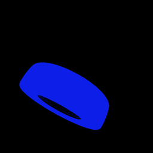

# Observation Data

The avatar can report observed objects in three different modalities. Each modality has different information and different trade-offs.

## Setup

Assume that in each of the examples below, the controller script begins with:

```python
from tdw.controller import Controller


# Start the controller.
c = Controller()
c.start()
c.communicate({"$type": "create_empty_environment"})

# Create the avatar.
c.communicate({"$type": "create_avatar", "type": "A_Img_Caps_Kinematic", "id": "a"})

# Create a tire.
c.add_object("b03_bfg_silvertoown")
```

## 1. The `_img` pass

```python
# Set the pass masks to include _img (and only _img).
c.communicate({"$type": "set_pass_masks", "avatar_id": "a", "pass_masks": ["_img"]})

# Capture the image.
img_pass = c.communicate({"$type": "send_images", "frequency": "always"})
```

#### What you get

A byte array of an image (either a jpg or a png, depending on if you sent `set_img_pass_encoding`).


#### Benefits

- This is the only way to receive images in TDW.

#### Trade-offs

- The only way to know what objects are in the image is for a human to look at the image.
- **Image capture is slow.** For more information, see [Performance Optimizations](performance_optimizations.md).

## 2. The `_id` pass

```python
# Get all segmentation colors.
segmentation_colors = c.communicate({"$type": "send_segmentation_colors", "frequency": "once"})

# Parse the segmentation color data here.

# Set the pass masks to include _id (and only _id).
c.communicate({"$type": "set_pass_masks", "avatar_id": "a", "pass_masks": ["_id"]})

# Get the _id pass.
id_pass = c.communicate({"$type": "send_images", "frequency": "always"})

# Compare the colors in the _id pass to the colors in segmentation_colors here.
```

#### What you get

- A `SegmentationColors` output data object. To learn how to parse this, see [Output Data](../api/output_data.md).
- A byte array of an image (png) with the segmentation colors of all objects in the frame.



#### Usage

Compare the list of colors in the `_id` pass to the `SegmentationColors` object to determine the observed objects.

#### Benefits

- This is the option with the most information. You will know whether an object is in the frame as well as its shape, to what extent it is occluded, etc.

#### Trade-offs

- **The `_id` pass is slow.** In some cases, it's even slower than capturing the `_img` pass.

## 3. Other image passes

See: [`set_pass_masks`](https://github.com/threedworld-mit/tdw/blob/master/Documentation/api/command_api.md#set_pass_masks)

## 4. `IdPassGrayscale`

```python
grayscale = c.communicate({"$type": "send_id_pass_grayscale", "frequency": "always"})
```

#### What you get

An `IdPassGrayscale` output data object. This contains data of the _darkness_ (the grayscale value) of the `_id` pass. To learn how to parse this, see [Output Data](../api/output_data.md).

#### Usage

If you know what grayscale value to expect in the frame, this will tell you how occluded the object(s) is. There may be other use-cases too!

#### Benefits

- **This is the very fast.** 

#### Trade-offs

- Limited usefulness. This object will tell you the percentage of the frame occupied by _any_ objects, but nothing else.

## 5. `IdPassSegmentationColors`

```python
# Get all segmentation colors.
segmentation_colors = c.communicate({"$type": "send_segmentation_colors", "frequency": "once"})

# Parse the segmentation color data here.

# Get the observed colors.
observed_colors = c.communicate({"$type": "send_id_pass_segmentation_colors", "frequency": "always"})

# Compare observed_colors to segmentation_colors here.
```

#### What you get

- A `SegmentationColors` output data object. To learn how to parse this, see [Output Data](../api/output_data.md).
- An `IdPassSegmentationColors` output data object. This contains all unique colors in the `_id` pass (in other words, a list of all objects in the frame).

#### Usage

Compare the list of observed colors to the `SegmentationColors` object to determine the observed objects.

#### Benefits

- `IdPassSegmentationColors` is sometimes faster than the `_id` pass.

#### Trade-offs

- This will only tell you _which_ objects are in the frame, not _to what extent_ they are in the frame; if, for example, only 1 pixel is in the frame, they will still be included in the list of observed object.
- The build scans an image for unique colors before creating the output data. The more objects are in the image, the slower the process. If there are only a few objects in the frame, `IdPassSegementationColors` is significantly faster than `Images` but it _can_ be slower if there are many objects in the frame.

## 6. `Transforms` and avatar data

```python
transforms = c.communicate({"$type": "send_transforms", "frequency": "always"})
avatar = c.communicate({"$type": "send_avatars", "frequency": "always"})

# Compare the position and forward of the avatars and objects.
```

#### What you get

- The position, rotation, and forward directional vector of each object in the scene.
- The position, rotation, and forward directional vector of each avatar in the scene.

#### Usage

You can infer whether the avatar is "looking at" a given object.

#### Benefits

- **This is the fastest option.**

#### Trade-offs

- **This option doesn't account for occlusion.** There's no way to know if there are any objects blocking the avatar's view.

# Benchmarks

| Test                                            | FPS  |
| ----------------------------------------------- | ---- |
| `--boxes --images --passes _img`                | 306  |
| `--boxes --images --passes _id`                 | 230  |
| `--boxes --id_grayscale --images --passes none` | 316  |
| `--boxes --id_colors --images --passes none`    | 180  |
| `--boxes --transforms`                          | 611  |

### How to run this test

```bash
cd <root>/Python/benchmarking
python3 observation_data.py
```

```
<run build>
```

