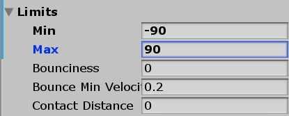
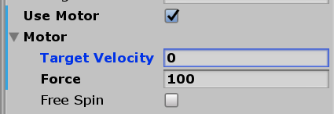
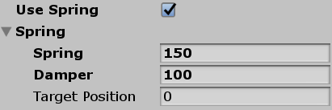
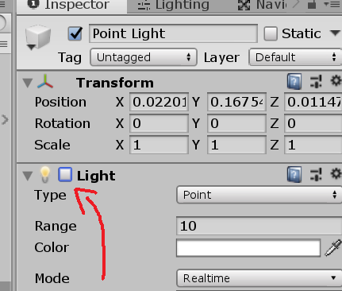

# Creating Composite Objects

If you haven't yet, it may be helpful to first read [Composite Objects](composite_objects.md) to get an overview of what composite objects are and how they behave for frontend users.

## Using the AssetBundleCreator

Composite Objects can be created in any Unity project. To generate TDW-compatible asset bundles:

1. Save the object as a prefab.
2. Export that prefab as a Unity package.
3. Open the `asset_bundle_creator` Unity package (you may first need to run the [AssetBundleCreator](../misc_frontend/add_local_object.md)).
4. Import the Unity package.
5. Run `AssetBundleCreator`: 

```python 
from tdw.asset_bundle_creator import AssetBundleCreator

prefab_path = get_prefab_path() # You need to define this.

a = AssetBundleCreator(prefab_path)

# Get a report. If there are no exceptions, you're ok.
a.validate_composite_object_prefab()

a.prefab_to_asset_bundles(prefab_path)
a.create_record(wnid, wcategory, scale) # You need to define these.
```

## Using `model_pipeline.py`

`model_pipeline.py` is a backend tool that doesn't ship with TDW releases. If you're using the public release of TDW, you can skip this section. 

If you are a backend TDW developer working in the private repo:

1. Save the object as a prefab.
2. Export that prefab as a Unity package.
3. Open the `asset_bundle_creator` Unity package (you may first need to run the [AssetBundleCreator](../misc_frontend/add_local_object.md)).
4. Import the Unity package.
5. Run `model_pipeline.py` starting at the prefab stage.

## How to Set Up the Root Object

The root (parent) object of a composite object must have a Rigidbody component (like any other TDW model). All sub-objects must be parented to the root object.

## How to Create Sub-Objects

Composite objects must be constructed in particular ways. In some cases, if the object's parameters are wrong, they will raise errors when calling `AssetBundleCreator.valid_composite_object_prefab()`. This is a _good_ thing as it it will prevent you from creating asset bundles with problems.

### Unity Components

Any sub-object with "mechanical" or "interactive" behavior requires a corresponding Unity Component to be attached to the GameObject. TDW will automatically map these Components to "mechanisms" for [frontend users](composite_objects.md).

Each sub-object requires:

- A Rigidbody. This is what differentiates a *sub-object* from a non-interactive *sub-mesh* on the backend. If you attach a HingeJoint component, a Rigidbody will automatically be added.
- Colliders. These can be GameObjects parented to the sub-object.
- If Rigidbodies should be attached to each other, then they need a Joint component. This can be a HingeJoint (if the object is articulated) or it can be a FixedJoint (which will rigidly attach the two objects)

**Bad example:**

```
A: Rigidbody
....B: Rigidbody + MeshRenderer
........Colliders
....C: Rigidbody + MeshRenderer + HingeJoint (connected to B)
........Colliders
```

This example will have reasonable *behavior* but spurious output data; object `A` doesn't have colliders and will immediately fall through the floor.

**Good example:**

```
A: Rigidbody + MeshRenderer
....Colliders
....B: Rigidbody + MeshRenderer + HingeJoint (connected to A)
........Colliders
```

| Mechanism         | Unity Component                              |
| ----------------- | -------------------------------------------- |
| `hinge`           | HingeJoint, Rigidbody                        |
| `motor`           | HingeJoint with an enabled motor, Rigidbody  |
| `spring`          | HingeJoint with an enabled spring, Rigidbody |
| `prismatic_joint` | ConfigureableJoint, Rigidbody                |
| `light`           | Light, Rigidbody, FixedJoint                 |
| `none`            | Rigidbody, FixedJoint (optional)             |

### `hinge`

A HingeJoint's _anchor_ is the pivot about which it rotates. A HingeJoint will rotate around its _axis_. You will need to experiment by trial-and-error to figure out where the anchors should be and what the axis should be. Generally, you want the axis values to be 0, 1, or -1.

Usually, you want to toggle  **Enable Collision**, which will allow this object to collide with other sub-objects:


HingeJoints can _optionally_  have **limits**, which will constrain how far they can move or swing. If you want limits, enabled `Use Limits` and set `Min` and `Max` values:



HingeJoints can _optionally_ have break forces and break torques. This will allow them to snap off the parent object with sufficient force. If you don't want this behavior, keep the values at the default `Infinity`.


HingeJoints may have a **motor** or a **spring**, or **neither**. They may _not_ have _both_ a motor _and_ a spring.

#####  Connected Body

HingeJoints must have a connected body that is not null:


### `motor`

`motors` are HingeJoints with enabled motors. The initial set up and requirements are the same as a HingeJoint.

Motors will apply a force to reach a target velocity like a ceiling fan.

For motors, make sure that `Use Motor` is enabled, `Force` is not 0, and `Target Velocity` is 0. You can optionally enabled `Free Spin`:



_When testing the motor, the target velocity can be > 0; just make sure to reset it before exporting._

### `spring`

`springs` are HingeJoints with enabled springs. The initial set up and requirements are the same as a HingeJoint.

Spring HingeJoints will "spring" forward like a Jack-in-the-box.

Make sure that `Use Spring` is enabled, `Spring` and `Damper` are not 0, and `Target Position` is 0:



_When testing the spring, the target position can be > 0; just make sure to reset it before exporting._

### `prismatic_joint`

Prismatic motion can be set using ConfigureableJoints; ConfigureableJoints should *only* be used for prismatic motion.

1. ConfigureableJoints must have a connected body that is not null (just like HingeJoints)
2. Set the `Anchor` at the current position of the object + the upper limit + the lower limit.
3. Set `Axis` to the direction of the motion.
4. Set `Secondary Axis` to match `Axis`.
5. Set `X Motion` to `Limited`, `Y Motion` to `Locked`, and `Z Motion` to `Locked`, regardless of the actual direction of the joint.
6. Set `Angular X Motion`, `Angular Y Motion`, and `Angular Z Motion` to `Locked`.
7. Under `Linear Limit`, set `Limit` to the lower limit.


### `light`

If you want an object to have a light source (like a lightbulb in a lamp), the lightbulb must be a sub-object.

A light sub-object must have:

- A Rigidbody

- A FixedJoint (to prevent the light from falling). The FixedJoint must have a connected body that is not null (see HingeJoint).
- If you want the light to be "off" by default, disable the Light component rather than the GameObject:



### `none`

All other sub-objects must have Rigidbodies.

A sub-object doesn't have to be attached to the parent (example: drawers in a chest).

If you _want_ to attach the sub-object, you need an additional FixedJoint component. The FixedJoint must have a connected body that is not null (see HingeJoint).