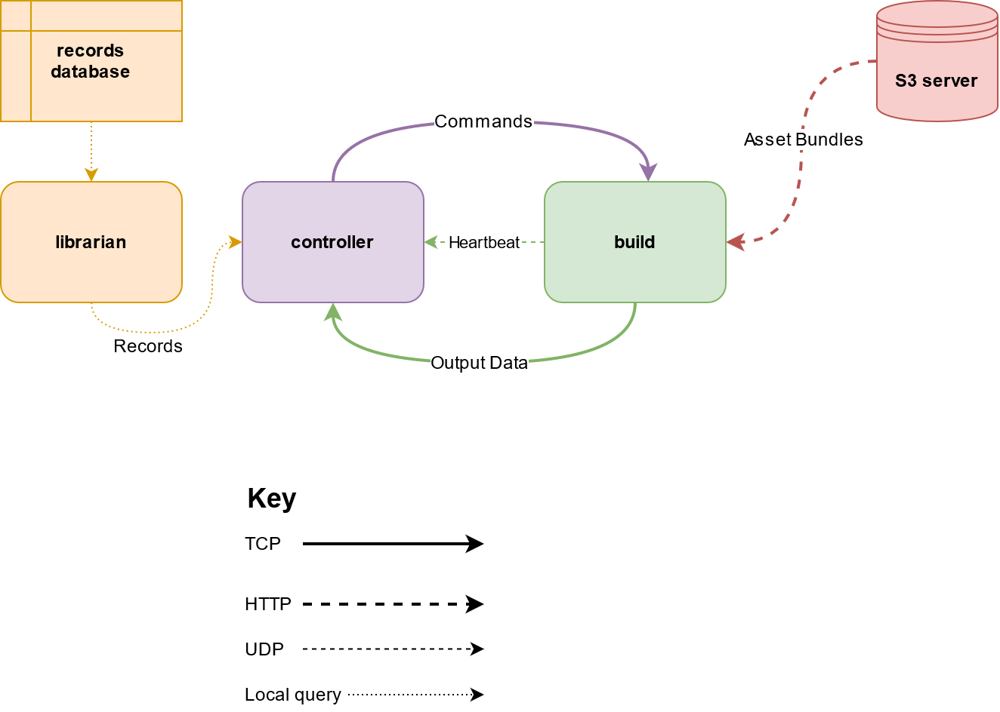
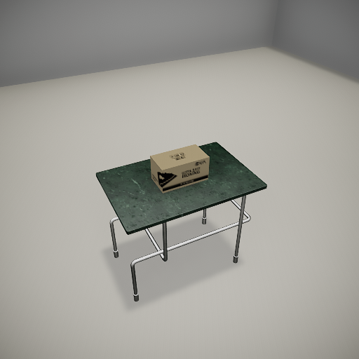

# Getting Started With TDW

## Overview 

**ThreeDWorld (TDW)** is a platform for interactive multi-modal physical simulation. With TDW, users can simulate high-fidelity sensory data and physical interactions between mobile agents and objects in a wide variety of rich 3D environments.

TDW is a general-purpose tool that allows the user to communicate and manipulate a 3D environment. As such, there's no single "correct" procedure for using TDW. This guide will show you how to start using TDW and how to explore the available options.

## What you need to know

- Some familiarity with running programs from the command line.
- Beginner Python3 skills.

## Requirements

- Windows, OS X, or Linux
- Python 3.6+
- A GPU, the faster the better. It is possible to run TDW without a GPU but you will lose some speed and photorealism.
- For [audio/video recording](misc_frontend/video.md), you will need an audio driver.
- [Flex](misc_frontend/flex.md) has complicated requirements; please refer to the linked document.

#### Remote server requirements

* **The build requires X.** 
* We have tested the build in Ubuntu 16 and 18.
* Up-to-date NVIDIA drivers.
* The server must have 8 or less GPUs. (If there are more, you can temporarily disable them by editing xorg.conf)

## Installation

#### 1. Install the `tdw` Python module

| Windows                   | OS X and Linux        |
| ------------------------- | --------------------- |
| **`pip3 install tdw --user`** | **`sudo pip3 install tdw`** |

***

#### 2. Run a minimal test

##### 2a. On a personal computer:

1. Create this Python script and save it as `my_controller.py`:

```python
from tdw.controller import Controller

c = Controller()
print("Everything is OK!")
c.communicate({"$type": "terminate"})
```

2. Run the controller:

| Windows                  | OS X                       | Linux                                   |
| ------------------------ | -------------------------- | --------------------------------------- |
| `py -3 my_controller.py` | `python3 my_controller.py` | `DISPLAY=:0.0 python3 my_controller.py` |

When you launch run this script, the `Controller` will download the **build**, the binary executable application that runs the simulation environment and then launch the build. The controller will also check to see if your version of TDW is the most recent. For more information on what happens when you start a controller, read [this](misc_frontend/releases.md#Updates).

##### 2b. On a remote Linux server:

1. Set up a virtual display.

```bash
sudo service lightdm stop
sudo killall Xorg
sudo nvidia-xconfig -a --use-display-device=None --virtual=256x256
sudo /usr/bin/X :0&
```

NOTE: Not all of these commands will be applicable to every server. The last number is the `display_number` which will be used in the script below:

2. Create this Python script and save it as `my_controller.py`:

```python
from tdw.controller import Controller

display_number = 0 # Set this number to your virtual display.
c = Controller(display=display_number)
print("Everything is OK!")
c.communicate({"$type": "terminate"})
```

3. Run the controller:

```bash
DISPLAY=:0.0 python3 my_controller.py # Your display number might not be 0
```

##### 2c. From a Docker container:

Read [this](https://github.com/threedworld-mit/tdw/blob/v1.6.1/Documentation/Docker/docker.md). We recommend first trying TDW on a personal computer to familiarize yourself with the basic setup.

***

### 3. Download this repo and run a test

This repo contains all of the example controllers and documentation for TDW, as well as the source code for the `tdw` Python module. You can download the repo either as a zip file or by forking the repo.

In this test, TDW creates a basic simulation in which objects are added into the 3D environment. Images are routed to the controller and saved to the local disk: `tdw/Python/example_controllers/dist/`

3. `cd tdw/Python/example_controllers`
4. `python3 getting_started.py`

## Core concepts



TDW has the following core components:

1. **The build** is the 3D environment application. It is available as a [compiled executable](https://github.com/threedworld-mit/tdw/releases/latest).
2. **The controller** is an external Python script created by the user that communicates with the build.
3. **The S3 server** is a remote server. It contains the  binary files of each model, material, etc. that can be added to the build at runtime. These binary files are called [asset bundles](https://docs.unity3d.com/Manual/AssetBundlesIntro.html).
4. **The records databases** are a set of local .json metadata files with **records** corresponding to each asset bundle.
5. A [**librarian**](python/librarian/librarian.md) is a Python wrapper class to easily query metadata in a records database file.

### The simulation pattern

1. The controller communicates with the build by sending a list of  [**commands**](api/command_api_guide.md).
2. The build receives the list of serialized commands, deserializes them, and executes them.
3. The build advances 1 _physics frame_ (simulation step).
4. The build returns [**output data**](api/output_data.md) to the controller.

#### Output Data

Output data is always sent as a list, with the last element of the list being the frame number:

```
[data, data, data, frame]
```

If the build has no data to send, it will send `[frame]`.

## The build

### Terminology

- The **Unity Engine** is the underlying architecture of the build. Unity is powerful and solves a lot of the hardest tasks automatically, such as calculating lighting and shadows. However, Unity is closed-source; a significant portion of the engine is "black-box".
- A **scene** is a blank slate that can be populated with meshes, scripts, etc. Scenes are intrinsic to Unity.
- An **environment** is a TDW idiom for a space within a scene that can be populated with objects. The default proc-gen room created by the [`create_exterior_walls`](api/command_api.md#create_exterior_walls) command has 1 environment. Scenes loaded from asset bundles may have additional environments, which represent open spaces.
- An **avatar** is an object in TDW that can be "piloted" by TDW and return data (usually images).
- An [**asset bundle**](https://docs.unity3d.com/Manual/AssetBundlesIntro.html) is a Unity Engine binary file for loading assets into the executable at runtime. To query which asset bundles are included in TDW, use a [librarian](python/librarian/librarian.md).

### Command-line arguments

The build accepts several command-line arguments. Command-line arguments should always be formatted `-flag=argument`:

`./TDW.exe -port=1204`

| Flag                  | Description                             | Default   |
| --------------------- | --------------------------------------- | --------- |
| `-address`      | Address of the controller                       | localhost |
| `-port` | Network port for sending and receiving messages | 1071   |
| `-screenWidth`        | Width of the screen                     | 256       |
| `-screenHeight`       | Height of the screen                    | 256       |
| `-gpuDevice`          | GPU device number used for CUDA (Flex)  | 0         |
| `-force-glcore42` | Force the build to run on OpenGL 4.2 (see [Debug TDW](misc_frontend/debug_tdw.md)).<br>This is one of many [Unity arguments](https://docs.unity3d.com/Manual/CommandLineArguments.html), all of which can be used for a TDW build. | N/A |

### Running the build on a remote server

- See **Requirements** for system requirements.
- Make sure that xorg is set up correctly such that there is a virtual display that you can launch the build on.
- Use the `run_build.sh` script located in `tdw/bash/` or the [Docker container](Docker/docker.md).

## The controller

All controllers are sub-classes of the `Controller` class. Controllers send and receive data via the `communicate` function:

```python
from tdw.controller import Controller

c = Controller()

# resp will be a list of one element: [frame]
resp = c.communicate({"$type": "load_scene", 
                      "scene_name": "ProcGenScene"})
```

In many example controllers, you will see a function `self.start()`. This is a wrapper function for the `load_scene` command.

***

_The full version of the following example can be found [here](https://github.com/threedworld-mit/tdw/blob/master/Python/example_controllers/getting_started.py)._

Commands can be sent in lists of arbitrary length, allowing for arbitrarily complex instructions per frame. The user must explicitly request output data:

```python
from pathlib import Path
from tdw.controller import Controller
from tdw.tdw_utils import TDWUtils
from tdw.librarian import ModelLibrarian
from tdw.output_data import OutputData, Bounds, Images

lib = ModelLibrarian("models_core.json")
# Get the record for the table.
table_record = lib.get_record("small_table_green_marble")

c = Controller()

table_id = 0

# 1. Load the scene.
# 2. Create an empty room (using a wrapper function)
# 3. Add the table.
# 4. Request Bounds data.
resp = c.communicate([{"$type": "load_scene",
                       "scene_name": "ProcGenScene"},
                      TDWUtils.create_empty_room(12, 12),
                      c.get_add_object(model_name=table_record.name,
                                       object_id=table_id,
                                       position={"x": 0, "y": 0, "z": 0},
                                       rotation={"x": 0, "y": 0, "z": 0}),
                      {"$type": "send_bounds",
                       "ids": [table_id],
                       "frequency": "once"}])
```

The `resp` object is a list of byte arrays that can be deserialized into output data:

```python
# Get the top of the table.
top_y = 0
for r in resp[:-1]:
    r_id = OutputData.get_data_type_id(r)
    # Find the bounds data.
    if r_id == "boun":
        b = Bounds(r)
        # We only requested the table, so it is object 0:
        _, top_y, _ = b.get_top(0)        
```

The variable `top_y` can be used to place an object on the table:

```python
box_record = lib.get_record("puzzle_box_composite")
box_id = 1
c.communicate(c.get_add_object(model_name=box_record.name,
                               object_id=box_id,
                               position={"x": 0, "y": top_y, "z": 0},
                               rotation={"x": 0, "y": 0, "z": 0}))
```

Then an **avatar** can be added to the scene. In this case, the avatar is just a camera. The avatar can then send an image. This image is a numpy array that can be either saved to disk or fed directly into a ML system:

```python
avatar_id = "a"
resp = c.communicate([{"$type": "create_avatar",
                       "type": "A_Img_Caps_Kinematic",
                       "avatar_id": avatar_id},
                      {"$type": "teleport_avatar_to",
                       "position": {"x": 1, "y": 2.5, "z": 2},
                       "avatar_id": avatar_id},
                      {"$type": "look_at",
                       "avatar_id": avatar_id,
                       "object_id": box_id},
                      {"$type": "set_pass_masks",
                       "avatar_id": avatar_id,
                       "pass_masks": ["_img"]},
                      {"$type": "send_images",
                       "frequency": "once",
                       "avatar_id": avatar_id}])

# Get the image.
for r in resp[:-1]:
    r_id = OutputData.get_data_type_id(r)
    # Find the image data.
    if r_id == "imag":
        img = Images(r)
        
        # Usually, you'll want to use one of these functions, but not both of them:
        
        # Use this to save a .jpg
        TDWUtils.save_images(img, filename="test_img") 
        
        print(f"Image saved to: {Path('dist/test_img.jpg').resolve()}")
        
        # Use this to convert the image to a PIL image, which can be processed by a ML system at runtime.
        # The index is 0 because we know that there is only one pass ("_img").
        pil_img = TDWUtils.get_pil_image(img, index=0)
```

To terminate the build once your simulation is done:

```python
c.communicate({"$type": "terminate"})
```

Put together, the example code will create this image:



## Restarting a simulation

To restart a simulation, **always kill the controller _and_ the build.** Never recycle a build or controller instance!

Kill the build by sending `{"$type": "terminate"}`:

```python
c = Controller(launch_build=True) # Launch the build.
c.communicate({"$type": "terminate"}) # Terminate the build.
```

## Further documentation

**TDW is EXTENSIVELY documented.** For a full list of documents and topics covered, see the [README](../README.md).
