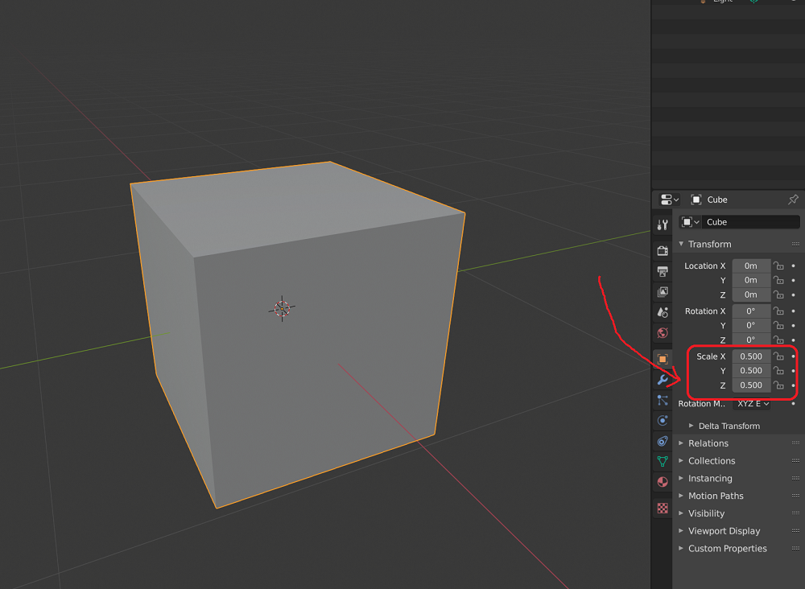

##### 3D Model Libraries

# Add your own models to TDW

It is possible to add any 3D model to TDW. However, the underlying Unity engine can't directly import 3D model files at runtime. They must be converted into asset bundles (the binary format that all other TDW objects are stored as). A separate set of applications must also generate physics colliders for the model.

## Requirements

- Windows 10, OS X, or Linux
- (Windows only) Visual C++ 2012 Redistributable
- The `tdw` module
- Python 3.6+
- Unity Hub
- Unity Editor 2020.3.24f1
  - Build options must enabled for Windows, OS X, and Linux (these can  be set when installing Unity).
  - Ideally, Unity Editor should be installed via Unity Hub; otherwise, you'll need to add the `unity_editor_path` parameter to the `AssetBundleCreator` constructor (see below).
- A .fbx or .obj+.mtl model

## The `AssetBundleCreator`

The [`AssetBundleCreator`](../../python/asset_bundle_creator.md) Python class will convert an .fbx or .obj file into an asset bundle and generate physics colliders. Depending on the complexity of the base mesh, this can be a lengthy process, especially when generating physics colliders.

```python
from tdw.asset_bundle_creator import AssetBundleCreator

a = AssetBundleCreator()
model_path = "test.fbx" # Change this to the actual path.
asset_bundle_paths, record_path = a.create_asset_bundle(model_path=model_path, cleanup=True)
```

`asset_bundle_paths` is a list of [Paths](https://docs.python.org/3/library/pathlib.html) to the generated asset bundles for Windows, OS X and Linux. `record_path` is the path to a json file containing the [model metadata](../../python/librarian/model_librarian.md).

The `cleanup` parameter determines whether the `AssetBundleCreator` will remove intermediate files after creating the asset bundles.

There are optional parameters for `wnid` and `wcategory` which will set the semantic category for the object. You can usually guess what the category should be by comparing it to existing categories. For example, if you have a `chair.fbx` file, this how you'd get the the `wnid` and `wcategory`:

```python
from tdw.asset_bundle_creator import AssetBundleCreator
from tdw.librarian import ModelLibrarian

model_path = "chair.fbx"
wnid = -1
wcategory = "chair"

librarian = ModelLibrarian("models_full.json")
wnids_and_wcategories = librarian.get_model_wnids_and_wcategories()
for w in wnids_and_wcategories:
    if wnids_and_wcategories[w] == "chair":
        # Convert to an integer. In this case, "n03001627" to 3001627.
        wnid = int(w[1:])
        break
a = AssetBundleCreator()
asset_bundle_paths, record_path = a.create_asset_bundle(model_path=model_path, 
                                                        cleanup=True,
                                                        wnid=wnid,
                                                        wcategory=wcategory)
```

There is one other optional parameter, `scale`, which should usually be set to 1 (the default value). Setting it to another value will scale the model by this factor whenever it is instantiated in TDW.

### Unity Editor path

If you installed Unity Editor via Unity Hub, `AssetBundleCreator` should be able to automatically find the Unity Editor executable.

If the Unity Editor executable is in an unexpected location, you will need to explicitly set its location in the `AssetBundleCreator` by setting the optional `unity_editor_path` parameter:

```python
from tdw.asset_bundle_creator import AssetBundleCreator

a = AssetBundleCreator(quiet=True, unity_editor_path="D:/Unity/2020.3.24f1/Editor/Unity.exe")
```

### Intermediate API calls

It's possible to manually perform any of the operations involved in creating an asset bundle.

Sometimes, it's useful to convert a 3D model to a [prefab](https://docs.unity3d.com/Manual/Prefabs.html), edit the prefab in Unity Editor (for example, to adjust the color or positions of the colliders), and then convert the prefab to an asset bundle. In that case, you'd first do this:

```python
from pathlib import Path
from tdw.asset_bundle_creator import AssetBundleCreator

model_name = "chair"
model_path = Path(model_name + ".fbx")
a = AssetBundleCreator()
obj_path, is_new = a.fbx_to_obj(model_path)
wrl_path = a.obj_to_wrl(obj_path)
obj_colliders_path = a.wrl_to_obj(wrl_path, model_name)
copied_file_paths = a.move_files_to_unity_project(obj_colliders_path, model_path)
prefab_path, report_path = a.create_prefab(f"{model_name}_colliders.obj", model_name, model_path.suffix)

# Save the prefab path for later.
Path("prefab_path.txt").write_text(str(prefab_path.resolve()))
```

Then adjust the prefab in Unity Editor.

Then do this:

```python
from pathlib import Path
from tdw.asset_bundle_creator import AssetBundleCreator

wcategory = "chair"
wnid = 3001627
prefab_path = Path(Path("prefab_path.txt").read_text())
model_name = "chair"
model_path = Path(model_name + ".fbx")
a = AssetBundleCreator()
asset_bundle_paths = a.prefab_to_asset_bundle(prefab_path=prefab_path, model_name=model_name)
urls = a.get_local_urls(asset_bundle_paths=asset_bundle_paths)
record_path = a.create_record(model_name=model_name, scale=1, wnid=wnid, wcategory=wcategory, urls=urls)
```

## Add a custom model to a TDW simulation

You can load a model saved on a local machine with the [`add_object` command](../../api/command_api.md#add_object) just like a model from one of TDW's model library.

There are two ways to do this. First, you can just manually set the URL of the asset bundle. Be aware that you need to select the asset bundle for your operating system and you need to add `file:///` to the start of the URL.

Suppose the directory structure looks like this:

```
/home
....tdw_asset_bundles/
........chair/
............record.json
............StandaloneWindows64/
................chair
............StandaloneOSX/
................chair
............StandaloneLinux64/
................chair
```

`StandaloneWindows64`, `StandaloneOSX`, and `StandaloneLinux64` are descriptors generated by Unity Engine. TDW includes a convenient way to convert from these to "system" descriptions:

```python
from platform import system
from tdw.backend.platforms import SYSTEM_TO_UNITY

print(SYSTEM_TO_UNITY[system()])
```

So we can find the correct asset bundle like this:

```python
from pathlib import Path
from platform import system
from tdw.backend.platforms import SYSTEM_TO_UNITY

model_name = "chair"
path = Path.home().joinpath("tdw_asset_bundles/" + model_name + "/" + SYSTEM_TO_UNITY[system()] + model_name)
path = "file:///" + str(path.resolve())
```

And then we can create an object instance of the model with the `add_object` command:

```python
from pathlib import Path
from platform import system
from tdw.backend.platforms import SYSTEM_TO_UNITY
from tdw.controller import Controller
from tdw.tdw_utils import TDWUtils

model_name = "chair"
path = Path.home().joinpath("tdw_asset_bundles/" + model_name + "/" + SYSTEM_TO_UNITY[system()] + model_name)
path = "file:///" + str(path.resolve())

c = Controller()
c.communicate([TDWUtils.create_empty_room(12, 12),
               {"$type": "add_object",
                "name": model_name,
                "url": path,
                "scale_factor": 1,
                "position": {"x": 0, "y": 0, "z": 0},
                "rotation": {"x": 0, "y": 0, "z": 0},
                "category": "chair",
                "id": c.get_unique_id()}])
```

Or, you can use the record data generated by the `AssetBundleCreator`. `ModelRecord.get_url()` returns the URL for your operating system:

```python
from pathlib import Path
from json import loads
from tdw.controller import Controller
from tdw.tdw_utils import TDWUtils
from tdw.librarian import ModelRecord

model_name = "chair"
model_record = ModelRecord(loads(Path.home().joinpath("tdw_asset_bundles/chair/record.json").read_text()))
c = Controller()
c.communicate([TDWUtils.create_empty_room(12, 12),
               {"$type": "add_object",
                "name": model_name,
                "url": model_record.get_url(),
                "scale_factor": model_record.scale_factor,
                "position": {"x": 0, "y": 0, "z": 0},
                "rotation": {"x": 0, "y": 0, "z": 0},
                "category": model_record.wcategory,
                "id": c.get_unique_id()}])
```

##  Create a custom model library

If you want to create many asset bundles, it's usually convenient to create your own `ModelLibrarian` and store it as a local json file. This `ModelLibrarian` can contain any model records including models from other model libraries.

First, create the librarian json file by calling `ModelLibrarian.create_library()`:

```python
from tdw.librarian import ModelLibrarian

ModelLibrarian.create_library(description="Custom model librarian",
                              path="models_custom.json")
```

Then, load the librarian and add your model:

```python
from pathlib import Path
from json import loads
from tdw.librarian import ModelLibrarian, ModelRecord

# Convert from a relative to absolute path to load the librarian.
librarian = ModelLibrarian(library=str(Path("models_custom.json").resolve()))

record = ModelRecord(loads(Path.home().joinpath("tdw_asset_bundles/chair/record.json").read_text()))

librarian.add_or_update_record(record=record, overwrite=False, write=True)
```

You can add a record from another model library in nearly the same way:

```python
from pathlib import Path
from tdw.librarian import ModelLibrarian

custom_librarian = ModelLibrarian(library=str(Path("models_custom.json").resolve()))
core_librarian = ModelLibrarian("models_core.json")
record = core_librarian.get_record("rh10")
custom_librarian.add_or_update_record(record=record, overwrite=False, write=True)
```

## Creating Many Asset Bundles

You could convert many models to asset bundles by creating a loop that repeatedly calls `AssetBundleCreator.create_asset_bundles()`. **This is not a good idea.** Repeatedly calling Unity from a Python script is actually very slow. (It also appears to slow down over many consecutive calls).

Instead, consider using `create_many_asset_bundles(library_path)` for large numbers of models. This function will walk through `asset_bundle_creator/Assets/Resources/models/` searching for .obj and .fbx models. It will convert these models to asset bundles.

## .fbx unit scale

The unit scale of the exported .fbx file must be meters. If not, the physics colliders will likely be at the wrong scale.

## Export .fbx files from Blender 2.8

Blender can be fussy when exporting to Unity. If you export a .obj, you shouldn't have any problems. If you export a .fbx, there may be problems with the model's scale, as well as the collider's scale.

To set correct .fbx model scaling in Blender:

1. Set the scale of your model to 0.5



2. Making sure that the model is still selected, apply the scale: **ctrl+a+s**
3. Making sure that the model is still selected, export the .fbx file. Make sure you're exporting only the selected object, and set the scaling to "FBX Units Scale".


 ## Troubleshooting

- Make sure that Unity Editor and Visual Studio are _closed_ when running `AssetBundleCreator`.
- Make sure that you have installed the Editor _via Unity Hub_; the Python script assumes this when trying to find the editor .exe
- If `AssetBundleCreator` is crashing with errors, please let us know; copy+paste the error when you do.
- If you get this warning in the Editor log: `[warn] kq_init: detected broken kqueue; not using.: Undefined error: 0` it means that there's a problem with your Unity license. Make sure you have valid and active Unity credentials.

***

**Next: [Add ShapeNet models to TDW](shapenet.md)**

[Return to the README](../../../README.md)

***

Example controllers:

- [local_object.py](https://github.com/threedworld-mit/tdw/blob/master/Python/example_controllers/3d_models/local_object.py) Create a local asset bundle and load it into TDW.

Python API:

- [`ModelLibrarian`](../../python/librarian/model_librarian.md)
- [`AssetBundleCreator`](../../python/asset_bundle_creator.md)

Command API:

- [`add_object`](../../api/command_api.md#add_object)
