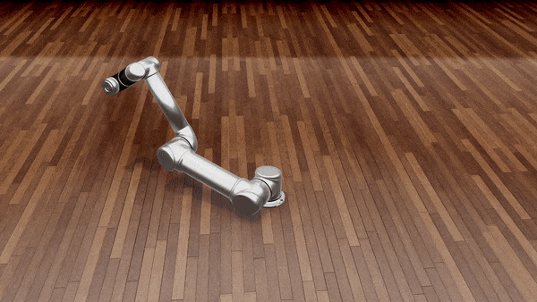

##### Agents

# Overview

*Most agent behavior in TDW is handled via the PhysX physics engine. If you haven't done so already, we strongly recommend you read the [physics tutorial](../physx/overview.md).*

Unlike most simulation platforms, TDW has a very loose definition for "agent". Some examples of what *might* be, but doesn't *have* to be, an agent:

- [Avatars](../core_concepts/avatars.md) have image sensors but typically are not embodied.
- [Objects](../core_concepts.md) don't have image sensors but [it is possible to directly apply forces to objects](../physx/forces.md) and thereby make them act as if they are embodied agents.
- [Robots](../robots/overview.md) can act as agents but don't have image sensors by default.

TDW includes higher-level add-ons to effectively "create" agents from lower-level functionality. The [`Robot` add-on](../../python/add_ons/robot.md), for example, is a robotics wrapper class that has been designed assuming that the user wants to use robots as agents.

The following tables lists the agent tutorials, but should not be taken as the be-all-end-all of what is possible for agent behavior in TDW. Each agent has been optimized to achieve realism in certain ways but not in other ways.

### [Robot](../robots/overview.md)

[Robots](../robots/overview.md) are physically realistic and driven by motor drives. You can set joint targets, apply forces to drives, and so on. Robots can interact with objects in the scene.

**Trade-offs:** TDW doesn't include built-in motion planning or high-level action spaces for its robots (though it is possible for you to implement this yourself).



### [Magnebot](https://github.com/alters-mit/magnebot)

[Magnebots](https://github.com/alters-mit/magnebot) are robot-like agents. In many respects, Magnebots behave exactly as robots; their joints are motorized robot joints.

The Magnebot API is a high-level action space API with built-in motion planning.   

 For example, to add a Magnebot to a scene and move the Magnebot forward by 2 meters:

```python
from magnebot import MagnebotController

c = MagnebotController()
c.init_scene()
c.move_by(2)
```

**Trade-offs:** The Magnebot doesn't exist in real life. It uses a grasp system that, while *physically responsive* to the environment, isn't possible in real life.


### Human

Human users can directly control TDW. A human can move an agent using keyboard controls. A human can also directly control an embodied virtual reality agent.

**Trade-offs:** The VR agent can't walk around large spaces without instantaneous teleport actions and doesn't have colliders except on its hands.

### Replicant

Replicants are human-like, or "humanoid" agents. They are embodied and physically response to the environment. They have far more sophisticated motion planning than robots or Magnebots and can have specialized animation routines for specific actions.

**Trade-offs:** Unlike robots or Magnebots, replicant joints aren't motorized. If a replicant tries to pick up a large object, it might act *as if* the object is too heavy to lift but the physics engine alone won't determine the outcome of the action.

### [Embodied avatar](../embodied_avatars/overview.md)

Embodied avatars are simple geometric shapes with image sensors. They can be useful for prototyping.

**Trade-offs:** Embodied avatars are simple. They can't interact with objects except by running into them.

***

[Return to the README](../../../README.md)