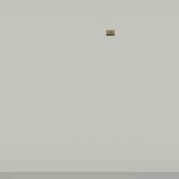
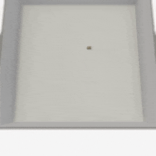
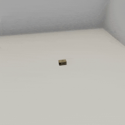

##### Camera Controls

# The `CinematicCamera` add-on

The [`CinematicCamera` add-on](../../python/add_ons/cinematic_camera.md) is a camera with additional "cinematic" functionality. This camera can rotate and move smoothly. `CinematicCamera` isn't meant to be used for image dataset generation, agent training, etc. It is most useful when generating videos in TDW.

The `CinematicCamera` API is very similar to the [`ThirdPersonCamera`](../../python/add_ons/third_person_camera.md) API; this is because they both create avatars and therefore use the some of the same low-level TDW commands. The `CinematicCamera` essentially replaces the instantaneous move/rotate API calls in `ThirdPersonCamera` with API calls that initiate smooth, continuous movement.

Adding a `CinematicCamera` is similar to adding a `ThirdPersonCamera`:

```python
from tdw.controller import Controller
from tdw.tdw_utils import TDWUtils
from tdw.add_ons.cinematic_camera import CinematicCamera
from tdw.add_ons.image_capture import ImageCapture
from tdw.backend.paths import EXAMPLE_CONTROLLER_OUTPUT_PATH

c = Controller()
object_id = c.get_unique_id()
camera = CinematicCamera(position={"x": 2, "y": 1.6, "z": -0.6},
                         look_at=object_id,
                         avatar_id="a")
path = EXAMPLE_CONTROLLER_OUTPUT_PATH.joinpath("cinematic_camera_minimal")
capture = ImageCapture(path=path, avatar_ids=["a"])
print(f"Images will be save to: {path.resolve()}")
c.add_ons.extend([camera, capture])
c.communicate([TDWUtils.create_empty_room(12, 12),
               c.get_add_object(model_name="iron_box",
                                position={"x": 1, "y": 3, "z": -0.5},
                                object_id=object_id)])
c.communicate({"$type": "terminate"})
```

## Constructor parameters

`CinematicCamera` shares many constructor parameters with `ThirdPersonCamera`. It also has some parameters not found in the `ThirdPersonCamera` constructor, and vice versa.

| Parameter             | `ThirdPersonCamera` | `CinematicCamera` |
| --------------------- | ------------------- | ----------------- |
| `avatar_id`           | X                   | X                 |
| `position`            | X                   | X                 |
| `look_at`             | X                   | X                 |
| `rotation`            | X                   | X                 |
| `field_of_view`       | X                   | X                 |
| `follow_object`       |                     | X                 |
| `follow_rotate`       |                     | X                 |
| `move_speed`          | X                   |                   |
| `rotate_speed`        | X                   |                   |
| `field_of_view_speed` | X                   |                   |

- `move_speed` is the directional speed of the camera. This can later be adjusted by setting `camera.move_speed`.
- `rotate_speed` is the angular speed of the camera. This can later be adjusted by setting `camera.rotate_speed`.
- `field_of_view_speed` is the rate per frame that the field of view will be set. This can later be adjusted by setting `camera.field_of_view_speed`.

## Movement

| Function                                        | Description                                                  |
| ----------------------------------------------- | ------------------------------------------------------------ |
| `move_to_position(target, relative)`            | Move to a target absolute or relative position.              |
| `move_to_object(target, arrived_offset, min_y)` | Move to a target object; optionally offset the final position. |
| `stop_moving()`                                 | Stop moving.                                                 |

This controller moves a `CinematicCamera` forward by four meters:

```python
from tdw.controller import Controller
from tdw.tdw_utils import TDWUtils
from tdw.add_ons.cinematic_camera import CinematicCamera
from tdw.add_ons.image_capture import ImageCapture
from tdw.backend.paths import EXAMPLE_CONTROLLER_OUTPUT_PATH

c = Controller()
object_id = c.get_unique_id()
camera = CinematicCamera(position={"x": 0, "y": 13, "z": -4},
                         rotation={"x": 80, "y": 0, "z": 0},
                         avatar_id="a")
path = EXAMPLE_CONTROLLER_OUTPUT_PATH.joinpath("cinematic_camera_move")
capture = ImageCapture(path=path, avatar_ids=["a"])
print(f"Images will be save to: {path.resolve()}")
c.add_ons.extend([camera, capture])
c.communicate([TDWUtils.create_empty_room(12, 12),
               {"$type": "set_target_framerate",
                "framerate": 60},
               c.get_add_object(model_name="iron_box",
                                position={"x": 1, "y": 0, "z": 1},
                                object_id=object_id)])
camera.move_to_position({"x": 0, "y": 0, "z": 4}, relative=True)
for i in range(100):
    c.communicate([])
c.communicate({"$type": "terminate"})
```

Result:



This will move the camera to the object, stopping at a given distance and height:

```python
from tdw.controller import Controller
from tdw.tdw_utils import TDWUtils
from tdw.add_ons.cinematic_camera import CinematicCamera
from tdw.add_ons.image_capture import ImageCapture
from tdw.backend.paths import EXAMPLE_CONTROLLER_OUTPUT_PATH

c = Controller()
object_id = c.get_unique_id()
camera = CinematicCamera(position={"x": 0, "y": 13, "z": -4},
                         rotation={"x": 80, "y": 0, "z": 0},
                         avatar_id="a")
path = EXAMPLE_CONTROLLER_OUTPUT_PATH.joinpath("cinematic_camera_move_to_object")
capture = ImageCapture(path=path, avatar_ids=["a"])
print(f"Images will be save to: {path.resolve()}")
c.add_ons.extend([camera, capture])
c.communicate([TDWUtils.create_empty_room(12, 12),
               {"$type": "set_target_framerate",
                "framerate": 60},
               c.get_add_object(model_name="iron_box",
                                position={"x": 1, "y": 0, "z": 1},
                                object_id=object_id)])
camera.move_to_object(target=object_id, offset={"x": 1.1, "y": 2.5, "z": -0.5})
for i in range(100):
    c.communicate([])
c.communicate({"$type": "terminate"})
```

Result:



## Rotation

| Function                     | Description                           |
| ---------------------------- | ------------------------------------- |
| `rotate_to_object(target)`   | Rotate towards an object.             |
| `rotate_to_position(target)` | Rotate towards a position.            |
| `rotate_by_rpy(target`)      | Rotate by (roll, pitch, yaw) angles.  |
| `rotate_to_rotation(target)` | Rotate towards a rotation quaternion. |
| `stop_rotating()`            | Stop rotating.                        |

In this example, the camera rotates to look at an object and then slowly looks upwards:

```python
from tdw.controller import Controller
from tdw.tdw_utils import TDWUtils
from tdw.add_ons.cinematic_camera import CinematicCamera
from tdw.add_ons.image_capture import ImageCapture
from tdw.backend.paths import EXAMPLE_CONTROLLER_OUTPUT_PATH

c = Controller()
object_id = c.get_unique_id()
camera = CinematicCamera(position={"x": 0, "y": 4, "z": -4},
                         avatar_id="a")
path = EXAMPLE_CONTROLLER_OUTPUT_PATH.joinpath("cinematic_camera_rotation")
capture = ImageCapture(path=path, avatar_ids=["a"])
print(f"Images will be save to: {path.resolve()}")
c.add_ons.extend([camera, capture])
c.communicate([TDWUtils.create_empty_room(12, 12),
               {"$type": "set_target_framerate",
                "framerate": 60},
               c.get_add_object(model_name="iron_box",
                                position={"x": 1, "y": 0, "z": 1},
                                object_id=object_id)])
camera.rotate_to_object(target=object_id)
for i in range(60):
    c.communicate([])
camera.rotate_by_rpy({"x": -20, "y": 0, "z": 0})
camera.rotate_speed = 0.25
for i in range(80):
    c.communicate([])
c.communicate({"$type": "terminate"})
```

Result:


## Field of view

| Function                           | Description                                                  |
| ---------------------------------- | ------------------------------------------------------------ |
| `set_field_of_view(field_of_view)` | Set the target field of view. This will also set the camera's target focal length. |

In this example, the camera adjusts its field of view per frame (note that this also adjusts the camera's focal length):

```python
from tdw.controller import Controller
from tdw.tdw_utils import TDWUtils
from tdw.add_ons.cinematic_camera import CinematicCamera
from tdw.add_ons.image_capture import ImageCapture
from tdw.backend.paths import EXAMPLE_CONTROLLER_OUTPUT_PATH

c = Controller()
object_id = c.get_unique_id()
camera = CinematicCamera(position={"x": 0, "y": 4, "z": -4},
                         avatar_id="a",
                         look_at=object_id)
path = EXAMPLE_CONTROLLER_OUTPUT_PATH.joinpath("cinematic_camera_field_of_view")
capture = ImageCapture(path=path, avatar_ids=["a"])
print(f"Images will be save to: {path.resolve()}")
c.add_ons.extend([camera, capture])
c.communicate([TDWUtils.create_empty_room(12, 12),
               {"$type": "set_target_framerate",
                "framerate": 60},
               c.get_add_object(model_name="iron_box",
                                position={"x": 1, "y": 0, "z": 1},
                                object_id=object_id)])
camera.set_field_of_view(field_of_view=20)
for i in range(100):
    c.communicate([])
c.communicate({"$type": "terminate"})
```

Result:



## `footsteps.py` example controller

[`footsteps.py`](https://github.com/threedworld-mit/tdw/blob/master/Python/example_controllers/camera_controls/footsteps.py) adds a `CinematicCamera` to a realistic looking scene. The camera follows a human-like agent as it walks. This controller uses several other features covered in other tutorials:

- The camera follows a [non-physics humanoid](../non_physics/humanoids.md).
- The controller uses [`PyImpact`](../audio/py_impact_advanced.md) to generate the footstep sounds.

***

**This is the last document in the "Camera Controls" tutorial.**

[Return to the README](../../../README.md)

***

Example controllers:

- [footsteps.py](https://github.com/threedworld-mit/tdw/blob/master/Python/example_controllers/camera_controls/footsteps.py)

Python API:

- [`CinematicCamera`](../../python/add_ons/cinematic_camera.md)

Command API:

- [`set_target_framerate`](../../api/command_api.md#set_target_framerate)

