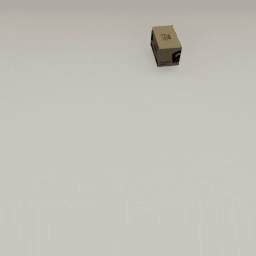

##### Camera Controls

# Follow an object

An avatar can "follow" an object via the [`follow_object` command](../../api/command_api.md#follow_object), in which case it will translate to a position offset from the object's current position and optionally match the object's rotation. `follow_object` must be sent *per frame* in order for the position and rotation to continuously update:

```python
from tdw.controller import Controller
from tdw.tdw_utils import TDWUtils

c = Controller()

object_id = c.get_unique_id()
avatar_position = {"x": 2, "y": 1.6, "z": -0.6}
commands = [TDWUtils.create_empty_room(12, 12),
            c.get_add_object(model_name="iron_box",
                             library="models_core.json",
                             position={"x": 1, "y": 0, "z": -0.5},
                             object_id=object_id)]
commands.extend(TDWUtils.create_avatar(position=avatar_position,
                                       avatar_id="a",
                                       look_at={"x": 1, "y": 0, "z": -0.5}))
# Apply a force to the object.
commands.append({"$type": "apply_force_to_object",
                "id": object_id,
                "force": {"x": -15, "y": 2, "z": 3}})

c.communicate(commands)

# Per frame, look at the object and follow its position.
for i in range(100):
    c.communicate([{"$type": "follow_object",
                    "object_id": object_id,
                    "position": avatar_position,
                    "rotation": False,
                    "avatar_id": "a"},
                   {"$type": "look_at",
                    "object_id": object_id,
                    "avatar_id": "a"}])
c.communicate({"$type": "terminate"})
```

Result:



A [`ThirdPersonCamera`](../../python/add_ons/third_person_camera.md) can also follow an object by setting the `follow_object` parameter of the constructor. You can optionally set `follow_object_rotation` to match the rotation of the object. The `ThirdPersonCamera` will automatically send `follow_object` commands per frame. To reset the target, set `self.follow_target` and `self.follow_rotate`:

```python
from tdw.controller import Controller
from tdw.tdw_utils import TDWUtils
from tdw.add_ons.third_person_camera import ThirdPersonCamera

c = Controller()

object_id = c.get_unique_id()
# Create a third-person camera that will follow the object.
cam = ThirdPersonCamera(avatar_id="a",
                        position={"x": 2, "y": 1.6, "z": -0.6},
                        follow_object=object_id,
                        follow_rotate=False,
                        look_at=object_id)
c.add_ons.append(cam)
c.communicate([TDWUtils.create_empty_room(12, 12),
               c.get_add_object(model_name="iron_box",
                                library="models_core.json",
                                position={"x": 1, "y": 0, "z": -0.5},
                                object_id=object_id),
               {"$type": "apply_force_to_object",
                "id": object_id,
                "force": {"x": -15, "y": 2, "z": 3}}])
for i in range(100):
    c.communicate([])
# Stop following the object.
cam.follow_object = None
c.communicate({"$type": "terminate"})
```


***

**Next: [The `CinematicCamera` add-on](cinematic_camera.md).**

[Return to the README](../../../README.md)

***

Example controllers:

- [follow.py](https://github.com/threedworld-mit/tdw/blob/master/Python/example_controllers/camera_controls/follow.py) Tell a camera to follow an object.

Python API:

- [`ThirdPersonCamera`](../../python/add_ons/third_person_camera.md)

Command API:

- [`follow_object`](../../api/command_api.md#follow_object)
