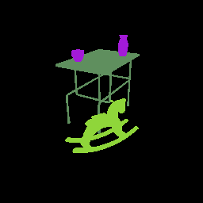

# The `_category` pass

The `_category` pass is similar to the `_id` pass but it assigns colors based on category. Note that the two items on the table are in the same category and therefore receive the same color:



You can get each object's category via the [`ModelLibrarian`](../../python/librarian/model_librarian.md):

```python
from tdw.librarian import ModelLibrarian

lib = ModelLibrarian()

for object_name in ["small_table_green_marble", "rh10", "jug01", "jug05"]:
    record = lib.get_record(object_name)
    print(object_name, record.wcategory)
```

Output:

```
small_table_green_marble table
rh10 toy
jug01 jug
jug05 jug
```

