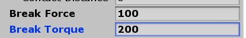
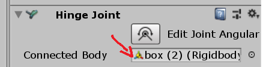
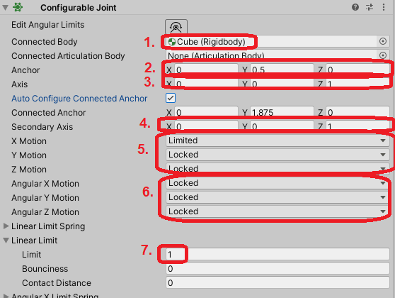

##### Composite (articulated) objects

# Create a composite object from a prefab

The process for creating a composite object is the same as the process for creating a regular object, except that there is an intermediate step in which the user must edit the prefab. 

**While it is technically possible for any user to create composite objects, doing so requires at least some Unity experience.** Because of this, composite object creation is considered a "backend" feature of TDW that we don't expect most users to use.

When you are editing the prefab, it should be located within the [Asset Bundle Creator Unity project](https://github.com/alters-mit/asset_bundle_creator), which gets automatically created when you first call `ModelCreator()` (or you can clone it like any other repo).

## Requirements

See requirements for using the [`ModelCreator`](../custom_models/custom_models.md). 

## Step 1: Create the prefab

### 1A: Create the prefab from a single .fbx file

In some cases, your .fbx file (.fbx or .obj) might already be structured correctly for composite objects, meaning that each sub-object is a separate mesh.

 If that's the case, create a prefab with the `ModelCreator`:

```python
from pathlib import Path
from tdw.asset_bundle_creator.model_creator import ModelCreator
from tdw.backend.paths import EXAMPLE_CONTROLLER_OUTPUT_PATH

source_file = Path.home().joinpath("source_file.fbx")
output_directory = EXAMPLE_CONTROLLER_OUTPUT_PATH.joinpath("custom_composite_object")
m = ModelCreator()
m.source_file_to_prefab(name="example_composite_object",
                        source_file=source_file,
                        output_directory=output_directory)
```

### 1B: Create the prefab from separate .fbx files

If your .fbx file is *not* structured correctly, you'll need to create separate prefabs for each sub-object.

1. Separate your .fbx file into separate .fbx files, one per sub-mesh. This can be done in Blender, MAX, or Maya; how to split the mesh correctly is beyond the scope of this document.
2. Save each .fbx file to the same directory.
3. Convert each .fbx file to a prefab:

```python
from pathlib import Path
from tdw.asset_bundle_creator.model_creator import ModelCreator
from tdw.backend.paths import EXAMPLE_CONTROLLER_OUTPUT_PATH

source_directory = Path.home().joinpath("example_composite_object")
output_directory = EXAMPLE_CONTROLLER_OUTPUT_PATH.joinpath("custom_composite_object")
for source_file in source_directory.iterdir():
    if source_file.is_file() and source_file.suffix == ".fbx":
        m = ModelCreator()
        m.source_file_to_prefab(name=source_file.name[:-4],
                                source_file=source_file,
                                output_directory=output_directory)
```

4. Combine all of the prefabs into a single prefab. The top-level parent object must be an object with a mesh (rather than an empty root object). For example, if the model is a refrigerator, the prefab of the body of the refrigerator is the root object and the prefabs of the doors are parented to the prefab of the body:

```
refrigerator_body.prefab
....door_left.prefab
....door_right.prefab
```

## Step 2: Add Unity components

### 2A: Set up the root object

The root (parent) object of a composite object must have a Rigidbody component (like any other TDW model). All sub-objects must be parented to the root object.

### 2B: Set up the sub-objects

Any sub-object with "mechanical" or "interactive" behavior requires a corresponding Unity Component to be attached to the GameObject. TDW will automatically map these Components to "mechanisms" for frontend users.

Each sub-object requires:

- A Rigidbody. This is what differentiates a *sub-object* from a non-interactive *sub-mesh* on the backend. If you attach a HingeJoint component, a Rigidbody will automatically be added. If Rigidbodies should be attached to each other, then they need a Joint component. This can be a HingeJoint or ConfigurableJoint (if the object is articulated) or it can be a FixedJoint (which will rigidly attach the two objects). See below for how to correctly set up Joint components.
- Colliders. These can be GameObjects parented to the sub-object. Having generated separate prefabs, the GameObjects should already have colliders.

**Bad example:**

```
A: Rigidbody
....B: Rigidbody + MeshRenderer
........Colliders
....C: Rigidbody + MeshRenderer + HingeJoint (connected to B)
........Colliders
```

This example will have reasonable *behavior* but spurious output data; object `A` doesn't have colliders and will immediately fall through the floor.

**Good example:**

```
A: Rigidbody + MeshRenderer
....Colliders
....B: Rigidbody + MeshRenderer + HingeJoint (connected to A)
........Colliders
```

| Mechanism         | Unity Component                              |
| ----------------- | -------------------------------------------- |
| `hinge`           | HingeJoint, Rigidbody                        |
| `motor`           | HingeJoint with an enabled motor, Rigidbody  |
| `spring`          | HingeJoint with an enabled spring, Rigidbody |
| `prismatic_joint` | ConfigureableJoint, Rigidbody                |
| `light`           | Light, Rigidbody, FixedJoint                 |
| `none`            | Rigidbody, FixedJoint (optional)             |

#### `hinge` mechanism

A HingeJoint's _anchor_ is the pivot about which it rotates. A HingeJoint will rotate around its _axis_. You will need to experiment by trial-and-error to figure out where the anchors should be and what the axis should be. Generally, you want the axis values to be 0, 1, or -1.

Usually, you want to toggle  **Enable Collision**, which will allow this object to collide with other sub-objects:


HingeJoints can _optionally_  have **limits**, which will constrain how far they can move or swing. If you want limits, enabled `Use Limits` and set `Min` and `Max` values:


HingeJoints can _optionally_ have break forces and break torques. This will allow them to snap off the parent object with sufficient force. If you don't want this behavior, keep the values at the default `Infinity`.



HingeJoints may have a **motor** or a **spring**, or **neither**. They may _not_ have _both_ a motor _and_ a spring.

HingeJoints must have a connected body that is not null:


#### `motor` mechanism

`motors` are HingeJoints with enabled motors. The initial set up and requirements are the same as a HingeJoint.

Motors will apply a force to reach a target velocity like a ceiling fan.

For motors, make sure that `Use Motor` is enabled, `Force` is not 0, and `Target Velocity` is 0. You can optionally enabled `Free Spin`:


_When testing the motor, the target velocity can be > 0; just make sure to reset it before exporting._

#### `spring` mechanism

`springs` are HingeJoints with enabled springs. The initial set up and requirements are the same as a HingeJoint.

Spring HingeJoints will "spring" forward like a Jack-in-the-box.

Make sure that `Use Spring` is enabled, `Spring` and `Damper` are not 0, and `Target Position` is 0:


_When testing the spring, the target position can be > 0; just make sure to reset it before exporting._

#### `prismatic_joint` mechanism

Prismatic motion can be set using ConfigureableJoints; ConfigureableJoints should *only* be used for prismatic motion.

1. ConfigureableJoints must have a connected body that is not null (just like HingeJoints)
2. Set the `Anchor` at the current position of the object + the upper limit + the lower limit.
3. Set `Axis` to the direction of the motion.
4. Set `Secondary Axis` to match `Axis`.
5. Set `X Motion` to `Limited`, `Y Motion` to `Locked`, and `Z Motion` to `Locked`, regardless of the actual direction of the joint.
6. Set `Angular X Motion`, `Angular Y Motion`, and `Angular Z Motion` to `Locked`.
7. Under `Linear Limit`, set `Limit` to the lower limit.



#### `light` mechanism

If you want an object to have a light source (like a lightbulb in a lamp), the lightbulb must be a sub-object.

A light sub-object must have:

- A Rigidbody

- A FixedJoint (to prevent the light from falling). The FixedJoint must have a connected body that is not null (see HingeJoint).
- If you want the light to be "off" by default, disable the Light component rather than the GameObject:


#### `none` mechanism

All other sub-objects must have Rigidbodies.

A sub-object doesn't have to be attached to the parent (example: drawers in a chest).

If you _want_ to attach the sub-object, you need an additional FixedJoint component. The FixedJoint must have a connected body that is not null (see HingeJoint).

## Step 3: Create asset bundles

When you are done editing the prefab, run a Python script like this:

```python
from tdw.asset_bundle_creator.model_creator import ModelCreator
from tdw.backend.paths import EXAMPLE_CONTROLLER_OUTPUT_PATH

output_directory = EXAMPLE_CONTROLLER_OUTPUT_PATH.joinpath("custom_composite_object")
m = ModelCreator()
m.prefab_to_asset_bundles(name="example_composite_object",
                          output_directory=output_directory)
```

## Step 4: Test the asset bundle in TDW

Write a small controller that adds the local asset bundle to TDW. Test the physics behavior of the object.

***

**Next: [Create a composite object from a .urdf file](create_from_urdf.md)**

[Return to the README](../../../README.md)

***

Python API:

- [`ModelLibrarian`](../../python/librarian/model_librarian.md)
- [`ModelCreator`](../../python/asset_bundle_creator/model_creator.md)