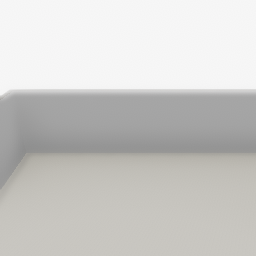

##### Core Concepts

# Add-ons and the `ThirdPersonCamera`

**Add-ons** in TDW are objects that can be added to a controller and act as wrappers for the Command API. They will inject commands at every `communicate()` call. You can attach an add-on to the controller by adding it to the `c.add_ons` list.

The purpose of add-ons is to simplify repetitious or complex behavior in TDW and to standardize common API calls. The most important thing to know about add-ons is that there is nothing that add-on can do that can't be done with low-level commands.

The [`ThirdPersonCamera`](../../python/add_ons/third_person_camera.md) add-on will add a third-person camera avatar to the scene. It can do everything covered [in the previous document](avatars.md) but with simplified controls. 

To start, we'll define the camera and append it to the `c.add_ons` list:

```python
from tdw.controller import Controller
from tdw.tdw_utils import TDWUtils
from tdw.add_ons.third_person_camera import ThirdPersonCamera

c = Controller()

# Create the third-person camera.
camera = ThirdPersonCamera(avatar_id="a",
                           position={"x": -1, "y": 5.7, "z": -3.8},
                           rotation={"x": 26, "y": 0, "z": 0})
# Append the third-person camera add-on.
c.add_ons.append(camera)
```

At this point the controller still hasn't sent any commands  to add the camera. Add-on commands are always sent when `c.communicate()` is called:

```python
from time import sleep
from tdw.controller import Controller
from tdw.tdw_utils import TDWUtils
from tdw.add_ons.third_person_camera import ThirdPersonCamera

c = Controller()

# Create the third-person camera.
camera = ThirdPersonCamera(avatar_id="a",
                           position={"x": -1, "y": 5.7, "z": -3.8},
                           rotation={"x": 26, "y": 0, "z": 0})
# Append the third-person camera.
c.add_ons.append(camera)
c.communicate([TDWUtils.create_empty_room(12, 12)])
sleep(2)
c.communicate({"$type": "terminate"})
```

Result:



## Moving the `ThirdPersonCamera`

The third-person camera can be moved via `camera.teleport(position)` and rotated via `camera.rotate(rotation)`:

```python
from tdw.controller import Controller
from tdw.tdw_utils import TDWUtils
from tdw.add_ons.third_person_camera import ThirdPersonCamera

c = Controller()

camera = ThirdPersonCamera(avatar_id="a",
                           position={"x": -1, "y": 5.7, "z": -3.8},
                           rotation={"x": 26, "y": 0, "z": 0})
c.add_ons.append(camera)
c.communicate([TDWUtils.create_empty_room(12, 12),
               {"$type": "set_target_framerate",
                "framerate": 30}])
for i in range(20):
    # Raise the camera up by 0.1 meters.
    camera.teleport(position={"x": 0, "y": 0.1, "z": 0},
                    absolute=False)
    # Rotate around the yaw axis by 2 degrees.
    camera.rotate(rotation={"x": 0, "y": 2, "z": 0})
    c.communicate([])
c.communicate({"$type": "terminate"})
```

Result:


Note that we're iterating by calling `c.communicate([])`. This sends an empty list of commands (plus any commands injected by the `camera` add-on). 

## Add-ons order of execution

- Add-on commands are always sent in the order that they appear in `c.add_ons`. 
- Add-on commands are always sent *after* the commands explicitly listed in `communicate(commands)`.

For example, in this example, there are two cameras (`camera_0` and `camera_1`):

```python
from tdw.controller import Controller
from tdw.tdw_utils import TDWUtils
from tdw.add_ons.third_person_camera import ThirdPersonCamera

c = Controller()
camera_0 = ThirdPersonCamera(avatar_id="a",
                           position={"x": -1, "y": 5.7, "z": -3.8},
                           rotation={"x": 26, "y": 0, "z": 0})
camera_1 = ThirdPersonCamera(avatar_id="b",
                             position={"x": 1.1, "y": 3.7, "z": 2.1},
                             rotation={"x": 26, "y": 0, "z": 0})
c.add_ons.extend([camera_0, camera_1])
c.communicate([TDWUtils.create_empty_room(12, 12),
               {"$type": "set_target_framerate",
                "framerate": 30}])
```

The order of execution is: 

1. `TDWUtils.create_empty_room(12, 12)`
2. `{"$type": "set_target_framerate", "framerate": 30}`
3. Commands to initialize `camera_0`
4. Commands to initialize `camera_1`

## Define your own add-ons

To define your own add-on, extend the [`AddOn`](../../python/add_ons/add_on.md) class and define the following functions:

- `get_initialization_commands()` Returns a list of commands to initialize the add-on.
- `on_send(resp)` Defines what happens after commands are sent and a response is receive. `resp` is a list of bytes that can be turned into [output data](output_data.md).
- Additionally, you might want to define a custom constructor and custom API calls. `self.commands` is a list of commands that will be sent on the next frame.

This is an example of a very simple custom add-on. It can dynamically set the screen size.

```python
from typing import List
from tdw.add_ons.add_on import AddOn

class SetScreenSize(AddOn):
    def __init__(self, width: int, height: int):
        super().__init__()
        self.width: int = width
        self.height: int = height

    def get_initialization_commands(self) -> List[dict]:
        return [{"$type": "set_screen_size",
                 "width": self.width,
                 "height": self.height}]

    def on_send(self, resp: List[bytes]) -> None:
        return
    
    def set(self, width: int, height: int):
        self.commands.append({"$type": "set_screen_size",
                              "width": width,
                              "height": height})
```

- The constructor has `width` and `height` parameters to set the screen size.
- `get_initialization_commands(self)` returns a [`set_screen_size`](../../api/command_api.md#set_screen_size) command.
- `on_send(self, resp: List[bytes])` doesn't do anything in this example.
- `set(self, width: int, height: int)` is a custom API call that allows the user to set a new screen size after initialization. `self.commands` will be sent on the next frame.

***

**Next: [Objects](objects.md)**

[Return to the README](../../../README.md)

***

Example controllers:

- [third_person_camera.py](https://github.com/threedworld-mit/tdw/blob/master/Python/example_controllers/core_concepts/third_person_camera.py) Example usage of the `ThirdPersonCamera`.
- [set_screen_size.py](https://github.com/threedworld-mit/tdw/blob/master/Python/example_controllers/core_concepts/set_screen_size.py) Example custom add-on.

Python API:

- [`AddOn`](../../python/add_ons/add_on.md) (abstract base class for all add-ons)
- [`ThirdPersonCamera`](../../python/add_ons/third_person_camera.md) 

Command API:

- [`create_exterior_walls`](../../api/command_api.md#create_exterior_walls)
- [`set_screen_size`](../../api/command_api.md#set_screen_size)

