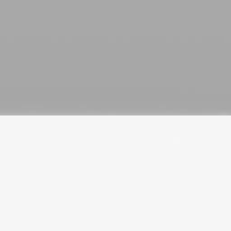
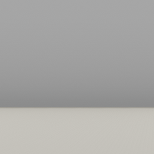
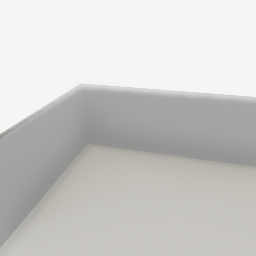
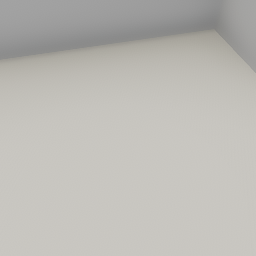
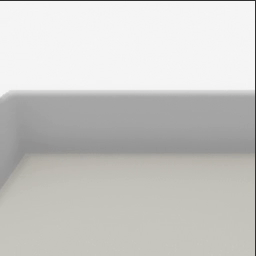

##### Core Concepts

# Avatars and cameras

As mentioned [earlier](design_philosophy.md), TDW doesn't impose metaphors regarding what an agent is or whether there needs to be one at all. **Avatars** are a type of [agent](../agents/overview.md) in TDW but not the only one.

All avatars have a camera. The most commonly used avatar is a non-embodied camera or "third-person camera". There is a more streamline API for third-person cameras, which will be covered in the [next document](add_ons.md).

To add the third-person camera avatar to the scene:

```python
from tdw.controller import Controller
from tdw.tdw_utils import TDWUtils

c = Controller()
c.communicate([TDWUtils.create_empty_room(12, 12),
               {"$type": "create_avatar",
                "type": "A_Img_Caps_Kinematic",
                "id": "a"}])
```

 ...which will render this image in the build application's window:



The avatar is currently at position (0, 0, 0) i.e. floor level--the top half of the image is above the floor and the bottom half is below the floor. To move the avatar to a better location, send `teleport_avatar_to`:

```python
from tdw.controller import Controller
from tdw.tdw_utils import TDWUtils

c = Controller()
c.communicate([TDWUtils.create_empty_room(12, 12),
               {"$type": "create_avatar",
                "type": "A_Img_Caps_Kinematic",
                "id": "a"},
               {"$type": "teleport_avatar_to",
                "avatar_id": "a",
                "position": {"x": -1, "y": 0.6, "z": 2.4}}])
```

...which will render this image:



This is a *little* better (the camera is now above floor level) but still not great. Let's rotate the avatar's **sensor container** (its camera) for a better view of the scene:

```python
from tdw.controller import Controller
from tdw.tdw_utils import TDWUtils

c = Controller()
c.communicate([TDWUtils.create_empty_room(12, 12),
               {"$type": "create_avatar",
                "type": "A_Img_Caps_Kinematic",
                "id": "a"},
               {"$type": "teleport_avatar_to",
                "avatar_id": "a",
                "position": {"x": -1, "y": 5.7, "z": -3.8}},
               {"$type": "rotate_sensor_container_by",
                "axis": "pitch",
                "angle": 26,
                "avatar_id": "a"},
               {"$type": "rotate_sensor_container_by",
                "axis": "yaw",
                "angle": -15,
                "avatar_id": "a"}])
```

...which will render this image:



## `TDWUtils.create_avatar()`

`TDWUtils` includes a helpful wrapper function for creating avatars: [`create_avatar()`](https://github.com/threedworld-mit/tdw/blob/master/Documentation/python/tdw_utils.md#create_avataravatar_typea_img_caps_kinematic-avatar_ida-positionnone-look_atnone---listdict):

```python
from tdw.controller import Controller
from tdw.tdw_utils import TDWUtils

c = Controller()
commands = [TDWUtils.create_empty_room(12, 12)]
commands.extend(TDWUtils.create_avatar(avatar_type="A_Img_Caps_Kinematic",
                                       position={"x": -1, "y": 5.7, "z": -3.8},
                                       look_at={"x": 0, "y": 1, "z": 0}))
c.communicate(commands)
```

...which will render this image:



## Moving and rotating the avatar

To move and rotate the avatar, simply teleport and rotate it by small increments per frame:

```python
from tdw.controller import Controller
from tdw.tdw_utils import TDWUtils

"""
Move the avatar and rotate the camera.
Note that in this example, the `avatar_id` parameters are missing. That's because they all default to "a".
"""

c = Controller()
y = 5.7
c.communicate([TDWUtils.create_empty_room(12, 12),
               {"$type": "create_avatar",
                "type": "A_Img_Caps_Kinematic",
                "id": "a"},
               {"$type": "teleport_avatar_to",
                "position": {"x": -1, "y": y, "z": -3.8}},
               {"$type": "rotate_sensor_container_by",
                "axis": "pitch",
                "angle": 26},
               {"$type": "set_target_framerate",
                "framerate": 30}])
for i in range(20):
    y += 0.1
    c.communicate([{"$type": "rotate_sensor_container_by",
                    "axis": "yaw",
                    "angle": 2},
                   {"$type": "teleport_avatar_to",
                    "position": {"x": -1, "y": y, "z": -3.8}}])
c.communicate({"$type": "terminate"})
```

...which moves the avatar like this:



## Embodied avatars

There are several embodied avatars in TDW which can be useful for prototyping. [Read this for more information.](../embodied_avatars/embodied_avatar.md)

***

**Next: [Add-ons and the `ThirdPersonCamera`](add_ons.md)**

[Return to the README](../../../README.md)

***

Example controllers:

- [move_avatar.py](https://github.com/threedworld-mit/tdw/blob/master/Python/example_controllers/core_concepts/move_avatar.py) Move an avatar and rotate its camera.

Python API:

- [`TDWUtils.create_avatar(avatar_type, position, look_at)`](../../python/tdw_utils.md)

Command API:

- [`create_avatar`](../../api/command_api.md#create_avatar)
- [`teleport_avatar_to`](../../api/command_api.md#teleport_avatar_to)
- [`rotate_sensor_container_by`](../../api/command_api.md#rotate_sensor_container_by)
- [`set_target_framerate`](../../api/command_api.md#set_target_framerate)
