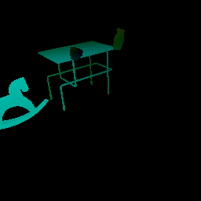

# Core concepts: Image capture passes

The [previous document](images.md) described how to capture the `_img` pass. This document covers the other capture passes in TDW:

## The `_id` capture pass

The `_id` capture pass shows the **segmentation colors** of each object in the scene. Each object has a randomly assigned segmentation color. You can get their colors with the [`send_segmentation_colors`](../../api/command_api.md#send_segmentation_colors), which will return [`SegmentationColors`](../../api/output_data.md#SegmentationColors.md) output data.. You can use this information to determine which objects are in the image and to what extent they are in the image:

```python
from collections import Counter
from tdw.controller import Controller
from tdw.tdw_utils import TDWUtils
from tdw.add_ons.third_person_camera import ThirdPersonCamera
from tdw.add_ons.image_capture import ImageCapture
from tdw.output_data import OutputData, SegmentationColors

c = Controller()
c.start()
object_id_0 = c.get_unique_id()
object_id_1 = c.get_unique_id()
object_id_2 = c.get_unique_id()
object_id_3 = c.get_unique_id()
object_names = {object_id_0: "small_table_green_marble",
                object_id_1: "rh10",
                object_id_2: "jug01",
                object_id_3: "jug05"}

cam = ThirdPersonCamera(position={"x": 2.478, "y": 1.602, "z": 1.412},
                        look_at={"x": 0, "y": 0.2, "z": 0},
                        avatar_id="a")
c.add_ons.append(cam)
cap = ImageCapture(path="tmp", avatar_ids=["a"], pass_masks=["_id"])
c.add_ons.append(cap)
resp = c.communicate([TDWUtils.create_empty_room(12, 12),
                      c.get_add_object(object_names[object_id_0],
                                    object_id=object_id_0),
                      c.get_add_object(object_names[object_id_1],
                                    position={"x": 0.7, "y": 0, "z": 0.4},
                                    rotation={"x": 0, "y": 30, "z": 0},
                                    object_id=object_id_1),
                      c.get_add_object(model_name=object_names[object_id_2],
                                       position={"x": -0.3, "y": 0.9, "z": 0.2},
                                       object_id=object_id_2),
                      c.get_add_object(object_names[object_id_3],
                                       position={"x": 0.3, "y": 0.9, "z": -0.2},
                                       object_id=object_id_3),
                      {"$type": "send_segmentation_colors",
                       "frequency": "once"}])
segmentation_colors = dict()
for i in range(len(resp) - 1):
    r_id = OutputData.get_data_type_id(resp[i])
    # Get segmentation color output data.
    if r_id == "segm":
        segm = SegmentationColors(resp[i])
        for j in range(segm.get_num()):
            object_id = segm.get_object_id(j)
            object_name = object_names[object_id]
            segmentation_color = segm.get_object_color(j)
            segmentation_colors[object_id] = segmentation_color

# The total number of pixels in the image.
num_pixels = 256 * 256
# Get PIL images from `ImageCapture`.
pil_image = cap.get_pil_images()["a"]["_id"]
colors = Counter(pil_image.getdata())
# Get the percentage of the image occupied by each object.
for object_id in segmentation_colors:
    segmentation_color = segmentation_colors[object_id]
    object_name = object_names[object_id]
    if segmentation_color not in colors:
        print(object_name + " is not in the image!")
    else:
        print(object_name + " is in the frame!", float(colors[segmentation_color]) / num_pixels)
c.communicate({"$type": "terminate"})
```

Output:

```
small_table_green_marble is in the frame! 0.04205322265625
rh10 is in the frame! 0.03570556640625
jug01 is in the frame! 0.0045013427734375
jug05 is in the frame! 0.003204345703125
```

and:


## The `_category` pass

The `_category` pass is similar to the `_id` pass but it assigns colors based on category. Note that the two items on the table are in the same category and therefore receive the same color:


## The `_mask` pass

The `_mask` pass is similar to the `_id` and `_category` passes except that all objects are the same color.


## The `_depth` pass

The `_depth` pass encodes depth values per pixel into 3 bytes (RGB). The resulting image looks strange but is very accurate:


To convert the image back into depth values, you can use `TDWUtils.get_depth_values()`:

```python
import matplotlib.pyplot as plt
from tdw.controller import Controller
from tdw.tdw_utils import TDWUtils
from tdw.add_ons.third_person_camera import ThirdPersonCamera
from tdw.add_ons.image_capture import ImageCapture

c = Controller()
c.start()
object_id_0 = c.get_unique_id()
object_id_1 = c.get_unique_id()
object_id_2 = c.get_unique_id()
object_id_3 = c.get_unique_id()
object_names = {object_id_0: "small_table_green_marble",
                object_id_1: "rh10",
                object_id_2: "jug01",
                object_id_3: "jug05"}

cam = ThirdPersonCamera(position={"x": 2.478, "y": 1.602, "z": 1.412},
                        look_at={"x": 0, "y": 0.2, "z": 0},
                        avatar_id="a")
c.add_ons.append(cam)
cap = ImageCapture(path="tmp", avatar_ids=["a"], pass_masks=["_depth"])
c.add_ons.append(cap)
c.communicate([TDWUtils.create_empty_room(12, 12),
               c.get_add_object(object_names[object_id_0],
                                object_id=object_id_0),
               c.get_add_object(object_names[object_id_1],
                                position={"x": 0.7, "y": 0, "z": 0.4},
                                rotation={"x": 0, "y": 30, "z": 0},
                                object_id=object_id_1),
               c.get_add_object(model_name=object_names[object_id_2],
                                position={"x": -0.3, "y": 0.9, "z": 0.2},
                                object_id=object_id_2),
               c.get_add_object(object_names[object_id_3],
                                position={"x": 0.3, "y": 0.9, "z": -0.2},
                                object_id=object_id_3)])
images = cap.images["a"]
for i in range(images.get_num_passes()):
    if images.get_pass_mask(i) == "_depth":
        depth_values = TDWUtils.get_depth_values(images.get_image(i), depth_pass="_depth",
                                                 width=images.get_width(), height=images.get_height())
        plt.imshow(depth_values)
        plt.show()
c.communicate({"$type": "terminate"})
```

Result:


#### Point clouds

It is possible to convert the `_depth` pass into a point cloud. To this we need to add 3 things to the previous example:

- Send the [`send_camera_matrices`](../../api/command_api.md#send_camera_matrices) command.
- Parse the output data to receive [`CameraMatrices`](../../api/output_data.md#CameraMatrices.md).
- Call [`TDWUtils.get_point_cloud(depth, filename, camera_matrix)`](../../python/tdw_utils.md).

```python
from tdw.controller import Controller
from tdw.tdw_utils import TDWUtils
from tdw.add_ons.third_person_camera import ThirdPersonCamera
from tdw.add_ons.image_capture import ImageCapture
from tdw.output_data import OutputData, CameraMatrices

c = Controller()
c.start()
object_id_0 = c.get_unique_id()
object_id_1 = c.get_unique_id()
object_id_2 = c.get_unique_id()
object_id_3 = c.get_unique_id()
object_names = {object_id_0: "small_table_green_marble",
                object_id_1: "rh10",
                object_id_2: "jug01",
                object_id_3: "jug05"}

cam = ThirdPersonCamera(position={"x": 2.478, "y": 1.602, "z": 1.412},
                        look_at={"x": 0, "y": 0.2, "z": 0},
                        avatar_id="a")
c.add_ons.append(cam)
cap = ImageCapture(path="tmp", avatar_ids=["a"], pass_masks=["_depth"])
c.add_ons.append(cap)
resp = c.communicate([TDWUtils.create_empty_room(12, 12),
                      c.get_add_object(object_names[object_id_0],
                                    object_id=object_id_0),
                      c.get_add_object(object_names[object_id_1],
                                    position={"x": 0.7, "y": 0, "z": 0.4},
                                    rotation={"x": 0, "y": 30, "z": 0},
                                    object_id=object_id_1),
                      c.get_add_object(model_name=object_names[object_id_2],
                                       position={"x": -0.3, "y": 0.9, "z": 0.2},
                                       object_id=object_id_2),
                      c.get_add_object(object_names[object_id_3],
                                       position={"x": 0.3, "y": 0.9, "z": -0.2},
                                       object_id=object_id_3),
                      {"$type": "send_camera_matrices",
                       "frequency": "once"}])
# Get the camera matrix.
camera_matrix = None
for i in range(len(resp) - 1):
    r_id = OutputData.get_data_type_id(resp[i])
    if r_id == "cama":
        camera_matrix = CameraMatrices(resp[i]).get_camera_matrix()
images = cap.images["a"]
for i in range(images.get_num_passes()):
    if images.get_pass_mask(i) == "_depth":
        depth_values = TDWUtils.get_depth_values(images.get_image(i), depth_pass="_depth",
                                                 width=images.get_width(), height=images.get_height())
        TDWUtils.get_point_cloud(depth=depth_values, filename="tmp/point_cloud.txt", camera_matrix=camera_matrix)
c.communicate({"$type": "terminate"})
```

## The `_depth_simple` pass

The `_depth_simple` pass is similar to the `_depth` pass but encodes depth values to grayscale (1 byte). This makes it less accurate but somewhat easier to use. Note that the fact that this image is nearly all black is actually accurate:


## The `_normals` pass

In the `_normals` pass, surfaces are colored according to their orientation in relation to the camera.


## The `_albedo` pass

The `_albedo` pass has only color and texture, as if lit with only ambient light.


## The `_flow` pass

In the `_flow` pass, pixels are colored according to their motion in relation to the camera. In the example used above, nothing is moving, so the image is totally black. If we add motion to the scene, we get this:

  


***

**This is the last document in the "Core Concepts" section. [Return to the README](../../README.md) for more in-depth documentation about specific subjects and use-cases.**

Example controller: [capture_passes.py](https://github.com/threedworld-mit/tdw/blob/master/Python/example_controllers/core_concepts/capture_passes.py)

Python API:

- [`TDWUtils.get_depth_values(image, depth_pass, width, height, near_plane, far_plane)`](../../python/tdw_utils.md) 
- [`TDWUtils.get_point_cloud(depth, filename, camera_matrix)`](../../python/tdw_utils.md) 

Command API:

- [`send_segmentation_colors`](../../api/command_api.md#send_segmentation_colors)
- [`send_camera_matrices`](../../api/command_api.md#send_camera_matrices) 

Output Data API:

- [`SegmentationColors`](../../api/output_data.md#SegmentationColors.md)
- [`CameraMatrices`](../../api/output_data.md#CameraMatrices.md)

[Return to the README](../../README.md)