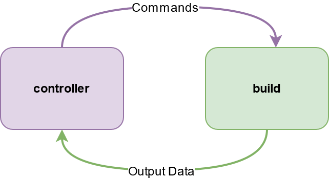

##### Core Concepts

# The Controller

*Note: We recommend you try the code examples in this document on a personal computer, not a remote server. [The next Core Concepts document](launch_build.md) explains how to run TDW on a remote server in more detail.*

A controller is the Python object that communicates with the simulation application (the build). Typically, users are responsible for writing their own controllers, though the documentation for TDW includes numerous examples.



You've already seen a minimal controller script example:

```python
from tdw.controller import Controller

c = Controller()
c.communicate({"$type": "terminate"})
```

This will launch the build and immediately kill the process.

In many cases, you'll want to add your own functions to a controller. To do this, create a child class of `Controller`:

```python
from tdw.controller import Controller

class MyController(Controller):
    pass


if __name__ == "__main__":
    c = MyController()
    c.communicate({"$type": "terminate"})
```

This example will print all of the commands sent to the build:

```python
from typing import Union, List
from tdw.controller import Controller

class MyController(Controller):
    def communicate(self, commands: Union[dict, List[dict]]) -> list:
        print(commands)
        return super().communicate(commands=commands)
 

if __name__ == "__main__":
    c = MyController()
    c.communicate({"$type": "terminate"})
```

## Frames, Commands, and Output Data

- The controller sends **commands** to the build per `communicate()` call. In the above examples, `{"$type": "terminate"}` is a command.
- Every time the controller calls `communicate()`, the simulation advances 1 **frame**. In nearly all cases, a frame is equivalent in TDW to both a visual camera render and a physics step (the exception is the `step_physics` command, which is covered in a later tutorial). If the controller *doesn't* call `communicate()`, the simulation pauses until it does. 
- The build receives **output data** from the build per communicate call.


***

**Next: [Auto-launching the TDW build](launch_build.md)**

[Return to the README](../../../README.md)

***

Python API:

- [`Controller`](../../python/controller.md)  (Base class for all TDW controllers)

Command API:

- [`terminate`](../../api/command_api.md#terminate)
- [`step_physics`](../../api/command_api.md#step_physics)