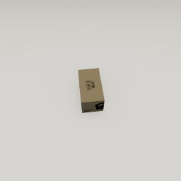
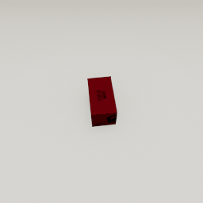

##### Core Concepts

# Objects

**Objects** in TDW are 3D models that can be placed in the scene by the controller. By default, they will also respond to TDW's rendering and physics engine (though this can be toggled off if needed). A **model** is a non-instanced object; in TDW, the controller downloads a model and instantiates it as an object.

Each object has an **object ID**, an integer that is assigned by the controller and is used by subsequent commands that reference objects.

To add an object to the scene, send the [`add_object`](../../api/command_api.md#add_object) command or use the `Controller.get_add_object()` wrapper function:

```python
from tdw.controller import Controller
from tdw.tdw_utils import TDWUtils
from tdw.add_ons.third_person_camera import ThirdPersonCamera

c = Controller()

# Generate a unique object ID.
object_id = c.get_unique_id()
# Add a camera and look at the object (we haven't added the object yet but this will execute after adding the object).
cam = ThirdPersonCamera(position={"x": 2, "y": 1.6, "z": -0.6},
                        look_at=object_id)
c.add_ons.append(cam)
# Create the scene and add the object.
c.communicate([TDWUtils.create_empty_room(12, 12),
               c.get_add_object(model_name="iron_box",
                                library="models_core.json",
                                position={"x": 1, "y": 0, "z": -0.5},
                                object_id=object_id)])
```

Result:



The above example is equivalent to this example, which doesn't use the `get_add_object()` wrapper function:

```python
from tdw.controller import Controller
from tdw.tdw_utils import TDWUtils
from tdw.add_ons.third_person_camera import ThirdPersonCamera

c = Controller()

# Generate a unique object ID.
object_id = c.get_unique_id()
# Add a camera and look at the object (we haven't added the object yet but this will execute after adding the object).
cam = ThirdPersonCamera(position={"x": 2, "y": 1.6, "z": -0.6},
                        look_at=object_id)
c.add_ons.append(cam)
# Create the scene and add the object.
# Change the URL to your operating system: windows, osx, or linux.
c.communicate([TDWUtils.create_empty_room(12, 12),
               {"$type": "add_object",
                "name": "iron_box",
                "url": "https://tdw-public.s3.amazonaws.com/models/windows/2018-2019.1/iron_box",
                "scale_factor": 1.0,
                "position": {"x": 1, "y": 0, "z": -0.5},
                "rotation": {"x": 0, "y": 0, "z": 0},
                "category": "box",
                "id": object_id}])
```

## Object positions

Every object's pivot is at its **bottom-center**. To place an object on the ground, set the `y` coordinate of its position to 0.

## Objects and memory management

Like scenes, objects are stored as **asset bundles**. All of TDW's object asset bundles are stored on a remote S3 server. At runtime, the asset bundles are downloaded into memory. When the build process ends, the asset bundles are removed from memory.

It might take some time to download and load any particular object into TDW, but only the first time the object is added to the scene; subsequent copies of the object will load into the scene nearly instantaneously.

In this example, multiple instances of the same sofa model will be added to the scene. The first takes a couple of seconds to download; the rest are loaded in much faster:

```python
from time import time
from tdw.controller import Controller
from tdw.tdw_utils import TDWUtils

c = Controller()
c.communicate(TDWUtils.create_empty_room(12, 12))
# Add a bunch of sofas.
y = 0
for i in range(10):
    object_id = c.get_unique_id()
    t0 = time()
    c.communicate(c.get_add_object("arflex_hollywood_sofa",
                                   object_id=object_id,
                                   position={"x": 0, "y": y, "z": 0}))
    y += 10
    print(time() - t0)
c.communicate({"$type": "terminate"})
```

## Model metadata records and the `ModelLibrarian`

The `add_object` command can  be cumbersome to use because of all of its parameters. To that end, TDW stores metadata records for each of its models in a `ModelLibrarian`(../../python/librarian/model_librarian.md). To fetch the record of `iron_box` (the object in the previous example), create a `ModelLibrarian` and call `get_record()`:

```python
from tdw.librarian import ModelLibrarian

librarian = ModelLibrarian()
record = librarian.get_record("iron_box")

# iron_box
print(record.name)
# Prints the URL for your operating system.
# For example, if you're using Linux, this will print record.urls["Linux"]
print(record.get_url())

# Prints the object's semantic category. In this case: box
print(record.wcategory)
```

Every object in the model librarian has been semantically tagged by category: the `wcategory` and `wnid` parameters are the object's WordNet category and ID values.

Records are stored in a list: `librarian.records`. You can iterate through the list:

```python
from tdw.librarian import ModelLibrarian

librarian = ModelLibrarian()
for record in librarian.records:
    if record.wcategory == "box":
        print(record.name)
```

There are many other useful parameters in a model record ([read this for more information](../../python/librarian/model_librarian.md)) but one worth nothing right away is `do_not_use`. Most of TDW's models were purchased from a third party and sometimes they have problems. If we've flagged a model as `do_not_use`, don't use it! We will fix the model in the near future.

```python
from tdw.librarian import ModelLibrarian

librarian = ModelLibrarian()
record = librarian.get_record("iron_box")

for record in librarian.records:
    if record.do_not_use:
        print(record.name)
```

## Other model libraries

 The default model librarian is the "core" model library. The objects in this library are publicly available and free:

```python
from tdw.librarian import ModelLibrarian

# These are the same.
lib_0 = ModelLibrarian()
lib_1 = ModelLibrarian("models_core.json")
```

There are other model libraries as well; it is possible to use your own models in TDW and to generate your own metadata libraries for those models. See [Model Libraries in the README](../../../README.md).

## Cached model librarians

Every time `Controller.get_add_object()` is called, it will evaluate the optional `library` parameter (the default value is `"models_core.json"`). The controller will then load and cache the library if it hasn't done so already. This is beneficial for performance reasons but it can be also be useful at runtime for checking record data. Cached model librarians are stored in a dictionary: `Controller.MODEL_LIBRARIANS`:

```python
from tdw.controller import Controller
from tdw.tdw_utils import TDWUtils

c = Controller()
print(Controller.MODEL_LIBRARIANS)

c.communicate([TDWUtils.create_empty_room(12, 12),
               c.get_add_object(model_name="rh10",
                                object_id=0,
                                library="models_core.json")])
print(Controller.MODEL_LIBRARIANS)
c.communicate({"$type": "terminate"})
```

Output:

```
{}
{'models_core.json': <tdw.librarian.ModelLibrarian object at 0x000002191EA98F48>}
```

## How to get images of every model in the library

The TDW repo includes [a controller that will create images of every object in the model library](https://github.com/threedworld-mit/tdw/blob/master/Python/screenshotter.py):

1. `cd path/to/tdw/Python` (replace `path/to` with the actual path)
2. `python3 screenshotter.py`
3. [Launch the build manually](launch_build.md)

Images will be saved to `~/TDWImages` (where `~` is your home directory).

You can review the images with the [TDW Model Visualizer](https://github.com/threedworld-mit/tdw_visualizers).

## Object commands

There are [many object commands in TDW](../../api/command_api.md) (see "Object Command"). Each of these commands refers to the object using its integer ID. This example will create an `iron_box` object and then change its color to red:

```python
from time import sleep
from tdw.controller import Controller
from tdw.tdw_utils import TDWUtils
from tdw.add_ons.third_person_camera import ThirdPersonCamera

"""
Add a box and make it red.
"""

c = Controller()

# Generate a unique object ID.
object_id = c.get_unique_id()
# Add a camera and look at the object (we haven't added the object yet but this will execute after adding the object).
cam = ThirdPersonCamera(position={"x": 2, "y": 1.6, "z": -0.6},
                        look_at=object_id)
c.add_ons.append(cam)
# Create the scene, add the object, and make the object red.
c.communicate([TDWUtils.create_empty_room(12, 12),
               c.get_add_object(model_name="iron_box",
                                library="models_core.json",
                                position={"x": 1, "y": 0, "z": -0.5},
                                object_id=object_id),
               {"$type": "set_color",
                "color": {"r": 1.0, "g": 0, "b": 0, "a": 1.0},
                "id": object_id}])
sleep(2)
c.communicate({"$type": "terminate"})
```

Result:



## Scenes and objects

Some streamed scenes include objects such as benches, tables, etc. These objects are *static*--they won't move or response to any of the object-related commands in the API. The basic distinction between scenes and objects is that scenes are treated as background objects while objects can be dynamically created and manipulated by a controller.

***

**Next: [Output data](output_data.md)**

[Return to the README](../../../README.md)

***

Example controllers:

- [red_box.py](https://github.com/threedworld-mit/tdw/blob/master/Python/example_controllers/core_concepts/red_box.py) Add a box and make it red.

Python API:

- [`Controller.get_unique_id()` and `Controller.get_add_object(model_name, object_id, position, rotation, library)`](../../python/controller.md)
- [`ModelLibrarian`](../../python/librarian/model_librarian.md)

Command API:

- [`add_object`](../../api/command_api.md#add_object)
- [`set_color`](../../api/command_api.md#set_color)

Utility applications:

- [TDW Model Visualizer](https://github.com/threedworld-mit/tdw_visualizers)
