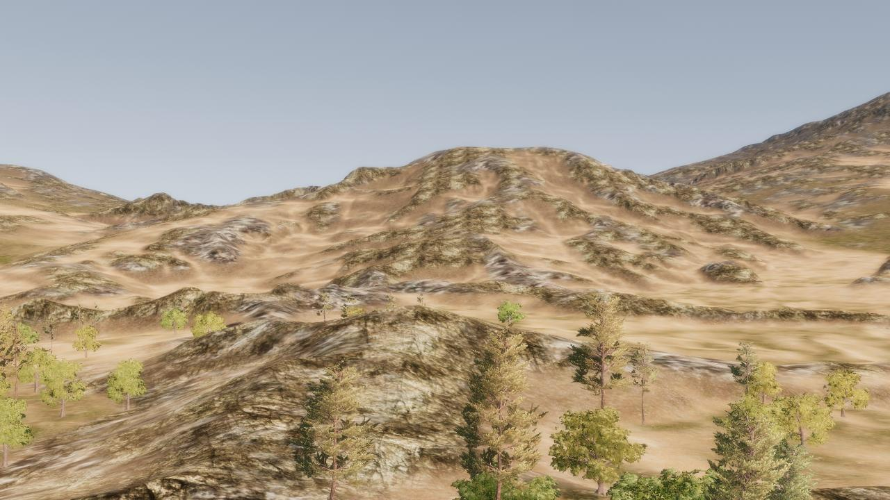
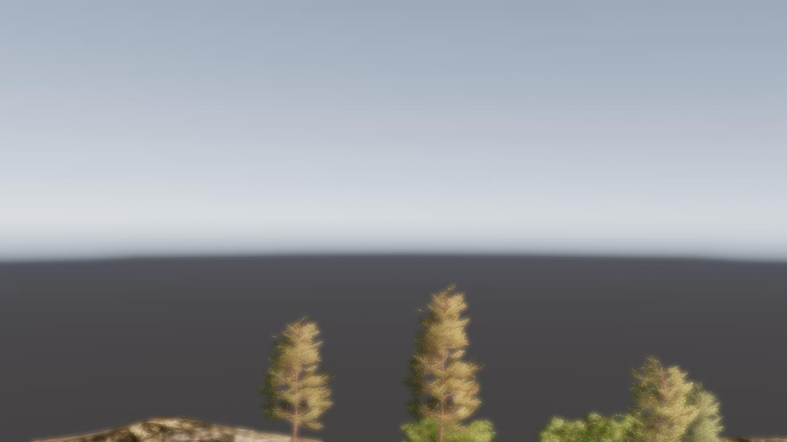

##### Core Concepts

# Outdoor Scenes

As mentioned in the [Scenes documentation](scenes.md), outdoor scenes are essentially the same as any other streamed scene but require some additional [camera](avatars.md) settings. TDW's cameras use default parameters that are good for indoor environments with short viewing distances.

You can find outdoor scenes by searching for them in the [scene record data](scenes.md):

```python
from tdw.librarian import SceneLibrarian

lib = SceneLibrarian()
for record in lib.records:
    if record.location == "exterior":
        print(record.name)
```

## Large outdoor scenes

Right now, TDW has two large outdoor scenes, `savanna_6km`, which is 6 square kilometers, and `savanna_flat_6km`, which is the same scene but the terrain is totally flat.  The TDW team will add more large outdoor scenes in the future.

For large outdoor scenes with long view distances, the camera clipping planes need to be set via [`set_camera_clipping_planes`](../../api/command_api.md#set_camera_clipping_planes) so that far-away terrain is included in the image.

You may also want to adjust post-processing settings e.g. [`set_focus_distance`](../../api/command_api.md#set_focus_distance) to prevent unwanted blurring. For more information, [read this](../photorealism/depth_of_field.md).

```python
from tdw.controller import Controller
from tdw.add_ons.third_person_camera import ThirdPersonCamera
from tdw.add_ons.image_capture import ImageCapture
from tdw.backend.paths import EXAMPLE_CONTROLLER_OUTPUT_PATH

c = Controller()
camera = ThirdPersonCamera(position={"x": -12.1, "y": 60, "z": 492},
                           look_at={"x": 0, "y": 58, "z": 0},
                           avatar_id="a")
path = EXAMPLE_CONTROLLER_OUTPUT_PATH.joinpath("terrain")
print(f"Images will be saved to: {path}")
capture = ImageCapture(avatar_ids=["a"], path=path)
c.add_ons.extend([camera, capture])
c.communicate([c.get_add_scene(scene_name="savanna_6km"),
               {"$type": "set_screen_size",
                "width": 1280,
                "height": 720}])
c.communicate([{"$type": "set_camera_clipping_planes",
                "near": 1.0,
                "far": 10000,
                "avatar_id": "a"},
               {"$type": "set_focus_distance",
                "focus_distance": 2.5}])
c.communicate({"$type": "terminate"})
```

Result:



Without setting the clipping planes and focus distance, we'd get this image instead:



## Medium-sized outdoor scenes

Right now, there are two medium-sized outdoor scenes in TDW:

- `suburb_scene_2023` An outdoor suburb scene.
- `suburb_scene_2018` This is included only for legacy reasons.

## Small outdoor scenes

TDW includes several small outdoor scenes such as `abandoned_factory`. These scenes are meant for static photorealistic image generation, and are probably too small for anything involving a mobile agent.

***

**This is the last document in the "Core Concepts" section. We recommend you next read our guide on [troubleshooting and good coding practices in TDW](../troubleshooting/common_errors.md).**

[Return to the README](../../../README.md)

***

Example Controllers:

- [terrain.py](https://github.com/threedworld-mit/tdw/blob/master/Python/example_controllers/core_concepts/terrain.py) Load a large outdoor scene.

Python API:

- [`SceneLibrarian`](../../python/librarian/scene_librarian.md#scenerecord-api) (A collection of scene metadata records)

Command API:

- [`set_camera_clipping_planes`](../../api/command_api.md#set_camera_clipping_planes)
- [`set_focus_distance`](../../api/command_api.md#set_focus_distance) 
