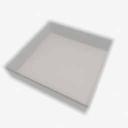
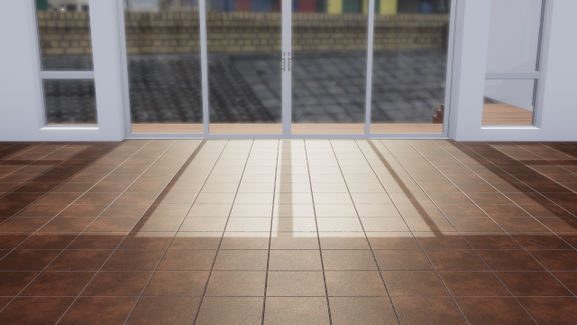

##### Core Concepts

# TDW and Random Numbers

In nearly all cases in TDW, the controller handles random number generation, not the build. This document explain best practices for generating and handling random numbers.

## Object IDs

The most common need for random numbers is for [object IDs](objects.md). In this case, we recommend calling `Controller.get_unique_id()`. You can find examples of this throughout TDW's documentation.

## Floats (positions, colors, etc.)

You can generate random floats with the standard Python `random` module.

Alternatively, you can generate numbers from a numpy `RandomState`:

```python
import numpy as np

seed = 0
rng = np.random.RandomState(seed)
```

According to numpy's documentation, `RandomState` is deprecated, but it's useful in TDW because it's easy to *seed*. **If you use the same random see in a `RandomState`, it will generate the same numbers.** This can be useful if you ever need to re-create a scene setup or trial that involves random numbers.

This will always generate the same float:

```python
import numpy as np

seed = 0
rng = np.random.RandomState(seed)
f = rng.uniform(-1.0, 1.0)
```

 **In the above example, sending `f` in a command may generate an error.** This is because Python's `json` library can't serialize numpy value types or numpy arrays. To prevent this, always cast to a Python value type:

```python
import numpy as np

seed = 0
rng = np.random.RandomState(seed)
f = float(rng.uniform(-1.0, 1.0))
```

**However, if you change the order/quantity/etc. of random numbers, you will get different results even if you use the same seed.** The random seed marks the starting point of random number generation, not the actual sequence of numbers. If you generate two random integers and two random floats, and then you modify the controller to remove one of the integers, the two floats will be different even if you use the same seed.

## Segmentation colors

The build assigns random segmentation colors to each object. This *can* be deterministic, provided your controller sends [`set_random`](../../api/command_api.md#set_random):

```python
from tdw.controller import Controller

c = Controller()
c.communicate({"$type": "set_random",
               "seed": 0})
```

When you call `Controller()`, it calls `communicate()` and sends a list of commands, among them being `set_random`. If you call `set_random` again, you can set the *build's* random seed, which works the same way as a Python `RandomState` (it is a starting point for random number generation).

The build's random number generator is used to assign segmentation colors. So, by setting the same random seed every time, you will get the same segmentation colors every time (provided you don't edit your controller to add/remove objects).

If you explicitly send a `set_random` command and log it with a [`Logger`](../read_write/logger.md), and then reload the log file with a [`LogPlayback`](../read_write/logger.md), the segmentation colors will be the same because the log includes the `set_random` command. 


and add it before the log will always include the `set_random` command (the comma)

A **scene** is a static environment in a TDW simulation. It usually contains objects such as an empty room, outdoor terrain, etc. It might include additional 3D meshes such as trees, houses, etc., but these meshes are also static (they can't be moved or adjusted). Scenes can contain [objects](objects.md), [avatars](avatars.md), and other non-static entities.

For most of the [TDW Command API](commands.md) to work, you must add a scene to the simulation. There can never be more than one scene in TDW; loading a new scene will discard the previous scene.

There are several ways to load a scene in TDW:


## Optional A: Procedurally generated indoor environment

Creating a procedurally-generated interior scene (often abbreviated to "proc-gen room") in TDW requires several commands:

2. [`create_exterior_walls`](../../api/command_api.md#create_exterior_walls) to create a room with exterior walls.
3. (Optional) [`create_interior_walls`](../../api/command_api.md#create_interior_walls) to add create interior walls.
4. (Optional) [There are many other proc-gen room commands as well.](../../api/command_api.md#ProcGenRoomCommand)

These commands are relatively cumbersome to use, so TDW includes simple wrapper functions.

This controller:

```python
from tdw.controller import Controller
from tdw.tdw_utils import TDWUtils

c = Controller()
c.communicate(TDWUtils.create_empty_room(12, 12))
```

...does the exact same thing as this controller:

```python
from tdw.controller import Controller

c = Controller()
c.communicate({'$type': 'create_exterior_walls',
               'walls': [{'x': 0, 'y': 0}, {'x': 0, 'y': 1}, {'x': 0, 'y': 2}, {'x': 0, 'y': 3}, {'x': 0, 'y': 4}, {'x': 0, 'y': 5}, {'x': 0, 'y': 6}, {'x': 0, 'y': 7}, {'x': 0, 'y': 8}, {'x': 0, 'y': 9}, {'x': 0, 'y': 10}, {'x': 0, 'y': 11}, {'x': 1, 'y': 0}, {'x': 1, 'y': 11}, {'x': 2, 'y': 0}, {'x': 2, 'y': 11}, {'x': 3, 'y': 0}, {'x': 3, 'y': 11}, {'x': 4, 'y': 0}, {'x': 4, 'y': 11}, {'x': 5, 'y': 0}, {'x': 5, 'y': 11}, {'x': 6, 'y': 0}, {'x': 6, 'y': 11}, {'x': 7, 'y': 0}, {'x': 7, 'y': 11}, {'x': 8, 'y': 0}, {'x': 8, 'y': 11}, {'x': 9, 'y': 0}, {'x': 9, 'y': 11}, {'x': 10, 'y': 0}, {'x': 10, 'y': 11}, {'x': 11, 'y': 0}, {'x': 11, 'y': 1}, {'x': 11, 'y': 2}, {'x': 11, 'y': 3}, {'x': 11, 'y': 4}, {'x': 11, 'y': 5}, {'x': 11, 'y': 6}, {'x': 11, 'y': 7}, {'x': 11, 'y': 8}, {'x': 11, 'y': 9}, {'x': 11, 'y': 10}, {'x': 11, 'y': 11}]})

```

...which will create this scene:



**Note: The scene won't be actually be visible.** [The next page](avatars.md) will cover how to add rendering to TDW.

## Option B: Download and load a streamed scene

TDW includes many pre-generated photorealistic scenes. These scenes exist on a remote Amazon S3 server as ***asset bundles***, which are Unity3D-specific binary files that can be loaded into a Unity3D application (e.g. the TDW build) at runtime. To access a scene asset bundle, TDW downloads the scene into active memory (not to a local file).

Scene asset bundles can be quite large; expect downloads to require up to several minutes. When a scene is loaded into TDW, the previous scene (if any) is discarded from memory; if you want to use it again, TDW will need to re-download it.

To add a streamed scene to your simulation, send  [`add_scene`](../../api/command_api.md#add_scene). Because this command's parameters can be difficult to manage, TDW includes a helpful [`get_add_scene()` wrapper function](../../python/controller.md):

```python
from tdw.controller import Controller

c = Controller()
c.communicate(c.get_add_scene(scene_name="tdw_room"))
```

...does the exact same thing as this controller:

```python
from tdw.controller import Controller

c = Controller()
c.communicate({'$type': 'add_scene',
               'name': 'tdw_room',
               'url': 'https://tdw-public.s3.amazonaws.com/scenes/linux/2020.2/tdw_room'})
```

...which will create this scene:



### Scene metadata records and the `SceneLibrarian`

All asset bundles in TDW (including scenes) have associated metadata records. These records are stored in the `tdw` module as json files.

This is what the metadata for the scene `tdw_room` (the scene in the previous example) looks like:

```json
{'name': 'tdw_room', 
 'urls': {
     'Darwin': 'https://tdw-public.s3.amazonaws.com/scenes/osx/2020.2/tdw_room', 
     'Linux': 'https://tdw-public.s3.amazonaws.com/scenes/linux/2020.2/tdw_room',
     'Windows': 'https://tdw-public.s3.amazonaws.com/scenes/windows/2020.2/tdw_room'}, 
 'description': 'An interior space lit by sunlight from outside.', 
 'hdri': True, 
 'location': 'interior'}
```

TDW includes convenient wrapper classes for metadata records and collections of records. For scenes, records are stored in a [`SceneLibrarian`](../../python/librarian/scene_librarian.md#scenerecord-api). To access the record listed above:

```python
from tdw.librarian import SceneLibrarian

librarian = SceneLibrarian()
record = librarian.get_record("tdw_room")

# tdw_room
print(record.name)

# Prints the URL for your operating system. 
# For example, if you're using Linux, this will print record.urls["Linux"]
print(record.get_url()) 
```

Records are stored in a list: `librarian.records`. You can iterate through the list. This will print the names of each streamed scene in TDW:

```python
from tdw.librarian import SceneLibrarian

librarian = SceneLibrarian()
for record in librarian.records:
    print(record.name)
```

### Images of each scene

**[Images of each scene can be found here.](https://github.com/threedworld-mit/tdw/tree/master/Documentation/lessons/core_concepts/images/scenes)**

## Option C: Other options for creating a scene

### Perlin noise terrain

Send [`perlin_noise_terrain`](../../api/command_api.md#perlin_noise_terrain)  to generate a "terrain" mesh using Perlin noise. This controller:

```python
from tdw.controller import Controller

c = Controller()
c.communicate({"$type": "perlin_noise_terrain",
               "size": {"x": 24, "y": 24},
               "subdivisions": 1,
               "turbulence": 1.75,
               "origin": {"x": 0.5, "y": 0.5},
               "texture_scale": {"x": 4, "y": 2},
               "dynamic_friction": 0.25,
               "static_friction": 0.4,
               "bounciness": 0.2,
               "max_y": 10})
```

...will create this scene:


### An empty scene

It's possible to create a totally empty scene with the  [`create_empty_environment`](../../api/command_api.md#create_empty_environment) command. This is mainly for debugging TDW.

***

**Next: [Avatars and cameras](avatars.md)**

[Return to the README](../../../README.md)

***

Python API:

- [`SceneLibrarian`](../../python/librarian/scene_librarian.md#scenerecord-api) (A collection of scene metadata records)
- [`Controller.get_add_scene(scene_name)`](../../python/tdw_utils.md)
- [`TDWUtils.create_empty_room(width, length)`](../../python/tdw_utils.md)

Command API:

- [`create_exterior_walls`](../../api/command_api.md#create_exterior_walls)
- [`create_interior_walls`](../../api/command_api.md#create_interior_walls)
- [`perlin_noise_terrain`](../../api/command_api.md#perlin_noise_terrain)
- [`create_empty_environment`](../../api/command_api.md#create_empty_environment)
- [`add_scene`](../../api/command_api.md#add_scene)

