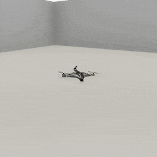
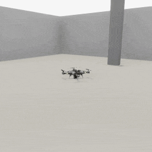

##### Drones

# Drones

*Drones in TDW are handled via the PhysX physics engine. If you haven't done so already, we strongly recommend you read the [physics tutorial](../physx/physx.md).*

TDW drones are agents that act like real-life drone quadcopters. The user can set lift, drive, and turn values to steer the drone. 

A drone can be added to the scene by using the [`Drone`](../../python/add_ons/drone.md) add-on:

```python
from tdw.controller import Controller
from tdw.add_ons.drone import Drone
from tdw.add_ons.third_person_camera import ThirdPersonCamera
from tdw.add_ons.image_capture import ImageCapture
from tdw.backend.paths import EXAMPLE_CONTROLLER_OUTPUT_PATH

c = Controller()
drone = Drone()
camera = ThirdPersonCamera(position={"x": 3.15, "y": 1.2, "z": 2},
                           look_at=drone.drone_id,
                           avatar_id="a")
path = EXAMPLE_CONTROLLER_OUTPUT_PATH.joinpath("drone_suburb")
capture = ImageCapture(avatar_ids=["a"], path=path)
print(f"Images will be saved to: {path}")
c.add_ons.extend([drone, camera, capture])
c.communicate([c.get_add_scene(scene_name="suburb_scene_2023")])
for i in range(200):
    c.communicate([])
# Start rising.
drone.set_lift(1)
for i in range(100):
    c.communicate([])
# Hold this altitude.
drone.set_lift(0)
# Fly forward.
drone.set_drive(1)
for i in range(200):
    c.communicate([])
# Turn a little then continue straight.
drone.set_turn(-1)
for i in range(100):
    c.communicate([])
drone.set_turn(0)
for i in range(100):
    c.communicate([])
# Stop and hover for 200 frames.
drone.set_drive(0)
for i in range(200):
    c.communicate([])
# Return to the ground.
drone.set_lift(-1)
for i in range(100):
    c.communicate([])
# Watch for a bit.
drone.set_lift(0)
for i in range(200):
    c.communicate([])
c.communicate({"$type": "terminate"})
```

Result:


## Lift, drive, and turn

You can set the drone's lift, drive, and turn via `drone.set_lift(value)`, `drone.set_drive(value)`, and `drone.set_turn(value)`. Each `value` must be -1, 0, or 1. If the `value` is 0, the drone will stop moving in that direction. For example, if you call `drone.set_lift(1)`, wait a few communicate() calls, and then call `drone.set_lift(0)`, the drone will remain at its present elevation (rather than falling).

## Initial position and rotation

To set the drone's initial position and rotation, set the `position` and `rotation` parameters in the constructor, for example: `drone = Drone(position={"x": 1, "y": 0, "z": 0}, rotation={"x": 0, "y": -90, "z": 0})`.

## Set optional flight parameters

There are many optional flight parameters that will determine the drone's speed, overall stability, etc. For example, to set the drone's maximum forward speed: `drone = Drone(forward_speed=5)`. 

For a full list of flight parameters, [read the API documentation](../../python/add_ons/drone.md).

## Output data and images

The drone stores its output data in `drone.dynamic`, which is a [`DroneDynamic`](../../python/drone/drone_dynamic.md) data object. This data includes the drone's position (`drone.dynamic.transform`, a [`Transform`](../../python/object_data/transform.md)), data for a raycast that starts from the drone and ends somewhere below it (`drone.dynamic.raycast_hit` and `drone.dynamic.raycast_point`), and a boolean indicating if the drone's motor is on.

Images are stored in a dictionary: `drone.dynamic.images`. The key is a string indicating the capture pass, for example `"_img"`. 

By default, the drone saves [RGB images](../core_concepts/images.md) and [depth maps](../visual_perception/depth.md). To set the drone's image passes, set the optional `image_passes` parameter in the constructor like this: `drone = Drone(image_passes=["_img"])`. 

The drone's camera matrices are stored in `drone.dynamic.camera_matrix` and `drone.dynamic.projection_matrix`.

To disable image capture, set the optional `image_capture` parameter in the constructor to False: `drone = Drone(image_capture=False)`. As with any camera in TDW, disabling image capture will allow the camera to continue to render to the window even though it isn't returning image data.

Note that, as with any camera, an [`ImageCapture`](../core_concepts/images.md) add-on, which most of these examples include, can supersede the drone's image capture parameters, depending on the order in which the add-ons are appended to `c.add_ons`.

To save images, you can call `drone.dynamic.save_images(output_directory)`. To convert the raw image data to a PIL image, call `drone.dynamic.get_pil_image(pass_mask)`.

In this example, we'll fly the drone and record its data every communicate() call. This is an unusual controller because it overrides `communicate()` in order to save drone images and record the drone's position and other data per call:

```python
from json import dumps
from typing import Union, List
from tdw.controller import Controller
from tdw.add_ons.drone import Drone
from tdw.backend.paths import EXAMPLE_CONTROLLER_OUTPUT_PATH


class DynamicData(Controller):
    """
    Read and save the drone's output data, including image data.
    """

    def __init__(self, port: int = 1071, check_version: bool = True, launch_build: bool = True):
        self._first_time_only = True
        super().__init__(port=port, check_version=check_version, launch_build=launch_build)
        self.drone = Drone(rotation={"x": 0, "y": -90, "z": 0})
        self.add_ons.append(self.drone)
        self.path = EXAMPLE_CONTROLLER_OUTPUT_PATH.joinpath("drone_dynamic_data")
        print(f"Images and JSON data will be saved to: {self.path}")
        # Start the json data.
        self.output_data = list()

    def communicate(self, commands: Union[dict, List[dict]]) -> list:
        resp = super().communicate(commands=commands)
        if self._first_time_only:
            self._first_time_only = False
            return resp
        # Save the drone's images.
        self.drone.dynamic.save_images(output_directory=self.path)
        # Write the other data as a JSON file.
        output_data = {"transform": {"position": self.drone.dynamic.transform.position.tolist(),
                                     "rotation": self.drone.dynamic.transform.rotation.tolist(),
                                     "forward": self.drone.dynamic.transform.forward.tolist()},
                       "camera_matrices": {"camera_matrix": self.drone.dynamic.camera_matrix.tolist(),
                                           "projection_matrix": self.drone.dynamic.projection_matrix.tolist()},
                       "raycast": {"hit": self.drone.dynamic.raycast_hit,
                                   "point": self.drone.dynamic.raycast_point.tolist()},
                       "motor_on": self.drone.dynamic.motor_on}
        # Remember the output data.
        self.output_data.append(output_data)
        # Return the response from the build.
        return resp

    def run(self):
        self.communicate(c.get_add_scene(scene_name="suburb_scene_2023"))
        # Let the drone rise.
        self.drone.set_lift(1)
        while self.drone.dynamic.transform.position[1] < 10:
            self.communicate([])
        # Quit.
        self.communicate({"$type": "terminate"})
        # Write the JSON data.
        self.path.joinpath("output_data.json").write_text(dumps(self.output_data, indent=2))


if __name__ == "__main__":
    c = DynamicData()
    c.run()
```

Result:


## Wrap drone movement in functions

So far, the examples in this document have waited a certain number of communicate() calls for the drone to rise, move, etc. In  most use-cases, you will most likely want to wait until the drone is at certain height, position, etc. instead.

This controller wraps `drone.set_lift(y)` in a simple `rise_by` function that calls communicate() until the drone is at a target height:

```python
from tdw.controller import Controller
from tdw.tdw_utils import TDWUtils
from tdw.add_ons.drone import Drone
from tdw.add_ons.third_person_camera import ThirdPersonCamera
from tdw.add_ons.image_capture import ImageCapture
from tdw.backend.paths import EXAMPLE_CONTROLLER_OUTPUT_PATH


class RiseBy(Controller):
    def __init__(self, port: int = 1071, check_version: bool = True, launch_build: bool = True):
        super().__init__(port=port, check_version=check_version, launch_build=launch_build)
        self.drone = Drone()
        self.camera = ThirdPersonCamera(position={"x": 2.59, "y": 1.2, "z": -3.57},
                                        look_at=self.drone.drone_id,
                                        avatar_id="a")
        path = EXAMPLE_CONTROLLER_OUTPUT_PATH.joinpath("drone_rise_by")
        print(f"Images will be saved to: {path}")
        self.capture = ImageCapture(avatar_ids=["a"], path=path)
        self.add_ons.extend([self.drone, self.camera, self.capture])

    def rise_by(self, y: float):
        if y > 0:
            self.drone.set_lift(1)
            up = True
        else:
            self.drone.set_lift(-1)
            up = False
        y1 = self.drone.dynamic.transform.position[1] + y
        if up:
            while self.drone.dynamic.transform.position[1] < y1:
                self.communicate([])
        else:
            while self.drone.dynamic.transform.position[1] > y1:
                self.communicate([])
        self.drone.set_lift(0)

    def run(self):
        self.communicate(TDWUtils.create_empty_room(12, 12))
        self.rise_by(1.1)
        self.communicate({"$type": "terminate"})


if __name__ == "__main__":
    c = RiseBy()
    c.run()
```

Many improvements could be made to this example, such as:

- Using `drone.dynamic.raycast_point` to find the drone's elevation from the terrain, as opposed to its elevation from y=0.
- As-is, this wrapper function wouldn't work very well for multi-agent simulations because there is no way to interrupt movement or to drive one drone while the other is moving. This could be handled  better with a boolean flag or a data class like the [Replicant's](../replicants/overview.md) actions, but doing so is relatively complex and beyond the scope of this document.

## Start and stop the motor

You can initialize a drone with its motor off like this: `drone = Drone(motor_on=False)`.

You can toggle the drone's motor while it is flying by calling `drone.set_motor(value)` where `value` is a boolean.

```python
from tdw.controller import Controller
from tdw.tdw_utils import TDWUtils
from tdw.add_ons.drone import Drone
from tdw.add_ons.third_person_camera import ThirdPersonCamera
from tdw.add_ons.image_capture import ImageCapture
from tdw.backend.paths import EXAMPLE_CONTROLLER_OUTPUT_PATH

c = Controller()
drone = Drone(rotation={"x": 0, "y": -90, "z": 0})
camera = ThirdPersonCamera(position={"x": 3.15, "y": 1.2, "z": 2},
                           look_at=drone.drone_id,
                           avatar_id="a")
path = EXAMPLE_CONTROLLER_OUTPUT_PATH.joinpath("drone_stop_motor")
capture = ImageCapture(avatar_ids=["a"], path=path)
print(f"Images will be saved to: {path}")
c.add_ons.extend([drone, camera, capture])
c.communicate(TDWUtils.create_empty_room(12, 12))
for i in range(200):
    c.communicate([])
# Start rising.
drone.set_lift(1)
for i in range(100):
    c.communicate([])
# Stop the motor.
drone.set_motor(False)
# The drone falls.
for i in range(200):
    c.communicate([])
c.communicate({"$type": "terminate"})
```

Result:



## Collision detection

The drone is technically a subclass of a standard [TDW object](../core_concepts/objects.md) and therefore will appear in object output data, including collision output data. 

When a drone collides with an object, its motor turns off. The add-on will continue to try to apply forces to the drone, so you must also call `drone.set_motor(False)`.

You can use a [`CollisionManager`](../physx/collisions.md) to listen for collisions between the drone and other objects like this:

```python
import numpy as np
from tdw.controller import Controller
from tdw.tdw_utils import TDWUtils
from tdw.add_ons.drone import Drone
from tdw.add_ons.third_person_camera import ThirdPersonCamera
from tdw.add_ons.image_capture import ImageCapture
from tdw.add_ons.collision_manager import CollisionManager
from tdw.backend.paths import EXAMPLE_CONTROLLER_OUTPUT_PATH


class CollisionDetection(Controller):
    """
    Drone collision detection.
    """

    def __init__(self, port: int = 1071, check_version: bool = True, launch_build: bool = True):
        super().__init__(port=port, check_version=check_version, launch_build=launch_build)
        self.drone = Drone()
        self.camera = ThirdPersonCamera(position={"x": 2.59, "y": 1.2, "z": -3.57},
                                        look_at=self.drone.drone_id,
                                        avatar_id="a")
        path = EXAMPLE_CONTROLLER_OUTPUT_PATH.joinpath("drone_collision_detection")
        print(f"Images will be saved to: {path}")
        self.capture = ImageCapture(avatar_ids=["a"], path=path)
        self.collision_manager = CollisionManager(enter=True, stay=False, exit=False)
        self.object_id = Controller.get_unique_id()
        self.add_ons.extend([self.drone, self.camera, self.capture, self.collision_manager])

    def rise_by(self, y: float):
        if y > 0:
            self.drone.set_lift(1)
            up = True
        else:
            self.drone.set_lift(-1)
            up = False
        y1 = self.drone.dynamic.transform.position[1] + y
        if up:
            while self.drone.dynamic.transform.position[1] < y1:
                self.communicate([])
        else:
            while self.drone.dynamic.transform.position[1] > y1:
                self.communicate([])
        self.drone.set_lift(0)

    def move_by(self, z: float, arrived_at: float = 0.1):
        if z > 0:
            self.drone.set_drive(1)
        else:
            self.drone.set_drive(-1)
        # Get the target position. We can't use the z coordinate because the drone might have turned.
        target = self.drone.dynamic.transform.position + self.drone.dynamic.transform.forward * z
        # Wait for the drone to reach the target, or stop if there was a collision.
        while len(self.collision_manager.obj_collisions) == 0 and np.linalg.norm(self.drone.dynamic.transform.position - target) > arrived_at:
            self.communicate([])
        # The drone crashed into an obstacle. Set all force values to 0 and let it fall.
        if len(self.collision_manager.obj_collisions) > 0:
            self.drone.set_motor(False)
            print(self.drone.dynamic.motor_on)
            for ids in self.collision_manager.obj_collisions:
                print(ids.int1, ids.int2)
            for i in range(100):
                self.communicate([])
        else:
            self.drone.set_drive(0)

    def run(self):
        commands = [TDWUtils.create_empty_room(12, 12)]
        commands.extend(Controller.get_add_physics_object(model_name="cube",
                                                          object_id=self.object_id,
                                                          library="models_flex.json",
                                                          position={"x": 0, "y": 0, "z": 3},
                                                          scale_factor={"x": 0.5, "y": 3, "z": 0.3},
                                                          kinematic=True))
        self.communicate(commands)
        self.rise_by(1.1)
        self.move_by(5)
        self.communicate({"$type": "terminate"})


if __name__ == "__main__":
    c = CollisionDetection()
    c.run()
```

Result:



## Physical realism

**Drones are *not* entirely physically realistic.** 

Drones *are* realistic in that they look like drones and respond to [PhysX forces](../physx/forces.md). Whenever you set the drone's lift, drive, or turn values,  you are adjusting forces being applied to it per communicate() call. As explained above, drones can collide with objects.

However, TDW doesn't simulate true aerodynamic. Drones "fly" by ignoring the simulation's gravity. 

## Low-level description

The drone is added to the scene via [`add_drone`](../../api/command_api.md#add_drone).  And [avatar](../core_concepts/avatars.md) is attached to the drone via [`create_avatar`](../../api/command_api.md#create_avatar) and [`parent_avatar_to_drone`](../../api/command_api.md#parent_avatar_to_drone).

Per communicate call, the drone receives [`Transforms`](../../api/output_data.md#Transforms), which it uses to find its position, forward, and rotation; and  [`Transforms`](../../api/output_data.md#Transforms), and [`Drones`](../../api/output_data.md#Drones), which includes the drone's motor status and raycast information.

The drone's lift, drive, and turn are set by continuously sending [`apply_drone_drive`](../../api/command_api.md#apply_drone_drive), [`apply_drone_lift`](../../api/command_api.md#apply_drone_lift), and [`apply_drone_turn`](../../api/command_api.md#apply_drone_turn), respectively. The drone's motor is set via [`set_drone_motor`](../../api/command_api.md#set_drone_motor).

***

**This is the last document in the "Drone" tutorial.**

[Return to the README](../../../README.md)

***

Example controllers:

- [minimal.py](https://github.com/threedworld-mit/tdw/blob/master/Python/example_controllers/drone/minimal.py) Minimal example of a drone flying in a suburb.
- [collision_detection.py](https://github.com/threedworld-mit/tdw/blob/master/Python/example_controllers/drone/collision_detection.py) Drone collision detection.
- [dynamic_data.py](https://github.com/threedworld-mit/tdw/blob/master/Python/example_controllers/drone/dynamic_data.py) Read and save the drone's output data, including image data.
- [rise_by.py](https://github.com/threedworld-mit/tdw/blob/master/Python/example_controllers/drone/rise_by.py) Wrap drone movement in a simple "rise by" function.
- [stop_motor.py](https://github.com/threedworld-mit/tdw/blob/master/Python/example_controllers/drone/stop_motor.py) Stop the drone's motor.

Python API:

- [`Drone`](../../python/add_ons/drone.md)
- [`DroneDynamic`](../../python/drone/drone_dynamic.md)
- [`Transform`](../../python/object_data/transform.md)

Command API:

- [`add_drone`](../../api/command_api.md#add_drone).
- [`create_avatar`](../../api/command_api.md#create_avatar)
- [`parent_avatar_to_drone`](../../api/command_api.md#parent_avatar_to_drone)
- [`apply_drone_drive`](../../api/command_api.md#apply_drone_drive)
- [`apply_drone_lift`](../../api/command_api.md#apply_drone_lift)
- [`apply_drone_turn`](../../api/command_api.md#apply_drone_turn)
- [`set_drone_motor`](../../api/command_api.md#set_drone_motor)

Output Data:

-  [`Transforms`](../../api/output_data.md#Transforms)
-  [`Drones`](../../api/output_data.md#Drones)