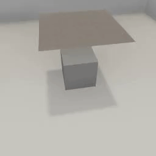
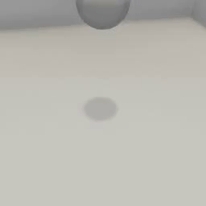

##### Physics (Flex)

# Cloth actors

**Flex fluids have been deprecated in TDW. Please use [Obi cloth](../obi/cloth.md) instead.**

Enable an object as a cloth-body actor via [`set_flex_cloth_actor`](../../api/command_api.md#set_flex_cloth_actor):

```python
from tdw.controller import Controller
from tdw.tdw_utils import TDWUtils
from tdw.add_ons.third_person_camera import ThirdPersonCamera
from tdw.add_ons.image_capture import ImageCapture
from tdw.backend.paths import EXAMPLE_CONTROLLER_OUTPUT_PATH

"""
Minimal example of a Flex cloth body simulation.
"""

c = Controller()
camera = ThirdPersonCamera(avatar_id="a",
                           position={"x": 3.83, "y": 3.6, "z": -0.71},
                           look_at={"x": 0, "y": 0, "z": 0})
path = EXAMPLE_CONTROLLER_OUTPUT_PATH.joinpath("flex_cloth")
print(f"Images will be saved to: {path}")
capture = ImageCapture(avatar_ids=["a"], path=path)
c.add_ons.extend([camera, capture])
cube_id = c.get_unique_id()
cloth_id = c.get_unique_id()
c.communicate([TDWUtils.create_empty_room(12, 12),
               {'$type': 'convexify_proc_gen_room'},
               {'$type': 'create_flex_container'},
               c.get_add_object(model_name="cube",
                                object_id=cube_id,
                                library="models_flex.json",
                                position={"x": 0, "y": 0, "z": 0}),
               {"$type": "set_flex_solid_actor",
                "id": cube_id,
                "mass_scale": 50,
                "particle_spacing": 0.125},
               {"$type": "assign_flex_container",
                "id": cube_id,
                "container_id": 0},
               c.get_add_object(model_name="cloth_square",
                                object_id=cloth_id,
                                library="models_special.json",
                                position={"x": 0.25, "y": 2, "z": 0}),
               {"$type": "set_flex_cloth_actor",
                "id": cloth_id,
                "mass_scale": 1,
                "mesh_tesselation": 1,
                "tether_stiffness": 0.5,
                "bend_stiffness": 1.0,
                "self_collide": False,
                "stretch_stiffness": 1.0},
               {"$type": "assign_flex_container",
                "id": cloth_id,
                "container_id": 0}])
for i in range(300):
    c.communicate([])
c.communicate({"$type": "terminate"})
```

Result:



## Cloth models

In the above example, each object is from a different [model library](../3d_models/overview.md). The cube is from `models_flex.json` and the cloth square is from `models_special.json`.

Not all Flex models are suitable for cloth simulations. `cloth_square` is usually the best choice for a sheet of cloth. The following `models_flex.json` primitives are also suitable:

- `cube`
- `octahedron`
- `pentagon`
- `platonic`
- `pyramid`
- `sphere`
- `torus`
- `triangular_prism`

## Pressurized cloth objects

In this example, a cloth ball will be added to the scene. The `"pressure"` parameter simulates air pressure:

```python
from tdw.controller import Controller
from tdw.tdw_utils import TDWUtils
from tdw.add_ons.third_person_camera import ThirdPersonCamera
from tdw.add_ons.image_capture import ImageCapture
from tdw.backend.paths import EXAMPLE_CONTROLLER_OUTPUT_PATH

"""
Add a pressurized cloth ball to the scene.
"""

c = Controller()
camera = ThirdPersonCamera(avatar_id="a",
                           position={"x": 3.83, "y": 3.6, "z": -0.71},
                           look_at={"x": 0, "y": 0, "z": 0})
path = EXAMPLE_CONTROLLER_OUTPUT_PATH.joinpath("cloth_ball")
print(f"Images will be saved to: {path}")
capture = ImageCapture(avatar_ids=["a"], path=path)
c.add_ons.extend([camera, capture])
ball_id = c.get_unique_id()
c.communicate([TDWUtils.create_empty_room(12, 12),
               {'$type': 'convexify_proc_gen_room'},
               {'$type': 'create_flex_container'},
               c.get_add_object(model_name="sphere",
                                object_id=ball_id,
                                library="models_flex.json",
                                position={"x": 0, "y": 2, "z": 0}),
               {"$type": "set_flex_cloth_actor",
                "id": ball_id,
                "mass_scale": 1,
                "mesh_tesselation": 1,
                "tether_stiffness": 0.5,
                "bend_stiffness": 1.0,
                "self_collide": False,
                "stretch_stiffness": 1.0,
                "pressure": 0.9},
               {"$type": "assign_flex_container",
                "id": ball_id,
                "container_id": 0}])
for i in range(200):
    c.communicate([])
c.communicate({"$type": "terminate"})
```

Result:



***

**Next: [Fluid and source actors](fluid_and_source.md)**

[Return to the README](../../../README.md)

***

Example controllers:

- In the TDW repo:
  - [soft_body.py](https://github.com/threedworld-mit/tdw/blob/master/Python/example_controllers/flex/soft_body.py) Minimal soft body simulation.
  - [cloth_ball.py](https://github.com/threedworld-mit/tdw/blob/master/Python/example_controllers/flex/cloth_ball.py) Simulate a pressurized cloth ball.
  - [cloth_drape.py](https://github.com/threedworld-mit/tdw/blob/master/Python/example_controllers/flex/cloth_drape.py) Drape a cloth square over an object.

- [tdw_physics](https://github.com/alters-mit/tdw_physics) includes several cloth simulations:
  - [dragging.py](https://github.com/alters-mit/tdw_physics/blob/master/controllers/dragging.py) Add a cloth. Place an object on the cloth. Add forces to a portion of the cloth to "drag" the object.
  - [draping.py](https://github.com/alters-mit/tdw_physics/blob/master/controllers/draping.py) Drape a randomly-selected object with a cloth object.
  - [squishing.py](https://github.com/alters-mit/tdw_physics/blob/master/controllers/squishing.py) "Squish" cloth primitives.

Command API:

- [`set_flex_cloth_actor`](../../api/command_api.md#set_flex_cloth_actor)