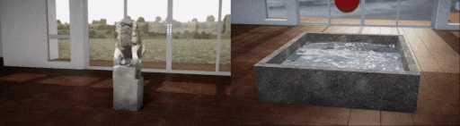

##### Physics (Flex)

# Flex - Overview

NVIDIA Flex is a physics engine in TDW that supports particle-based soft body, cloth, and fluid dynamics.



## Core concepts of Flex

By default, simulations in TDW use [PhysX](../physx/physx.md). To create a Flex simulation, you must manually enable Flex.

Flex objects exist in a "Flex Container" and have "Flex Actors" (Solid Actor, Cloth Actor, etc.). Physics is simulated by modifying the actor's *particles*, calculated using a GPU.

## System requirements

- Linux
  - High-end NVIDIA GPU (e.g. Titan X) and drivers
  - CUDA 8
  - Ubuntu 16
- Windows
  - High-end NVIDIA GPU (e.g. Titan X) and drivers
  - _Windows Unity Editor only:_ Make sure that the Windows build settings are enabled.
- OS X
  - Flex is not supported on OS X

## Scene setup

### 1. Create a scene with convex colliders

Flex objects won't interact with meshes with non-convex colliders. By default, most scenes in TDW have non-convex colliders.

For [streamed scenes](../core_concepts/scenes.md), send the [`add_scene`](../../api/command_api.md#add_scene) command (*not* [`Controller.get_add_scene(scene_name)`](../../python/controller.md)) and set `"convexify": True`:

```python
from tdw.controller import Controller
from tdw.librarian import SceneLibrarian

record = SceneLibrarian().get_record("building_site")
c = Controller()
c.communicate({"$type": "add_scene",
               "name": record.name,
               "url": record.get_url(),
               "convexify": True})  # This will make the colliders convex.
```

For the proc-gen room, send [`confexify_proc_gen_room`](../../api/command_api.md#convexify_proc_gen_room) after creating the room:

```python
from tdw.controller import Controller
from tdw.tdw_utils import TDWUtils

c = Controller()
c.communicate([TDWUtils.create_empty_room(12, 12),
               {"$type": "convexify_proc_gen_room"}])
```

### 2. Create a Flex container

Create a Flex container (which defines the Flex space and behavior) by sending [`create_flex_container`](../../api/command_api.md#create_flex_container):

```python
from tdw.controller import Controller
from tdw.tdw_utils import TDWUtils

c = Controller()
c.communicate([TDWUtils.create_empty_room(12, 12),
               {"$type": "convexify_proc_gen_room"},
               {"$type": "create_flex_container"}])
```

The `create_flex_container` has many optional parameters; see [the API documentation for more information](../../api/command_api.md#create_flex_container):

```python
from tdw.controller import Controller
from tdw.tdw_utils import TDWUtils

c = Controller()
c.communicate([TDWUtils.create_empty_room(12, 12),
               {"$type": "convexify_proc_gen_room"},
               {"$type": "create_flex_container", 
                "radius": 0.1875, 
                "solid_rest": 0.125, 
                "fluid_rest": 0.1125,
                "static_friction": 0.5,
                "dynamic_friction": 0.5,
                "particle_friction": 0.5, 
                "collision_distance": 0.0625,
                "substep_count": 3, 
                "iteration_count": 8,
                "damping": 1,
                "drag": 0.0,
                "shape_collision_margin": 0.0,
                'planes': [{'x': 0, 'y': 1, 'z': 0, 'w': 0}, {'x': 0, 'y': -1, 'z': 0, 'w': 5},
                           {'x': 1, 'y': 0, 'z': 0, 'w': 2.2}, {'x': -1, 'y': 0, 'z': 0, 'w': 2.2},
                           {'x': 0, 'y': 0, 'z': 1, 'w': 2.2}, {'x': 0, 'y': 0, 'z': -1, 'w': 2.2}],
                "cohesion": 0.025, 
                "surface_tension": 0.0, 
                "viscocity": 0.001, 
                "vorticity": 0.0, 
                "buoyancy": 1.0, 
                "adhesion": 0.0, 
                "anisotropy_scale": 2.0,
                "max_particles": 10000,
                "max_neighbors": 100, 
                "sleep_threshold": 0.0}])
```

### 3. Add an Flex object

Adding an object to a Flex scene requires at least 3 commands:

1. [`add_object`](../../api/command_api.md#add_object) or [`Controller.get_add_object(model_name)`](../../python/controller.md)
2. A command to *set the Flex actor* (in this case, [`set_flex_solid_actor`](../../api/command_api.md#set_flex_solid_actor))
3. [`assign_flex_container`](../../api/command_api.md#assign_flex_container) The `container_id` parameter should usually be 0. Container IDs are incremented every time a new one is added, such that the first container in the scene is 0, the second is 1, etc.

```python
from tdw.controller import Controller
from tdw.tdw_utils import TDWUtils

c = Controller()
object_id = c.get_unique_id()
c.communicate([TDWUtils.create_empty_room(12, 12),
               {"$type": "convexify_proc_gen_room"},
               {"$type": "create_flex_container"},
               c.get_add_object(model_name="rh10",
                                object_id=object_id,
                                position={"x": 0, "y": 1, "z": 0}),
               {"$type": "set_flex_solid_actor",
                "id": object_id,
                "mass_scale": 5,
                "particle_spacing": 0.05},
               {"$type": "assign_flex_container",
                "id": object_id,
                "container_id": 0}])
c.communicate({"$type": "terminate"})
```

## Flex primitive models

TDW includes a [model library](../3d_models/overview.md) of *Flex primitives*. These models are simple shapes with extra vertices to make them more useful in Flex simulations. All Flex primitives models can also be used in PhysX simulations.

To read the available Flex primitives:

```python
from tdw.librarian import ModelLibrarian

librarian = ModelLibrarian("models_flex.json")
for record in librarian.records:
    print(record.name)
```

Output:

```
bowl
cone
cube
cylinder
dumbbell
octahedron
pentagon
pipe
platonic
pyramid
sphere
torus
triangular_prism
```

To use a Flex primitive in a scene, set the `"library"` parameter of `Controller.get_add_object(model_name)`:

```python
from tdw.controller import Controller
from tdw.tdw_utils import TDWUtils

c = Controller()
object_id = c.get_unique_id()
c.communicate([TDWUtils.create_empty_room(12, 12),
               {"$type": "convexify_proc_gen_room"},
               {"$type": "create_flex_container"},
               c.get_add_object(model_name="cube",
                                object_id=object_id,
                                library="models_flex.json",
                                position={"x": 0, "y": 1, "z": 0}),
               {"$type": "set_flex_solid_actor",
                "id": object_id,
                "mass_scale": 5,
                "particle_spacing": 0.05},
               {"$type": "assign_flex_container",
                "id": object_id,
                "container_id": 0}])
c.communicate({"$type": "terminate"})
```

## Limitations

In general, if you only need rigidbody physics, you should almost always opt for the default [PhysX](../physx/physx.md) physics engine rather than Flex.

- **Flex is no longer supported by NVIDIA.** There are bugs in the Unity Flex plugin that unfortunately we can't fix. Flex and PhysX have been merged as of PhysX 5. However, Unity uses a much older version of PhysX and it's not known when, or if, it will ever be upgraded. Additionally, this means that many parameters in Flex objects are poorly documented.
- **Collision callbacks are very limited.** Collision detection is supported *internally* but there is no direct way to [serialize collision "events" into output data.](../physx/collisions.md) In most Flex simulations, we use PhysX colliders, which will align with solid actors but won't perfectly align with cloth, soft, fluid, or source actors.
- **Not all models  work in Flex.** Internally, a model is Flex-compatible if has a single GameObject and a single mesh. To determine if a model can be used in Flex, check [`record.flex`](../../python/librarian/model_librarian.md):

```python
from tdw.librarian import ModelLibrarian

librarian = ModelLibrarian()
for record in librarian.records:
    if record.flex and not record.do_not_use:
        print(record.name)
```

## Known bugs

- **Flex leaks memory when objects are destroyed.** This is a bug in the Unity Flex plugin that we can't fix. If you destroy objects with the command [`destroy_flex_object`](../../api/command_api.md#destroy_flex_object) instead of [`destroy_object`](../../api/command_api.md#destroy_object), *less* memory will be leaked.
- **Fluid simulations are supported only on Windows.** If you try loading fluids in Ubuntu 16, the screen will flip upside-down and the fluid will be invisible.
- Adding a Flex Source Actor with the [`set_flex_source_actor`](../../api/command_api.md#set_flex_source_actor) command disables all particle data for all Flex objects in the scene.

***

**Next: [Solid and soft actors](solid_and_soft.md)**

[Return to the README](../../../README.md)

***

Example controllers:

- [flex_minimal.py](https://github.com/threedworld-mit/tdw/blob/master/Python/example_controllers/flex/flex_minimal.py) Minimal Flex scene setup.

Python API:

- [`ModelLibrarian`](../../python/librarian/model_librarian.md)
- [`Controller`](../../python/controller.md)

Command API:

- [`add_scene`](../../api/command_api.md#add_scene)
- [`confexify_proc_gen_room`](../../api/command_api.md#convexify_proc_gen_room)
- [`create_flex_container`](../../api/command_api.md#create_flex_container)
- [`add_object`](../../api/command_api.md#add_object)
- [`set_flex_solid_actor`](../../api/command_api.md#set_flex_solid_actor)
- [`assign_flex_container`](../../api/command_api.md#assign_flex_container)
- [`destroy_flex_object`](../../api/command_api.md#destroy_flex_object)
- [`destroy_object`](../../api/command_api.md#destroy_object)
- [`set_flex_source_actor`](../../api/command_api.md#set_flex_source_actor)