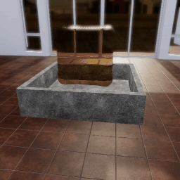
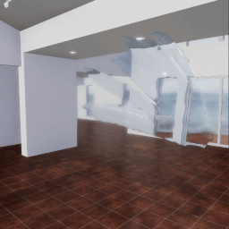

##### Physics (Flex)

# Fluid and source actors

**Flex fluids have been deprecated in TDW. Please use [Obi fluids](../obi/fluids.md) instead.**

In Flex simulations *fluids* are bodies of fluids while *sources* are fluids emitted from a source.

## Limitations

- Flex fluid and source actors are only supported on Windows.
- [Flex particle output data](output_data.md) is disabled if there are fluid or source actors in the scene.

## Fluid simulations and Flex containers

Like all Flex simulations, fluid simulations require a Flex container. The parameters `"viscosity"`, `"adhesion"`, and `"cohesion"` control the fluid dynamics.

TDW includes pre-set values for various types of fluids. You can find these in the [`tdw.flex_data.fluid_type.FLUID_TYPES`](../../python/flex_data/fluid_type.md):

```python
from tdw.flex_data.fluid_type import FLUID_TYPES

print(FLUID_TYPES.keys())
water = FLUID_TYPES["water"]
print(water.fluid_type)
print(water.adhesion)
print(water.viscosity)
print(water.cohesion)
```

Output:

```
dict_keys(['water', 'ink', 'oil', 'honey', 'glycerin', 'chocolate'])
water
0
0.01
0.001
```

You can then use these parameters in [`create_flex_container`](../../api/command_api.md#create_flex_container):

```python
from tdw.controller import Controller
from tdw.tdw_utils import TDWUtils
from tdw.flex_data.fluid_type import FLUID_TYPES

fluid = FLUID_TYPES["honey"]
c = Controller()
c.communicate([TDWUtils.create_empty_room(12, 12),
               {'$type': 'convexify_proc_gen_room'},
               {"$type": "create_flex_container",
                "collision_distance": 0.04,
                "static_friction": 0.1,
                "dynamic_friction": 0.1,
                "particle_friction": 0.1,
                "viscocity": fluid.viscosity,
                "adhesion": fluid.adhesion,
                "cohesion": fluid.cohesion,
                "radius": 0.1,
                "fluid_rest": 0.05,
                "damping": 0.01,
                "substep_count": 5,
                "iteration_count": 8,
                "buoyancy": 1.0}])
```

In this example, fluids are parameterized and randomly selected:

```python
import random
from tdw.controller import Controller
from tdw.flex_data.fluid_type import FLUID_TYPES


class FlexFluids(Controller):
    def __init__(self, port: int = 1071, check_version: bool = True, launch_build: bool = True):
        super().__init__(port=port, check_version=check_version, launch_build=launch_build)
        self.communicate(self.get_add_scene(scene_name="tdw_room"))

    def trial(self, fluid_name: str) -> None:
        fluid = FLUID_TYPES[fluid_name]
        self.communicate([{"$type": "create_flex_container",
                           "collision_distance": 0.04,
                           "static_friction": 0.1,
                           "dynamic_friction": 0.1,
                           "particle_friction": 0.1,
                           "viscocity": fluid.viscosity,
                           "adhesion": fluid.adhesion,
                           "cohesion": fluid.cohesion,
                           "radius": 0.1,
                           "fluid_rest": 0.05,
                           "damping": 0.01,
                           "substep_count": 5,
                           "iteration_count": 8,
                           "buoyancy": 1.0}])

    def run(self, num_trials: int) -> None:
        for i in range(num_trials):
            # Select a random fluid.
            fluid_name = random.choice(FLUID_TYPES.keys())
            self.trial(fluid_name=fluid_name)
        self.communicate({"$type": "terminate"})


if __name__ == "__main__":
    c = FlexFluids()
    c.run(num_trials=15)
```

## Fluid actors

A fluid actor requires a pre-defined fluid object: Load it via [`load_flex_fluid_from_resources`](../../api/command_api.md#load_flex_fluid_from_resources). Make the fluid body a fluid actor via [`set_flex_fluid_actor`](../../api/command_api.md#set_flex_fluid_actor). When using fluid actors, set the parameter `"fluid_container"` to True and set `"fluid_type"` to the name of the fluid in [`assign_flex_container`](../../api/command_api.md#assign_flex_container).

You can optionally add a receptacle object, such as `fluid_receptacle1x1`, found in `models_special.json`. It does *not* need to be a Flex-enabled object.

This example adds a random fluid to each trial:

```python
import random
from tdw.controller import Controller
from tdw.tdw_utils import TDWUtils
from tdw.flex_data.fluid_type import FLUID_TYPES


class FlexFluids(Controller):
    """
    Generate fluid simulation trials with random fluids.
    """

    def __init__(self, port: int = 1071, check_version: bool = True, launch_build: bool = True):
        super().__init__(port=port, check_version=check_version, launch_build=launch_build)
        # Create a scene and add a camera.
        commands = [self.get_add_scene(scene_name="tdw_room")]
        commands.extend(TDWUtils.create_avatar(position={"x": -3.75, "y": 1.5, "z": -0.5},
                                               look_at={"x": 0, "y": 0, "z": 0},
                                               avatar_id="a"))
        self.communicate(commands)

    def trial(self, fluid_name: str) -> None:
        fluid = FLUID_TYPES[fluid_name]
        receptacle_id = self.get_unique_id()
        fluid_id = self.get_unique_id()
        # Create a Flex fluid container.
        # Add a receptacle and a fluid object.
        self.communicate([{"$type": "create_flex_container",
                           "collision_distance": 0.04,
                           "static_friction": 0.1,
                           "dynamic_friction": 0.1,
                           "particle_friction": 0.1,
                           "viscocity": fluid.viscosity,
                           "adhesion": fluid.adhesion,
                           "cohesion": fluid.cohesion,
                           "radius": 0.1,
                           "fluid_rest": 0.05,
                           "damping": 0.01,
                           "substep_count": 5,
                           "iteration_count": 8,
                           "buoyancy": 1.0},
                          self.get_add_object(model_name="fluid_receptacle1x1",
                                              object_id=receptacle_id,
                                              position={"x": -0.35, "y": 0, "z": 0},
                                              rotation={"x": 0, "y": 0, "z": 0},
                                              library="models_special.json"),
                          {"$type": "scale_object",
                           "id": receptacle_id,
                           "scale_factor": {"x": 2.0, "y": 2.0, "z": 2.0}},
                          {"$type": "set_kinematic_state",
                           "id": receptacle_id,
                           "is_kinematic": True,
                           "use_gravity": False},
                          {"$type": "load_flex_fluid_from_resources",
                           "id": fluid_id,
                           "orientation": {"x": 0, "y": 0, "z": 0},
                           "position": {"x": -0.35, "y": 1.0, "z": 0}},
                          {"$type": "set_flex_fluid_actor",
                           "id": fluid_id,
                           "mass_scale": 1.0,
                           "particle_spacing": 0.05},
                          {"$type": "assign_flex_container",
                           "id": fluid_id,
                           "container_id": 0,
                           "fluid_container": True,
                           "fluid_type": fluid_name}])
        # Let the fluid move.
        for i in range(200):
            self.communicate([])
        # Reset the scene.
        self.communicate([{"$type": "destroy_flex_container"},
                          {"$type": "destroy_object",
                           "id": receptacle_id},
                          {"$type": "destroy_flex_object",
                           "id": fluid_id}])

    def run(self, num_trials: int) -> None:
        for i in range(num_trials):
            # Select a random fluid.
            fluid_keys = list(FLUID_TYPES.keys())
            fluid_name = random.choice(fluid_keys)
            self.trial(fluid_name=fluid_name)
        self.communicate({"$type": "terminate"})


if __name__ == "__main__":
    c = FlexFluids()
    c.run(num_trials=15)
```

Result:



Note: Each trial ends with three commands: [`destroy_flex_container`](../../api/command_api.md#destroy_flex_container), [`destroy_object`](../../api/command_api.md#destroy_object), and [`destroy_flex_object`](../../api/command_api.md#destroy_flex_object). [A document later in this tutorial will explain in more depth how to reset a Flex scene.](reset_scene.md) The command `destroy_object` is used for the receptacle because it isn't a Flex object.

## Source actors

A fluid source actor object requires at least two commands:

1. [`load_flex_fluid_source_from_resources`](../../api/command_api.md#load_flex_fluid_source_from_resources) This will instantiate a model stored within the TDW build as the fluid source.
2. [`set_flex_fluid_source_actor`](../../api/command_api.md#set_flex_fluid_source_actor) This makes the object a fluid source actor.

Just like fluid actors, you can use fluid types to define fluid parameters. When using fluid source actors, set the parameter `"fluid_container"` to True and set `"fluid_type"` to the name of the fluid in [`assign_flex_container`](../../api/command_api.md#assign_flex_container).

```python
from tdw.controller import Controller
from tdw.tdw_utils import TDWUtils
from tdw.flex_data.fluid_type import FLUID_TYPES

c = Controller()
fluid = FLUID_TYPES["water"]
fluid_id = c.get_unique_id()
# Load the scene. Create a Flex container.
# Load the fluid source object and scale it.
# Create the fluid source actor, assign its container and set the scale to a reasonable size for a water jet.
commands = [c.get_add_scene(scene_name="tdw_room"),
            {"$type": "create_flex_container",
             "collision_distance": 0.05,
             "static_friction": 0.1,
             "dynamic_friction": 0.1,
             "particle_friction": 0.1,
             "solid_rest": 0.1,
             "fluid_rest": 0.095,
             "viscocity": fluid.viscosity,
             "cohesion": fluid.cohesion,
             "adhesion": fluid.adhesion,
             "surface_tension": 0.01,
             "radius": 0.25,
             "damping": 0,
             "substep_count": 2,
             "iteration_count": 5,
             "buoyancy": 1.0,
             "anisotropy_scale": 1.5,
             "max_particles": 15000,
             "max_neighbors": 200},
            {"$type": "load_flex_fluid_source_from_resources",
             "id": fluid_id,
             "orientation": {"x": 44, "y": 0, "z": 0},
             "position": {"x": 0, "y": 1.0, "z": 0}},
            {"$type": "scale_object",
             "id": fluid_id,
             "scale_factor": {"x": 0.4, "y": 0.4, "z": 1}},
            {"$type": "set_flex_fluid_source_actor",
             "id": fluid_id,
             "mass_scale": 1.0,
             "start_speed": 5.0,
             "lifetime": 3.0,
             "mesh_tesselation": 2},
            {"$type": "assign_flex_container",
             "id": fluid_id,
             "container_id": 0,
             "fluid_container": True},
            {"$type": "set_time_step",
             "time_step": 0.02}]
# Add an avatar.
commands.extend(TDWUtils.create_avatar(position={"x": 3.6, "y": 1.8, "z": 1.3}, look_at={"x": 0, "y": 1.35, "z": -2}))
c.communicate(commands)

for i in range(200):
    c.communicate([])
c.communicate({"$type": "terminate"})
```

Result:



##  Fluid and source actor parameters

Read the API documentation for a full list of parameters for [`set_flex_fluid_actor`](../../api/command_api.md#set_flex_fluid_actor) and [`set_flex_fluid_source_actor`](../../api/command_api.md#set_flex_fluid_source_actor).

In almost all cases, you should use the default values; the most important values to adjust are in [`create_flex_container`](../../api/command_api.md#create_flex_container) (see above example).

***

**Next: [Move, rotate, and scale Flex objects](transform.md)**

[Return to the README](../../../README.md)

***

Example controllers:

- In the TDW repo:
  - [fluid.py](https://github.com/threedworld-mit/tdw/blob/master/Python/example_controllers/flex/fluid.py)  Generate fluid simulation trials with random fluids.
  - [source.py](https://github.com/threedworld-mit/tdw/blob/master/Python/example_controllers/flex/source.py)  Create a Flex FluidSource, or "hose pipe", simulation of a fluid stream.
- [tdw_physics](https://github.com/alters-mit/tdw_physics) includes a fluid simulation:
  - [submerging.py](https://github.com/alters-mit/tdw_physics/blob/master/controllers/submerging.py) Drop ball objects of increasing mass into afluid.

Command API:

- [`create_flex_container`](../../api/command_api.md#create_flex_container)
- [`load_flex_fluid_from_resources`](../../api/command_api.md#load_flex_fluid_from_resources)
- [`set_flex_fluid_actor`](../../api/command_api.md#set_flex_fluid_actor)
- [`assign_flex_container`](../../api/command_api.md#assign_flex_container)
- [`destroy_flex_container`](../../api/command_api.md#destroy_flex_container)
- [`destroy_object`](../../api/command_api.md#destroy_object)
- [`destroy_flex_object`](../../api/command_api.md#destroy_flex_object)
- [`load_flex_fluid_source_from_resources`](../../api/command_api.md#load_flex_fluid_source_from_resources)
- [`set_flex_fluid_source_actor`](../../api/command_api.md#set_flex_fluid_source_actor)
