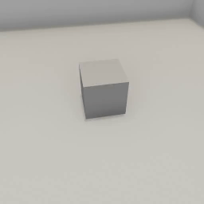
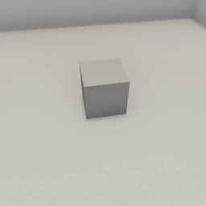

##### Physics (Flex)

# Apply forces to Flex objects

Like [PhysX](../physx/physx.md), it is possible to apply forces to Flex objects either implicitly (i.e. letting objects fall to due gravity) or explicitly (i.e. by adding a force to the physics engine).

## Apply a force to the Flex object

The simplest way to apply a force to a Flex object is to send [`apply_force_to_flex_object`](../../api/command_api.md#apply_force_to_flex_object):

```python
from tdw.controller import Controller
from tdw.tdw_utils import TDWUtils
from tdw.add_ons.third_person_camera import ThirdPersonCamera
from tdw.add_ons.image_capture import ImageCapture
from tdw.backend.paths import EXAMPLE_CONTROLLER_OUTPUT_PATH

c = Controller()
camera = ThirdPersonCamera(avatar_id="a",
                           position={"x": 3.83, "y": 3.6, "z": -0.71},
                           look_at={"x": 0, "y": 0, "z": 0})
path = EXAMPLE_CONTROLLER_OUTPUT_PATH.joinpath("apply_force_to_flex_object")
print(f"Images will be saved to: {path}")
capture = ImageCapture(avatar_ids=["a"], path=path)
c.add_ons.extend([camera, capture])
cube_id = c.get_unique_id()
c.communicate([TDWUtils.create_empty_room(12, 12),
               {'$type': 'convexify_proc_gen_room'},
               {'$type': 'create_flex_container'},
               c.get_add_object(model_name="cube",
                                object_id=cube_id,
                                library="models_flex.json",
                                position={"x": 0, "y": 0, "z": 0}),
               {'$type': 'set_flex_soft_actor',
                'id': cube_id,
                'particle_spacing': 0.125,
                'cluster_stiffness': 0.22},
               {"$type": "assign_flex_container",
                "id": cube_id,
                "container_id": 0},
               {"$type": "apply_force_to_flex_object",
                "force": {"x": 2000, "y": 0.0, "z": 0},
                "id": cube_id}])
for i in range(200):
    c.communicate([])
c.communicate({"$type": "terminate"})
```

Result:



## Apply a force to individual Flex particles

It is also possible to apply forces to individual particles. To do this, you'll need to first request [`FlexParticles` output data](output_data.md) and then send [`apply_forces_to_flex_object_base64`](../../api/command_api.md#apply_forces_to_flex_object_base64).

`apply_forces_to_flex_object_base64` encodes particles and forces in a base64 string.

The array is  arranged as such:

 `forces = [f0_x, f0_y, f0_z, id0, f1_x, f1_y, f1_z, id1 ... ]`

Where `f` values are coordinates for the force vector and `id` values are the particle IDs (see above).

To encode `forces` to base64 correctly, use [`TDWUtils.get_base64_flex_particle_forces(forces)`](../../python/tdw_utils.md).

This controller will apply forces only to the topmost particles of a cube:

```python
from tdw.controller import Controller
from tdw.tdw_utils import TDWUtils
from tdw.add_ons.third_person_camera import ThirdPersonCamera
from tdw.add_ons.image_capture import ImageCapture
from tdw.backend.paths import EXAMPLE_CONTROLLER_OUTPUT_PATH
from tdw.output_data import OutputData, FlexParticles

c = Controller()
camera = ThirdPersonCamera(avatar_id="a",
                           position={"x": 3.83, "y": 3.6, "z": -0.71},
                           look_at={"x": 0, "y": 0, "z": 0})
path = EXAMPLE_CONTROLLER_OUTPUT_PATH.joinpath("apply_forces_to_flex_object_base64")
print(f"Images will be saved to: {path}")
capture = ImageCapture(avatar_ids=["a"], path=path)
c.add_ons.extend([camera, capture])
cube_id = c.get_unique_id()
resp = c.communicate([TDWUtils.create_empty_room(12, 12),
                      {'$type': 'convexify_proc_gen_room'},
                      {'$type': 'create_flex_container'},
                      c.get_add_object(model_name="cube",
                                       object_id=cube_id,
                                       library="models_flex.json",
                                       position={"x": 0, "y": 0, "z": 0}),
                      {'$type': 'set_flex_soft_actor',
                       'id': cube_id,
                       'particle_spacing': 0.125,
                       'cluster_stiffness': 0.22},
                      {"$type": "assign_flex_container",
                       "id": cube_id,
                       "container_id": 0},
                      {"$type": "send_flex_particles",
                       "frequency": "once"}])
# The forces and IDs, arranged as: [f0_x, f0_y, f0_z, id0, f1_x, f1_y, f1_z, id1 ... ]
particle_forces_and_ids = []
for i in range(len(resp) - 1):
    r_id = OutputData.get_data_type_id(resp[i])
    if r_id == "flex":
        flex_particles = FlexParticles(resp[i])
        # Get the particles for the cube.
        for j in range(flex_particles.get_num_objects()):
            if flex_particles.get_id(j) == cube_id:
                particles = flex_particles.get_particles(j)
                # Iterate through the particles. The ID is the index.
                for particle_id in range(len(particles)):
                    # Get the y value of the particle.
                    if particles[particle_id][1] > 0.75:
                        # Apply a force to this particle.
                        particle_forces_and_ids.extend([10, 0, 0, particle_id])
# Encode the force.
force_string = TDWUtils.get_base64_flex_particle_forces(forces=particle_forces_and_ids)
# Apply the force.
c.communicate({"$type": "apply_forces_to_flex_object_base64",
               "forces_and_ids_base64": force_string,
               "id": cube_id})
for i in range(200):
    c.communicate([])
c.communicate({"$type": "terminate"})
```

Result:



***

**Next: [Reset a Flex scene](reset_scene.md)**

[Return to the README](../../../README.md)

***

Example controllers:

- [apply_forces_to_flex_object_base64.py](https://github.com/threedworld-mit/tdw/blob/master/Python/example_controllers/flex/apply_forces_to_flex_object_base64.py) Apply forces to individual Flex particles.
- [apply_force_to_flex_object.py](https://github.com/threedworld-mit/tdw/blob/master/Python/example_controllers/flex/apply_force_to_flex_object.py) Apply a directional force to a Flex soft-body object.

Python API:

- [`TDWUtils.get_base64_flex_particle_forces(forces)`](../../python/tdw_utils.md)

Command API:

- [`apply_force_to_flex_object`](../../api/command_api.md#apply_force_to_flex_object)
- [`apply_forces_to_flex_object_base64`](../../api/command_api.md#apply_forces_to_flex_object_base64)
- [`send_flex_particles`](../../api/command_api.md#send_flex_particles)

Output Data:

- [`FlexParticles`](../../api/output_data.md#FlexParticles)