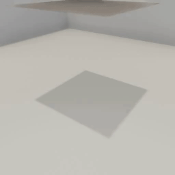

##### Physics (Flex)

# Other Flex commands

- [`set_flex_object_mass`](../../api/command_api.md#set_flex_object_mass) sets the mass of a Flex object. When a Flex object is created, you can set its mass with the `"mass_scale"` parameter. The `set_flex_object_mass` command can set the object's mass after it is instantiated.
- [`set_flex_particles_mass`](../../api/command_api.md#set_flex_particles_mass) sets the mass of a single particle of the Flex object. For example, if the particle mass is 1 and there are 100 particles, then the mass of the object is 100.
- [`set_flex_particle_fixed`](../../api/command_api.md#set_flex_particle_fixed) "fixes" a particle, making it immovable.

This example adds a cloth object to the scene, sets its mass, and fixes a particle at one of its corners, causing the cloth to hang in midair:

```python
import numpy as np
from tdw.controller import Controller
from tdw.tdw_utils import TDWUtils
from tdw.add_ons.third_person_camera import ThirdPersonCamera
from tdw.add_ons.image_capture import ImageCapture
from tdw.backend.paths import EXAMPLE_CONTROLLER_OUTPUT_PATH
from tdw.output_data import OutputData, FlexParticles

c = Controller()
camera = ThirdPersonCamera(avatar_id="a",
                           position={"x": -2.75, "y": 2.3, "z": -2},
                           look_at={"x": 0, "y": 0.25, "z": 0})
path = EXAMPLE_CONTROLLER_OUTPUT_PATH.joinpath("fixed_particle")
print(f"Images will be saved to: {path}")
capture = ImageCapture(avatar_ids=["a"], path=path)
c.add_ons.extend([camera, capture])
object_id = c.get_unique_id()
# Create the cloth object. Get particle data.
resp = c.communicate([TDWUtils.create_empty_room(12, 12),
                      {"$type": "create_flex_container",
                       "collision_distance": 0.001,
                       "static_friction": 1.0,
                       "dynamic_friction": 1.0,
                       "iteration_count": 12,
                       "substep_count": 12,
                       "radius": 0.1875,
                       "damping": 0,
                       "drag": 0},
                      c.get_add_object("cloth_square",
                                       library="models_special.json",
                                       position={"x": 0, "y": 2, "z": 0},
                                       rotation={"x": 0, "y": 0, "z": 0},
                                       object_id=object_id),
                      {"$type": "set_flex_cloth_actor",
                       "id": object_id,
                       "mesh_tesselation": 1,
                       "stretch_stiffness": 0.5620341548096974,
                       "bend_stiffness": 0.6528988964052056,
                       "tether_stiffness": 0.7984931184979334,
                       "tether_give": 0,
                       "pressure": 0,
                       "mass_scale": 1},
                      {"$type": "set_flex_object_mass",
                       "mass": 1.5,
                       "id": object_id},
                      {"$type": "assign_flex_container",
                       "container_id": 0,
                       "id": object_id},
                      {"$type": "send_flex_particles",
                       "frequency": "once"}])
# The maximum distance between a particle and the center of the cloth.
max_d = 0
# The ID of the particle at the maximum distance.
max_id = 0
for i in range(len(resp) - 1):
    r_id = OutputData.get_data_type_id(resp[i])
    if r_id == "flex":
        flex_particles = FlexParticles(resp[i])
        for j in range(flex_particles.get_num_objects()):
            if flex_particles.get_id(j) == object_id:
                particles = flex_particles.get_particles(j)
                # Get the particle that is furthest from the center.
                for particle_id in range(len(particles)):
                    d = np.linalg.norm(particles[particle_id][:-1] - 1)
                    if d > max_d:
                        max_d = d
                        max_id = particle_id
                    particle_id += 1
# Set the particle as "fixed".
c.communicate({"$type": "set_flex_particle_fixed",
               "is_fixed": True,
               "particle_id": max_id,
               "id": object_id})

for i in range(250):
    c.communicate([])
c.communicate({"$type": "terminate"})
```

Result:



***

**This is the last document in the "Physics (Flex)" tutorial.**

[Return to the README](../../../README.md)

***

Example controllers:

- [fixed_particle.py](https://github.com/threedworld-mit/tdw/blob/master/Python/example_controllers/flex/fixed_particle.py) Add a cloth object and fix one of its particles in mid-air.

Command API:

- [`set_flex_object_mass`](../../api/command_api.md#set_flex_object_mass)
- [`set_flex_particles_mass`](../../api/command_api.md#set_flex_particles_mass) 
- [`set_flex_particle_fixed`](../../api/command_api.md#set_flex_particle_fixed) 
