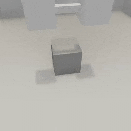

##### Physics (Flex)

# Solid and soft actors

## Solid actors

So far, we've seen how to add *solid actors* to a Flex scene. These will behave very similarly to default PhysX objects.

```python
from tdw.controller import Controller
from tdw.tdw_utils import TDWUtils

c = Controller()
object_id = c.get_unique_id()
c.communicate([TDWUtils.create_empty_room(12, 12),
               {"$type": "convexify_proc_gen_room"},
               {"$type": "create_flex_container"},
               c.get_add_object(model_name="cube",
                                object_id=object_id,
                                library="models_flex.json",
                                position={"x": 0, "y": 1, "z": 0}),
               {"$type": "set_flex_solid_actor",
                "id": object_id,
                "mesh_expansion": 0,
                "mass_scale": 1,
                "particle_spacing": 0.05},
               {"$type": "assign_flex_container",
                "id": object_id,
                "container_id": 0}])
c.communicate({"$type": "terminate"})
```

- `mesh_expansion` will resize the mesh. This should almost always be 0.
- `particle_spacing` is the distance between each particle. This typically needs to be adjusted depending on the geometry and vertices of the underlying mesh data.
- `mass_scale` should match the mass you'd normally assign a PhysX object.

## Soft actors

Enable an object as a soft-body actor via [`set_flex_soft_actor`](../../api/command_api.md#set_flex_soft_actor):

```python
from tdw.controller import Controller
from tdw.tdw_utils import TDWUtils
from tdw.add_ons.third_person_camera import ThirdPersonCamera
from tdw.add_ons.image_capture import ImageCapture
from tdw.backend.paths import EXAMPLE_CONTROLLER_OUTPUT_PATH

c = Controller()
camera = ThirdPersonCamera(avatar_id="a",
                           position={"x": 3.83, "y": 3.6, "z": -0.71},
                           look_at={"x": 0, "y": 0, "z": 0})
path = EXAMPLE_CONTROLLER_OUTPUT_PATH.joinpath("flex_soft_body")
print(f"Images will be saved to: {path}")
capture = ImageCapture(avatar_ids=["a"], path=path)
c.add_ons.extend([camera, capture])
cube_id = c.get_unique_id()
dumbbell_id = c.get_unique_id()
c.communicate([TDWUtils.create_empty_room(12, 12),
               {'$type': 'convexify_proc_gen_room'},
               {'$type': 'create_flex_container'},
               c.get_add_object(model_name="cube",
                                object_id=cube_id,
                                library="models_flex.json",
                                position={"x": 0, "y": 0, "z": 0}),
               {"$type": "set_flex_solid_actor",
                "id": cube_id,
                "mass_scale": 50,
                "particle_spacing": 0.125},
               {"$type": "assign_flex_container",
                "id": cube_id,
                "container_id": 0},
               c.get_add_object(model_name="dumbbell",
                                object_id=dumbbell_id,
                                library="models_flex.json",
                                position={"x": 0.25, "y": 2, "z": 0}),
               {"$type": "set_flex_soft_actor",
                "id": dumbbell_id,
                'particle_spacing': 0.05,
                'cluster_stiffness': 0.5,
                "mass_scale": 1},
               {"$type": "assign_flex_container",
                "id": dumbbell_id,
                "container_id": 0}])
for i in range(200):
    c.communicate([])
c.communicate({"$type": "terminate"})
```

Result:



## Soft actor parameters

There are many soft actor parameters; see [the API documentation for more information](../../api/command_api.md#set_flex_soft_actor). Unfortunately, most of descriptions of the parameters are uninformative because they aren't explained in the NVIDIA Flex documentation.

Of these, the most important (besides `id`, of course) is particle spacing. If the particles are too far apart, the object will appear to tear. If the particles are too close, the simulation can dramatically slow down. The ideal particle spacing varies by object and can only be determined via trial and error.

***

**Next: [Cloth actors](cloth.md)**

[Return to the README](../../../README.md)

***

Example controllers:

- [soft_body.py](https://github.com/threedworld-mit/tdw/blob/master/Python/example_controllers/flex/soft_body.py) Minimal soft body simulation.

Command API:

- [`set_flex_solid_actor`](../../api/command_api.md#set_flex_solid_actor)
- [`set_flex_soft_actor`](../../api/command_api.md#set_flex_soft_actor)