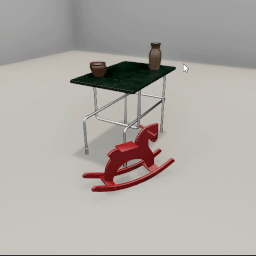

##### Keyboard and Mouse

# Mouse input

Mouse input is handled via the [`Mouse`](../../python/add_ons/mouse.md) add-on. This add-on tracks button press events, the position of the mouse, and any objects underneath the cursor.

The `Mouse` add-on requires there to be an [avatar](../core_concepts/avatars.md) in the scene.

In this example, we'll create a simple scene with a static camera. The user can click an object to print the object ID. If the user right-clicks, the simulation ends.

```python
from tdw.controller import Controller
from tdw.tdw_utils import TDWUtils
from tdw.add_ons.mouse import Mouse
from tdw.add_ons.third_person_camera import ThirdPersonCamera

"""
Click on objects to print their IDs.
"""

c = Controller()
object_id_0 = c.get_unique_id()
object_id_1 = c.get_unique_id()
object_id_2 = c.get_unique_id()
object_id_3 = c.get_unique_id()
object_names = {object_id_0: "small_table_green_marble",
                object_id_1: "rh10",
                object_id_2: "jug01",
                object_id_3: "jug05"}
camera = ThirdPersonCamera(position={"x": 2.478, "y": 1.602, "z": 1.412},
                           look_at={"x": 0, "y": 0.2, "z": 0},
                           avatar_id="a")
mouse = Mouse(avatar_id="a")
c.add_ons.extend([camera, mouse])
c.communicate([TDWUtils.create_empty_room(12, 12),
               c.get_add_object(object_names[object_id_0],
                                object_id=object_id_0),
               c.get_add_object(object_names[object_id_1],
                                position={"x": 0.7, "y": 0, "z": 0.4},
                                rotation={"x": 0, "y": 30, "z": 0},
                                object_id=object_id_1),
               c.get_add_object(model_name=object_names[object_id_2],
                                position={"x": -0.3, "y": 0.9, "z": 0.2},
                                object_id=object_id_2),
               c.get_add_object(object_names[object_id_3],
                                position={"x": 0.3, "y": 0.9, "z": -0.2},
                                object_id=object_id_3)])
done = False
while not done:
    # End the simulation.
    if mouse.right_button_pressed:
        done = True
    # We clicked on an object.
    elif mouse.left_button_pressed and mouse.mouse_is_over_object:
        print(mouse.mouse_over_object_id)
    # Advance to the next frame.
    c.communicate([])
c.communicate({"$type": "terminate"})
```

Result:



Output:

```
14947557
15255504
10275307
```

## Mouse buttons

`Mouse` has nine mouse button boolean fields. It listens to `left`, `middle`, and `right` button events. Events include `pressed` (the button was pressed on this frame), `held` (the button was pressed on a previous frame and held on this frame), and `released` (the button was released on this frame). Some examples:

- To check if the middle button was released: `if mouse.middle_button_released == True:`
- To check if the left button was held: `if mouse.left_button_held == True:`

[Read the API documentation for a complete list.](../../python/add_ons/mouse.md)

## Scroll wheel

`mouse.scroll_wheel_delta` is a two-element array describing the *delta* of the scroll wheel movement. The second element is the y direction (scroll up and down) and the first element is the lateral direction (scroll left and right, which some mice can do).

This is is a minimal example of how to read scroll wheel delta information:

```python
from tdw.controller import Controller
from tdw.tdw_utils import TDWUtils
from tdw.add_ons.mouse import Mouse
from tdw.add_ons.third_person_camera import ThirdPersonCamera

c = Controller()
camera = ThirdPersonCamera(position={"x": 2.478, "y": 1.602, "z": 1.412},
                           look_at={"x": 0, "y": 0.2, "z": 0},
                           avatar_id="a")
mouse = Mouse(avatar_id="a")
c.add_ons.extend([camera, mouse])
c.communicate(TDWUtils.create_empty_room(12, 12))
done = False
while not done:
    # End the simulation.
    if mouse.right_button_pressed:
        done = True
    # Listen to the scroll wheel.
    elif mouse.scroll_wheel_delta[1] > 0:
        print("scroll up", mouse.scroll_wheel_delta)
    elif mouse.scroll_wheel_delta[0] > 0:
        print("scroll right", mouse.scroll_wheel_delta)
    c.communicate([])
c.communicate({"$type": "terminate"})
```

## Screen position

`mouse.screen_position` is the screen position of the mouse in pixel coordinates. It is a 2-element (x, y) numpy array.

## World position, avatars, and objects

The `Mouse` add-on requires an avatar because it needs a camera in order to convert the mouse screen position to a world position.

- `mouse.world_position` is the position of the end of ray cast from the camera through the screen position. It is a 3-element (x, y, z) numpy array.
- `mouse.mouse_is_over_object` is a boolean. If True, the mouse cursor is currently over an [object](../core_concepts/objects.md).
- `mouse.mouse_over_object_id` is an integer. If `mouse.mouse_is_over_object == True`, then this is the ID of the object.

## Low-level description

When `Mouse` initializes it sends [`send_mouse`](../../api/command_api.md#send_mouse) in order to receive [`Mouse` output data](../../api/output_data.md#Mouse) per-frame. Per-frame, it also sends [`send_mouse_rayast`](../../api/command_api.md#send_mouse_raycast) to raycast through the mouse screen position to receive [`Raycast` output data](../../api/output_data.md#Raycast) containing the world position and the ID of the object hit by the raycast.

## Reset the scene

When you [reset a scene](../scene_setup_high_level/reset_scene.md), do this: `mouse.initialized = False`

## Non-static cameras

In the examples shown thus far, the avatar camera is at a static position and rotation. You can combine mouse input with standard first-person keyboard controls via the [`FirstPersonAvatar`](first_person_avatar.md) add-on, which is a subclass of `Mouse`.

***

**Next: [The `FirstPersonAvatar`](first_person_avatar.md)**

[Return to the README](../../../README.md)

***

Example controllers:

- [mouse_controls.py](https://github.com/threedworld-mit/tdw/blob/master/Python/example_controllers/keyboard_and_mouse/mouse_controls.py) Click on objects to print their IDs.

Python API:

- [`Mouse`](../../python/add_ons/mouse.md)
- [`ThirdPersonCamera`](../../python/add_ons/third_person_camera.md)

Command API:

- [`send_mouse`](../../api/command_api.md#send_mouse)
- [`send_mouse_rayast`](../../api/command_api.md#send_mouse_raycast)

Output Data:

- [`Mouse`](../../api/output_data.md#Mouse)
- [`Raycast`](../../api/output_data.md#Raycast)