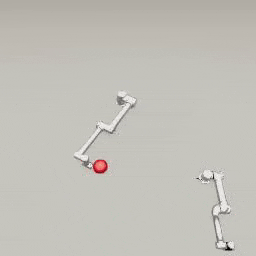

##### Multi-agent simulations

# Custom agent classes

One method of multi-agent planning is to extend the agent add-on class. This can be a simple and effective way of adding an internal planning system to an agent.

In this document, we'll define `SwingRobot` add-on that extends [`Robot`](../../python/add_ons/robot.md). A `SwingRobot` can try to "swing" at a moving ball.

## Extending an add-on class

[Add-ons are relatively simple classes.](../core_concepts/add_ons.md) To create the `SwingRobot`, we need to extend `Robot`, the constructor, and the `on_send(resp)` function:

```python
from typing import List, Dict, Union
from tdw.librarian import RobotLibrarian, RobotRecord
from tdw.add_ons.robot import Robot


class SwingRobot(Robot):
    def __init__(self, name: str, target_id: int, swing_direction: int, robot_id: int = 0,
                 position: Dict[str, float] = None, rotation: Dict[str, float] = None,
                 source: Union[RobotLibrarian, RobotRecord, str] = None):
        super().__init__(name=name, robot_id=robot_id, position=position, rotation=rotation, source=source)
        self.target_id: int = target_id
        self.swing_direction: int = swing_direction

    def on_send(self, resp: List[bytes]) -> None:
        super().on_send(resp=resp)
```

The constructor has two new parameters:

- `target_id` is the ID of the target object (the ball).
- `swing_direction` defines whether the arm swings clockwise or counterclockwise.

## Define API calls

Next, we'll define API calls for the `SwingRobot`. These will be used externally (by the controller) and internally (by the add-on's planning system):

```python
from typing import List, Dict, Union
from tdw.librarian import RobotLibrarian, RobotRecord
from tdw.add_ons.robot import Robot


class SwingRobot(Robot):
    def __init__(self, name: str, target_id: int, swing_direction: int, robot_id: int = 0,
                 position: Dict[str, float] = None, rotation: Dict[str, float] = None,
                 source: Union[RobotLibrarian, RobotRecord, str] = None):
        super().__init__(name=name, robot_id=robot_id, position=position, rotation=rotation, source=source)
        self.target_id: int = target_id
        self.swing_direction: int = swing_direction

    def on_send(self, resp: List[bytes]) -> None:
        super().on_send(resp=resp)
        
    def start_to_swing(self) -> None:
        self.set_joint_targets(targets={self.static.joint_ids_by_name["shoulder_link"]: 70 * self.swing_direction})

    def start_to_reset(self) -> None:
        self.set_joint_targets(targets={self.static.joint_ids_by_name["shoulder_link"]: 0})
```

- `start_to_swing(self)` starts to move the robot's arm. `self.swing_direction` defines which direction it will move.
- `start_to_reset(self)` starts to move the robot's arm back to its neutral position.

## Define state machine flags

It can be useful to use [state machines](https://gameprogrammingpatterns.com/state.html) to manage basic AI behavior; they are often used in video game design. State machines typically use enum values to determine which discrete *state* the agent is currently in and therefore how to plan the current action:

```python
from enum import Enum

class State(Enum):
    idle = 1  # The robot isn't moving.
    swinging = 2  # The robot is rotating its shoulder.
    resetting = 4  # The robot is resetting to its neutral position.
```

We'll add a `State` flag to the `SwingRobot` class: `self.state` is the robot's current state:

```python
from enum import Enum
from typing import List, Dict, Union
from tdw.librarian import RobotLibrarian, RobotRecord
from tdw.add_ons.robot import Robot

class State(Enum):
    idle = 1  # The robot isn't moving.
    swinging = 2  # The robot is rotating its shoulder.
    resetting = 4  # The robot is resetting to its neutral position.
    
    
class SwingRobot(Robot):
    def __init__(self, name: str, target_id: int, swing_direction: int, robot_id: int = 0,
                 position: Dict[str, float] = None, rotation: Dict[str, float] = None,
                 source: Union[RobotLibrarian, RobotRecord, str] = None):
        super().__init__(name=name, robot_id=robot_id, position=position, rotation=rotation, source=source)
        self.target_id: int = target_id
        self.swing_direction: int = swing_direction
        # The robot's current state.
        self.state: State = State.idle

    def on_send(self, resp: List[bytes]) -> None:
        super().on_send(resp=resp)

    def start_to_swing(self) -> None:
        self.state = State.swinging
        self.set_joint_targets(targets={self.static.joint_ids_by_name["shoulder_link"]: 70 * self.swing_direction})

    def start_to_reset(self) -> None:
        self.state = State.resetting
        self.set_joint_targets(targets={self.static.joint_ids_by_name["shoulder_link"]: 0})
```

Note that `self.state` is set three times in this example:

- In the constructor (to set the initial `idle` state)
- In `start_to_swing(self)` (to set the `swinging` state)
- In `start_to_reset(self)` (to set the `resetting` state)

## Add commands to `self.commands`

In this example, we are using `self.set_joint_targets(targets)` to set revolute joint targets because it's already defined in the `Robot` add-on.

We could instead add commands to `self.commands`. These commands will be sent on the next frame:

```python
from enum import Enum
from typing import List, Dict, Union
from tdw.librarian import RobotLibrarian, RobotRecord
from tdw.add_ons.robot import Robot


class State(Enum):
    idle = 1  # The robot isn't moving.
    swinging = 2  # The robot is rotating its shoulder.
    resetting = 4  # The robot is resetting to its neutral position.


class SwingRobot(Robot):
    def __init__(self, name: str, target_id: int, swing_direction: int, robot_id: int = 0,
                 position: Dict[str, float] = None, rotation: Dict[str, float] = None,
                 source: Union[RobotLibrarian, RobotRecord, str] = None):
        super().__init__(name=name, robot_id=robot_id, position=position, rotation=rotation, source=source)
        self.target_id: int = target_id
        self.swing_direction: int = swing_direction
        # The robot's current state.
        self.state: State = State.idle

    def on_send(self, resp: List[bytes]) -> None:
        super().on_send(resp=resp)

    def start_to_swing(self) -> None:
        self.state = State.swinging
        joint_id = self.static.joint_ids_by_name["shoulder_link"]
        self.commands.append({"$type": "set_revolute_target",
                              "target": 70 * self.swing_direction,
                              "joint_id": joint_id,
                              "id": self.robot_id})
        self.dynamic.joints[joint_id].moving = True

    def start_to_reset(self) -> None:
        self.state = State.resetting
        joint_id = self.static.joint_ids_by_name["shoulder_link"]
        self.commands.append({"$type": "set_revolute_target",
                              "target": 0,
                              "joint_id": joint_id,
                              "id": self.robot_id})
        self.dynamic.joints[joint_id].moving = True
```

## Add a planning system

Using the state machine flags and our custom `SwingRobot` class, we can now define a basic planning system.

`on_send(self, resp)` is called after commands are sent to the build. `resp` is a list of bytes that can be deserialized into [output data](../core_concepts/output_data.md). You can use this function for planning by reading `resp` and then adding commands to `self.commands` (which will be sent on the next frame).

In this example, the robot will plan depending on the data from `resp` and the value of `self.state`:

| State             | Behavior                                                     |
| ----------------- | ------------------------------------------------------------ |
| `State.idle`      | Did the target object (the ball) collided with the robot on this frame.<br>*If yes:* Start to swing at the ball by calling `self.start_to_swing()`.<br>*If no:* Do nothing. |
| `State.swinging`  | Are the joints moving?<br>*If yes:* Do nothing.<br>*If no:* Start to reset the arm by calling `self.start_to_reset()`. |
| `State.resetting` | Are the joints moving?<br>*If yes:* Do nothing.<br>*If no:* Set `self.state = State.idle` |

```python
from enum import Enum
from typing import Dict, Union, List
from tdw.add_ons.robot import Robot
from tdw.librarian import RobotLibrarian, RobotRecord


class State(Enum):
    idle = 1  # The robot isn't moving.
    swinging = 2  # The robot is rotating its shoulder.
    resetting = 4  # The robot is resetting to its neutral position.


class SwingRobot(Robot):
    def __init__(self, name: str, target_id: int, swing_direction: int, robot_id: int = 0,
                 position: Dict[str, float] = None, rotation: Dict[str, float] = None,
                 source: Union[RobotLibrarian, RobotRecord, str] = None):
        super().__init__(name=name, robot_id=robot_id, position=position, rotation=rotation, source=source)
        self.state: State = State.idle
        self.target_id: int = target_id
        self.swing_direction: int = swing_direction

    def on_send(self, resp: List[bytes]) -> None:
        super().on_send(resp=resp)
        # If the robot is idle and collides with the ball,
        if self.state == State.idle:
            # Are any of my joints currently colliding with the target object?
            for collision in self.dynamic.collisions_with_objects:
                # `collision` is a tuple. The first element is always a joint ID and the second element is always an object ID.
                if collision[1] == self.target_id:
                    self.start_to_swing()
        elif self.state == State.swinging:
            if not self.joints_are_moving():
                self.start_to_reset()
        elif self.state == State.resetting:
            if not self.joints_are_moving():
                self.state = State.idle

    def start_to_swing(self) -> None:
        self.state = State.swinging
        self.set_joint_targets(targets={self.static.joint_ids_by_name["shoulder_link"]: 70 * self.swing_direction})

    def start_to_reset(self) -> None:
        self.state = State.resetting
        self.set_joint_targets(targets={self.static.joint_ids_by_name["shoulder_link"]: 0})
```

## Add the add-on(s) to a controller

Now we can add multiple `SwingRobot` add-ons to a controller. In this example, we'll also add a [`ThirdPersonCamera`](../../python/add_ons/third_person_camera.md) and [`ImageCapture`](../../python/add_ons/image_capture.md) in order to  record this example:

```python
from enum import Enum
from typing import Dict, Union, List
from tdw.controller import Controller
from tdw.add_ons.robot import Robot
from tdw.librarian import RobotLibrarian, RobotRecord
from tdw.add_ons.third_person_camera import ThirdPersonCamera
from tdw.add_ons.image_capture import ImageCapture
from tdw.backend.paths import EXAMPLE_CONTROLLER_OUTPUT_PATH


class State(Enum):
    idle = 1  # The robot isn't moving.
    swinging = 2  # The robot is rotating its shoulder.
    resetting = 4  # The robot is resetting to its neutral position.


class SwingRobot(Robot):
    def __init__(self, name: str, target_id: int, swing_direction: int, robot_id: int = 0,
                 position: Dict[str, float] = None, rotation: Dict[str, float] = None,
                 source: Union[RobotLibrarian, RobotRecord, str] = None):
        super().__init__(name=name, robot_id=robot_id, position=position, rotation=rotation, source=source)
        self.state: State = State.idle
        self.target_id: int = target_id
        self.swing_direction: int = swing_direction

    def on_send(self, resp: List[bytes]) -> None:
        super().on_send(resp=resp)
        # If the robot is idle and collides with the ball,
        if self.state == State.idle:
            # Are any of my joints currently colliding with the target object?
            for collision in self.dynamic.collisions_with_objects:
                # `collision` is a tuple. The first element is always a joint ID and the second element is always an object ID.
                if collision[1] == self.target_id:
                    self.start_to_swing()
        elif self.state == State.swinging:
            if not self.joints_are_moving():
                self.start_to_reset()
        elif self.state == State.resetting:
            if not self.joints_are_moving():
                self.state = State.idle

    def start_to_swing(self) -> None:
        self.state = State.swinging
        self.set_joint_targets(targets={self.static.joint_ids_by_name["shoulder_link"]: 70 * self.swing_direction})

    def start_to_reset(self) -> None:
        self.state = State.resetting
        self.set_joint_targets(targets={self.static.joint_ids_by_name["shoulder_link"]: 0})


class MultiRobot(Controller):
    def run(self) -> None:
        object_id = self.get_unique_id()
        # Add two robots, a camera, and image capture.
        robot_0 = SwingRobot(name="ur5",
                             target_id=object_id,
                             swing_direction=-1,
                             robot_id=self.get_unique_id(),
                             position={"x": -1, "y": 0, "z": 0.8})
        robot_1 = SwingRobot(name="ur10",
                             robot_id=self.get_unique_id(),
                             target_id=object_id,
                             swing_direction=1,
                             position={"x": 0.1, "y": 0, "z": -0.5},
                             rotation={"x": 0, "y": 30, "z": 0})
        camera = ThirdPersonCamera(avatar_id="a",
                                   position={"x": 0, "y": 3.05, "z": 2.1},
                                   look_at={"x": 0, "y": 0, "z": 0})
        path = EXAMPLE_CONTROLLER_OUTPUT_PATH.joinpath("multi_robot")
        print(f"Images will be saved to: {path}")
        capture = ImageCapture(avatar_ids=["a"], path=path)
        self.add_ons.extend([robot_0, robot_1, camera, capture])
```

Then, we'll initialize the scene:

- Create the scene
- Add the object (the ball)
- [Enable collision detection.](../robots/collision_detection.md)
- Start to swing the arm of `robot_1`:

```python
from enum import Enum
from typing import Dict, Union, List
from tdw.controller import Controller
from tdw.tdw_utils import TDWUtils
from tdw.add_ons.robot import Robot
from tdw.librarian import RobotLibrarian, RobotRecord
from tdw.add_ons.third_person_camera import ThirdPersonCamera
from tdw.add_ons.image_capture import ImageCapture
from tdw.backend.paths import EXAMPLE_CONTROLLER_OUTPUT_PATH


class State(Enum):
    idle = 1  # The robot isn't moving.
    swinging = 2  # The robot is rotating its shoulder.
    resetting = 4  # The robot is resetting to its neutral position.


class SwingRobot(Robot):
    def __init__(self, name: str, target_id: int, swing_direction: int, robot_id: int = 0,
                 position: Dict[str, float] = None, rotation: Dict[str, float] = None,
                 source: Union[RobotLibrarian, RobotRecord, str] = None):
        super().__init__(name=name, robot_id=robot_id, position=position, rotation=rotation, source=source)
        self.state: State = State.idle
        self.target_id: int = target_id
        self.swing_direction: int = swing_direction

    def on_send(self, resp: List[bytes]) -> None:
        super().on_send(resp=resp)
        # If the robot is idle and collides with the ball,
        if self.state == State.idle:
            # Are any of my joints currently colliding with the target object?
            for collision in self.dynamic.collisions_with_objects:
                # `collision` is a tuple. The first element is always a joint ID and the second element is always an object ID.
                if collision[1] == self.target_id:
                    self.start_to_swing()
        elif self.state == State.swinging:
            if not self.joints_are_moving():
                self.start_to_reset()
        elif self.state == State.resetting:
            if not self.joints_are_moving():
                self.state = State.idle

    def start_to_swing(self) -> None:
        self.state = State.swinging
        self.set_joint_targets(targets={self.static.joint_ids_by_name["shoulder_link"]: 70 * self.swing_direction})

    def start_to_reset(self) -> None:
        self.state = State.resetting
        self.set_joint_targets(targets={self.static.joint_ids_by_name["shoulder_link"]: 0})


class MultiRobot(Controller):
    def run(self) -> None:
        object_id = self.get_unique_id()
        # Add two robots, a camera, and image capture.
        robot_0 = SwingRobot(name="ur5",
                             target_id=object_id,
                             swing_direction=-1,
                             robot_id=self.get_unique_id(),
                             position={"x": -1, "y": 0, "z": 0.8})
        robot_1 = SwingRobot(name="ur10",
                             robot_id=self.get_unique_id(),
                             target_id=object_id,
                             swing_direction=1,
                             position={"x": 0.1, "y": 0, "z": -0.5},
                             rotation={"x": 0, "y": 30, "z": 0})
        camera = ThirdPersonCamera(avatar_id="a",
                                   position={"x": 0, "y": 3.05, "z": 2.1},
                                   look_at={"x": 0, "y": 0, "z": 0})
        path = EXAMPLE_CONTROLLER_OUTPUT_PATH.joinpath("multi_robot")
        print(f"Images will be saved to: {path}")
        capture = ImageCapture(avatar_ids=["a"], path=path)
        self.add_ons.extend([robot_0, robot_1, camera, capture])
        commands = [TDWUtils.create_empty_room(12, 12)]
        commands.extend(self.get_add_physics_object(object_id=object_id,
                                                    model_name="prim_sphere",
                                                    library="models_special.json",
                                                    position={"x": 0.36, "y": 0, "z": 0.67},
                                                    scale_factor={"x": 0.2, "y": 0.2, "z": 0.2},
                                                    default_physics_values=False,
                                                    mass=5))
        self.communicate(commands)
        while robot_0.joints_are_moving() or robot_1.joints_are_moving():
            self.communicate([])
        # Start swinging.
        robot_1.start_to_swing()
        # Enable collision detection.
        self.communicate({"$type": "send_collisions",
                          "enter": True,
                          "stay": False,
                          "exit": False,
                          "collision_types": ["obj", "env"]})
        for i in range(500):
            self.communicate([])
        self.communicate({"$type": "terminate"})


if __name__ == "__main__":
    c = MultiRobot()
    c.run()
```

Result:


***

**This is the last document in the "Multi-agent simulations" tutorial.**

[Return to the README](../../../README.md)

***

Example controllers:

- [multi_robot.py](https://github.com/threedworld-mit/tdw/blob/master/Python/example_controllers/multi_agent/multi_robot.py) Two "Swing Robots" swing at a ball when they detect a collision.

Python API:

-  [`Robot`](../../python/add_ons/robot.md)
-  [`ThirdPersonCamera`](../../python/add_ons/third_person_camera.md)
-  [`ImageCapture`](../../python/add_ons/image_capture.md)

Command API:

- [`send_collisions`](../../api/command_api.md#send_collisions)
