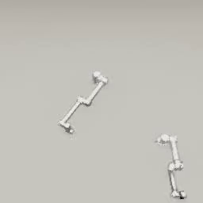

##### Multi-agent simulations

# Overview

Creating multi-agent simulations is relatively simple in TDW. Technically, because [TDW doesn't have a fixed definition or API for agents](../agents/overview.md), adding multiple agents to the scene is as simple as sending commands for objects, robots, etc. with different IDs. 

However, it is far easier to use add-ons to define agents. To add multiple agents to the scene, add multiple add-ons.

This is an example of a minimal multi-agent simulation. It adds two [`Robot`](../../python/add_ons/robot.md) add-ons to the scene and sets joint targets for each. The resulting motion is concurrent:

```python
from tdw.controller import Controller
from tdw.tdw_utils import TDWUtils
from tdw.add_ons.robot import Robot
from tdw.add_ons.third_person_camera import ThirdPersonCamera
from tdw.add_ons.image_capture import ImageCapture
from tdw.backend.paths import EXAMPLE_CONTROLLER_OUTPUT_PATH

"""
Minimal example of a multi-agent simulation.
"""

c = Controller()
# Add two robots, a camera, and image capture.
robot_0 = Robot(name="ur5",
                robot_id=c.get_unique_id(),
                position={"x": -1, "y": 0, "z": 0.8})
robot_1 = Robot(name="ur10",
                robot_id=c.get_unique_id(),
                position={"x": 0.1, "y": 0, "z": -0.5},
                rotation={"x": 0, "y": 30, "z": 0})
camera = ThirdPersonCamera(avatar_id="a",
                           position={"x": 0, "y": 3.05, "z": 2.1},
                           look_at={"x": 0, "y": 0, "z": 0})
path = EXAMPLE_CONTROLLER_OUTPUT_PATH.joinpath("multi_agent_minimal")
print(f"Images will be saved to: {path}")
capture = ImageCapture(avatar_ids=["a"], path=path)
c.add_ons.extend([robot_0, robot_1, camera, capture])
c.communicate(TDWUtils.create_empty_room(12, 12))
# Set joint targets.
robot_0.set_joint_targets(targets={robot_0.static.joint_ids_by_name["shoulder_link"]: -70})
robot_1.set_joint_targets(targets={robot_1.static.joint_ids_by_name["shoulder_link"]: 70})
# Wait until the joints stop moving.
while robot_0.joints_are_moving() and robot_1.joints_are_moving():
    c.communicate([])
c.communicate({"$type": "terminate"})
```

Result:



We can add multiple types of agent to the same simulation. This example adds a `Robot` and an [`EmbodiedAvatar`](../../python/add_ons/embodied_avatar.md). Note that the simulation ends when the robot stops moving; it's not necessary in multi-agent simulations to wait for all agents to finish their actions (or in fact to wait for *any* agents to finish their actions).

```python
from tdw.controller import Controller
from tdw.tdw_utils import TDWUtils
from tdw.add_ons.robot import Robot
from tdw.add_ons.embodied_avatar import EmbodiedAvatar
from tdw.add_ons.third_person_camera import ThirdPersonCamera
from tdw.add_ons.image_capture import ImageCapture
from tdw.backend.paths import EXAMPLE_CONTROLLER_OUTPUT_PATH

"""
Minimal example of a multi-agent simulation with different types of agents.
"""

c = Controller()
# Add a robot, an embodied avatar, a camera, and image capture.
robot = Robot(name="ur10",
              robot_id=c.get_unique_id(),
              position={"x": -1, "y": 0, "z": 0.8})
embodied_avatar = EmbodiedAvatar(avatar_id="e",
                                 position={"x": 0.1, "y": 0, "z": -0.5})
camera = ThirdPersonCamera(avatar_id="a",
                           position={"x": 0, "y": 4.05, "z": 3.1},
                           look_at={"x": 0, "y": 0, "z": 0})
path = EXAMPLE_CONTROLLER_OUTPUT_PATH.joinpath("robot_and_avatar")
print(f"Images will be saved to: {path}")
capture = ImageCapture(avatar_ids=["a"], path=path)
c.add_ons.extend([robot, embodied_avatar, camera, capture])
c.communicate(TDWUtils.create_empty_room(12, 12))
# Set the robot's joint targets .
robot.set_joint_targets(targets={robot.static.joint_ids_by_name["shoulder_link"]: -70})
# Move the avatar forward.
embodied_avatar.apply_force(500)
# Wait until the robot joints stop moving.
while robot.joints_are_moving():
    c.communicate([])
c.communicate({"$type": "terminate"})
```

Result:


## Agent planning

In most multi-agent simulations, the agents need to be "aware" of the scene state and plan accordingly. Neither the `Robot` nor the `EmbodiedAvatar` has a built-in "planning system" but you can define one by extending each class. The next document in this tutorial will explain how.

***

**Next: [Custom agent classes](custom_agent_classes.md)**

[Return to the README](../../../README.md)

***

Example controllers:

- [multi_agent_minimal.py](https://github.com/threedworld-mit/tdw/blob/master/Python/example_controllers/multi_agent/multi_agent_minimal.py) Minimal example of a multi-agent simulation.
- [robot_and_avatar.py](https://github.com/threedworld-mit/tdw/blob/master/Python/example_controllers/multi_agent/robot_and_avatar.py) Minimal example of a multi-agent simulation with different types of agents.

Python API:

-  [`Robot`](../../python/add_ons/robot.md)
-  [`EmbodiedAvatar`](../../python/add_ons/embodied_avatar.md)
-  [`ThirdPersonCamera`](../../python/add_ons/third_person_camera.md)
-  [`ImageCapture`](../../python/add_ons/image_capture.md)
