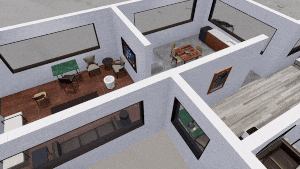

##### Non-physics objects

# The `FloorplanFlood` add-on

The [`FloorplanFlood`](../../python/add_ons/floorplan_flood.md) add-on is a special case of [visual effects](visual_effects.md) in that it combines specialized visual effects with specific scenes. This add-on is a sub-class of the [`Floorplan` add-on](../scene_setup_high_level/floorplans.md). The `FloorplanFlood` add-on generates scene layouts that are exactly the same as `Floorplan`'s, using the exact same API, except that it adds it instantiates "flood effects" underneath floor sections of each room. By raising the height of the flood object, you can simulate a "flooding" effect.

The `FloorplanFlood` add-on doesn't work on pre-M1 Apple computers.

Read [the API documentation](../../python/add_ons/floorplan_flood.md) for more information.

```python
from tdw.controller import Controller
from tdw.add_ons.image_capture import ImageCapture
from tdw.add_ons.third_person_camera import ThirdPersonCamera
from tdw.add_ons.floorplan_flood import FloorplanFlood
from tdw.backend.paths import EXAMPLE_CONTROLLER_OUTPUT_PATH


"""
Generate a floorplan scene and populate it with a layout of objects.
Flood a small set of rooms, and allow two objects to float in the water.
"""

c = Controller()

# Initialize the FloorplanFlood add-on.
floorplan_flood = FloorplanFlood()
# Scene 1, visual variant a, object layout 0.
floorplan_flood.init_scene(scene="1a", layout=0)

# Add a camera and enable image capture.
camera = ThirdPersonCamera(position={"x":-5, "y": 6.4, "z": -2.6},
                           look_at={"x": -2.25, "y": 0.05, "z": 2.5},
                           avatar_id="a")
path = EXAMPLE_CONTROLLER_OUTPUT_PATH.joinpath("floorplan_controller")
print(f"Images will be saved to: {path}")
capture = ImageCapture(avatar_ids=["a"], pass_masks=["_img"], path=path)

c.add_ons.extend([floorplan_flood, camera, capture])
# Initialize the scene.
c.communicate([])
bowl_id = c.get_unique_id()
chair_id = c.get_unique_id()
# Make the image 720p and hide the roof.
c.communicate([{"$type": "set_screen_size",
                "width": 1280,
                "height": 720},
               {"$type": "set_field_of_view",
                "field_of_view": 82,
                "avatar_id": "a"},
               {"$type": "set_floorplan_roof",
                "show": False},
               # Add two objects that will float about in the water.
               c.get_add_object(model_name="elephant_bowl",
                                object_id=bowl_id,
                                position={"x": -4.0, "y": 0, "z": 3.36},
                                rotation={"x": 0, "y": 0, "z": 0}),
               c.get_add_object(model_name="chair_thonet_marshall",
                                object_id=chair_id,
                                position={"x": -7.0, "y": 0, "z": 3.8},
                                rotation={"x": 0, "y": 0, "z": 0}),
              {"$type": "add_floorplan_flood_buoyancy",
               "id": bowl_id},
              {"$type": "add_floorplan_flood_buoyancy",
               "id": chair_id}])
# Start the flood at floor ID # 4, then use the adjacent floor info to propagate
# to adjacent rooms.  This is a very simple example; a real application would use 
# a more robust model for flood propagation.
flood_start_floor = 4
for i in range(50):
    floorplan_flood.set_flood_height(flood_start_floor, 0.0125)
    c.communicate([])
adjacent_floors = floorplan_flood.get_adjacent_floors(flood_start_floor)
for f in adjacent_floors:
    for i in range(50):
        floorplan_flood.set_flood_height(f, 0.0125)
        c.communicate([])
# Let the flood water undulate, and the objects bob about, for a while before quitting.
for i in range(100):
    c.communicate([])
c.communicate({"$type": "terminate"})
```

Result:



### Buoyancy

You can make objects "buoyant" by sending [`add_floorplan_flood_buoyancy`](../../api/command_api.md#add_floorplan_flood_buoyancy) per object. This isn't  a true buoyancy simulation. The objects will become [kinematic](../physx/physics_objects.md) and a specialized script will manually move the object up and down to make it appear as if it is floating.

### Valid Scenes

The `FloorplanFlood` add-on uses custom-sized flood objects that must be added at specific positions to look realistic. Accordingly, the flood effects can only be used in the floorplan scenes, as opposed to other scenes such as tdw_room. Read [the API documentation](../../python/add_ons/floorplan_flood.md) for more information.

***

**This is the last document in the "Non-physics objects" tutorial.**

[Return to the README](../../../README.md)

***

Example controllers:

- [floodplan_flood_minimal.py](https://github.com/threedworld-mit/tdw/blob/master/Python/example_controllers/non_physics/floodplan_flood_minimal.py)  A minimal example of how to use a `FloorplanFlood` add-on.

Python API:

- [`FloorplanFlood`](../../python/add_ons/floorplan_flood.md)

Command API:

- [`add_floorplan_flood_buoyancy`](../../api/command_api.md#add_floorplan_flood_buoyancy)