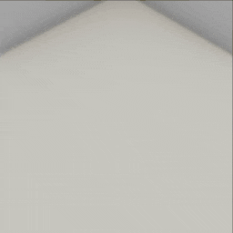
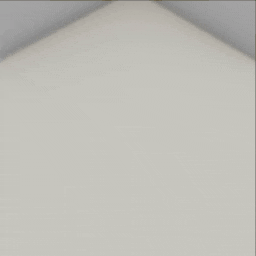

##### Non-physics objects

# Line renderers

*Line renderers are most useful for visualizing object motion. If you haven't done so already, we recommend you read the [Physics (PhysX) tutorial](../physx/physx.md).*

**Line renderers** are non-physics 3D lines in a scene. They can be added from existing data as well as adjusted at runtime.

In this example, we'll run a series of "trials". In each trial, an object is added to the scene, as well as a line renderer, which is added by sending  [`add_line_renderer`](../../api/command_api.md#add_line_renderer). Using an [`ObjectManager`](../../python/add_ons/object_manager.md), the trial will run until the object stops moving. At every frame, the controller will add a new point to the line renderer by sending [`add_points_to_line_renderer`](../../api/command_api.md#add_points_to_line_renderer). At the end of the trial, the object and line renderer are removed by sending [`destroy_object`](../../api/command_api.md#destroy_object) and [`remove_line_renderer`](../../api/command_api.md#destroy_line_renderer), respectively.

```python
from typing import Dict
from tdw.controller import Controller
from tdw.tdw_utils import TDWUtils
from tdw.add_ons.third_person_camera import ThirdPersonCamera
from tdw.add_ons.object_manager import ObjectManager


class LineRenderer(Controller):
    """
    Run a series of trials. In each trial, an object is dropped and its path is renderered as a 3D line.
    """

    def __init__(self, port: int = 1071, check_version: bool = True, launch_build: bool = True):
        super().__init__(port=port, check_version=check_version, launch_build=launch_build)
        self.camera: ThirdPersonCamera = ThirdPersonCamera(avatar_id="a",
                                                           position={"x": 2.88, "y": 6.34, "z": -2.69},
                                                           look_at={"x": 0, "y": 0, "z": 0})
        self.object_manager: ObjectManager = ObjectManager(transforms=False, rigidbodies=True, bounds=True)
        self.add_ons.extend([self.camera, self.object_manager])
        self.communicate(TDWUtils.create_empty_room(12, 12))

    def trial(self, model_name: str, rotation: Dict[str, float], force: Dict[str, float]) -> None:
        self.object_manager.reset()
        # Add the object.
        object_id = Controller.get_unique_id()
        position = {"x": 0, "y": 3, "z": 0}
        commands = Controller.get_add_physics_object(model_name=model_name,
                                                     object_id=object_id,
                                                     position=position,
                                                     rotation=rotation,
                                                     library="models_core.json")
        # Apply a force to the object.
        commands.append({"$type": "apply_force_to_object",
                         "id": object_id,
                         "force": force})
        # Add the line.
        line_id = Controller.get_unique_id()
        commands.append({"$type": "add_line_renderer",
                         "id": line_id,
                         "points": [position, position],
                         "start_color": {"r": 0.6, "g": 0, "b": 0.2, "a": 1},
                         "end_color": {"r": 0, "g": 0.8, "b": 0.3, "a": 1},
                         "start_width": 0.2,
                         "end_width": 0.2,
                         "loop": False,
                         "position": {"x": 0, "y": 0, "z": 0}})
        self.communicate(commands)
        # Wait until the object stops moving.
        while not self.object_manager.rigidbodies[object_id].sleeping:
            # Add a line point at the object's position.
            self.communicate({"$type": "add_points_to_line_renderer",
                              "id": line_id,
                              "points": [TDWUtils.array_to_vector3(self.object_manager.bounds[object_id].center)]})
        # Clear the scene.
        self.communicate([{"$type": "destroy_object",
                           "id": object_id},
                          {"$type": "destroy_line_renderer",
                           "id": line_id}])

    def run(self) -> None:
        self.trial(model_name="iron_box", rotation={"x": 5, "y": 40, "z": 30}, force={"x": 0.5, "y": 1.5, "z": 0})
        self.trial(model_name="iron_box", rotation={"x": 5, "y": 40, "z": 30}, force={"x": 1.5, "y": 3.5, "z": 0})
        self.communicate({"$type": "terminate"})


if __name__ == "__main__":
    c = LineRenderer()
    c.run()
```

Result:



## Line renderers, speed, and memory usage

Whenever possible, you should set the `"points"` parameter of `add_line_renderer` rather than sending `add_points_to_line_renderer`; these two commands are handled differently on the backend, with `add_line_renderer` being the faster implementation. This isn't applicable in the above example because the goal is to extend the line at runtime, but the difference can be significant when loading a line from saved data.

For lines with many vertices, you may want to consider sending the command [`simplify_line_renderer`](../../api/command_api.md#simplify_line_renderer) which will remove intermediate points based on a "tolerance" value. What this value actually means is defined by the Unity Engine and not well documented; in practice, values between 0 and 0.01 seem to be adequate.

This example is the same as the previous example except that we send `simplify_line_renderer` with a tolerance value of 0.01:

```python
from typing import Dict
from tdw.controller import Controller
from tdw.tdw_utils import TDWUtils
from tdw.add_ons.third_person_camera import ThirdPersonCamera
from tdw.add_ons.object_manager import ObjectManager


class LineRenderer(Controller):
    """
    Run a series of trials. In each trial, an object is dropped and its path is renderered as a 3D line.
    """

    def __init__(self, port: int = 1071, check_version: bool = True, launch_build: bool = True):
        super().__init__(port=port, check_version=check_version, launch_build=launch_build)
        self.camera: ThirdPersonCamera = ThirdPersonCamera(avatar_id="a",
                                                           position={"x": 2.88, "y": 6.34, "z": -2.69},
                                                           look_at={"x": 0, "y": 0, "z": 0})
        self.object_manager: ObjectManager = ObjectManager(transforms=False, rigidbodies=True, bounds=True)
        self.add_ons.extend([self.camera, self.object_manager])
        self.communicate(TDWUtils.create_empty_room(12, 12))

    def trial(self, model_name: str, rotation: Dict[str, float], force: Dict[str, float]) -> None:
        self.object_manager.reset()
        # Add the object.
        object_id = Controller.get_unique_id()
        position = {"x": 0, "y": 3, "z": 0}
        commands = Controller.get_add_physics_object(model_name=model_name,
                                                     object_id=object_id,
                                                     position=position,
                                                     rotation=rotation,
                                                     library="models_core.json")
        # Apply a force to the object.
        commands.append({"$type": "apply_force_to_object",
                         "id": object_id,
                         "force": force})
        # Add the line.
        line_id = Controller.get_unique_id()
        commands.append({"$type": "add_line_renderer",
                         "id": line_id,
                         "points": [position, position],
                         "start_color": {"r": 0.6, "g": 0, "b": 0.2, "a": 1},
                         "end_color": {"r": 0, "g": 0.8, "b": 0.3, "a": 1},
                         "start_width": 0.2,
                         "end_width": 0.2,
                         "loop": False,
                         "position": {"x": 0, "y": 0, "z": 0}})
        self.communicate(commands)
        # Wait until the object stops moving.
        while not self.object_manager.rigidbodies[object_id].sleeping:
            # Add a line point at the object's position.
            self.communicate([{"$type": "add_points_to_line_renderer",
                               "id": line_id,
                               "points": [TDWUtils.array_to_vector3(self.object_manager.bounds[object_id].center)]},
                              {"$type": "simplify_line_renderer",
                               "id": line_id,
                               "tolerance": 0.01}])
        # Clear the scene.
        self.communicate([{"$type": "destroy_object",
                           "id": object_id},
                          {"$type": "destroy_line_renderer",
                           "id": line_id}])

    def run(self) -> None:
        self.trial(model_name="iron_box", rotation={"x": 5, "y": 40, "z": 30}, force={"x": 0.5, "y": 1.5, "z": 0})
        self.trial(model_name="iron_box", rotation={"x": 5, "y": 40, "z": 30}, force={"x": 1.5, "y": 3.5, "z": 0})
        self.communicate({"$type": "terminate"})


if __name__ == "__main__":
    c = LineRenderer()
    c.run()
```

Result:



## Remove points from a line

Remove points on the line by sending [`remove_points_from_line_renderer`](../../api/command_api.md#remove_points_from_line_renderer).

***

**Next: [Textured quads](textured_quads.md)**

[Return to the README](../../../README.md)

***

Example controllers:

- [line_renderer.py](https://github.com/threedworld-mit/tdw/blob/master/Python/example_controllers/non_physics/line_renderer.py)  Run a series of trials. In each trial, an object is dropped and its path is renderered as a 3D line.

Command API:

- [`add_line_renderer`](../../api/command_api.md#add_line_renderer)
- [`add_points_to_line_renderer`](../../api/command_api.md#add_points_to_line_renderer)
- [`destroy_line_renderer`](../../api/command_api.md#destroy_line_renderer)
- [`simplify_line_renderer`](../../api/command_api.md#simplify_line_renderer)
- [`remove_points_from_line_renderer`](../../api/command_api.md#remove_points_from_line_renderer)