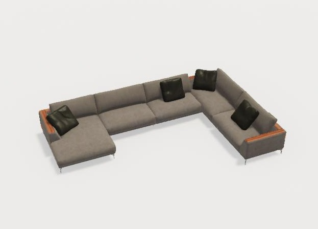
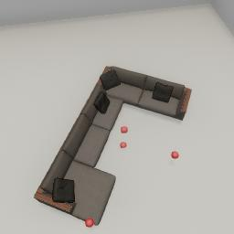

##### Non-physics objects

# Position markers

*Position markers are most useful when setting up a scene. If you haven't done so already, we recommend you read the [Scene Setup tutorials](../scene_setup/overview.md).*

**Position markers** are simple non-physics objects that can be used to mark a position. They are useful when debugging a scene.

Consider this model, `arflex_hollywood_sofa`:



It might be difficult to estimate at a glance where the object's [bounds](../scene_setup_low_level/bounds.md) are. To visualize them, we can add position markers with the [`add_position_marker`](../../api/command_api.md#add_position_marker) command:

```python
from tdw.controller import Controller
from tdw.tdw_utils import TDWUtils
from tdw.output_data import OutputData, Bounds
from tdw.add_ons.third_person_camera import ThirdPersonCamera
from tdw.add_ons.image_capture import ImageCapture
from tdw.backend.paths import EXAMPLE_CONTROLLER_OUTPUT_PATH

"""
Visualize the bounds of an object with position markers.
"""

c = Controller()
camera = ThirdPersonCamera(avatar_id="a",
                           position={"x": 3.83, "y": 6, "z": -0.71},
                           look_at={"x": 0, "y": 0, "z": 0})
path = EXAMPLE_CONTROLLER_OUTPUT_PATH.joinpath("position_markers")
print(f"Images will be saved to: {path}")
capture = ImageCapture(avatar_ids=["a"], path=path)
c.add_ons.extend([camera, capture])
object_id = c.get_unique_id()
# Create the scene. Add the object. Request bounds data.
resp = c.communicate([TDWUtils.create_empty_room(12, 12),
                      c.get_add_object(model_name="arflex_hollywood_sofa",
                                       object_id=object_id,
                                       position={"x": 1, "y": 0, "z": 0},
                                       rotation={"x": 0, "y": 31, "z": 0}),
                      {"$type": "send_bounds",
                       "frequency": "once"}])
commands = []
for i in range(len(resp) - 1):
    r_id = OutputData.get_data_type_id(resp[i])
    if r_id == "boun":
        bounds = Bounds(resp[i])
        for j in range(bounds.get_num()):
            if bounds.get_id(j) == object_id:
                for bound_position in [bounds.get_top(j), bounds.get_bottom(j), bounds.get_left(j), bounds.get_right(j),
                                       bounds.get_front(j), bounds.get_bottom(j)]:
                    commands.append({"$type": "add_position_marker",
                                     "position": TDWUtils.array_to_vector3(bound_position),
                                     "scale": 0.2})
c.communicate(commands)
c.communicate({"$type": "terminate"})
```

Result:



*In this image, the position markers for the top, bottom, and two sides of the sofa are visible.*

## Optional parameters

The only required parameter of `add_position_marker` is `position` (an {x, y, z} dictionary). There are other optional parameters:

- `"scale"` sets the size of the marker. If the scale is 1 the marker will be 1 meter wide.
- `"color"` is an {r, g, b, a} dictionary where each value is between 0 and 1. By default, position markers are red.
- `"shape"` can be `"cube"`, `"sphere"`, `"circle"`, or `"square"`

## Remove position markers

To remove all position markers from a scene, send [`remove_position_markers`](../../api/command_api.md#remove_position_markers).

## Command API and output data

Position markers aren't [objects](../core_concepts/objects.md) in the TDW sense and won't respond to object commands such as `teleport_object`. They won't appear in *any* output data except `Images` (and only in the `_img` pass).

***

**Next: [Line renderers](line_renderers.md)**

[Return to the README](../../../README.md)

***

Example controllers:

- [position_markers.py](https://github.com/threedworld-mit/tdw/blob/master/Python/example_controllers/non_physics/position_markers.py)  Visualize the bounds of an object with position markers.

Command API:

- [`add_position_marker`](../../api/command_api.md#add_position_marker)
- [`remove_position_markers`](../../api/command_api.md#remove_position_markers)