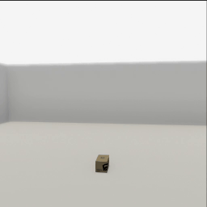
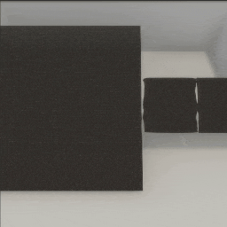
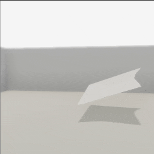
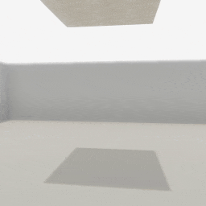
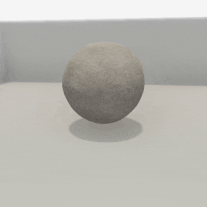
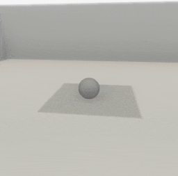

##### Physics (Obi)

# Cloth

In TDW's implementation of Obi, there are two types of cloth:

1. **Sheets** are two-dimensional squares that can optionally be **tethered** in-place.
2. **Volumes** are three-dimensional objects that can be **pressurized**. They are much more similar to standard TDW objects but have a more limited number of shapes.

## Sheets

To add an Obi cloth sheet to the scene, call `obi.create_cloth_sheet()`, which sends two commands: [`add_material`](../../api/command_api.md#add_material) (downloads and loads into memory the cloth sheet's [visual material](../objects_and_scenes/materials_textures_colors.md)) and [`create_obi_cloth_sheet`](../../api/command_api.md#create_obi_cloth_sheet).

This is a minimal example of how to create a cloth sheet:

```python
from tdw.controller import Controller
from tdw.tdw_utils import TDWUtils
from tdw.add_ons.obi import Obi
from tdw.add_ons.third_person_camera import ThirdPersonCamera

c = Controller()
camera = ThirdPersonCamera(position={"x": -3.75, "y": 1.5, "z": -0.5},
                           look_at={"x": 0, "y": 1.25, "z": 0})
obi = Obi()
c.add_ons.extend([camera, obi])
# Create a cloth sheet.
obi.create_cloth_sheet(cloth_material="cotton",
                       object_id=Controller.get_unique_id(),
                       position={"x": 0, "y": 2, "z": 0},
                       rotation={"x": 0, "y": 0, "z": 0})
commands = [TDWUtils.create_empty_room(12, 12)]
commands.extend(Controller.get_add_physics_object(model_name="sphere",
                                                  object_id=Controller.get_unique_id(),
                                                  library="models_flex.json",
                                                  kinematic=True,
                                                  gravity=False,
                                                  scale_factor={"x": 0.5, "y": 0.5, "z": 0.5}))
c.communicate(commands)
# Let the cloth fall.
for i in range(150):
    c.communicate([])
c.communicate({"$type": "terminate"})

```

Result:



### Sheet types

There are three [`SheetType`](../../python/obi_data/cloth/sheet_type.md) values, each with different sizes and particle densities, which can be set via the optional `sheet_type` parameter.

This example controller adds three cloth sheets, each with a different `SheetType`. 

```python
from tdw.controller import Controller
from tdw.tdw_utils import TDWUtils
from tdw.add_ons.obi import Obi
from tdw.add_ons.third_person_camera import ThirdPersonCamera
from tdw.obi_data.cloth.sheet_type import SheetType

c = Controller()
camera = ThirdPersonCamera(position={"x": 0, "y": 8, "z": 5},
                           look_at={"x": 0, "y": 1.25, "z": 0})
obi = Obi()
c.add_ons.extend([camera, obi])
# Create cloth sheets, each with a different type.
obi.create_cloth_sheet(cloth_material="canvas",
                       object_id=Controller.get_unique_id(),
                       position={"x": -4, "y": 2, "z": 0},
                       rotation={"x": 30, "y": 0, "z": 0},
                       sheet_type=SheetType.cloth)
obi.create_cloth_sheet(cloth_material="canvas",
                       object_id=Controller.get_unique_id(),
                       position={"x": -2, "y": 2, "z": 0},
                       rotation={"x": 30, "y": 0, "z": 0},
                       sheet_type=SheetType.cloth_hd)
obi.create_cloth_sheet(cloth_material="canvas",
                       object_id=Controller.get_unique_id(),
                       position={"x": 2, "y": 2, "z": 0},
                       rotation={"x": 30, "y": 0, "z": 0},
                       sheet_type=SheetType.cloth_vhd)
# Create the scene.
commands = [TDWUtils.create_empty_room(12, 12)]
# Add example objects underneath each sheet.
for x in [-4, -2, 2]:
    commands.extend(Controller.get_add_physics_object(model_name="sphere",
                                                      object_id=Controller.get_unique_id(),
                                                      position={"x": x, "y": 0, "z": 0},
                                                      library="models_flex.json",
                                                      kinematic=True,
                                                      gravity=False,
                                                      scale_factor={"x": 0.5, "y": 0.5, "z": 0.5}))
c.communicate(commands)
for i in range(150):
    c.communicate([])
c.communicate({"$type": "terminate"})
```

Result:



Note that the differences in size (`cloth_vhd` is the largest) and deformation fidelity (`cloth` mostly stays flat).

It is possible to scale any of the cloth sheet types. [Read this for more information.](solvers.md)

### Tethering

A portion of a cloth sheet can be **tethered** in-place. Cloth sheets by default aren't tethered. Cloth sheets may have more than one tether.

To add tethered positions,  set the `tether_positions` parameter in `obi.create_cloth_sheet()`. This is a dictionary where the key is a [`TetherParticleGroup`](../../python/obi_data/cloth/tether_particle_group.md) (describes the position of the tether) and the value is a [`TetherType`](../../python/obi_data/cloth/tether_type.md) (describes the nature of the tether: the object ID and whether the tether is static or dynamic). If `tether_type.object_id` is the same as the ID of the cloth object then the cloth will be suspended in mid-air.

This example tethers a cloth sheet at multiple positions in mid-air:

```python
from tdw.controller import Controller
from tdw.tdw_utils import TDWUtils
from tdw.add_ons.obi import Obi
from tdw.add_ons.third_person_camera import ThirdPersonCamera
from tdw.obi_data.cloth.sheet_type import SheetType
from tdw.obi_data.cloth.tether_particle_group import TetherParticleGroup
from tdw.obi_data.cloth.tether_type import TetherType

c = Controller()
cloth_id = Controller.get_unique_id()
camera = ThirdPersonCamera(position={"x": -3.75, "y": 1.5, "z": -0.5},
                           look_at={"x": 0, "y": 1.25, "z": 0})
obi = Obi()
c.add_ons.extend([camera, obi])
obi.create_cloth_sheet(cloth_material="plastic",
                       object_id=cloth_id,
                       position={"x": 1, "y": 1.0, "z": -1},
                       rotation={"x": 20, "y": 10, "z": 10},
                       sheet_type=SheetType.cloth_hd,
                       tether_positions={TetherParticleGroup.north_edge: TetherType(object_id=cloth_id, is_static=True),
                                         TetherParticleGroup.east_edge: TetherType(object_id=cloth_id)})
c.communicate(TDWUtils.create_empty_room(12, 12))
for i in range(150):
    c.communicate([])
c.communicate({"$type": "terminate"})
```

Result:



### Un-tethering

To un-tether a cloth sheet, call `obi.untether_cloth_sheet()`:

```python
from tdw.controller import Controller
from tdw.tdw_utils import TDWUtils
from tdw.add_ons.obi import Obi
from tdw.add_ons.third_person_camera import ThirdPersonCamera
from tdw.obi_data.cloth.sheet_type import SheetType
from tdw.obi_data.cloth.tether_particle_group import TetherParticleGroup
from tdw.obi_data.cloth.tether_type import TetherType

c = Controller()
cloth_id = Controller.get_unique_id()
camera = ThirdPersonCamera(position={"x": -3.75, "y": 1.5, "z": -0.5},
                           look_at={"x": 0, "y": 1.25, "z": 0})
obi = Obi()
c.add_ons.extend([camera, obi])
# Create the cloth sheet and tether it.
obi.create_cloth_sheet(cloth_material="canvas",
                       object_id=cloth_id,
                       position={"x": 0, "y": 3.0, "z": 0},
                       sheet_type=SheetType.cloth_hd,
                       tether_positions={TetherParticleGroup.center: TetherType(cloth_id)})
c.communicate(TDWUtils.create_empty_room(12, 12))
for i in range(100):
    c.communicate([])
# Un-tether the cloth sheet.
obi.untether_cloth_sheet(object_id=cloth_id, tether_position=TetherParticleGroup.center)
for i in range(100):
    c.communicate([])
c.communicate({"$type": "terminate"})
```

Result:



## Cloth volumes

To add a cloth volume to the scene, call `obi.create_cloth_volume()`, which sends two commands: [`add_material`](../../api/command_api.md#add_material) (downloads and loads into memory the cloth volume's [visual material](../objects_and_scenes/materials_textures_colors.md)) and [`create_obi_cloth_volume`](../../api/command_api.md#create_obi_cloth_volume).

This is a minimal example of how to create a cloth volume:

```python
from tdw.controller import Controller
from tdw.tdw_utils import TDWUtils
from tdw.add_ons.obi import Obi
from tdw.add_ons.third_person_camera import ThirdPersonCamera
from tdw.obi_data.cloth.volume_type import ClothVolumeType

c = Controller()
cloth_id = Controller.get_unique_id()
camera = ThirdPersonCamera(position={"x": -3.75, "y": 1.5, "z": -0.5},
                           look_at={"x": 0, "y": 0.5, "z": 0})
obi = Obi()
c.add_ons.extend([camera, obi])
# Add the cloth volume.
obi.create_cloth_volume(cloth_material="canvas",
                        object_id=cloth_id,
                        position={"x": 0, "y": 1.0, "z": 0},
                        rotation={"x": 0, "y": 0, "z": 0},
                        volume_type=ClothVolumeType.sphere,
                        scale_factor={"x": 0.5, "y": 0.5, "z": 0.5},
                        pressure=3.0,
                        solver_id=0)
c.communicate(TDWUtils.create_empty_room(12, 12))
for i in range(200):
    c.communicate([])
c.communicate({"$type": "terminate"})
```

Result:



- The `volume_type` parameter accepts a [`VolumeType`](../..python/obi_data/cloth/volume_type.md) value.
- The `pressure` parameter determines how pressurized the volume is; in this example, the sphere behaves like a somewhat deflated ball.
- The `scale_factor` parameter non-uniformly scales the cloth volume object.

## Cloth materials

Both `obi.create_cloth_sheet()` and `obi.create_cloth_volume()` have a `cloth_material` parameter. A cloth material is Obi physics parameters for the cloth plus its visual appearance.

 `cloth_material` can be set to either a preset cloth material (in which case the value is a string) or a custom cloth material (in which case the value is a [`ClothMaterial`](../../python/obi_data/cloth/cloth_material.md)). 

To get a dictionary of cloth material presets, do this:

```python
from tdw.obi_data.cloth.cloth_material import CLOTH_MATERIALS

for cloth_name in CLOTH_MATERIALS:
    print(cloth_name)
```

Output:

```
silk
cotton
wool
canvas
burlap
rubber
plastic
```

This example controller uses a custom cloth material:

```python
from tdw.controller import Controller
from tdw.tdw_utils import TDWUtils
from tdw.add_ons.obi import Obi
from tdw.add_ons.third_person_camera import ThirdPersonCamera
from tdw.obi_data.cloth.cloth_material import ClothMaterial
from tdw.obi_data.cloth.sheet_type import SheetType

c = Controller()
camera = ThirdPersonCamera(position={"x": -3.75, "y": 1.5, "z": -0.5},
                           look_at={"x": 0, "y": 1.25, "z": 0})
obi = Obi()
c.add_ons.extend([camera, obi])
cloth_material = ClothMaterial(visual_material="cotton_natural_rough",
                               texture_scale={"x": 2, "y": 2},
                               stretching_scale=1,
                               stretch_compliance=0,
                               max_compression=0,
                               max_bending=0.05,
                               drag=0,
                               lift=0,
                               tether_compliance=0,
                               tether_scale=1,
                               visual_smoothness=0)
obi.create_cloth_sheet(cloth_material=cloth_material,
                       object_id=Controller.get_unique_id(),
                       position={"x": 0, "y": 2, "z": 0},
                       rotation={"x": 0, "y": 0, "z": 0},
                       sheet_type=SheetType.cloth_hd)
commands = [TDWUtils.create_empty_room(12, 12)]
commands.extend(Controller.get_add_physics_object(model_name="iron_box",
                                                  object_id=Controller.get_unique_id()))
c.communicate(commands)
# Let the cloth fall.
for i in range(150):
    c.communicate([])
c.communicate({"$type": "terminate"})
```

Result:



This example creates a custom cloth material by copying most of the values from `CLOTH_MATERIALS["silk"]`:

```python
from tdw.obi_data.cloth.cloth_material import ClothMaterial, CLOTH_MATERIALS

# Get the preset silk material.
preset_material = CLOTH_MATERIALS["silk"]
# Use all of the parameters of the preset.
custom_material = ClothMaterial(**preset_material.__dict__)
# Set a custom visual material and texture scale.
custom_material.visual_material = "silk_smooth_red"
custom_material.texture_scale = {"x": 1, "y": 1}
```

***

**Next: [`ObiParticles` output data](obi_particles.md)**

[Return to the README](../../../README.md)

***

Example controllers:

- [cloth_sheet.py](https://github.com/threedworld-mit/tdw/blob/master/Python/example_controllers/obi/cloth_sheet.py) Minimal example of dropping a cloth sheet onto an object.
- [cloth_volume.py](https://github.com/threedworld-mit/tdw/blob/master/Python/example_controllers/obi/cloth_volume.py) Minimal example of adding a cloth volume to a scene.
- [custom_cloth.py](https://github.com/threedworld-mit/tdw/blob/master/Python/example_controllers/obi/custom_cloth.py) Add a cloth sheet with a custom material to the scene.
- [sheet_types.py](https://github.com/threedworld-mit/tdw/blob/master/Python/example_controllers/obi/sheet_types.py) Example of different sheet types.
- [tether_self.py](https://github.com/threedworld-mit/tdw/blob/master/Python/example_controllers/obi/tether_self.py) Apply multiple tether positions to a single cloth sheet.
- [untether.py](https://github.com/threedworld-mit/tdw/blob/master/Python/example_controllers/obi/untether.py) Tether and then un-tether a cloth sheet.

Python API:

- [`Obi`](../../python/add_ons/obi.md)
- Cloth data classes:
  - [`ClothMaterial`](../../python/obi_data/cloth/cloth_material.md)
  - [`SheetType`](../../python/obi_data/cloth/sheet_type.md)
  - [`TetherParticleGroup`](../../python/obi_data/cloth/tether_particle_group.md)
  - [`TetherType`](../../python/obi_data/cloth/tether_type.md)
  - [`VolumeType`](../../python/obi_data/cloth/volume_type.md)

Command API:

- [`add_material`](../../api/command_api.md#add_material)
- [`create_obi_cloth_sheet`](../../api/command_api.md#create_obi_cloth_sheet)
- [`create_obi_cloth_volume`](../../api/command_api.md#create_obi_cloth_volume)