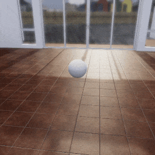

##### Physics (Obi)

# Colliders and collision materials

In Unity and in TDW, each object has *n* number of [PhysX physics colliders](../physx/physx.md). Obi adds an additional **ObiCollider** component to each PhysX collider object. Each ObiCollider might also have a **ObiCollisionMaterial**, a data class that influences how the collider behaves in a collision event.

In TDW, the  [`Obi` add-on](../../python/add_ons/obi.md) automatically adds Obi colliders and collision materials to each object in the scene. In order to do this, it sends commands requesting output data in order to determine what is in the scene. This process has three broad implications:

1. The `Obi` add-on is only aware of objects that are in the scene when it initializes and won't automatically Obi-fy anything added afterwards.
2. It is possible for the user to manually add Obi colliders to an object after `Obi` initializes by sending the relevant commands.
2. It is possible to override collision material settings within the `Obi` add-on.

## How the `Obi` add-on creates Obi colliders and collision materials

### Objects, robots, and VR rigs

When the `Obi` add-on is initialized or reset, it sends several commands, receives output data, and uses the output data to add Obi colliders on the next frame:

| Command (first frame) | Output Data (second frame) |
| ------- | ----------- |
| [`send_static_rigidbodies`](../../api/command_api.md#send_static_rigidbodies) | [`StaticRigidbodies`](../../api/output_data.md#StaticRigidbodies) |
| [`send_static_robots`](../../api/command_api.md#send_static_rigidbodies) | [`StaticRobot`](../../api/output_data.md#StaticRobot) |
| [`send_static_oculus_touch`](../../api/command_api.md#send_static_oculus_touch) | [`StaticOculusTouch`](../../api/output_data.md#StaticOculusTouch) |

In TDW and Unity, each object has a [physic material](../physx/physics_objects.md). An Obi collision material is similar to a Unity physic material; both data classes have parameters for dynamic and static friction. The `StaticRigidbodies` data includes these values. By default, `Obi` will set the Obi dynamic and static friction to match the PhysX dynamic and static friction, and set all other values to 0. Robots and VR rigs are set to defaults (friction values are 0.3, everything else is 0).

### The floor

Most, but not all, interior scenes in TDW have an explicitly-defined floor. In these scenes, `Obi` adds an Obi collider to the floor and sets its collision material to default parameters (friction values are 0.3, everything else is 0).

## How to override collision material values

There are many reasons to override collision materials; most involve how non-actors will interact with actors. For example, when simulating a viscous [fluid](fluids.md), it may be important to increase the stickiness of everything else in the scene.

In the `Obi` constructor and `reset()` function, there are three parameters that can be set to override collision material values:

- `floor_material` to set the collision material of the floor.
- `object_materials` to set the collision materials of  [objects](../core_concepts/objects.md) and [robots](../robots/overview.md) (key = object or robot ID).
- `vr_material` to set the collision material of a [VR rig](../vr/overview.md).

Each of these parameters uses the [`CollisionMaterial`](../../python/obi_data/collision_materials/collision_material.md) data class.

## Obi actors and Obi collision materials

In an Obi simulation, it is often insufficient to define realistic parameters for an actor;  you must define corresponding parameters for the objects in the scene. For example, in a fluid simulation, fluids don't have a friction or stickiness properties but collision materials do, so all of the *non*-actors need to have correct collision material materials in order for a fluid to behave correctly.

In this example, we'll add milk to the scene and decrease the friction of the floor and a reference object:

```python
from tdw.controller import Controller
from tdw.add_ons.obi import Obi
from tdw.add_ons.third_person_camera import ThirdPersonCamera
from tdw.obi_data.fluids.disk_emitter import DiskEmitter
from tdw.obi_data.collision_materials.collision_material import CollisionMaterial
from tdw.obi_data.collision_materials.material_combine_mode import MaterialCombineMode

"""
Create a custom collision material to simulate a slick fluid.
"""

c = Controller()
c.communicate(Controller.get_add_scene(scene_name="tdw_room"))
fluid_id = Controller.get_unique_id()
object_id = Controller.get_unique_id()
camera = ThirdPersonCamera(position={"x": -3.75, "y": 1.5, "z": -0.5},
                           look_at={"x": 0, "y": 0, "z": 0})
# Define a slick collision material.
slick_material = CollisionMaterial(dynamic_friction=0.05,
                                   static_friction=0.05,
                                   stickiness=0,
                                   stick_distance=0,
                                   stickiness_combine=MaterialCombineMode.average,
                                   friction_combine=MaterialCombineMode.average)
obi = Obi(floor_material=slick_material, object_materials={object_id: slick_material})
c.add_ons.extend([camera, obi])
obi.create_fluid(fluid="milk",
                 shape=DiskEmitter(radius=0.25),
                 object_id=fluid_id,
                 position={"x": -0.1, "y": 2.0, "z": 0},
                 rotation={"x": 90, "y": 0, "z": 0},
                 lifespan=12,
                 speed=3)
# Add an object for the fluid to interact with.
c.communicate(Controller.get_add_physics_object(model_name="sphere",
                                                object_id=object_id,
                                                library="models_flex.json",
                                                kinematic=True,
                                                gravity=False,
                                                scale_factor={"x": 0.5, "y": 0.5, "z": 0.5}))
for i in range(300):
    c.communicate([])
c.communicate({"$type": "terminate"})
```

Result:



## How to manually add Obi colliders

The `Obi` add-on automatically sends all of these commands; in most cases, it shouldn't be necessary for you to send them outside of the add-on.

- To add Obi colliders to an [object](../core_concepts/objects.md), send [`create_obi_colliders`](../../api/command_api.md#create_obi_colliders). 
- To set Obi collision materials for an object, send [`set_obi_collision_material`](../../api/command_api.md#set_obi_collision_material). 
- To add Obi colliders to a [robot](../robots/overview.md), send [`create_robot_obi_colliders`](../../api/command_api.md#create_robot_obi_colliders).
- To set Obi collision materials for a robot, send [`set_robot_obi_collision_material`](../../api/command_api.md#set_robot_obi_collision_material).
- To add Obi colliders to a [VR rig](../vr/overview.md), send [`create_vr_obi_colliders`](../../api/command_api.md#create_vr_obi_colliders).
- To set Obi collision materials for a VR rig, send [`set_vr_obi_collision_material`](../../api/command_api.md#set_vr_obi_collision_material).
- To add Obi colliders to the floor, send [`create_floor_obi_colliders`](../../api/command_api.md#create_floor_obi_colliders).
- To set Obi collision materials for the floor, send [`set_floor_obi_collision_material`](../../api/command_api.md#set_floor_obi_collision_material).

***

**Next: [Solvers](solvers.md)**

[Return to the README](../../../README.md)

***

Example controllers:

- [milk.py](https://github.com/threedworld-mit/tdw/blob/master/Python/example_controllers/obi/milk.py) Create a custom collision material to simulate a slick fluid.

Python API:

- [`Obi`](../../python/add_ons/obi.md)
- Collision materials:
  - [`CollisionMaterial`](../../python/obi_data/collision_materials/collision_material.md)
  - [`MaterialCombineMode`](../../python/obi_data/collision_materials/material_combine_mode.md)

Command API:

- [`send_static_rigidbodies`](../../api/command_api.md#send_static_rigidbodies)
- [`send_static_robots`](../../api/command_api.md#send_static_robots)
- [`send_static_oculus_touch`](../../api/command_api.md#send_static_oculus_touch)
- [`create_obi_colliders`](../../api/command_api.md#create_obi_colliders)
- [`set_obi_collision_material`](../../api/command_api.md#set_obi_collision_material)
- [`create_robot_obi_colliders`](../../api/command_api.md#create_robot_obi_colliders)
- [`set_robot_obi_collision_material`](../../api/command_api.md#set_robot_obi_collision_material)
- [`create_vr_obi_colliders`](../../api/command_api.md#create_vr_obi_colliders)
- [`set_vr_obi_collision_material`](../../api/command_api.md#set_vr_obi_collision_material)
- [`create_floor_obi_colliders`](../../api/command_api.md#create_floor_obi_colliders)
- [`set_floor_obi_collision_material`](../../api/command_api.md#set_floor_obi_collision_material)
- [`send_static_rigidbodies`](../../api/command_api.md#send_static_rigidbodies)

Output data:

- [`StaticRigidbodies`](../../api/output_data.md#StaticRigidbodies)
- [`StaticRobot`](../../api/output_data.md#StaticRobot)
- [`StaticOculusTouch`](../../api/output_data.md#StaticOculusTouch)

