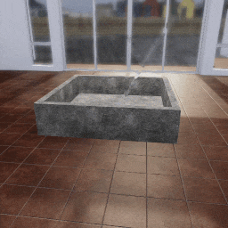
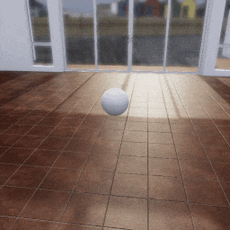

##### Physics (Obi)

# Fluids

To add an Obi fluid to the scene, call `obi.create_fluid()`:

```python
from tdw.controller import Controller
from tdw.add_ons.obi import Obi
from tdw.add_ons.third_person_camera import ThirdPersonCamera
from tdw.obi_data.fluids.disk_emitter import DiskEmitter

"""
Pour water into a receptacle.
"""

c = Controller()
c.communicate(Controller.get_add_scene(scene_name="tdw_room"))
camera = ThirdPersonCamera(position={"x": -3.75, "y": 1.5, "z": -0.5},
                           look_at={"x": 0, "y": 0, "z": 0})
obi = Obi()
c.add_ons.extend([camera, obi])
obi.create_fluid(fluid="water",
                 shape=DiskEmitter(),
                 object_id=Controller.get_unique_id(),
                 position={"x": 0, "y": 2.35, "z": -1.5},
                 rotation={"x": 45, "y": 0, "z": 0},
                 speed=5)
c.communicate(Controller.get_add_physics_object(model_name="fluid_receptacle1x1",
                                                object_id=Controller.get_unique_id(),
                                                library="models_special.json",
                                                kinematic=True,
                                                gravity=False,
                                                scale_factor={"x": 2, "y": 2, "z": 2}))
for i in range(500):
    c.communicate([])
c.communicate({"$type": "terminate"})
```

Result:



Note that in this example, we've loaded a [streamed scene](../core_concepts/scenes.md) instead of the usual example empty room. This is because fluids render much more realistically in streamed scenes due to their superior [lighting setups](../photorealism/lighting.md).

## The `create_obi_fluid` command

`obi.create_fluid` creates a single command, [`create_obi_fluid`](../../api/command_api.md#create_obi_fluid), which it then automatically sends to the build:

```python
from tdw.add_ons.obi import Obi
from tdw.obi_data.fluids.cube_emitter import CubeEmitter

obi = Obi()
obi.create_fluid(fluid="honey",
                 shape=CubeEmitter(),
                 object_id=0,
                 position={"x": 0, "y": 2.35, "z": 0},
                 rotation={"x": 90, "y": 0, "z": 0},
                 speed=1)
print(obi.commands)
```

Output:

```
[{'$type': 'create_obi_fluid', 'id': 0, 'fluid': {'$type': 'fluid', 'capacity': 1500, 'resolution': 1.0, 'color': {'a': 0.5, 'b': 0.15, 'g': 0.986, 'r': 1.0}, 'rest_density': 1000.0, 'radius_scale': 2.0, 'random_velocity': 0.15, 'smoothing': 3.0, 'surface_tension': 1.0, 'viscosity': 1.5, 'vorticity': 0.7, 'reflection': 0.2, 'transparency': 0.875, 'refraction': 0.0, 'buoyancy': -1, 'diffusion': 0, 'diffusion_data': {'w': 0, 'x': 0, 'y': 0, 'z': 0}, 'atmospheric_drag': 0, 'atmospheric_pressure': 0, 'particle_z_write': False, 'thickness_cutoff': 1.2, 'thickness_downsample': 2, 'blur_radius': 0.02, 'surface_downsample': 1, 'render_smoothness': 0.8, 'metalness': 0, 'ambient_multiplier': 1, 'absorption': 5, 'refraction_downsample': 1, 'foam_downsample': 1}, 'shape': {'$type': 'cube_emitter', 'size': {'x': 0.1, 'y': 0.1, 'z': 0.1}, 'sampling_method': 'volume'}, 'position': {'x': 0, 'y': 2.35, 'z': 0}, 'rotation': {'x': 90, 'y': 0, 'z': 0}, 'lifespan': 4, 'minimum_pool_size': 0.5, 'solver_id': 0, 'speed': 1}]
```

## The `fluid` parameter

The `fluid` parameter can be a **preset fluid** or a **custom fluid**. In the above example, we used the preset `"honey"`.

There are two types of Obi fluids: 

1. *Fluids* such as honey, water, etc.
2. *Granular fluids* such as gravel, sand, etc.

### `Fluid` data objects

To get a dictionary of *fluid* presets, do this:

```python
from tdw.obi_data.fluids.fluid import FLUIDS

for fluid_name in FLUIDS:
    print(fluid_name)
```

Output:

```
blood
chocolate
corn_oil
glycerin
honey
ink
milk
molasses
motor_oil
water
```

`FLUIDS` is a dictionary, where the key is the name of the preset and the value is a [`Fluid`; click this link for the API documentation to learn more about what each parameter means.](../../python/obi_data/fluids/fluid.md)

```python
from tdw.obi_data.fluids.fluid import FLUIDS

fluid = FLUIDS["water"]
for k in fluid.__dict__:
    print(f'{k}={fluid.__dict__[k]}')
```

Output:

```
capacity=1500
resolution=1.0
color={'a': 0.5, 'b': 1.0, 'g': 0.995, 'r': 0.985}
rest_density=1000.0
radius_scale=1.6
random_velocity=0.0
smoothing=2.0
surface_tension=1.0
viscosity=0.001
vorticity=1.0
reflection=0.25
transparency=1.0
refraction=-0.034
buoyancy=-1
diffusion=0
diffusion_data={'w': 0, 'x': 0, 'y': 0, 'z': 0}
atmospheric_drag=0
atmospheric_pressure=0
particle_z_write=False
thickness_cutoff=1.2
thickness_downsample=2
blur_radius=0.02
surface_downsample=1
render_smoothness=0.8
metalness=0
ambient_multiplier=1
absorption=5
refraction_downsample=1
foam_downsample=1
```

### `GranularFluid` data objects

To get a dictionary of *granular fluid* presets, do this:

```python
from tdw.obi_data.fluids.granular_fluid import GRANULAR_FLUIDS

for granular_fluid_name in GRANULAR_FLUIDS:
    print(granular_fluid_name)
```

Output:

```
gravel
rocks
```

`GRANULAR_FLUIDS` is a dictionary where the key is the name of the preset and the value is a [`GranularFluid`; click this link for the API documentation to learn more about what each parameter means.](../../python/obi_data/fluids/granular_fluid.md)

```python
from tdw.obi_data.fluids.granular_fluid import GRANULAR_FLUIDS

granular_fluid = GRANULAR_FLUIDS["gravel"]
for k in granular_fluid.__dict__:
    print(f'{k}={granular_fluid.__dict__[k]}')
```

Output:

```
capacity=1000.0
resolution=2.0
color={'r': 0.5, 'g': 0.5, 'b': 0.5, 'a': 1}
rest_density=200.0
radius_scale=1.7
random_velocity=0
randomness=30.0
```

### Custom fluids

Instead of passing a string to `obi.create_fluid(fluid)` (in other words, instead of passing the name of a preset), you can pass a custom `Fluid` or `GranularFluid` object:

```python
from tdw.controller import Controller
from tdw.add_ons.obi import Obi
from tdw.add_ons.third_person_camera import ThirdPersonCamera
from tdw.obi_data.fluids.cube_emitter import CubeEmitter
from tdw.obi_data.fluids.fluid import Fluid

"""
Add a custom fluid to the scene.
"""

c = Controller()
c.communicate(Controller.get_add_scene(scene_name="tdw_room"))
fluid_id = Controller.get_unique_id()
camera = ThirdPersonCamera(position={"x": -3.75, "y": 1.5, "z": -0.5},
                           look_at={"x": 0, "y": 0, "z": 0})
obi = Obi()
c.add_ons.extend([camera, obi])
# Define a custom fluid.
fluid = Fluid(capacity=1000,
              resolution=0.5,
              color={"r": 0.8, "g": 0.8, "b": 0.8, "a": 1.0},
              rest_density=1000,
              reflection=0.95,
              refraction=0,
              smoothing=3.0,
              render_smoothness=1.0,
              metalness=0.1,
              viscosity=0.5,
              absorption=0,
              vorticity=0,
              surface_tension=2.0,
              transparency=0.15,
              thickness_cutoff=2,
              radius_scale=1.5,
              random_velocity=0.125)
# Create the fluid.
obi.create_fluid(fluid=fluid,
                 shape=CubeEmitter(),
                 object_id=fluid_id,
                 position={"x": -0.1, "y": 2.0, "z": 0},
                 rotation={"x": 90, "y": 0, "z": 0},
                 lifespan=6,
                 speed=0.75)
# Add an object for the fluid to interact with.
c.communicate(Controller.get_add_physics_object(model_name="sphere",
                                                object_id=Controller.get_unique_id(),
                                                library="models_flex.json",
                                                kinematic=True,
                                                gravity=False,
                                                scale_factor={"x": 0.5, "y": 0.5, "z": 0.5}))
for i in range(500):
    c.communicate([])
c.communicate({"$type": "terminate"})
```

Result:



## The `shape` parameter

Obi fluids are emitted by a **fluid emitter**. The emitter can be one of four shapes:

1. [`CubeEmitter`](../../python/obi_data/fluids/cube_emitter.md)
2. [`DiskEmitter`](../../python/obi_data/fluids/disk_emitter.md)
3. [`EdgeEmitter`](../../python/obi_data/fluids/edge_emitter.md)
4. [`SphereEmitter`](../../python/obi_data/fluids/sphere_emitter.md)

Each of these shapes has optional constructor parameters; read the API documentation for more information.

In this example, we'll set the `size` of a [`CubeEmitter`](../../python/obi_data/fluids/cube_emitter.md):

```python
from tdw.controller import Controller
from tdw.add_ons.obi import Obi
from tdw.add_ons.third_person_camera import ThirdPersonCamera
from tdw.obi_data.fluids.cube_emitter import CubeEmitter

c = Controller()
c.communicate(Controller.get_add_scene(scene_name="tdw_room"))
fluid_id = Controller.get_unique_id()
camera = ThirdPersonCamera(position={"x": 1.2, "y": 1.5, "z": -1.5},
                           look_at={"x": 0, "y": 0, "z": 0})
obi = Obi()
c.add_ons.extend([camera, obi])
obi.create_fluid(fluid="honey",
                 shape=CubeEmitter(size={"x": 0.5, "y": 0.5, "z": 0.5}),
                 object_id=fluid_id,
                 position={"x": 0, "y": 2.35, "z": 0},
                 rotation={"x": 90, "y": 0, "z": 0},
                 speed=1)
c.communicate(Controller.get_add_physics_object(model_name="rh10",
                                                object_id=Controller.get_unique_id()))
for i in range(200):
    c.communicate([])
c.communicate({"$type": "terminate"})
```

## Optional parameters

- The `position` and `rotation` parameters work exactly the same as they do for adding objects. `position` sets the position of the fluid emitter. By default, the position is (0, 0, 0). `rotation` sets the rotation of the fluid emitter in Euler angles. By default, the rotation is (0, 0, 0).
- `speed` controls the emission speed. By default, this is 0, meaning that no fluid will be emitted.
- `lifespan` is the particle lifespan in seconds.
- `minimum_pool_size` is the minimum amount of inactive particles available before the emitter is allowed to resume emission.
- `solver_id` is the ID of the [Obi solver](solvers.md). By default, this is 0 (the ID of the first solver).

## Dynamically set the fluid speed

Set the fluid emission speed at runtime by calling `obi.set_fluid_speed(object_id, speed)`.

## Fluid render settings

Fluid rendering is dependent on three aspects of a scene: The lighting of the scene, the properties of the fluid, and specialized Obi settings on the camera itself. Because the camera receives different settings per fluid, **you can only render one type of fluid at a time.** More accurately, you can render any number of types of fluids, but unless they all have similar render values, one of them will look more realistic than the rest. In TDW, the render settings are updated every time `create_obi_fluid` (i.e. `obi.create_fluid()`) is sent. For example, if you add `honey`, `oil`, and `water` to the scene, the render settings will be for `water` because it was the last fluid added.

Granular fluids don't use render settings and don't have the same limitation. However, if you add a fluid after adding a granular fluid (for example, adding `gravel` and then `water`), the render setting will be re-enabled for water, and the gravel will appear "goopy".

***

**Next: [Cloth](cloth.md)**

[Return to the README](../../../README.md)

***

Example controllers:

- [water.py](https://github.com/threedworld-mit/tdw/blob/master/Python/example_controllers/obi/water.py) Pour water into a receptacle.
- [custom_fluid.py](https://github.com/threedworld-mit/tdw/blob/master/Python/example_controllers/obi/custom_fluid.py) Add a custom fluid to the scene.

Python API:

- [`Obi`](../../python/add_ons/obi.md)
- Fluid types:
  - [`Fluid`](../../python/obi_data/fluids/fluid.md)
  - [`GranularFluid`](../../python/obi_data/fluids/granular_fluid.md)
- Emitter shapes:
  - [`CubeEmitter`](../../python/obi_data/fluids/cube_emitter.md)
  - [`DiskEmitter`](../../python/obi_data/fluids/disk_emitter.md)
  - [`EdgeEmitter`](../../python/obi_data/fluids/edge_emitter.md)
  - [`SphereEmitter`](../../python/obi_data/fluids/sphere_emitter.md)

Command API:

- [`create_obi_fluid`](../../api/command_api.md#create_obi_fluid)