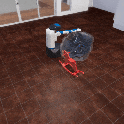

##### Physics (Obi)

# Robots and Obi

*If you haven't done so already, please read the documentation for [robots in TDW](../robots/overview.md).*

## Robots

Robots are *partially* supported in Obi. This is limitation on the backend. Robots in TDW use a Unity component called "ArticulationBody" which is far more stable than a Rigidbody. Obi, however, uses Rigidbodies, not ArticulationBodies. The result is that it treats robots more like a static element in the environment. 

In this example, we'll add an Obi fluid, an object, and a robot. Notice how the fluid flows around both the robot and the object, but pushes only the object.

```python
from tdw.controller import Controller
from tdw.add_ons.obi import Obi
from tdw.add_ons.third_person_camera import ThirdPersonCamera
from tdw.add_ons.robot import Robot
from tdw.obi_data.fluids.cube_emitter import CubeEmitter

c = Controller()
# Add Obi.
obi = Obi()
# Add a robot.
robot = Robot(name="fetch", position={"x": -0.5, "y": 0, "z": 0})
# Add a camera.
camera = ThirdPersonCamera(position={"x": 2.7, "y": 2.5, "z": -1.75},
                           look_at={"x": 0, "y": 0, "z": 0})
c.add_ons.extend([obi, robot, camera])
# Create the scene, including an object.
commands = [Controller.get_add_scene(scene_name="tdw_room")]
commands.extend(Controller.get_add_physics_object(model_name="rh10",
                                                  object_id=Controller.get_unique_id(),
                                                  position={"x": 0.5, "y": 0, "z": 0}))
c.communicate(commands)
# Create a fluid.
obi.create_fluid(fluid="water",
                 object_id=Controller.get_unique_id(),
                 position={"x": 0, "y": 0.5, "z": 1},
                 rotation={"x": 0, "y": 180, "z": 0},
                 speed=3,
                 shape=CubeEmitter(size={"x": 0.5, "y": 0.5, "z": 0.5}))
for i in range(100):
    c.communicate([])
c.communicate({"$type": "terminate"})
```

Result:



## Magnebots

[Magnebots](https://github.com/alters-mit/magnebot) aren't supported in Obi. Magnebots grasp objects by temporarily destroying Rigidbody components; this disrupts the Obi simulation. It may be possible to fix this in future TDW updates.

***

**Next: [Obi and Flex](obi_and_flex.md)**

[Return to the README](../../../README.md)

***

Example controllers:

- [obi_robot.py](https://github.com/threedworld-mit/tdw/blob/master/Python/example_controllers/obi/obi_robot.py) Add a robot and an Obi fluid to the scene.

Python API:

- [`Obi`](../../python/add_ons/obi.md)
- [`Robot`](../../python/add_ons/robot.md)