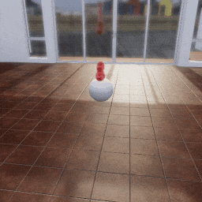
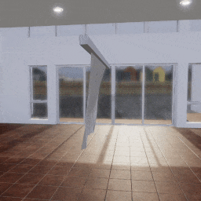

##### Physics (Obi)

# Solvers

## Overview

Every Obi simulation requires at least one **solver**. In TDW, the [`Obi` add-on](../../python/add_ons/obi.md) will automatically send [`create_obi_solver`](../../api/command_api.md#create_obi_solver) when it initializes or resets (see below). In most cases, this automatically-created solver will be sufficient for your simulation.

Each solver has an integer ID corresponding to the order in which they were created:  The first solver is 0, the second is 1, and so on. 

Whenever you add actors such as [fluids](fluids.md), they must be assigned a solver. This is handled by a `solver_id` parameter; for example, `obi.create_fluid()` has an optional `solver_id` parameter (default value is 0).

##  Creating additional solvers

You can send [`create_obi_solver`](../../api/command_api.md#create_obi_solver) more than once to create additional solvers. There are two main reasons to do this:

1. Actors assigned to different solvers won't interact with each other.
2. Solvers can have different parameters, which may be needed for different Obi actors.

## Set solver parameters

Set solver parameters by calling `obi.set_solver()` which will send [`set_obi_solver_substeps`](../../api/command_api.md#set_obi_solver_substeps) and [`set_obi_solver_scale`](../../api/command_api.md#set_obi_solver_scale).

- Substeps are sub-frames between `communicate()` calls. More substeps can greatly increase the accuracy of the simulation at the cost of speed. They can also prevent tearing glitches with cloth.
- The scale of a solver will uniformly scale all of its actors.

## Example: Create strawberry jam

In this example, we'll define a highly viscous [fluid](fluids.md) that looks and behaves like strawberry jam. We'll increase the number of solver substeps from 1 to 4 in order to allow the viscous jam to behave correctly, and we'll make the floor and reference object sticky.

```python
from tdw.controller import Controller
from tdw.add_ons.obi import Obi
from tdw.add_ons.third_person_camera import ThirdPersonCamera
from tdw.obi_data.fluids.disk_emitter import DiskEmitter
from tdw.obi_data.fluids.fluid import Fluid
from tdw.obi_data.collision_materials.collision_material import CollisionMaterial
from tdw.obi_data.collision_materials.material_combine_mode import MaterialCombineMode

c = Controller()
c.communicate(Controller.get_add_scene(scene_name="tdw_room"))
fluid_id = Controller.get_unique_id()
object_id = Controller.get_unique_id()
camera = ThirdPersonCamera(position={"x": -3.75, "y": 1.5, "z": -0.5},
                           look_at={"x": 0, "y": 0, "z": 0})

# Define a sticky collision material.
sticky_material = CollisionMaterial(dynamic_friction=0.8,
                                    static_friction=0.8,
                                    stickiness=0.9,
                                    stick_distance=0.1,
                                    stickiness_combine=MaterialCombineMode.average,
                                    friction_combine=MaterialCombineMode.average)
# Define a custom fluid.
fluid = Fluid(capacity=1500,
              resolution=0.75,
              color={"r": 1.0, "g": 0.1, "b": 0.1, "a": 1.0},
              rest_density=1000,
              reflection=0.25,
              refraction=0.05,
              smoothing=2.5,
              viscosity=2.5,
              vorticity=0,
              surface_tension=1,
              transparency=0.85,
              radius_scale=2.0)
# Initialize Obi.
obi = Obi(floor_material=sticky_material, object_materials={object_id: sticky_material})
c.add_ons.extend([camera, obi])
# Increase the solver substeps to accommodate the high viscosity and smoothing and make the fluid behave more like jam.
obi.set_solver(substeps=4)
# Create a disk-shaped emitter, pointing straight down.
obi.create_fluid(fluid=fluid,
                 shape=DiskEmitter(radius=0.2),
                 object_id=fluid_id,
                 position={"x": -0.1, "y": 2.0, "z": 0},
                 rotation={"x": 90, "y": 0, "z": 0},
                 lifespan=20,
                 speed=2)
# Add an object for the fluid to interact with.
c.communicate(Controller.get_add_physics_object(model_name="sphere",
                                                object_id=object_id,
                                                library="models_flex.json",
                                                kinematic=True,
                                                gravity=False,
                                                scale_factor={"x": 0.5, "y": 0.5, "z": 0.5}))
for i in range(500):
    c.communicate([])
c.communicate({"$type": "terminate"})
```

Result:



## Example: Scale a cloth sheet

[Cloth sheets](cloth.md) can't be scaled like cloth volumes can; this is because scaling the sheet would affect the data used for tethering. Instead, you can scale a cloth sheet by scaling the solver.

In this example, we'll create a cloth sheet, tether it to an object, scale the solver, and rotate the object:

```python
from tdw.controller import Controller
from tdw.add_ons.obi import Obi
from tdw.add_ons.third_person_camera import ThirdPersonCamera
from tdw.obi_data.cloth.tether_particle_group import TetherParticleGroup
from tdw.obi_data.cloth.tether_type import TetherType
from tdw.obi_data.cloth.sheet_type import SheetType

c = Controller()
c.communicate(Controller.get_add_scene(scene_name="tdw_room"))
camera = ThirdPersonCamera(position={"x": -3.75, "y": 1.5, "z": -0.5},
                           look_at={"x": 0, "y": 1.25, "z": 0})
obi = Obi()
c.add_ons.extend([camera, obi])
cloth_id = Controller.get_unique_id()
cube_id = Controller.get_unique_id()
# Scale the solver.
obi.set_solver(scale_factor=0.75,
               substeps=2)
# Create a sheet that looks and behaves like canvas, that we will attach to a bar-shaped object.
# Note the offset in Z, required to line up the "north" edge of the sheet with the object.
obi.create_cloth_sheet(cloth_material="canvas",
                       object_id=cloth_id,
                       position={"x": 0, "y": 2.0, "z": -1.0},
                       rotation={"x": 0, "y": 0, "z": 0},
                       sheet_type=SheetType.cloth_hd,
                       tether_positions={TetherParticleGroup.north_edge: TetherType(cube_id)})
# Create the long bar-shaped attachment object.
c.communicate(Controller.get_add_physics_object(model_name="cube",
                                                object_id=cube_id,
                                                library="models_flex.json",
                                                position={"x": 0, "y": 2.0, "z": 0},
                                                kinematic=True,
                                                gravity=False,
                                                scale_factor={"x": 3.0, "y": 0.1, "z": 0.1}))
# Let the cloth object settle.
for i in range(150):
    c.communicate([])
# Rotate the bar back and forth, moving the cloth with it.
for i in range(480):
    c.communicate({"$type": "rotate_object_by",
                   "id": cube_id,
                   "axis": "yaw",
                   "is_world": False,
                   "angle": 1})
for i in range(540):
    c.communicate({"$type": "rotate_object_by",
                   "id": cube_id,
                   "axis": "yaw",
                   "is_world": False,
                   "angle": -1})
c.communicate({"$type": "terminate"})
```

Result:



## Destroying additional solvers

When resetting the scene for a new trial i.e. when `obi.reset()` is called, the `Obi` add-on sends [`destroy_obi_solver`](../../api/command_api.md#destroy_obi_solver) to destroy the initial solver. 

Send additional `destroy_obi_solver` commands to clean up any other solvers that you created.

***

**Next: [Robots and Obi](robots.md)**

[Return to the README](../../../README.md)

***

Example controllers:

- [strawberry_jam.py](https://github.com/threedworld-mit/tdw/blob/master/Python/example_controllers/obi/strawberry_jam.py) Create a custom "strawberry jam" fluid, and a custom collision material.
- [tether_object.py](https://github.com/threedworld-mit/tdw/blob/master/Python/example_controllers/obi/tether_object.py) Tether a cloth sheet to another object and scale the sheet via the solver.

Python API:

- [`Obi`](../../python/add_ons/obi.md)

Command API:

- [`create_obi_solver`](../../api/command_api.md#create_obi_solver)
- [`set_obi_solver_substeps`](../../api/command_api.md#set_obi_solver_substeps)
- [`set_obi_solver_scale`](../../api/command_api.md#set_obi_solver_scale)
- [`destroy_obi_solver`](../../api/command_api.md#destroy_obi_solver)
