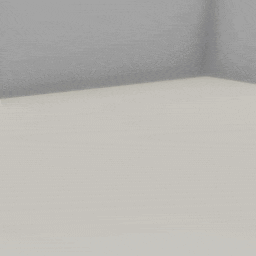
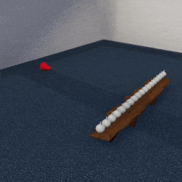
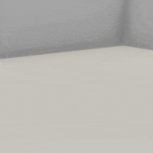

##### Physics (Obi)

# Wind

Obi can be used to simulate wind.

**In TDW's implementation of Obi, wind is an invisible fluid.** There is technically nothing the the wind simulation can do that you couldn't do with a custom fluid. The wind simulation merely provides good default values and better controls over a wind-like fluid.

## The `WindSource` data class

TDW's implementation of [fluids](fluids.md) assumes a relatively static simulation; once created, you can't easily change an emitter's position, size, etc. Wind, on the other hand, implies the need for more dynamic controls which means that wind fluid emitters need to be handled differently in the API.

A wind fluid emitter's parameters and state are contained in the [`WindSource`](../../python/obi_data/wind_source.md) data class.

To add a wind source to the scene, create an [`Obi` add-on](obi.md), create a wind source, and add it to `obi.wind_sources`, a dictionary:

```python
from tdw.add_ons.obi import Obi
from tdw.obi_data.wind_source import WindSource


wind_id = 0
obi = Obi()
wind_source = WindSource(wind_id=wind_id,
                         position={"x": -0.1, "y": 0, "z": 0.25},
                         rotation={"x": 0, "y": -90, "z": 0})
obi.wind_sources[wind_id] = wind_source
```

And then you can add `obi` to a controller as you normally would:

## Optional parameters

There are many optional parameters in the `WindSource` constructor. All of these parameters are the same as those used to define a [fluid](fluids.md), the main difference being that a `WindSource` exposes only some of the parameters. For example, any parameter related to rendering is hidden since we always want wind to be invisible. 

**For a full list of optional constructor parameters, read [the API documentation](../../python/obi_data/wind_source.md).**

## Dynamic wind API

The `WindSource` API assumes that you will want to gradually, rather than instantaneously, adjust parameter values. For example, `set_speed(speed, ds)` sets a *target* `speed`, where `ds` is a delta that will be added or subtracted to the current speed per `communicate()` call. To check whether the speed is still accelerating/decelerating, call `wind_soure.is_accelerating()`.

Each of these parameters are also found in the constructor. Setting the constructor parameters *will* immediately set initial values, while setting values afterwards, via functions, will set target values.

### Speed

In this example, a wind source will emit "wind" at a wall of blocks and a tethered [cloth sheet](cloth.md). After several gusts, we call `set_speed()` to start decelerating the wind.

Notice that chair, which has much more mass than the blocks, isn't pushed by the wind.

```python
from tdw.controller import Controller
from tdw.add_ons.obi import Obi
from tdw.add_ons.image_capture import ImageCapture
from tdw.add_ons.third_person_camera import ThirdPersonCamera
from tdw.obi_data.wind_source import WindSource
from tdw.obi_data.cloth.sheet_type import SheetType
from tdw.obi_data.cloth.tether_particle_group import TetherParticleGroup
from tdw.obi_data.cloth.tether_type import TetherType
from tdw.tdw_utils import TDWUtils
from tdw.backend.paths import EXAMPLE_CONTROLLER_OUTPUT_PATH


c = Controller()
commands = [TDWUtils.create_empty_room(12, 12)]
# Add some blocks.
y = 0
x = -1
cube_scale = {"x": 0.2, "y": 0.2, "z": 0.4}
while y < 1:
    z = 0
    while z < 1:
        commands.extend(Controller.get_add_physics_object(model_name="cube",
                                                          object_id=Controller.get_unique_id(),
                                                          position={"x": x, "y": y, "z": z},
                                                          library="models_flex.json",
                                                          default_physics_values=False,
                                                          scale_factor=cube_scale,
                                                          scale_mass=False,
                                                          mass=0.5))
        z += cube_scale["z"]
    y += cube_scale["y"]
commands.extend(Controller.get_add_physics_object(model_name="chair_billiani_doll",
                                                  object_id=Controller.get_unique_id(),
                                                  position={"x": -0.38, "y": 0, "z": -0.34},
                                                  library="models_core.json"))
c.communicate(commands)
wind_id = Controller.get_unique_id()
camera = ThirdPersonCamera(position={"x": 1.1, "y": 1.32, "z": -1.9},
                           look_at={"x": -2, "y": 0, "z": 0},
                           avatar_id="a")
path = EXAMPLE_CONTROLLER_OUTPUT_PATH.joinpath("wind")
print(f"Image will be saved to: {path}")
capture = ImageCapture(avatar_ids=["a"], path=path)
obi = Obi()
c.add_ons.extend([camera, capture, obi])
# Add a wind source.
wind_source = WindSource(wind_id=wind_id,
                         position={"x": -0.1, "y": 0, "z": 0.25},
                         rotation={"x": 0, "y": -90, "z": 0},
                         capacity=5000,
                         lifespan=2,
                         speed=30,
                         emitter_radius=1,
                         smoothing=0.75)
obi.wind_sources[wind_id] = wind_source
# Create a tethered cloth.
cloth_id = Controller.get_unique_id()
obi.create_cloth_sheet(cloth_material="canvas",
                       object_id=cloth_id,
                       position={"x": -4, "y": 1.6, "z": 0.2},
                       rotation={"x": -90, "y": 90, "z": 0},
                       sheet_type=SheetType.cloth,
                       tether_positions={TetherParticleGroup.north_edge: TetherType(object_id=cloth_id, is_static=True)})
c.communicate([])
for i in range(200):
    c.communicate([])
# Decrease the speed.
obi.wind_sources[wind_id].set_speed(speed=0.1, ds=0.1)
while obi.wind_sources[wind_id].is_accelerating():
    c.communicate([])
c.communicate({"$type": "terminate"})
```

Result:


### Gustiness

In the previous example, there are several "gusts" of wind. In this pseudo-wind simulation, gusts can be controlled by a combination of speed (sustained winds), particle capacity, and particle lifespan. To set the target capacity and lifespan, call `wind_source.set_gustiness(capacity, dc, lifespan, dl)`.  For more information on capacity and lifespan, read [the API documentation](../../python/obi_data/wind_source.md).

To check whether the gustiness is increasing/decreasing, call `is_gusting()` which returns a tuple: True if the capacity is changing, true if the lifespan is changing.

In this example, the wind source will first emit a sustained wind, and then gusts of wind:

```python
from tdw.controller import Controller
from tdw.add_ons.obi import Obi
from tdw.add_ons.image_capture import ImageCapture
from tdw.add_ons.third_person_camera import ThirdPersonCamera
from tdw.obi_data.wind_source import WindSource
from tdw.obi_data.cloth.sheet_type import SheetType
from tdw.obi_data.cloth.tether_particle_group import TetherParticleGroup
from tdw.obi_data.cloth.tether_type import TetherType
from tdw.tdw_utils import TDWUtils
from tdw.backend.paths import EXAMPLE_CONTROLLER_OUTPUT_PATH


c = Controller()
wind_id = Controller.get_unique_id()
camera = ThirdPersonCamera(position={"x": 1.1, "y": 1.32, "z": -1.9},
                           look_at={"x": -2, "y": 0, "z": 0},
                           avatar_id="a")
path = EXAMPLE_CONTROLLER_OUTPUT_PATH.joinpath("gust")
print(f"Image will be saved to: {path}")
capture = ImageCapture(avatar_ids=["a"], path=path)
obi = Obi()
c.add_ons.extend([camera, capture, obi])
# Add a wind source.
wind_source = WindSource(wind_id=wind_id,
                         position={"x": -0.1, "y": 0, "z": 0.25},
                         rotation={"x": 0, "y": -90, "z": 0},
                         capacity=15000,
                         lifespan=1,
                         speed=15,
                         emitter_radius=0.5,
                         smoothing=0.75,
                         visible=True)
obi.wind_sources[wind_id] = wind_source
cloth_id = Controller.get_unique_id()
obi.create_cloth_sheet(cloth_material="canvas",
                       object_id=cloth_id,
                       position={"x": -3, "y": 1.6, "z": 0.2},
                       rotation={"x": -90, "y": 90, "z": 0},
                       sheet_type=SheetType.cloth,
                       tether_positions={TetherParticleGroup.north_edge: TetherType(object_id=cloth_id, is_static=True)})

c.communicate(TDWUtils.create_empty_room(12, 12))
for i in range(300):
    c.communicate([])
# Switch to wind gusts.
obi.wind_sources[wind_id].set_gustiness(capacity=9000, dc=100, lifespan=2, dl=0.1)
gusting = True
while gusting:
    c.communicate([])
    dc, dl = obi.wind_sources[wind_id].is_gusting()
    gusting = dc and dl
# Wind gusts.
for i in range(400):
    c.communicate([])
c.communicate({"$type": "terminate"})
```

Result:



### Spread

The "spread" of the wind source is the extent to which it scatters from the emitter. To control the spread, call `wind_source.set_spread(spread, ds, resolution, dr)`. To check the whether the wind is spreading, call `wind_source.is_spreading()`, which returns two booleans (spread, resolution). For more information, read [the API documentation](../../python/obi_data/wind_source.md).

### Turbulence

To control the wind turbulence, call `wind_source.set_turbulence(vorticity, dv, random_velocity, dr)`. To check whether the wind turbulence is increasing or decreasing, call `wind_source.is_turbulating()`, which returns to booleans (turbulence, random velocity). For more information, read [the API documentation](../../python/obi_data/wind_source.md).

### Position

Set the target position and rotation by calling `wind_source.move_to(position, dp)`. 

To check whether the wind is moving, call `wind_source.is_moving()`, which returns a boolean. 

To get the current position of the wind source, call `wind_source.get_position()`.

In this example, a wind source is moved to knock over objects. There is also a cone at the position of the wind source. **Notice that the cone's ID is added to the `exclude` parameter in the `Obi` constructor.** This prevents the cone from receiving Obi colliders, which means that it won't interact with the wind fluid.

```python
import numpy as np
from tdw.controller import Controller
from tdw.tdw_utils import TDWUtils
from tdw.add_ons.third_person_camera import ThirdPersonCamera
from tdw.add_ons.obi import Obi
from tdw.add_ons.image_capture import ImageCapture
from tdw.obi_data.wind_source import WindSource
from tdw.backend.paths import EXAMPLE_CONTROLLER_OUTPUT_PATH


class MoveWind(Controller):
    def __init__(self, port: int = 1071, check_version: bool = True, launch_build: bool = True):
        super().__init__(port=port, check_version=check_version, launch_build=launch_build)
        self.cone_id: int = Controller.get_unique_id()
        self.wind_id: int = Controller.get_unique_id()
        self.obi = Obi()

    def trial(self, scene_name: str) -> None:
        # Add a camera and image capture.
        camera = ThirdPersonCamera(avatar_id="a",
                                   position={"x": 2.27, "y": 2.2, "z": 1.86},
                                   look_at={"x": 0, "y": 0.6, "z": 0})
        path = EXAMPLE_CONTROLLER_OUTPUT_PATH.joinpath("move_wind")
        print(f"Images will be saved to: {path}")
        capture = ImageCapture(avatar_ids=["a"],
                               path=path)
        # Add Obi. Don't add colliders to the cone.
        self.obi = Obi(exclude=[self.cone_id])
        self.add_ons.extend([camera, capture, self.obi])
        # Add a wind source.
        wind_x = 0
        wind_y = 0.75
        wind_z = -1.1
        wind_source = WindSource(wind_id=self.wind_id,
                                 position={"x": wind_x, "y": wind_y, "z": wind_z},
                                 rotation={"x": 0, "y": 0, "z": 0},
                                 emitter_radius=0.2,
                                 capacity=2000,
                                 lifespan=0.5,
                                 smoothing=1,
                                 speed=14)
        self.obi.wind_sources[self.wind_id] = wind_source
        # Create the scene.
        commands = [Controller.get_add_scene(scene_name=scene_name)]
        # Add a cone.
        commands.extend(Controller.get_add_physics_object(model_name="cone",
                                                          object_id=self.cone_id,
                                                          library="models_flex.json",
                                                          position={"x": wind_x, "y": wind_y, "z": wind_z - 0.3},
                                                          rotation={"x": 90, "y": 0, "z": 0},
                                                          kinematic=True,
                                                          scale_factor={"x": 0.2, "y": 0.3, "z": 0.2}))
        commands.append({"$type": "set_color",
                         "id": self.cone_id,
                         "color": {"r": 1, "g": 0, "b": 0, "a": 1}})
        # Add two tables.
        table_model_name = "live_edge_coffee_table"
        table_x0 = -1.231
        z = 0.645
        commands.extend(Controller.get_add_physics_object(model_name=table_model_name,
                                                          object_id=Controller.get_unique_id(),
                                                          position={"x": table_x0, "y": 0, "z": z},
                                                          library="models_core.json",
                                                          kinematic=True))
        # Get the dimensions of the tables.
        table_record = Controller.MODEL_LIBRARIANS["models_core.json"].get_record(table_model_name)
        table_extents = TDWUtils.get_bounds_extents(table_record.bounds)
        h = float(table_extents[1])
        w = float(table_extents[0])
        # Use the width to position the second table.
        table_x1 = table_x0 + w / 2
        commands.extend(Controller.get_add_physics_object(model_name=table_model_name,
                                                          object_id=Controller.get_unique_id(),
                                                          position={"x": table_x1, "y": 0, "z": z},
                                                          library="models_core.json",
                                                          kinematic=True))
        # Get the vase record.
        vase_model_name = "vase_02"
        vase_record = Controller.MODEL_LIBRARIANS["models_core.json"].get_record(vase_model_name)
        vase_extents = TDWUtils.get_bounds_extents(vase_record.bounds)
        vase_w = float(vase_extents[0])
        # Get x coordinates for the vases.
        vase_xs = np.arange(table_x0 - w / 2 + vase_w / 2, table_x1 + w / 2 - vase_w / 2, step=vase_w * 1.1)
        # Add the vases.
        for vase_x in vase_xs:
            commands.extend(Controller.get_add_physics_object(model_name=vase_model_name,
                                                              object_id=Controller.get_unique_id(),
                                                              position={"x": float(vase_x), "y": h, "z": z},
                                                              library="models_core.json"))
        self.communicate(commands)
        # Move the wind.
        for x in [-2.5, 2.5]:
            self.move_wind(position=np.array([x, wind_y, wind_z]))

    def move_wind(self, position: np.ndarray) -> None:
        wind: WindSource = self.obi.wind_sources[self.wind_id]
        wind.move_to(position=position, dp=0.025)
        self.communicate([])
        while wind.is_moving():
            # Move the cone and the wind.
            wind_position = wind.get_position()
            # Get the position of the cone. It's behind the wind source.
            cone_position = {"x": float(wind_position[0]),
                             "y": float(wind_position[1]),
                             "z": float(wind_position[2]) - 0.3}
            self.communicate([{"$type": "teleport_object",
                               "id": self.cone_id,
                               "position": cone_position}])


if __name__ == "__main__":
    c = MoveWind()
    c.trial(scene_name="box_room_2018")
    c.communicate({"$type": "terminate"})
```

Result:



### Rotation

Set the target position and rotation by calling `wind_source.rotate_by(angle, axis, da)`.

To check whether the wind is rotating, call `wind_source.is_rotating()`, which returns a boolean. 

To get the current angle and axis of the wind source, call `wind_source.get_rotation()`, which returns a tuple: angle (float), axis (string).

In this example, a wind source is rotated to knock over objects. There is also a cone at the position of the wind source. **Notice that the cone's ID is added to the `exclude` parameter in the `Obi` constructor.** This prevents the cone from receiving Obi colliders, which means that it won't interact with the wind fluid.

```python
import numpy as np
from tdw.controller import Controller
from tdw.tdw_utils import TDWUtils
from tdw.add_ons.third_person_camera import ThirdPersonCamera
from tdw.add_ons.obi import Obi
from tdw.add_ons.image_capture import ImageCapture
from tdw.obi_data.wind_source import WindSource
from tdw.backend.paths import EXAMPLE_CONTROLLER_OUTPUT_PATH


class RotateWind(Controller):
    def __init__(self, port: int = 1071, check_version: bool = True, launch_build: bool = True):
        super().__init__(port=port, check_version=check_version, launch_build=launch_build)
        self.cone_id: int = Controller.get_unique_id()
        self.wind_id: int = Controller.get_unique_id()
        self.obi = Obi()

    def trial(self, scene_name: str) -> None:
        # Add a camera and image capture.
        camera = ThirdPersonCamera(avatar_id="a",
                                   position={"x": 2.27, "y": 2.2, "z": 1.86},
                                   look_at={"x": 0, "y": 0.6, "z": 0})
        path = EXAMPLE_CONTROLLER_OUTPUT_PATH.joinpath("rotate_wind")
        print(f"Images will be saved to: {path}")
        capture = ImageCapture(avatar_ids=["a"],
                               path=path)
        # Add Obi. Don't add colliders to the cone.
        self.obi = Obi(exclude=[self.cone_id])
        self.add_ons.extend([camera, capture, self.obi])
        # Add a wind source.
        wind_x = 0
        wind_y = 0.75
        wind_z = -1.1
        wind_rotation = -60
        wind_source = WindSource(wind_id=self.wind_id,
                                 position={"x": wind_x, "y": wind_y, "z": wind_z},
                                 rotation={"x": 0, "y": wind_rotation, "z": 0},
                                 emitter_radius=0.2,
                                 capacity=2000,
                                 lifespan=0.5,
                                 smoothing=1,
                                 speed=14)
        self.obi.wind_sources[self.wind_id] = wind_source
        # Create the scene.
        commands = [Controller.get_add_scene(scene_name=scene_name)]
        # Add a cone. This will indicate wind direction.
        cone_euler_angles = {"x": 90, "y": wind_rotation, "z": 0}
        commands.extend(Controller.get_add_physics_object(model_name="cone",
                                                          object_id=self.cone_id,
                                                          library="models_flex.json",
                                                          position={"x": wind_x, "y": wind_y, "z": wind_z - 0.3},
                                                          rotation=cone_euler_angles,
                                                          kinematic=True,
                                                          scale_factor={"x": 0.2, "y": 0.3, "z": 0.2}))
        commands.append({"$type": "set_color",
                         "id": self.cone_id,
                         "color": {"r": 1, "g": 0, "b": 0, "a": 1}})
        # Add two tables.
        table_model_name = "live_edge_coffee_table"
        table_x0 = -1.231
        z = 0.645
        commands.extend(Controller.get_add_physics_object(model_name=table_model_name,
                                                          object_id=Controller.get_unique_id(),
                                                          position={"x": table_x0, "y": 0, "z": z},
                                                          library="models_core.json",
                                                          kinematic=True))
        # Get the dimensions of the tables.
        table_record = Controller.MODEL_LIBRARIANS["models_core.json"].get_record(table_model_name)
        table_extents = TDWUtils.get_bounds_extents(table_record.bounds)
        h = float(table_extents[1])
        w = float(table_extents[0])
        # Use the width to position the second table.
        table_x1 = table_x0 + w / 2
        commands.extend(Controller.get_add_physics_object(model_name=table_model_name,
                                                          object_id=Controller.get_unique_id(),
                                                          position={"x": table_x1, "y": 0, "z": z},
                                                          library="models_core.json",
                                                          kinematic=True))
        # Get the vase record.
        vase_model_name = "vase_02"
        vase_record = Controller.MODEL_LIBRARIANS["models_core.json"].get_record(vase_model_name)
        vase_extents = TDWUtils.get_bounds_extents(vase_record.bounds)
        vase_w = float(vase_extents[0])
        # Get x coordinates for the vases.
        vase_xs = np.arange(table_x0 - w / 2 + vase_w / 2, table_x1 + w / 2 - vase_w / 2, step=vase_w * 1.1)
        # Add the vases.
        for vase_x in vase_xs:
            commands.extend(Controller.get_add_physics_object(model_name=vase_model_name,
                                                              object_id=Controller.get_unique_id(),
                                                              position={"x": float(vase_x), "y": h, "z": z},
                                                              library="models_core.json"))
        self.communicate(commands)
        # Rotate the wind.
        for angle in [90, -10]:
            self.rotate_wind_by(angle=angle, initial_angle=wind_rotation)

    def rotate_wind_by(self, angle: float, initial_angle: float) -> None:
        wind: WindSource = self.obi.wind_sources[self.wind_id]
        # Start rotating by the angle.
        wind.rotate_by(angle=angle, da=0.2, axis="yaw")
        self.communicate([])
        while wind.is_rotating():
            # Rotate the cone to match the rotation of the wind. Continue until the wind emitter is done rotating.
            wind_angle, axis = wind.get_rotation()
            self.communicate([{"$type": "rotate_object_to_euler_angles",
                               "id": self.cone_id,
                               "euler_angles": {"x": 90, "y": wind_angle + initial_angle, "z": 0}}])


if __name__ == "__main__":
    c = RotateWind()
    c.trial(scene_name="box_room_2018")
    c.communicate({"$type": "terminate"})
```

Result: 


### Interrelation of wind parameters

Despite being divided into separate functions, the speed, gustiness parameters, spread parameters, and so on are all interrelated. These are just a few examples:

- Without a high speed the capacity and lifespan parameters won't do anything because the wind fluid particles will never reach the target objects. 
- A narrow spread will ensure that more particles collide with the objects, which will create a more sustained wind, albeit in a smaller volume.
- A narrow spread can affect turbulence. If there are many particles in a narrow emission then the turbulence values can become irrelevant.\

## Visibility

It can be useful for debugging to to make the wind visible by setting `visible=True` in the constructor:

```python
from tdw.controller import Controller
from tdw.add_ons.obi import Obi
from tdw.add_ons.image_capture import ImageCapture
from tdw.add_ons.third_person_camera import ThirdPersonCamera
from tdw.obi_data.wind_source import WindSource
from tdw.tdw_utils import TDWUtils
from tdw.backend.paths import EXAMPLE_CONTROLLER_OUTPUT_PATH


c = Controller()
wind_id = Controller.get_unique_id()
camera = ThirdPersonCamera(position={"x": 1.1, "y": 1.32, "z": -1.9},
                           look_at={"x": -2, "y": 0, "z": 0},
                           avatar_id="a")
path = EXAMPLE_CONTROLLER_OUTPUT_PATH.joinpath("visible_wind")
print(f"Image will be saved to: {path}")
capture = ImageCapture(avatar_ids=["a"], path=path)
obi = Obi()
c.add_ons.extend([camera, capture, obi])
# Add a wind source. Make it visible.
wind_source = WindSource(wind_id=wind_id,
                         position={"x": -0.1, "y": 0, "z": 0.25},
                         rotation={"x": 0, "y": -90, "z": 0},
                         emitter_radius=1,
                         capacity=5000,
                         speed=30,
                         lifespan=2,
                         smoothing=0.75,
                         visible=True)
obi.wind_sources[wind_id] = wind_source
c.communicate(TDWUtils.create_empty_room(12, 12))
for i in range(200):
    c.communicate([])
c.communicate({"$type": "terminate"})
```

Result:



## Output Data

The wind fluid is an Obi fluid. It behaves exactly the same as any other fluid and will appear in the [output data](obi_particles.md) as a fluid.

## Limitations

- **This is a fluid simulation.** Wind is often modeled using fluid dynamics but some this simulation can't emulate pressure and other aspects of gases.
- **This is a particle-based simulation.** There are many parameters, such as particle capacity and lifespan, that don't have any real-world analogue yet can significantly affect the simulation. There are likewise real-world parameters that are not easily translated into this simulation.
- **Obi fluids have performance issues.** Obi runs on the CPU, as opposed to the GPU. This wind simulation is suitable for small rooms and *not* for large outdoor spaces, where the required particle count would be too high.
- **Visible wind (for debugging) won't work correctly if there are other Obi objects (fluids, cloth, etc.) in the scene**. This is due to how Obi fluid rendering works.

## Low-level description

Wind sources are fluids and are added to a scene by calling [`create_obi_fluid`](../../api/command_api.md#create_obi_fluid).

Each adjustable parameter (capacity, lifespan, etc.) is internally stored as a [`LerpableFloat`](../../python/lerp/lerpable_float.md) data class; this class contains the current value, the target, and the delta. The wind source's position is stored as a [`LerpableVector`](../../python/lerp/lerpable_vector.md).

Per `communicate()` call, the lerpable values are updated and converted into commands:

| Parameter | Command |
| --- | --- |
| Capacity | [`set_obi_fluid_capacity`](../../api/command_api.md#set_obi_fluid_capacity) |
| Lifespan | [`set_obi_fluid_lifespan`](../../api/command_api.md#set_obi_fluid_lifespan) |
| Speed | [`set_obi_fluid_emission_speed`](../../api/command_api.md#set_obi_fluid_emission_speed) |
| Smoothing | [`set_obi_fluid_smoothing`](../../api/command_api.md#set_obi_fluid_smoothing) |
| Resolution | [`set_obi_fluid_resolution`](../../api/command_api.md#set_obi_fluid_resolution) |
| Vorticity | [`set_obi_fluid_vorticity`](../../api/command_api.md#set_obi_fluid_vorticity) |
| Random Velocity | [`set_obi_fluid_random_velocity`](../../api/command_api.md#set_obi_fluid_random_velocity) |
| Position | [`teleport_obi_actor`](../../api/command_api.md#teleport_obi_actor) |
| Rotation | [`rotate_obi_actor_by`](../../api/command_api.md#rotate_obi_actor_by) |


***

**Next: [Cloth](cloth.md)**

[Return to the README](../../../README.md)

***

Example controllers:

- [wind.py](https://github.com/threedworld-mit/tdw/blob/master/Python/example_controllers/obi/wind.py) Add a wind source to the scene and control its speed to knock over some block and push a tethered cloth.
- [gust.py](https://github.com/threedworld-mit/tdw/blob/master/Python/example_controllers/obi/gust.py) Control a wind source's gustiness.
- [move_wind.py](https://github.com/threedworld-mit/tdw/blob/master/Python/example_controllers/obi/move_wind.py) Move a wind source to knock over objects.
- [rotate_wind.py](https://github.com/threedworld-mit/tdw/blob/master/Python/example_controllers/obi/rotate_wind.py) Rotate a wind source to knock over objects.
- [visible_wind.py](https://github.com/threedworld-mit/tdw/blob/master/Python/example_controllers/obi/visible_wind.py) Add a wind source and make it visible.

Python API:

- [`Obi`](../../python/add_ons/obi.md)
- Fluid types:
- [`WindSource`](../../python/obi_data/wind_source.md)
- [`LerpableFloat`](../../python/lerp/lerpable_float.md)
- [`LerpableVector`](../../python/lerp/lerpable_vector.md)

Command API:

- [`create_obi_fluid`](../../api/command_api.md#create_obi_fluid)
- [`set_obi_fluid_capacity`](../../api/command_api.md#set_obi_fluid_capacity)
- [`set_obi_fluid_lifespan`](../../api/command_api.md#set_obi_fluid_lifespan)
- [`set_obi_fluid_emission_speed`](../../api/command_api.md#set_obi_fluid_emission_speed)
- [`set_obi_fluid_smoothing`](../../api/command_api.md#set_obi_fluid_smoothing)
- [`set_obi_fluid_resolution`](../../api/command_api.md#set_obi_fluid_resolution)
- [`set_obi_fluid_vorticity`](../../api/command_api.md#set_obi_fluid_vorticity)
- [`set_obi_fluid_random_velocity`](../../api/command_api.md#set_obi_fluid_random_velocity)
- [`teleport_obi_actor`](../../api/command_api.md#teleport_obi_actor)
- [`rotate_obi_actor_by`](../../api/command_api.md#rotate_obi_actor_by)