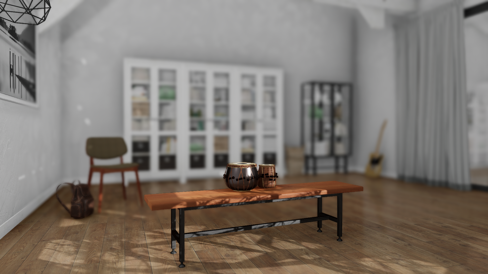
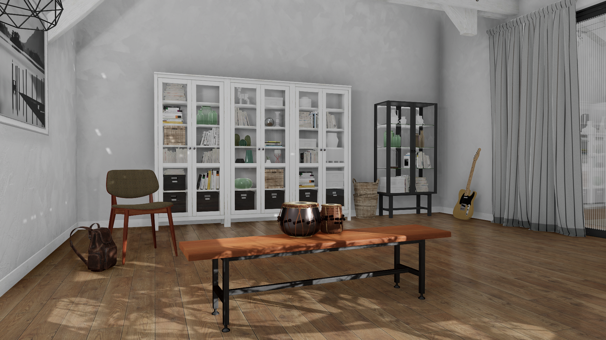

# Manipulating Depth of Field to Reduce Image "Blurriness"

Perceived "blurriness" in a rendered image, especially in the foreground of the image, is actually a camera effect that is typically due to the depth of field settings in TDW's post-processing.  We recognize that this may be an unwanted effect, therefore this document explains how the various components of depth of field work, and how to use TDW's API commands to change depth of field settings in order to modify or remove blurriness.

## What Is Depth of Field? 

Depth of field is basically a post-processing technique in Unity that simulates the way a real camera works; specifically, it models the way focus and aperture settings work in a physical camera lens.

In a typical photograph, there is a point in the scene, at some fixed distance from the camera, that is sharply in focus; the rest of the image is usually out of focus to some degree, increasing with distance from this "*point of principal focus*".   We normally think of this as the "foreground" of an image; the rest is "background". The degree to which the background is out of focus relative to the foreground can vary from quite subtle (almost unconsciously contributing to what makes a photograph so real)  to the extreme, when used for more artistic purposes. 

Depth of Field in TDW essentially serves the same purpose. It is enabled by default, as its use does contribute to making photo-realistic images appear more like photographs.  However in many cases the default values may not be ideal for a particular scene setup, and will require modification via API commands, as described below.  For the purposes of this discussion, there are three basic parameters in the Depth of Field effect that we will cover: Focal Length, Focus Distance and Aperture. Note that, when we draw analogies to a real camera in this document, we are simplifying slightly what is actually going on to better match how the Depth of Field effect works; for example, there is no discussion of the other parameter that comes into play with a real camera -- shutter speed.

**Note: Any discussion of changing Depth of Field settings assumes that post-processing in TDW is enabled (this is the default).  If it has been totally disabled via [`{"$type": "set_post_process", "value": False}`](../../api/command_api.md#set_post_process) it must be re-enabled in order for actual adjustments to be made.**

## Focal Length

Focal Length is basically the zoom factor of the simulated lens, in mm.  Larger numbers mean you are more zoomed in, i.e. it acts like a telephoto lens, and smaller numbers mean more zoomed out, i.e. like a wide-angle lens. Focal length is directly proportional to the camera's field of view; for example, a focal length of 24 gives a field of view of just over 53 degrees.

In TDW, the focal length of the Depth of Field effect is automatically adjusted to match the field of view of the avatar's camera(s), for example when applying the [`set_field_of_view`](../../api/command_api.md#set_field_of_view) command. Therefore this parameter of the Depth of Field effect can not be changed directly.

## Focus Distance

Focus Distance represents the distance from the camera to the point in the scene that should be most crisply in focus --- the "point of principal focus"; for example, 4 meters from the camera. 

The focus distance can be set via  [`set_focus_distance`](../../api/command_api.md#set_focus_distance)  command. You can also set the focus distance to be the distance from the sensor container to the object via the [`focus_on_object`](../../api/command_api.md#focus_on_object) command.

Note that we refer to this as a "point" of principal focus, but of course it can be a range, e.g. any point within a range from 3 meters away to 12 meters away.  The size of this range is a function of the third parameter -- Aperture.

## Aperture

In a real camera, the aperture is a mechanical iris that controls how much light enters the camera through the lens.  Traditionally, aperture settings (or "f-stops" as they are called) reflect the size of the iris opening, e.g.  f/1.4, f/2.8, f/5.6, f/8 f/16 etc. These aperture settings define the distance "into" the scene that will also be in focus. Smaller numbers mean a narrower range, while larger numbers mean a wider range.

The Aperture value can be set via the  [`set_aperture`](../../api/command_api.md#set_aperture) command. 

## Examples

The following images illustrate the effect of different settings for Focus Distance and Aperture:

**Figure A.** Focus Distance = 2.4, Aperture = 2.2, Focal Length = 31. Slight depth of field effect in background; bench is point of principal focus.

**Figure B.** Focus Distance = 2.4, Aperture = 0.7, Focal Length = 31. Increased depth of field effect in background; bench is point of principal focus.

**Figure C.** Focus Distance = 3.55, Aperture = 0.7, Focal Length = 31. The chair is now the point of principal focus. Note that both bench and cabinets are not in focus, but the white cabinet is less blurry than in B) because it is closer to the chair than the bench.

**Figure D.** Focus Distance = 3.55, Aperture =5.6, Focal Length = 31. The entire image is now in focus, as the aperture value is much larger now.

## Summary

- Adjusting the Focus Distance and Aperture settings can provide considerable creative control over the depth of field of your scenes.
- For a "big hammer" to remove any out-of-focus blurriness in your images, simply raise the Aperture setting to 5.6 or 8 for indoor scenes. Higher values like 16 or above may be required for exterior scenes, but recognize that this will effectively give you a crisp, in-focus image essentially to infinity.

***

**This is the last document in the "Photorealism" tutorial.**

[Return to the README](../../../README.md)

***

Command API:

- [`set_post_process`](../../api/command_api.md#set_post_process)
- [`set_field_of_view`](../../api/command_api.md#set_field_of_view)
- [`set_focus_distance`](../../api/command_api.md#set_focus_distance)
- [`focus_on_object`](../../api/command_api.md#focus_on_object)
- [`set_aperture`](../../api/command_api.md#set_aperture)
