##### Photorealism

# Interior lighting (the `InteriorSceneLighting` add-on)

[`InteriorSceneLighting`](../../python/add_ons/interior_scene_lighting.md) is an [add-on](../core_concepts/add_ons.md) that sets the [HDRI skybox](lighting.md) and [post-processing values](post_processing.md) for an interior scene such as `floorplan_1a` or `mm_craftroom_2b`.

A suitable scene is a scene that is interior and HDRI-compatible:

```python
from tdw.librarian import SceneLibrarian

lib = SceneLibrarian()
for record in lib.records:
    if record.hdri and record.location == "interior":
        print(record.name)
```

Add `InteriorSceneLighting` like you would with any other add-on:

```python
from tdw.controller import Controller
from tdw.add_ons.interior_scene_lighting import InteriorSceneLighting

c = Controller()
interior_scene_lighting = InteriorSceneLighting()
c.add_ons.append(interior_scene_lighting)
c.communicate(Controller.get_add_scene(scene_name="mm_craftroom_3b"))
c.communicate({"$type": "terminate"})
```

## Reset the scene

Call `interior_scene_lighting.reset()` whenever you [reset the scene](../scene_setup_high_level/reset_scene.md):

```python
from tdw.controller import Controller
from tdw.add_ons.interior_scene_lighting import InteriorSceneLighting

c = Controller()
interior_scene_lighting = InteriorSceneLighting()
c.add_ons.append(interior_scene_lighting)
for i in range(10):
    interior_scene_lighting.reset()
    c.communicate(Controller.get_add_scene(scene_name="mm_craftroom_3b"))
c.communicate({"$type": "terminate"})
```

## Select the skybox

By default, `InteriorSceneLighting` will set a random skybox when it is first created and whenever `reset()` is called. To get the name of the current skybox, see `interior_scene_lighting.hdri_skybox`:

```python
from tdw.controller import Controller
from tdw.add_ons.interior_scene_lighting import InteriorSceneLighting

c = Controller()
interior_scene_lighting = InteriorSceneLighting()
c.add_ons.append(interior_scene_lighting)
for i in range(10):
    interior_scene_lighting.reset()
    c.communicate(Controller.get_add_scene(scene_name="mm_craftroom_3b"))
    print(interior_scene_lighting.hdri_skybox)
c.communicate({"$type": "terminate"})
```

You can manually set the skybox in the constructor as well as in `reset()`. Note that `hdri_skybox` in the *constructor* will only set the HDRI skybox for the *first* scene; by default, `reset()` will still choose a random skybox:

```python
from tdw.controller import Controller
from tdw.add_ons.interior_scene_lighting import InteriorSceneLighting

c = Controller()
hdri_skybox = "bergen_4k"
interior_scene_lighting = InteriorSceneLighting(hdri_skybox=hdri_skybox)
c.add_ons.append(interior_scene_lighting)
for i in range(10):
    interior_scene_lighting.reset(hdri_skybox=hdri_skybox)
    c.communicate(Controller.get_add_scene(scene_name="mm_craftroom_3b"))
c.communicate({"$type": "terminate"})
```

**Many HDRI skyboxes are incompatible with `InteriorSceneLighting`.** There is a curated subset of skyboxes that are suitable for interior scenes, along with corresponding [post-exposure values](../../api/command_api.md#set_post_exposure). To get the names of the skybox, see `InteriorSceneLighting.SKYBOX_NAMES_AND_POST_EXPOSURE_VALUES`:

```python
from tdw.add_ons.interior_scene_lighting import InteriorSceneLighting

for hdri_skybox in InteriorSceneLighting.SKYBOX_NAMES_AND_POST_EXPOSURE_VALUES:
    print(hdri_skybox)
```

## Set the random number generator

By default, `InteriorSceneLighting` creates a new [numpy random number generator](https://numpy.org/doc/1.16/reference/generated/numpy.random.RandomState.html) in the constructor and per `reset()` call. You pass a random number generator as an `rng` parameter in the constructor and in `reset()`. You might want to do this if you want to use the same generator and random seed for procedural generation throughout the rest of the scene.

```python
import numpy as np
from tdw.controller import Controller
from tdw.add_ons.interior_scene_lighting import InteriorSceneLighting

c = Controller()
hdri_skybox = "bergen_4k"
random_seed = 0
rng = np.random.RandomState(random_seed)
interior_scene_lighting = InteriorSceneLighting(hdri_skybox=hdri_skybox, rng=rng)
c.add_ons.append(interior_scene_lighting)
for i in range(10):
    interior_scene_lighting.reset(hdri_skybox=hdri_skybox, rng=rng)
    c.communicate(Controller.get_add_scene(scene_name="mm_craftroom_3b"))
c.communicate({"$type": "terminate"})
```

## Optional parameters

You can optionally set the post-processing values in the constructor or in `reset()`. Note that you can't adjust post-exposure because that is set automatically.

```python
from tdw.add_ons.interior_scene_lighting import InteriorSceneLighting

interior_scene_lighting = InteriorSceneLighting(focus_distance=2.5,
                                                aperture=8,
                                                ambient_occlusion_intensity=0.125,
                                                ambient_occlusion_thickness_modifier=3.5,
                                                shadow_strength=1)
```

## Example controller and images

This controller loads a scene and populates it with objects [from a JSON file](https://github.com/threedworld-mit/tdw/blob/master/Python/example_controllers/photorealism/interior_scene.json). It then uses `InteriorSceneLighting` to create images of each HDRI skybox in the interior scene subset:

```python
from json import loads
from pathlib import Path
from platform import system
from tdw.controller import Controller
from tdw.add_ons.third_person_camera import ThirdPersonCamera
from tdw.add_ons.image_capture import ImageCapture
from tdw.add_ons.interior_scene_lighting import InteriorSceneLighting
from tdw.backend.paths import EXAMPLE_CONTROLLER_OUTPUT_PATH
from tdw.backend.platforms import SYSTEM_TO_S3


class InteriorScene(Controller):
    """
    Load an interior scene populated with objects. Render images of the scene using each interior lighting HDRI skybox.
    """

    def __init__(self, port: int = 1071, check_version: bool = True, launch_build: bool = True):
        super().__init__(port=port, check_version=check_version, launch_build=launch_build)
        self.communicate({"$type": "set_screen_size",
                          "width": 512,
                          "height": 512})
        # Load the commands used to initialize the objects in the scene.
        init_commands_text = Path("interior_scene.json").read_text()
        # Replace the URL platform infix.
        init_commands_text = init_commands_text.replace("/windows/", "/" + SYSTEM_TO_S3[system()] + "/")
        # Load the commands as a list of dictionaries.
        self.init_commands = loads(init_commands_text)
        # Set the camera. The position and rotation of the camera doesn't change between scenes.
        self.camera: ThirdPersonCamera = ThirdPersonCamera(avatar_id="a",
                                                           position={"x": -0.6771, "y": 1.5, "z": 2.0463},
                                                           rotation={"x": 0.0177, "y": 0.9814, "z": -0.1123, "w": 0.1545})
        # Enable image capture.
        self.path = EXAMPLE_CONTROLLER_OUTPUT_PATH.joinpath("interior_scene")
        print(f"Images will be saved to: {self.path}")
        self.capture: ImageCapture = ImageCapture(avatar_ids=["a"], path=self.path, pass_masks=["_img"])
        # Create the scene lighting add-on.
        self.interior_scene_lighting = InteriorSceneLighting()
        # Append the add-ons.
        self.add_ons.extend([self.interior_scene_lighting, self.camera, self.capture])
        # Get a list of HDRI skybox names.
        self.hdri_skybox_names = list(InteriorSceneLighting.SKYBOX_NAMES_AND_POST_EXPOSURE_VALUES.keys())

    def show_skybox(self, hdri_skybox_index: int) -> None:
        # Reset the add-ons.
        self.camera.initialized = False
        self.capture.initialized = False
        # Set the next HDRI skybox.
        self.interior_scene_lighting.reset(hdri_skybox=self.hdri_skybox_names[hdri_skybox_index])
        # Load the scene, populate with objects, add the camera, set the skybox and post-processing, and capture an image.
        self.communicate(self.init_commands)
        # Rename the image to the name of the skybox.
        src_filename = "a/img_" + str(self.capture.frame - 1).zfill(4) + ".jpg"
        dst_filename = "a/" + self.hdri_skybox_names[hdri_skybox_index] + ".jpg"
        self.path.joinpath(src_filename).replace(self.path.joinpath(dst_filename))

    def show_all_skyboxes(self) -> None:
        for i in range(len(self.hdri_skybox_names)):
            self.show_skybox(hdri_skybox_index=i)
        self.communicate({"$type": "terminate"})


if __name__ == "__main__":
    c = InteriorScene()
    c.show_all_skyboxes()
```

Result:

| HDRI Skybox                       | Image                                                        |
| --------------------------------- | ------------------------------------------------------------ |
| bergen_4k                         | 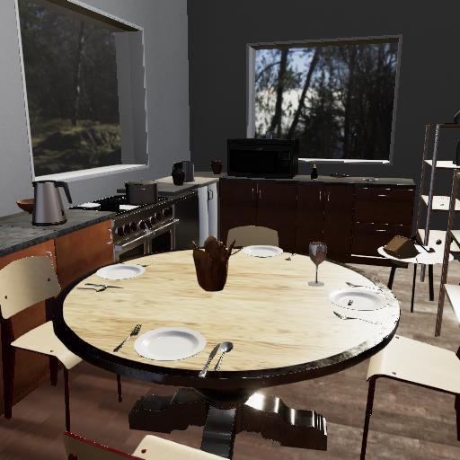            |
| fish_hoek_beach_4k                | 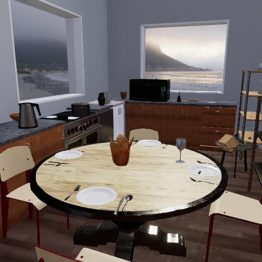   |
| furry_clouds_4k                   | 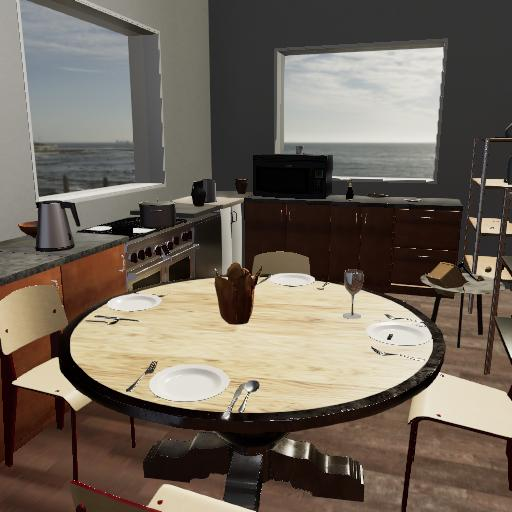      |
| industrial_sunset_4k              | 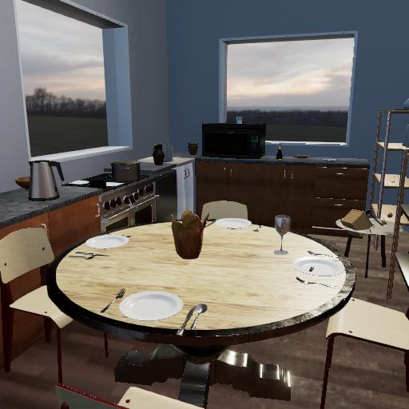 |
| kiara_1_dawn_4k                   | 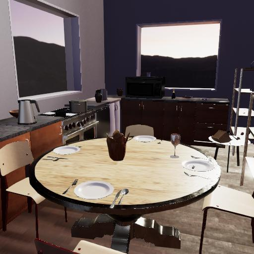      |
| kiara_8_sunset_4k                 | 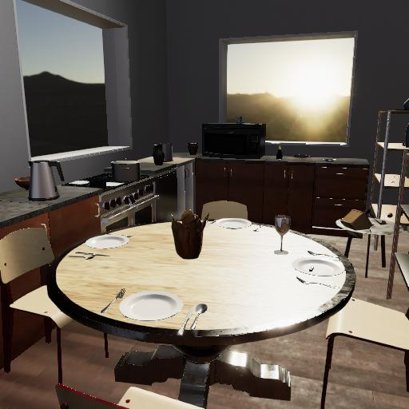    |
| konzerthaus_4k                    | 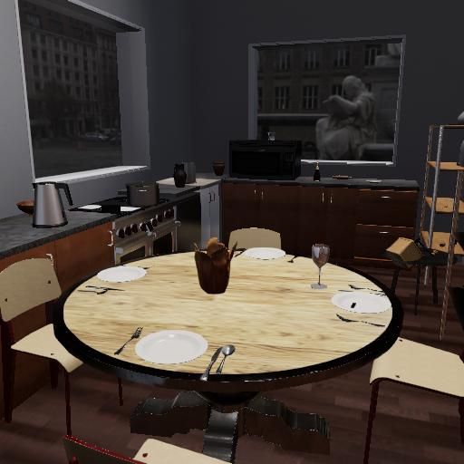       |
| lookout_4k                        | 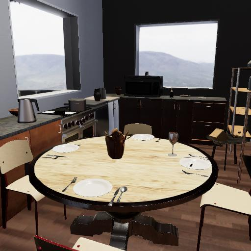           |
| mutianyu_4k                       | 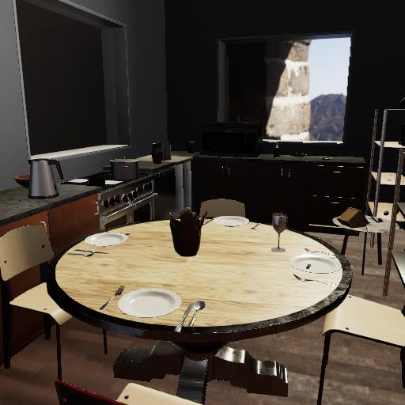          |
| ninomaru_teien_4k                 | 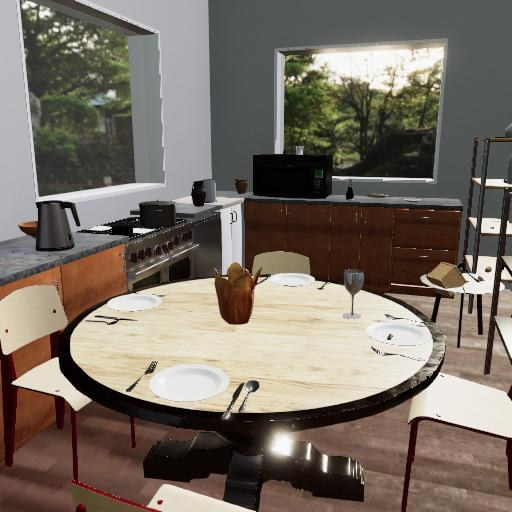    |
| noon_grass_4k                     | 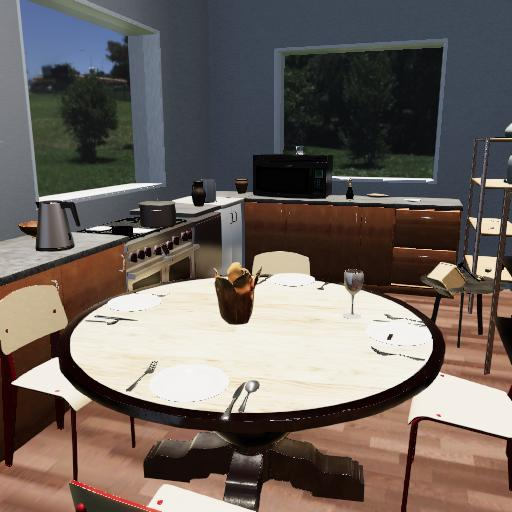        |
| old_apartments_walkway_4k         | 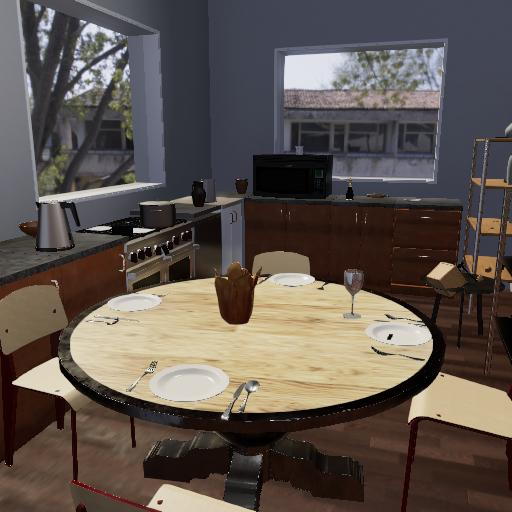 |
| pink_sunrise_4k                   | 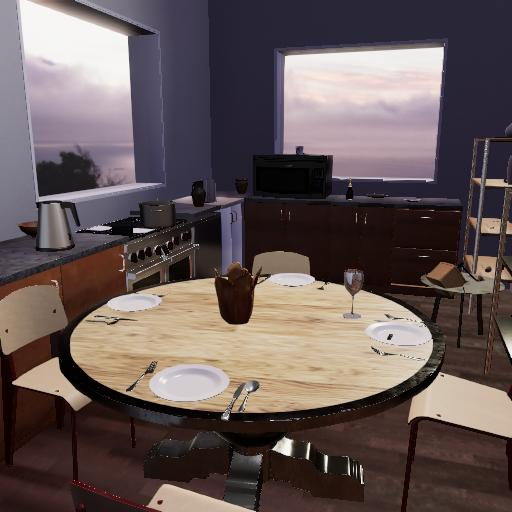      |
| qwantani_4k                       | 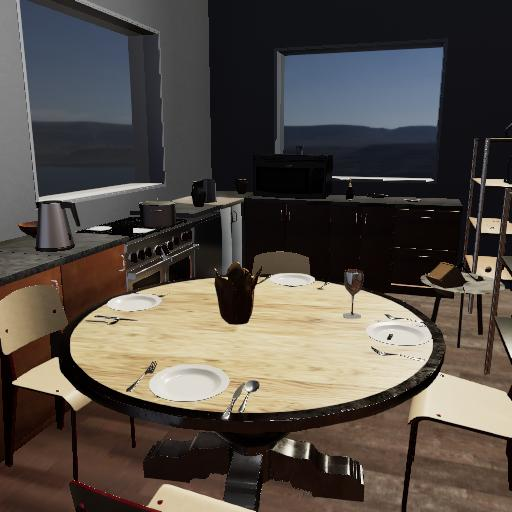          |
| rooftop_night_4k                  | 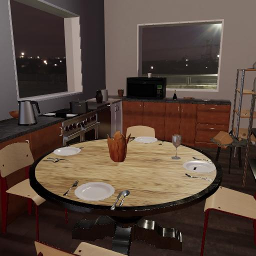     |
| satara_night_no_lamps_4k          | 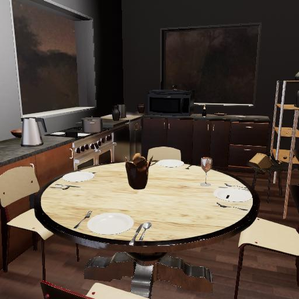 |
| simons_town_rocks_4k              | 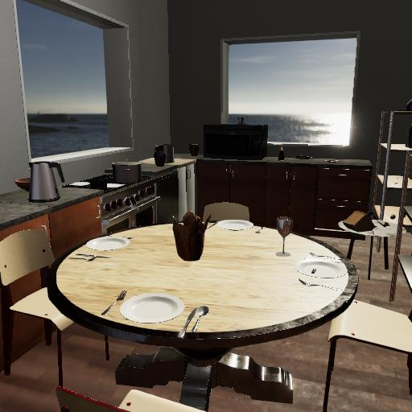 |
| sky_white                         | 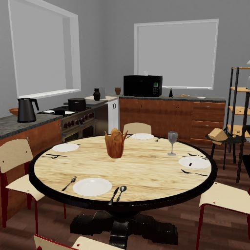            |
| snowy_forest_path_02_4k           | 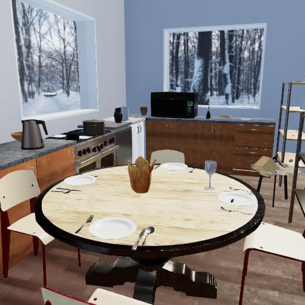 |
| spruit_dawn_4k                    | 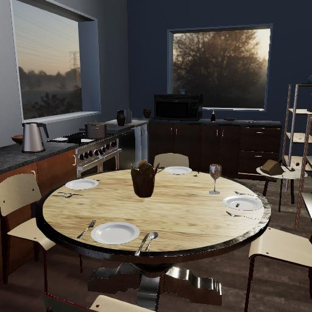       |
| sunset_fairway_4k                 | 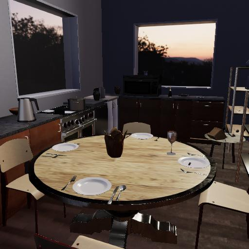    |
| sunset_in_the_chalk_quarry_4k     | 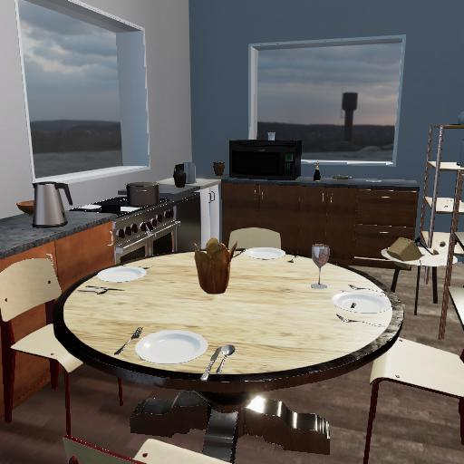 |
| table_mountain_1_4k               | 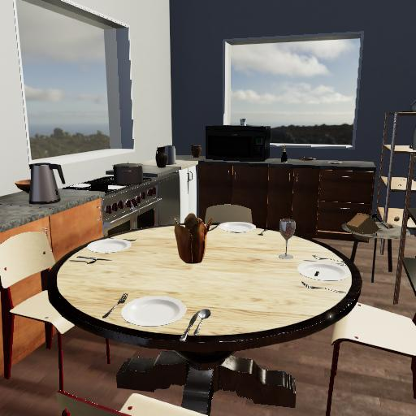  |
| venice_sunrise_4k                 | 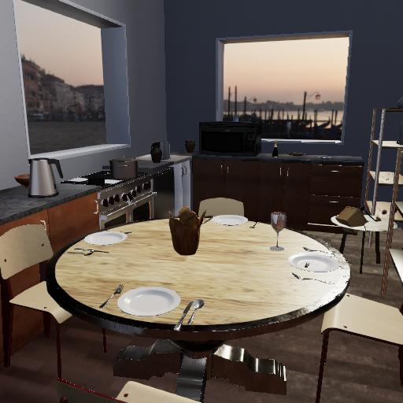    |
| venice_sunset_4k                  | 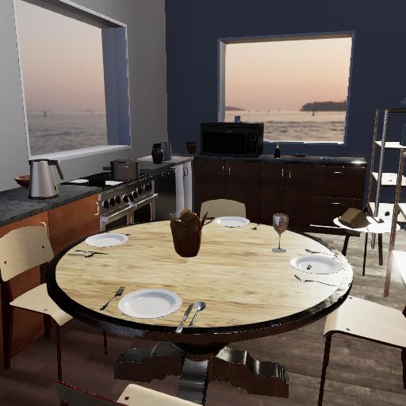     |
| vignaioli_night_4k                | 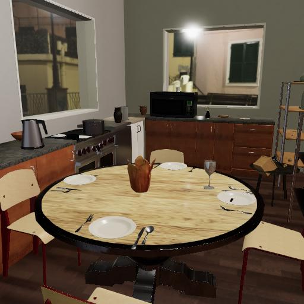   |
| whipple_creek_regional_park_01_4k | 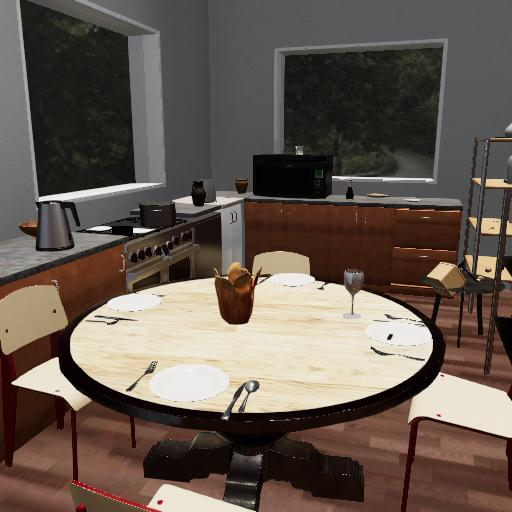 |

***

**Next: [Depth of field](depth_of_field.md)**

[Return to the README](../../../README.md)

***

Example controllers:

- [interior_scene.py](https://github.com/threedworld-mit/tdw/blob/master/Python/example_controllers/photorealism/interior_scene.py) Load an interior scene populated with objects. Render images of the scene using each interior lighting HDRI skybox.

Python API:

- [`InteriorSceneLighting`](../../python/add_ons/interior_scene_lighting.md)
- [`SceneLibrarian`](../../python/librarian/scene_librarian.md)

Command API:

- [`set_post_exposure`](../../api/command_api.md#set_post_exposure)
