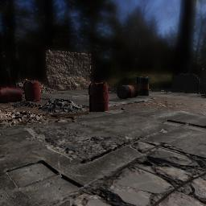
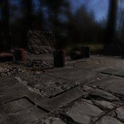

##### Photorealism

# Lighting (HDRI skyboxes)

Lighting in TDW scenes is typically controlled by setting the **HDRI skybox** of a scene.

An HDRI image is an image file that includes real-world lighting information. A skybox is an image that wraps around the background of a virtual scene to form a "sky". 

## HDRI skybox asset bundles

In TDW, HDRI skyboxes, like [models](../core_concepts/objects.md) and [visual materials](../objects_and_scenes/materials_textures_colors.md), are stored as **asset bundles**, typically on a remote server.

The metadata for each material is stored in an [`HDRISkyboxLibrarian`](../../python/librarian/hdri_skybox_librarian.md):

```python
from tdw.librarian import HDRISkyboxLibrarian

librarian = HDRISkyboxLibrarian()
record = librarian.records[0]
print(record.name)  # aft_lounge_4k
print(record.location)  # interior
```

There are other fields in an `HDRISkyboxRecord`;  these are mainly used internally to set the lighting parameters correctly.

## Add an HDRI skybox to a scene

This controller loads a [streamed scene](../core_concepts/scenes.md) and adds an HDRI skybox. Note that the controller uses a wrapper function, `get_add_hdri_skybox(skybox_name)`, to generate a valid command.

This:

```python
from tdw.controller import Controller
from tdw.add_ons.third_person_camera import ThirdPersonCamera

c = Controller()
camera = ThirdPersonCamera(avatar_id="a",
                           position={"x": -4.28, "y": 0.85, "z": 4.27},
                           look_at={"x": 0, "y": 0, "z": 0})
c.add_ons.append(camera)
c.communicate([{"$type": "set_screen_size",
                "width": 512,
                "height": 512},
               c.get_add_scene(scene_name="building_site"),
               c.get_add_hdri_skybox(skybox_name="bergen_4k")])
c.communicate({"$type": "terminate"})

```

...does the exact same thing as this:

```python
from tdw.controller import Controller
from tdw.add_ons.third_person_camera import ThirdPersonCamera

c = Controller()
camera = ThirdPersonCamera(avatar_id="a",
                           position={"x": -4.28, "y": 0.85, "z": 4.27},
                           look_at={"x": 0, "y": 0, "z": 0})
c.add_ons.append(camera)
c.communicate([{"$type": "set_screen_size",
                "width": 512,
                "height": 512},
               {"$type": "add_scene",
                "name": "building_site",
                "url": "https://tdw-public.s3.amazonaws.com/scenes/windows/2019.1/building_site"},
               {"$type": "add_hdri_skybox",
                "name": "bergen_4k",
                "url": "https://tdw-public.s3.amazonaws.com/hdri_skyboxes/windows/2019.1/bergen_4k",
                "exposure": 0.6,
                "initial_skybox_rotation": 210,
                "sun_elevation": 150,
                "sun_initial_angle": 185,
                "sun_intensity": 1}])
c.communicate({"$type": "terminate"})
```

This controller adds several different HDRI skyboxes to the same scene and outputs each image:

```python
from tdw.controller import Controller
from tdw.add_ons.third_person_camera import ThirdPersonCamera
from tdw.add_ons.image_capture import ImageCapture
from tdw.backend.paths import EXAMPLE_CONTROLLER_OUTPUT_PATH

c = Controller()
camera = ThirdPersonCamera(avatar_id="a",
                           position={"x": -4.28, "y": 0.85, "z": 4.27},
                           look_at={"x": 0, "y": 0, "z": 0})
path = EXAMPLE_CONTROLLER_OUTPUT_PATH.joinpath("hdri_skybox")
print(f"Image will be saved to: {path}")
capture = ImageCapture(avatar_ids=["a"], path=path)
c.add_ons.extend([camera, capture])
c.communicate([{"$type": "set_screen_size",
                "width": 512,
                "height": 512},
               c.get_add_scene(scene_name="building_site"),
               c.get_add_hdri_skybox(skybox_name="bergen_4k")])
for hdri_skybox in ["industrial_sunset_4k", "misty_pines_4k", "harties_4k"]:
    c.communicate(c.get_add_hdri_skybox(hdri_skybox))
c.communicate({"$type": "terminate"})
```

Result:

 

 

## Scenes that are enabled for HDRI skyboxes

Not all scenes in TDW are enabled for HDRI skyboxes. Typically, this is because either the scenes were added to TDW prior to HDRI skyboxes being added to the underlying Unity Engine, or because the lighting in the scene is already photorealistic.

To determine if a scene can support HDRI skyboxes, check `record.hdri`:

```python
from tdw.librarian import SceneLibrarian

librarian = SceneLibrarian()
for record in librarian.records:
    print(record.name, record.hdri)
```

## Rotate an HDRI skybox

To rotate an HDRI skybox, send [`rotate_hdri_skybox_by`](../../api/command_api.md#rotate_hdri_skybox_by). Rotating an HDRI skybox will change the direction of the light as well as the background image.

This controller loads a scene, adds an object, adds an HDRI skybox, adds a camera, and enables image capture. It then rotates the skybox per frame. Note that it also includes post-processing commands, which will be covered in the [next document](post_processing.md).

```python
from tdw.controller import Controller
from tdw.add_ons.third_person_camera import ThirdPersonCamera
from tdw.add_ons.image_capture import ImageCapture
from tdw.backend.paths import EXAMPLE_CONTROLLER_OUTPUT_PATH

c = Controller()
camera = ThirdPersonCamera(avatar_id="a",
                           position={"x": -4.28, "y": 0.85, "z": 4.27},
                           look_at={"x": 0, "y": 0, "z": 0})
path = EXAMPLE_CONTROLLER_OUTPUT_PATH.joinpath("rotate_hdri_skybox")
print(f"Image will be saved to: {path}")
capture = ImageCapture(avatar_ids=["a"], path=path)
c.add_ons.extend([camera, capture])

# Load the scene. Add an HDRI skybox. Add an object.
# Set post-processing.
# Set the shadow strength to maximum.
object_id = c.get_unique_id()
c.communicate([c.get_add_scene(scene_name="building_site"),
               c.get_add_hdri_skybox("bergen_4k"),
               c.get_add_object(model_name="alma_floor_lamp",
                                object_id=object_id,
                                rotation={"x": 0, "y": 90, "z": 0}),
               {"$type": "set_post_exposure",
                "post_exposure": 0.6},
               {"$type": "set_contrast",
                "contrast": -20},
               {"$type": "set_saturation",
                "saturation": 10},
               {"$type": "set_screen_space_reflections",
                "enabled": False},
               {"$type": "set_shadow_strength",
                "strength": 1.0}])
# Rotate the skybox.
for i in range(48):
    c.communicate([{"$type": "look_at",
                    "object_id": object_id,
                    "use_centroid": True},
                   {"$type": "rotate_hdri_skybox_by",
                    "angle": 15}])
c.communicate({"$type": "terminate"})
```

Result:


## Ambient light intensity

You can set the intensity of the scene's ambient light by sending [`set_ambient_intensity`](../../api/command_api.md#set_ambient_intensity). The default ambient light intensity varies between streamed scenes.

```python
from tdw.controller import Controller
from tdw.add_ons.third_person_camera import ThirdPersonCamera
from tdw.add_ons.image_capture import ImageCapture
from tdw.backend.paths import EXAMPLE_CONTROLLER_OUTPUT_PATH

c = Controller()
camera = ThirdPersonCamera(avatar_id="a",
                           position={"x": -4.28, "y": 0.85, "z": 4.27},
                           look_at={"x": 0, "y": 0, "z": 0})
path = EXAMPLE_CONTROLLER_OUTPUT_PATH.joinpath("ambient_intensity")
print(f"Image will be saved to: {path}")
capture = ImageCapture(avatar_ids=["a"], path=path)
c.add_ons.extend([camera, capture])
c.communicate([c.get_add_scene(scene_name="building_site"),
               c.get_add_hdri_skybox(skybox_name="bergen_4k")])
for intensity in [1, 0.2]:
    c.communicate({"$type": "set_ambient_intensity",
                   "intensity": intensity})
c.communicate({"$type": "terminate"})
```

Result:

| Intensity | Image                                           |
| --------- | ----------------------------------------------- |
| 0.76      |  |
| 1         |  |
| 0.2       |  |

## Shadow strength

You can set the intensity of the scene's ambient light by sending [`set_shadow_strength`](../../api/command_api.md#set_shadow_strength):

```python
from tdw.controller import Controller
from tdw.add_ons.third_person_camera import ThirdPersonCamera
from tdw.add_ons.image_capture import ImageCapture
from tdw.backend.paths import EXAMPLE_CONTROLLER_OUTPUT_PATH

c = Controller()
camera = ThirdPersonCamera(avatar_id="a",
                           position={"x": -4.28, "y": 0.85, "z": 4.27},
                           look_at={"x": 0, "y": 0, "z": 0})
path = EXAMPLE_CONTROLLER_OUTPUT_PATH.joinpath("shadow_strength")
print(f"Image will be saved to: {path}")
capture = ImageCapture(avatar_ids=["a"], path=path)
c.add_ons.extend([camera, capture])
c.communicate([c.get_add_scene(scene_name="building_site"),
               c.get_add_hdri_skybox(skybox_name="bergen_4k")])
for strength in [0.582, 1, 0.2]:
    c.communicate({"$type": "set_shadow_strength",
                   "strength": strength})
c.communicate({"$type": "terminate"})
```

Result:

| Strength | Image |
| -------- | ----- |
| 0.582    |        |
| 1        |       |
| 0.2      |       |

## Other lighting commands

It's possible to use other TDW commands to adjust a scene's lighting, both in scenes with and without HDRI skyboxes. **However, be aware that this usually won't result in photorealsitic images.** TDW's lighting has been carefully set up for photorealism; adjusting it can yield strange-looking images.

All scenes have at least one *directional light*, a light that has an angle but doesn't have a spatial point of origin. These commands adjust the directional light:

-  [`adjust_directional_light_intensity_by`](../../api/command_api.md#adjust_directional_light_intensity_by) 
-  [`reset_directional_light_rotation`](../../api/command_api.md#adjust_directional_light_intensity_by) 
-  [`rotate_directional_light_by`](../../api/command_api.md#rotate_directional_light_by) 
-  [`set_directional_light_color`](../../api/command_api.md#set_directional_light_color) 

Some scenes have *point lights*, which have a spatial point of origin. These commands adjust point lights:

-  [`adjust_point_lights_intensity_by`](../../api/command_api.md#adjust_point_lights_intensity_by) 

To get information about the lights in the scene, send [`send_lights`](../../api/command_api.md#send_lights) to receive [`Lights`](../../api/output_data.md#Lights) output data:

```python
from tdw.controller import Controller
from tdw.output_data import OutputData, Lights

"""
Load a streamed scene and received Lights output data.
"""

c = Controller()
resp = c.communicate([c.get_add_scene("tdw_room"),
                      {"$type": "send_lights"}])

for i in range(len(resp) - 1):
    r_id = OutputData.get_data_type_id(resp[i])
    if r_id == "ligh":
        lights = Lights(resp[i])
        print("Directional lights:")
        for j in range(lights.get_num_directional_lights()):
            intensity = lights.get_directional_light_intensity(j)
            color = lights.get_directional_light_color(j)
            rotation = lights.get_directional_light_rotation(j)
            print(j, intensity, color, rotation)
        print("Point lights:")
        for j in range(lights.get_num_point_lights()):
            intensity = lights.get_point_light_intensity(j)
            color = lights.get_point_light_color(j)
            position = lights.get_point_light_position(j)
            light_range = lights.get_point_light_range(j)
            print(j, intensity, color, position, light_range)
c.communicate({"$type": "terminate"})
```

Output:

```
Directional lights:
0 1.25 (255, 244, 214) (0.6830127239227295, 0.18301273882389069, -0.6830127239227295, 0.18301273882389069)
Point lights:
0 1.25 (255, 255, 255) (-0.18000000715255737, 2.7219998836517334, 0.029999999329447746) 10.0
```

***

**Next: [Post-processing](post_processing.md)**

[Return to the README](../../../README.md)

***

Example controllers:

- [ambient_intensity.py](https://github.com/threedworld-mit/tdw/blob/master/Python/example_controllers/photorealism/ambient_intensity.py) Show the difference between ambient light intensities.
- [hdri_skyboxes.py](https://github.com/threedworld-mit/tdw/blob/master/Python/example_controllers/photorealism/hdri_skyboxes.py) Add different HDRI skyboxes to the same scene.
- [lights_output_data.py](https://github.com/threedworld-mit/tdw/blob/master/Python/example_controllers/photorealism/lights_output_data.py) Load a streamed scene and received Lights output data.
- [rotate_hdri_skybox.py](https://github.com/threedworld-mit/tdw/blob/master/Python/example_controllers/photorealism/rotate_hdri_skybox.py) Add an HDRI skybox to the scene and rotate it.
- [shadow_strength.py](https://github.com/threedworld-mit/tdw/blob/master/Python/example_controllers/photorealism/v.py) Show the difference between shadow strengths.

Python API:

- [`Controller.get_add_hdri_skybox`](../../python/controller.md)
- [`HDRISkyboxLibrarian`](../../python/librarian/hdri_skybox_librarian.md)
- [`SceneLibrarian`](../../python/librarian/scene_librarian.md)

Command API:

- [`add_hdri_skybox`](../../api/command_api.md#add_hdri_skybox)
- [`rotate_hdri_skybox_by`](../../api/command_api.md#rotate_hdri_skybox_by)
- [`set_ambient_intensity`](../../api/command_api.md#set_ambient_intensity)
- [`set_shadow_strength`](../../api/command_api.md#set_shadow_strength)
-  [`adjust_directional_light_intensity_by`](../../api/command_api.md#adjust_directional_light_intensity_by) 
-  [`reset_directional_light_rotation`](../../api/command_api.md#adjust_directional_light_intensity_by) 
-  [`rotate_directional_light_by`](../../api/command_api.md#rotate_directional_light_by) 
-  [`set_directional_light_color`](../../api/command_api.md#set_directional_light_color) 
- [`adjust_point_lights_intensity_by`](../../api/command_api.md#adjust_point_lights_intensity_by)
- [`send_lights`](../../api/command_api.md#send_lights)

Output Data:

- [`Lights`](../../api/output_data.md#Lights)
