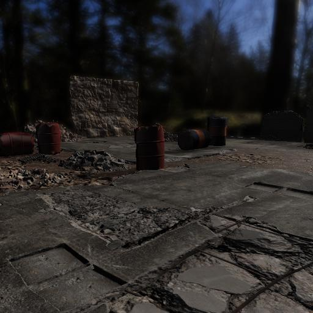
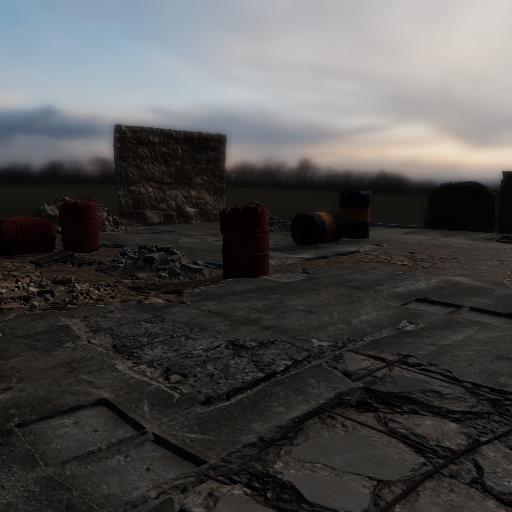
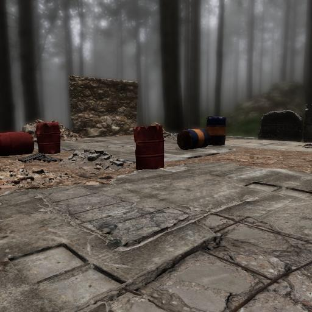
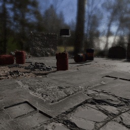
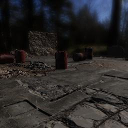
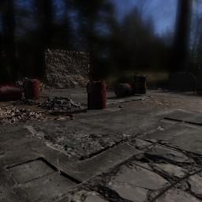
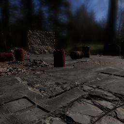

##### Photorealism

# Lighting (HDRI skyboxes)

There are two components to TDW's lighting model:

1. **Direct lighting:** a single light source representing the sun, used for dynamic lighting – the type of lighting that causes objects to cast shadows in a scene. 
2. **HDRI (High Dynamic Range Image) skyboxes** used for general environmental lighting. Using an HDRI skybox can *significantly* improve the photorealism of a scene.

Additionally, some scenes have **point light sources.**

This document is an overview of how lighting works in TDW. [A document later in this tutorial](interior_lighting.md) explains how  to use an add-on to achieve good-looking lighting in an interior scene using HDRI skyboxes and [post-processing](post_processing.md).

## Direct lighting

Every TDW scene has a single "sun" **directional light**. A directional light has an intensity and an angle, but doesn't have a spatial point of origin (i.e. it behaves as if it comes from infinitely far away).

Directional lights cast shadows from 3D objects in the scene onto other objects, or surfaces such as floors and walls. In interior scenes, depending on the light direction and scene geometry, it may also cast “pools” of light on objects and surfaces (e.g. by shining in to the room through a window). For example, the complex shadows and pool of light on the floor in the `photoreal.py` scene come from this type of lighting; 3D tree models outside the building are in fact casting these shadows through a transparent skylight in the roof of this building.

These commands adjust the directional light:

-  [`adjust_directional_light_intensity_by`](../../api/command_api.md#adjust_directional_light_intensity_by) 
-  [`reset_directional_light_rotation`](../../api/command_api.md#adjust_directional_light_intensity_by) 
-  [`rotate_directional_light_by`](../../api/command_api.md#rotate_directional_light_by) 
-  [`set_directional_light_color`](../../api/command_api.md#set_directional_light_color) 

**Be aware that adjusting scene lighting may negatively impact the quality of your final image.** TDW's lighting has been carefully set up for photorealism; adjusting it can yield strange-looking images. In particular, it is *highly* recommended that you only adjust the "sun" light rotation for interior scenes – doing so in exterior scenes will create implausible-looking images with incorrect shadows.

When rotating the directional “sun” light, keep these facts in mind:

- The “pitch” component of the rotation affects the elevation of the “sun” light (i.e. the apparent time-of-day), which in turn affects the *length* of shadows being cast.
- The “yaw” component of the rotation affects the *direction* of the shadows.

## HDRI Skyboxes

An HDRI image is an image file that includes real-world lighting information. A skybox is an image that wraps around the background of a virtual scene to form a "sky", much like a planetarium projection.

The choice of HDRI skybox can have a dramatic impact on the lighting of a scene, especially exterior scenes. This can include simulating the apparent time of day -- from sunrise, to noon, to sunset. Every HDRI skybox has associated metadata that positions the “sun” directional light at the correct elevation and angle to generate shadows that match the time of day and lighting conditions when the original image was captured. **For this reason, in any scene that uses an HDRI skybox we strongly recommend *not* altering the rotation of the “sun” directional light using the command API.**

To determine if a scene uses HDRI skyboxes, see [`record.hdri`](../../python/librarian/scene_librarian.md) in `SceneLibrarian`:

```python
from tdw.librarian import SceneLibrarian

librarian = SceneLibrarian()
for record in librarian.records:
    print(record.name, record.hdri)
```

### Set the HDRI skybox

Most streamed scenes in TDW include a default HDRI skybox, but the skybox can be changed programmatically. 

In TDW, HDRI skyboxes, like [models](../core_concepts/objects.md) and [visual materials](../scene_setup_low_level/materials_textures_colors.md), are stored as **asset bundles**, typically on a remote server.

The metadata for each material is stored in an [`HDRISkyboxLibrarian`](../../python/librarian/hdri_skybox_librarian.md):

```python
from tdw.librarian import HDRISkyboxLibrarian

librarian = HDRISkyboxLibrarian()
record = librarian.records[0]
print(record.name)  # aft_lounge_4k
print(record.location)  # interior
```

There are other fields in an `HDRISkyboxRecord`;  these are mainly used internally to set the lighting parameters correctly.

This will output the entire skybox library to a .csv file:

```python
from tdw.librarian import HDRISkyboxLibrarian

lib = HDRISkyboxLibrarian()
text = "name,location,sun_elevation,sun_initial_angle,sun_intensity,exposure,initial_skybox_rotation\n"
for record in lib.records:
    text += f"{record.name},{record.location},{record.sun_elevation},{record.sun_initial_angle},{record.sun_intensity},{record.exposure},{record.initial_skybox_rotation}\n"
text = text.strip()
with open("skyboxes.csv", "w") as f:
    f.write(text)
```

This controller loads a [streamed scene](../core_concepts/scenes.md) and adds an HDRI skybox. Note that the controller uses a wrapper function, `get_add_hdri_skybox(skybox_name)`, to generate a valid command.

This:

```python
from tdw.controller import Controller
from tdw.add_ons.third_person_camera import ThirdPersonCamera

c = Controller()
camera = ThirdPersonCamera(avatar_id="a",
                           position={"x": -4.28, "y": 0.85, "z": 4.27},
                           look_at={"x": 0, "y": 0, "z": 0})
c.add_ons.append(camera)
c.communicate([{"$type": "set_screen_size",
                "width": 512,
                "height": 512},
               c.get_add_scene(scene_name="building_site"),
               c.get_add_hdri_skybox(skybox_name="bergen_4k")])
c.communicate({"$type": "terminate"})

```

...does the exact same thing as this:

```python
from tdw.controller import Controller
from tdw.add_ons.third_person_camera import ThirdPersonCamera

c = Controller()
camera = ThirdPersonCamera(avatar_id="a",
                           position={"x": -4.28, "y": 0.85, "z": 4.27},
                           look_at={"x": 0, "y": 0, "z": 0})
c.add_ons.append(camera)
c.communicate([{"$type": "set_screen_size",
                "width": 512,
                "height": 512},
               {"$type": "add_scene",
                "name": "building_site",
                "url": "https://tdw-public.s3.amazonaws.com/scenes/windows/2019.1/building_site"},
               {"$type": "add_hdri_skybox",
                "name": "bergen_4k",
                "url": "https://tdw-public.s3.amazonaws.com/hdri_skyboxes/windows/2019.1/bergen_4k",
                "exposure": 0.6,
                "initial_skybox_rotation": 210,
                "sun_elevation": 150,
                "sun_initial_angle": 185,
                "sun_intensity": 1}])
c.communicate({"$type": "terminate"})
```

This controller adds several different HDRI skyboxes to the same scene and outputs each image:

```python
from tdw.controller import Controller
from tdw.add_ons.third_person_camera import ThirdPersonCamera
from tdw.add_ons.image_capture import ImageCapture
from tdw.backend.paths import EXAMPLE_CONTROLLER_OUTPUT_PATH

c = Controller()
camera = ThirdPersonCamera(avatar_id="a",
                           position={"x": -4.28, "y": 0.85, "z": 4.27},
                           look_at={"x": 0, "y": 0, "z": 0})
path = EXAMPLE_CONTROLLER_OUTPUT_PATH.joinpath("hdri_skybox")
print(f"Image will be saved to: {path}")
capture = ImageCapture(avatar_ids=["a"], path=path)
c.add_ons.extend([camera, capture])
c.communicate([{"$type": "set_screen_size",
                "width": 512,
                "height": 512},
               c.get_add_scene(scene_name="building_site"),
               c.get_add_hdri_skybox(skybox_name="bergen_4k")])
for hdri_skybox in ["industrial_sunset_4k", "misty_pines_4k", "harties_4k"]:
    c.communicate(c.get_add_hdri_skybox(hdri_skybox))
c.communicate({"$type": "terminate"})
```

Result:

 

 

### Rotate an HDRI skybox

To rotate an HDRI skybox, send [`rotate_hdri_skybox_by`](../../api/command_api.md#rotate_hdri_skybox_by). Rotating an HDRI skybox will change the direction of the light as well as the background image.

This controller loads a scene, adds an object, adds an HDRI skybox, adds a camera, and enables image capture. It then rotates the skybox per frame. Note that it also includes post-processing commands, which will be covered in the [next document](post_processing.md).

```python
from tdw.controller import Controller
from tdw.add_ons.third_person_camera import ThirdPersonCamera
from tdw.add_ons.image_capture import ImageCapture
from tdw.backend.paths import EXAMPLE_CONTROLLER_OUTPUT_PATH

c = Controller()
camera = ThirdPersonCamera(avatar_id="a",
                           position={"x": -4.28, "y": 0.85, "z": 4.27},
                           look_at={"x": 0, "y": 0, "z": 0})
path = EXAMPLE_CONTROLLER_OUTPUT_PATH.joinpath("rotate_hdri_skybox")
print(f"Image will be saved to: {path}")
capture = ImageCapture(avatar_ids=["a"], path=path)
c.add_ons.extend([camera, capture])

# Load the scene. Add an HDRI skybox. Add an object.
# Set post-processing.
# Set the shadow strength to maximum.
object_id = c.get_unique_id()
c.communicate([c.get_add_scene(scene_name="building_site"),
               c.get_add_hdri_skybox("bergen_4k"),
               c.get_add_object(model_name="alma_floor_lamp",
                                object_id=object_id,
                                rotation={"x": 0, "y": 90, "z": 0}),
               {"$type": "set_post_exposure",
                "post_exposure": 0.6},
               {"$type": "set_contrast",
                "contrast": -20},
               {"$type": "set_saturation",
                "saturation": 10},
               {"$type": "set_screen_space_reflections",
                "enabled": False},
               {"$type": "set_shadow_strength",
                "strength": 1.0}])
# Rotate the skybox.
for i in range(48):
    c.communicate([{"$type": "look_at",
                    "object_id": object_id,
                    "use_centroid": True},
                   {"$type": "rotate_hdri_skybox_by",
                    "angle": 15}])
c.communicate({"$type": "terminate"})
```

Result:



## Shadow strength

You can set the intensity of the scene's ambient light by sending [`set_shadow_strength`](../../api/command_api.md#set_shadow_strength):

```python
from tdw.controller import Controller
from tdw.add_ons.third_person_camera import ThirdPersonCamera
from tdw.add_ons.image_capture import ImageCapture
from tdw.backend.paths import EXAMPLE_CONTROLLER_OUTPUT_PATH

c = Controller()
camera = ThirdPersonCamera(avatar_id="a",
                           position={"x": -4.28, "y": 0.85, "z": 4.27},
                           look_at={"x": 0, "y": 0, "z": 0})
path = EXAMPLE_CONTROLLER_OUTPUT_PATH.joinpath("shadow_strength")
print(f"Image will be saved to: {path}")
capture = ImageCapture(avatar_ids=["a"], path=path)
c.add_ons.extend([camera, capture])
c.communicate([c.get_add_scene(scene_name="building_site"),
               c.get_add_hdri_skybox(skybox_name="bergen_4k")])
for strength in [0.582, 1, 0.2]:
    c.communicate({"$type": "set_shadow_strength",
                   "strength": strength})
c.communicate({"$type": "terminate"})
```

Result:

| Strength | Image |
| -------- | ----- |
| 0.582    |        |
| 1        |       |
| 0.2      |       |

## Point lights

Some scenes in TDW also contain *point lights*, which have a spatial point of origin. Additionally, lamp models that are composite objects incorporate a point light in the model that serves as a luminaire, so adding a model of this type to a scene will also add a point light.

To adjust the intensity of a scene's point lights, send [`adjust_point_lights_intensity_by`](../../api/command_api.md#adjust_point_lights_intensity_by) 

## `Lights` output data

To get information about the lights in the scene (including the scene's point lights), send [`send_lights`](../../api/command_api.md#send_lights) to receive [`Lights`](../../api/output_data.md#Lights) output data:

```python
from tdw.controller import Controller
from tdw.output_data import OutputData, Lights

"""
Load a streamed scene and received Lights output data.
"""

c = Controller()
resp = c.communicate([c.get_add_scene("tdw_room"),
                      {"$type": "send_lights"}])

for i in range(len(resp) - 1):
    r_id = OutputData.get_data_type_id(resp[i])
    if r_id == "ligh":
        lights = Lights(resp[i])
        print("Directional lights:")
        for j in range(lights.get_num_directional_lights()):
            intensity = lights.get_directional_light_intensity(j)
            color = lights.get_directional_light_color(j)
            rotation = lights.get_directional_light_rotation(j)
            print(j, intensity, color, rotation)
        print("Point lights:")
        for j in range(lights.get_num_point_lights()):
            intensity = lights.get_point_light_intensity(j)
            color = lights.get_point_light_color(j)
            position = lights.get_point_light_position(j)
            light_range = lights.get_point_light_range(j)
            print(j, intensity, color, position, light_range)
c.communicate({"$type": "terminate"})
```

Output:

```
Directional lights:
0 1.25 (255, 244, 214) (0.6830127239227295, 0.18301273882389069, -0.6830127239227295, 0.18301273882389069)
Point lights:
0 1.25 (255, 255, 255) (-0.18000000715255737, 2.7219998836517334, 0.029999999329447746) 10.0
```

***

**Next: [Post-processing](post_processing.md)**

[Return to the README](../../../README.md)

***

Example controllers:

- [hdri_skyboxes.py](https://github.com/threedworld-mit/tdw/blob/master/Python/example_controllers/photorealism/hdri_skyboxes.py) Add different HDRI skyboxes to the same scene.
- [lights_output_data.py](https://github.com/threedworld-mit/tdw/blob/master/Python/example_controllers/photorealism/lights_output_data.py) Load a streamed scene and received Lights output data.
- [rotate_hdri_skybox.py](https://github.com/threedworld-mit/tdw/blob/master/Python/example_controllers/photorealism/rotate_hdri_skybox.py) Add an HDRI skybox to the scene and rotate it.
- [shadow_strength.py](https://github.com/threedworld-mit/tdw/blob/master/Python/example_controllers/photorealism/shadow_strength.py) Show the difference between shadow strengths.

Python API:

- [`Controller.get_add_hdri_skybox`](../../python/controller.md)
- [`HDRISkyboxLibrarian`](../../python/librarian/hdri_skybox_librarian.md)
- [`SceneLibrarian`](../../python/librarian/scene_librarian.md)

Command API:

- [`add_hdri_skybox`](../../api/command_api.md#add_hdri_skybox)
- [`rotate_hdri_skybox_by`](../../api/command_api.md#rotate_hdri_skybox_by)
- [`set_shadow_strength`](../../api/command_api.md#set_shadow_strength)
- [`adjust_directional_light_intensity_by`](../../api/command_api.md#adjust_directional_light_intensity_by) 
- [`reset_directional_light_rotation`](../../api/command_api.md#adjust_directional_light_intensity_by) 
- [`rotate_directional_light_by`](../../api/command_api.md#rotate_directional_light_by) 
- [`set_directional_light_color`](../../api/command_api.md#set_directional_light_color) 
- [`adjust_point_lights_intensity_by`](../../api/command_api.md#adjust_point_lights_intensity_by)
- [`send_lights`](../../api/command_api.md#send_lights)

Output Data:

- [`Lights`](../../api/output_data.md#Lights)
