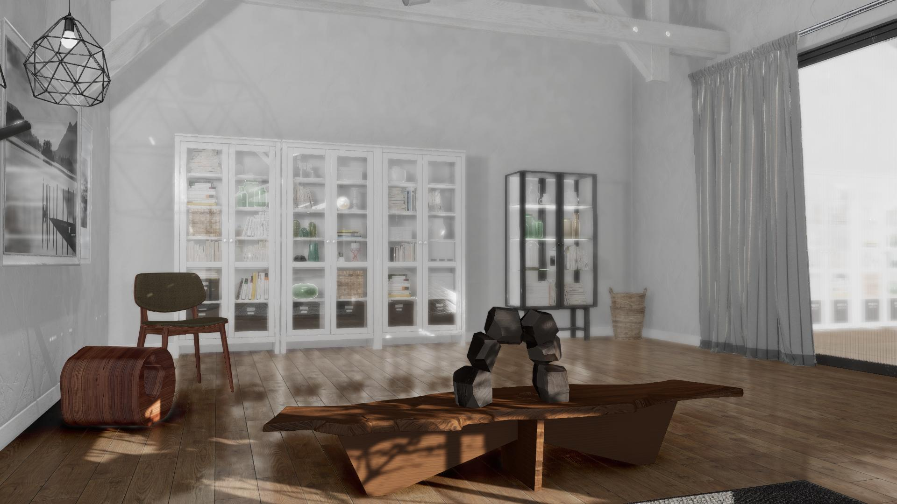

##### Photorealism

# Overview

TDW offers users the ability to generate near-photorealistic images at runtime.  We achieve this through the lighting and rendering approaches we use, and the high-quality 3D environment and object models from our library.

This tutorial will explain some of the best practices for rendering high-quality images in TDW.

Photorealism is best achieved via a combination of reasonable camera positions and angles, and plausible object selection and positions. If you haven't done so already, we strongly recommend you read the [camera controls tutorial](../camera/overview.md) and [Scene Setup tutorials](../scene_setup/overview.md).

## The `photoreal.py` example controller

[photoreal.py](https://github.com/threedworld-mit/tdw/blob/master/Python/example_controllers/photorealism/photoreal.py) is our best example of how to generate a maximum-quality image and TDW. It generates this image:

## High-level API: `tdw_image_dataset`

[`tdw_image_dataset`](https://github.com/alters-mit/tdw_image_dataset) is a high-level API for generating high-quality image datasets. It has been optimized for speed--it can generate 1.3M images at 256x256 pixels in approximately 8 hours--without sacrificing rendering quality.

***

**Next: [Lighting (HDRI skyboxes)](lighting.md)**

[Return to the README](../../../README.md)

***

High-level API:

- [`tdw_image_dataset`](https://github.com/alters-mit/tdw_image_dataset)

Example controllers:

- [photoreal.py](https://github.com/threedworld-mit/tdw/blob/master/Python/example_controllers/photorealism/photoreal.py)