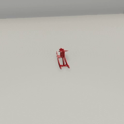

##### Physics (PhysX)

# `Collision` output data

In [PhysX](physx.md), collisions occur automatically whenever an object comes into contact with another object:

```python
from tdw.controller import Controller
from tdw.tdw_utils import TDWUtils
from tdw.add_ons.third_person_camera import ThirdPersonCamera

c = Controller()
camera = ThirdPersonCamera(position={"x": -3, "y": 2.1, "z": 0.5},
                           look_at={"x": 0, "y": 0, "z": 0})
c.add_ons.append(camera)
commands = [TDWUtils.create_empty_room(12, 12)]
commands.extend(c.get_add_physics_object(model_name="iron_box",
                                         object_id=c.get_unique_id(),
                                         position={"x": 0, "y": 3, "z": 0}))
commands.extend(c.get_add_physics_object(model_name="rh10",
                                         object_id=c.get_unique_id(),
                                         position={"x": 0, "y": 0, "z": 0}))
c.communicate(commands)
for i in range(200):
    c.communicate([])
c.communicate({"$type": "terminate"})

```

Result:



A **collision** is a discrete event at points of contact between a pair of objects. Collisions can occur between two non-kinematic objects as well as a kinematic object and a non-kinematic object.

There are three types of collision events:

- Enter (the collision began on this frame)
- Stay (the collision has persisted on this frame)
- Exit (the collision has ended on this frame)

To listen for collisions in TDW, send [`send_collisions`](../../api/command_api.md#send_collisions):

```python
from tdw.controller import Controller
from tdw.tdw_utils import TDWUtils

c = Controller()

commands = [TDWUtils.create_empty_room(12, 12)]
dropped_object_id = c.get_unique_id()
ground_object_id = c.get_unique_id()
# Add two objects.
commands.extend(c.get_add_physics_object(model_name="iron_box",
                                         object_id=dropped_object_id,
                                         position={"x": 0, "y": 3, "z": 0}))
commands.extend(c.get_add_physics_object(model_name="rh10",
                                         object_id=ground_object_id,
                                         position={"x": 0, "y": 0, "z": 0}))
# Request collisions data.
commands.append({"$type": "send_collisions",
                 "enter": True, 
                 "stay": False,
                 "exit": False, 
                 "collision_types": ["obj"]})
c.communicate(commands)
```

`send_collision` is structured differently than output data commands you've seen so far, such as [`send_rigidbodies`](../../api/command_api.md#send_rigidbodies):

- There isn't an optional `"ids"` parameter to request collision data for certain objects; you can request data for all of them or none.
- There isn't an optional `"frequency"` parameter; collision data is sent whenever a collision event occurs and *only* when a collision event occurs.

Note that we've set `"stay"` to `False`; collision stay events are *very* frequent. Setting this to `True` can *significantly* slow down your simulation.

Having sent `send_collisions`, we'll receive collision output data. Unlike most output data such as [`Rigidbodies`](../../api/output_data.md#Rigidbodies), every collision is returned as a *separate* [`Collision`](../../api/output_data.md#Collision) object:

```python
from tdw.controller import Controller
from tdw.tdw_utils import TDWUtils
from tdw.output_data import OutputData, Collision

c = Controller()

commands = [TDWUtils.create_empty_room(12, 12)]
dropped_object_id = c.get_unique_id()
ground_object_id = c.get_unique_id()
# Add two objects.
commands.extend(c.get_add_physics_object(model_name="iron_box",
                                         object_id=dropped_object_id,
                                         position={"x": 0, "y": 3, "z": 0}))
commands.extend(c.get_add_physics_object(model_name="rh10",
                                         object_id=ground_object_id,
                                         position={"x": 0, "y": 0, "z": 0}))
# Request collisions data.
commands.append({"$type": "send_collisions",
                 "enter": True,
                 "stay": False,
                 "exit": False,
                 "collision_types": ["obj"]})
resp = c.communicate(commands)

for i in range(100):
    for j in range(len(resp) - 1):
        r_id = OutputData.get_data_type_id(resp[j])
        if r_id == "coll":
            collision = Collision(resp[j])
            print(i, collision.get_collider_id(), collision.get_collidee_id(), collision.get_state(),
                  collision.get_relative_velocity())
            for k in range(collision.get_num_contacts()):
                print("\t", collision.get_contact_normal(k), collision.get_contact_point(k))
    resp = c.communicate([])
c.communicate({"$type": "terminate"})
```

- Collider ID and collidee ID are the objects IDs of the two colliding objects. The build will only send unique collision events--you'll never receive a second `Collision` object on the same frame with the collider and collidee reversed.
- State is the event type ("enter", "stay", or "exit")
- Relative velocity is the relative velocity between the two colliding objects
- Contact points are specific points of contact during a collision. The normal defines the vector of the collision and the point is the position of the contact. 

## `EnvironmentCollision` output data

In TDW (but not in PhysX), there is a distinction between background meshes with colliders (the scene) and dynamic objects.

Meshes in scenes aren't cached like objects; they don't have IDs, they don't return object data, and so on. Accordingly, the build can't write `Collision` data if an object collides with a scene mesh.

To deal with this, there is a separate [`EnvironmentCollision`](../../api/output_data.md#EnvironmentCollision) output data type for collisions between the object and the environment. To request this data, send `send_collisions` but add `"env"` to the list of `"collision_types"`:

```python
from tdw.controller import Controller
from tdw.tdw_utils import TDWUtils
from tdw.output_data import OutputData, Collision, EnvironmentCollision

c = Controller()

commands = [TDWUtils.create_empty_room(12, 12)]
dropped_object_id = c.get_unique_id()
ground_object_id = c.get_unique_id()
# Add two objects.
commands.extend(c.get_add_physics_object(model_name="iron_box",
                                         object_id=dropped_object_id,
                                         position={"x": 0, "y": 3, "z": 0}))
commands.extend(c.get_add_physics_object(model_name="rh10",
                                         object_id=ground_object_id,
                                         position={"x": 0, "y": 0, "z": 0}))
# Request collisions data.
commands.append({"$type": "send_collisions",
                 "enter": True,
                 "stay": False,
                 "exit": False,
                 "collision_types": ["obj", "env"]})
resp = c.communicate(commands)

for i in range(100):
    for j in range(len(resp) - 1):
        r_id = OutputData.get_data_type_id(resp[j])
        if r_id == "coll":
            collision = Collision(resp[j])
            print(i, collision.get_collider_id(), collision.get_collidee_id(), collision.get_state(),
                  collision.get_relative_velocity())
            for k in range(collision.get_num_contacts()):
                print("\t", collision.get_contact_normal(k), collision.get_contact_point(k))
        elif r_id == "enco":
            environment_collision = EnvironmentCollision(resp[j])
            print(i, environment_collision.get_object_id(), environment_collision.get_state(),
                  environment_collision.get_floor())
            for k in range(environment_collision.get_num_contacts()):
                print("\t", environment_collision.get_contact_normal(k), environment_collision.get_contact_point(k))
    resp = c.communicate([])
c.communicate({"$type": "terminate"})
```

- State and contact point data is the same as in `Collision` output data.
- Floor is True if the object collided with the floor or surface of the scene.
- `EnvironmentCollision` doesn't include relative velocity.

## The `CollisionManager` add-on

TDW includes a convenient [`CollisionManager` add-on](../../python/add_ons/collision_manager.md) for handling collision data. The `CollisionManager` will automatically send `send_collisions` when it is initialized.

- While the output data returns velocities, contact normals, and so on as (x, y, z) tuples, this data is converted to numpy arrays by the `CollisionManager`.
- `CollisionManager.obj_collisions` is a dictionary where each key is an [`IntPair`](../../python/int_pair.md) of object IDs.
- `CollisionManager.env_collisions` is a dictionary where each key is an object ID.

The following example does the same thing as the previous example but uses a `CollisionManager`:

```python
from tdw.controller import Controller
from tdw.tdw_utils import TDWUtils
from tdw.add_ons.collision_manager import CollisionManager

c = Controller()

# Add a collision manager
collision_manager = CollisionManager(enter=True, stay=False, exit=False, objects=True, environment=True)
c.add_ons.append(collision_manager)

commands = [TDWUtils.create_empty_room(12, 12)]
dropped_object_id = c.get_unique_id()
ground_object_id = c.get_unique_id()
# Add two objects.
commands.extend(c.get_add_physics_object(model_name="iron_box",
                                         object_id=dropped_object_id,
                                         position={"x": 0, "y": 3, "z": 0}))
commands.extend(c.get_add_physics_object(model_name="rh10",
                                         object_id=ground_object_id,
                                         position={"x": 0, "y": 0, "z": 0}))
c.communicate(commands)
for i in range(100):
    for object_ids in collision_manager.obj_collisions:
        print(i, object_ids.int1, object_ids.int2, collision_manager.obj_collisions[object_ids].state,
              collision_manager.obj_collisions[object_ids].relative_velocity)
        for normal, point in zip(collision_manager.obj_collisions[object_ids].normals, 
                                 collision_manager.obj_collisions[object_ids].points):
            print("\t", normal, point)
    for object_id in collision_manager.env_collisions:
        print(i, object_id, collision_manager.env_collisions[object_id].state,
              collision_manager.env_collisions[object_id].floor)
        for normal, point in zip(collision_manager.env_collisions[object_id].normals, 
                                 collision_manager.env_collisions[object_id].points):
            print("\t", normal, point)
    resp = c.communicate([])
c.communicate({"$type": "terminate"})
```

## Resetting a scene

When you want to [reset a scene](../scene_setup_high_level/reset_scene.md), be aware that you'll need to re-send `send_collisions` again.

If you're using a `CollisionManager`, set `collision_mananger.initialized = False` , which will make the manager re-initialize on the next frame.

***

**Next: [Apply forces to objects](forces.md)**

[Return to the README](../../../README.md)

***

Example controllers:

- [collisions.py](https://github.com/threedworld-mit/tdw/blob/master/Python/example_controllers/physx/collisions.py) Listen for collisions with a `CollisionManager`.

Python API:

- [`CollisionManager`](../../python/add_ons/collision_manager.md)
- [`IntPair`](../../python/int_pair.md)

Command API:

- [`send_collisions`](../../api/command_api.md#send_collisions)

Output Data API:

- [`Collision`](../../api/output_data.md#Collision)
- [`EnvironmentCollision`](../../api/output_data.md#EnvironmentCollision)
- [`Rigidbodies`](../../api/output_data.md#Rigidbodies)
