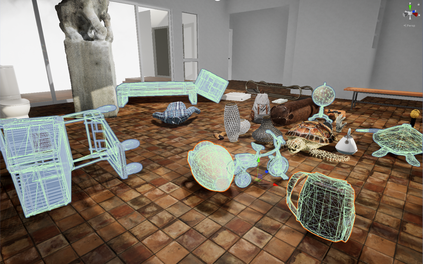

##### Physics (PhysX)

# PhysX - Overview

[PhysX](https://docs.unity3d.com/2020.1/Documentation/Manual/PhysicsOverview.html) is the Unity Engine's built-in physics engine. Because it is the default option, most controllers in TDW use PhysX.

## Core concepts of PhysX

In PhysX, objects can optionally be physics-enabled. In a video game, if you want to add a UI effect like a blinking arrow pointing to a location, you don't actually want the arrow to interact with the game's physics state.

In TDW, all [objects](../core_concepts/objects.md) *are* physics-enabled, meaning that they have [Rigidbodies](https://docs.unity3d.com/Manual/class-Rigidbody.html). The rigidbody has mass, velocity, momentum, friction, and so on.

Objects also have [colliders](https://docs.unity3d.com/Manual/CollidersOverview.html). These are invisible 3D meshes defining the physical shape of the object. All objects in TDW have colliders:

When an object moves or collides with another object, the physics engine automatically updates its state.

## Common mistakes when using PhysX

- It is possible to add multiple objects to TDW such that their bodies intersect each other. This is technically possible in PhysX but *not* recommended! The objects will have very glitchy and unpredictable behavior.
- Objects in TDW initially have a mass of 1 kg and default friction values, meaning that you might apply a force to an object and it will respond in unexpected ways. The reason for this and how to set reasonable physics parameters [will be covered in the next page of this tutorial](physics_objects.md).
- You should adjust the state of an object using non-physics commands such as [`teleport_object`](../../api/command_api.md#teleport_object) only when an object is first created. After that, you should only use commands such as [`apply_force_to_object`](../../api/command_api.md#apply_force_to_object). If you don't, PhysX will interpret the command as a *very* fast motion. And because the motion is technically being handled outside of the physics state, it can result in glitchy behavior.

## Limitations

- PhysX has been optimized for video games and is therefore built to interpolate between physics states--the objective is to yield a *reasonable* result and keep the game running at a steady framerate. As such, it's optimized for *precision*. Most notably, PhysX is not a deterministic physics engine.
- The collider meshes usually don't *exactly* match the render meshes of an object. This is because collider meshes must be convex, and therefore many objects are composed of multiple convex *collider hull* sub-meshes. The collider meshes in TDW actually match the render meshes very accurately for a Unity Engine simulation! But it's still possible that there will be some noticeable occasional discrepancies; most commonly, objects will sometimes seem to float slightly above the floor.
- PhysX can only simulate rigidbody physics. It can't simulate soft body deformation, cloth, or fluids.
- PhysX is closed source and it's therefore impossible to make low-level adjustments or optimizations to the physics engine.

***

**Next: [Object physics parameters](physics_objects.md)**

[Return to the README](../../../README.md)

***

Command API:

- [`teleport_object`](../../api/command_api.md#teleport_object)
- [`apply_force_to_object`](../../api/command_api.md#apply_force_to_object)
