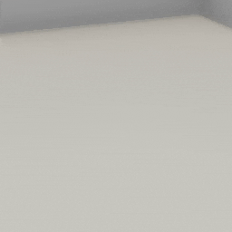

##### Physics (PhysX)

# Skip physics frames

[As mentioned in the overview page of this tutorial](overview.md), the build advances the physics state by 1 frame every time `Controller.communicate()` is called.

Sometimes, though, you might want to "skip" physics frames between `communicate()` calls. You can do this with the [`step_physics`](../../api/command_api.md) command or the [`StepPhysics`](../../python/add_ons/step_physics.md) add-on (which just sends `step_physics` on every frame).

`step_physics` doesn't *truly* skip physics frames; the frames *do* occur between `communicate()` calls:

| Call                                                     | Number of physics frames |
| -------------------------------------------------------- | ------------------------ |
| `c.communicate([TDWUtils.create_empty_room(12, 12)])`    | 1                        |
| `c.communicate([])`                                      | 1                        |
| `c.communicate({"$type": "step_physics", "frames": 1})`  | 2                        |
| `c.communicate({"$type": "step_physics", "frames": 10})` | 11                       |

The main reason to skip physics frames is for speed improvements--preparing and sending output data is slow.

In this example, an object is dropped twice. The first time, no physics frames are skipped. The second time, `{"$type": "step_physics", "frames": 10}` is sent every frame (via a `StepPhysics` add-on):

```python
from time import time
from tdw.controller import Controller
from tdw.tdw_utils import TDWUtils
from tdw.add_ons.object_manager import ObjectManager
from tdw.add_ons.third_person_camera import ThirdPersonCamera
from tdw.add_ons.step_physics import StepPhysics


class StepPhysicsSpeed(Controller):
    """
    Compare the speed of a simulation without skipping physics frames vs. skipping physics frames.
    """

    def __init__(self, port: int = 1071, check_version: bool = True, launch_build: bool = True):
        super().__init__(port=port, check_version=check_version, launch_build=launch_build)
        # Add a camera and an object manager.
        self.object_manager: ObjectManager = ObjectManager(transforms=False, rigidbodies=True)
        camera = ThirdPersonCamera(position={"x": 3, "y": 2.5, "z": -1},
                                   look_at={"x": 0, "y": 0, "z": 0})
        self.add_ons.extend([self.object_manager, camera])
        self.communicate(TDWUtils.create_empty_room(12, 12))

    def trial(self) -> float:
        """
        Wait for an object to fall.

        :return: The elapsed time.
        """

        object_id = self.get_unique_id()
        # Reset the object manager.
        self.object_manager.initialized = False
        # Add the object.
        self.communicate(self.get_add_physics_object(model_name="iron_box",
                                                     object_id=object_id,
                                                     position={"x": 0, "y": 30, "z": 0}))
        t0 = time()
        # Wait for the object to fall.
        while not self.object_manager.rigidbodies[object_id].sleeping:
            self.communicate([])
        t1 = time() - t0
        # Destroy the object.
        self.communicate({"$type": "destroy_object",
                          "id": object_id})
        return t1

    def run(self) -> None:
        t_no_skip = self.trial()
        # Add a StepPhysics add-on.
        self.add_ons.append(StepPhysics(num_frames=10))
        t_skip_frames = self.trial()
        print(t_no_skip, t_skip_frames)
        self.communicate({"$type": "terminate"})


if __name__ == "__main__":
    c = StepPhysicsSpeed()
    c.run()
```

Result:

```
2.8298497200012207 0.3419990539550781
```



The motion in both trials are the same, but in the second one physics steps are skipped such that it is much faster and some rendered frames (notably, during the bounces) are missing.

## Collisions and skipped frames

[Collision data](collisions.md) *is* returned for any skipped frames (assuming you've already sent `send_collisions`). For example, if you call `resp = c.communicate({"$type": "step_physics", "frames": 10})`, the simulation will advance 11 frames; if there are are collision events on frames 1, 2, 5, and 9, `resp` will contain each of those collision events.

***

**Next: [Disable physics](disable_physics.md)**

[Return to the README](../../../README.md)

***

Example controllers:

- [step_physics_speed.py](https://github.com/threedworld-mit/tdw/blob/master/Python/example_controllers/physx/ball_bounce.py) Compare the speed of a simulation without skipping physics frames vs. skipping physics frames.

Python API

- [`StepPhysics`](../../python/add_ons/step_physics.md)

Command API:

- [`step_physics`](../../api/command_api.md)