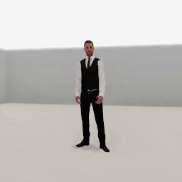
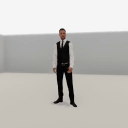
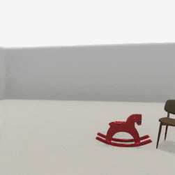

##### Replicants

# Animations

It is possible to tell the Replicant to move according to a prerecorded animation by calling  [`replicant.animate(animation)`](../../python/add_ons/replicant.md):

```python
from tdw.controller import Controller
from tdw.tdw_utils import TDWUtils
from tdw.add_ons.third_person_camera import ThirdPersonCamera
from tdw.add_ons.image_capture import ImageCapture
from tdw.add_ons.replicant import Replicant
from tdw.replicant.action_status import ActionStatus
from tdw.backend.paths import EXAMPLE_CONTROLLER_OUTPUT_PATH

c = Controller()
replicant = Replicant()
camera = ThirdPersonCamera(position={"x": -0.5, "y": 1.175, "z": 3},
                           look_at={"x": 0, "y": 1, "z": 0},
                           avatar_id="a")
path = EXAMPLE_CONTROLLER_OUTPUT_PATH.joinpath("replicant_animate")
print(f"Images will be saved to: {path}")
capture = ImageCapture(avatar_ids=["a"], path=path)
c.add_ons.extend([replicant, camera, capture])
c.communicate(TDWUtils.create_empty_room(12, 12))
# Play an animation.
replicant.animate(animation="kitchen_refrigerator_f")
while replicant.action.status == ActionStatus.ongoing:
    c.communicate([])
c.communicate([])
c.communicate({"$type": "terminate"})
```

Result:



## Animation asset bundles and metadata records

Like the [Replicant itself](overview.md), the Replicant's animations are stored as asset bundles that need to be downloaded and loaded into memory. Animation metadata is stored in the [`HumanoidAnimationLibrarian`](../../python/librarian/humanoid_animation_librarian.md):

```python
from tdw.librarian import HumanoidAnimationLibrarian

lib = HumanoidAnimationLibrarian()
for record in lib.records:
    print(record.name)
```

To fetch a specific record:

```python
from tdw.librarian import HumanoidAnimationLibrarian

lib = HumanoidAnimationLibrarian()
record = lib.get_record("walking_1")
print(record.name, record.framerate, record.get_num_frames(), record.loop)
```

Output:

```
walking_1 30 69 True
```

There are additional animations extracted from [SMPL](https://smpl.is.tue.mpg.de) in a separate librarian that can be used by Replicants:

```python
from tdw.librarian import HumanoidAnimationLibrarian

lib = HumanoidAnimationLibrarian("smpl_animations.json")
for record in lib.records:
    print(record.name)
```

To use `smpl_animations.json` or other animation libraries, set the `library` parameter:

```python
from tdw.controller import Controller
from tdw.tdw_utils import TDWUtils
from tdw.add_ons.third_person_camera import ThirdPersonCamera
from tdw.add_ons.image_capture import ImageCapture
from tdw.add_ons.replicant import Replicant
from tdw.replicant.action_status import ActionStatus
from tdw.backend.paths import EXAMPLE_CONTROLLER_OUTPUT_PATH

c = Controller()
replicant = Replicant()
camera = ThirdPersonCamera(position={"x": -0.5, "y": 1.175, "z": 3},
                           look_at={"x": 0, "y": 1, "z": 0},
                           avatar_id="a")
path = EXAMPLE_CONTROLLER_OUTPUT_PATH.joinpath("replicant_idle_to_crouch")
print(f"Images will be saved to: {path}")
capture = ImageCapture(avatar_ids=["a"], path=path)
c.add_ons.extend([replicant, camera, capture])
c.communicate(TDWUtils.create_empty_room(12, 12))
# Play an animation. Note that we've set the library parameter.
replicant.animate(animation="idle_to_crouch",
                  library="smpl_animations.json")
while replicant.action.status == ActionStatus.ongoing:
    c.communicate([])
c.communicate([])
c.communicate({"$type": "terminate"})
```

Result:



## Why there is a brief pause at the start of the animation

Each animation is stored as a [humanoid animation asset bundle](../non_physics_humanoids/overview.md). The first time you call `animate(animation)`, the animation needs to be downloaded and loaded into memory, hence the delay at the start of the action. Like all asset bundles, this is a one-time requirement. If you call the same `animate(animation)` again, it will be begin immediately.

## Physics and collision detection

*For more information regarding collision detection, [read this.](collision_detection.md)*

The `animate(animation)` action is responsive to physics in the scene. If the Replicant bumps into an object while moving, the object will move (assuming that the object is non-kinematic and that the Replicant's collision detection isn't actively avoiding objects).

The `animate(animation)` action succeeds if the animation reaches its end. The action fails if the Replicant collides with an object during the animation, in which case `replicant.action.status` will be `ActionStatus.collision`.

- If you try to play the same animation twice in a row but the first animation ends with `ActionStatus.collision`, the second animation will immediately end in `ActionStatus.collision`. This won't happen if the animations are different. To prevent this, set `replicant.collision_detection.previous_was_same = False`
- To ignore a specific object, add its ID to `replicant.collision_detection.exclude_objects` (a list of integers).
- To ignore all objects, set `replicant.collision_detection.objects = False`.

This example controller demonstrates how physics and collision detection settings can affect an animation:

 ```python
 from tdw.controller import Controller
 from tdw.tdw_utils import TDWUtils
 from tdw.add_ons.third_person_camera import ThirdPersonCamera
 from tdw.add_ons.image_capture import ImageCapture
 from tdw.add_ons.replicant import Replicant
 from tdw.replicant.action_status import ActionStatus
 from tdw.backend.paths import EXAMPLE_CONTROLLER_OUTPUT_PATH
 
 
 class AnimateCollisionDetection(Controller):
     """
     A minimal demo of how collision detection parameters affect animations.
     """
 
     def __init__(self, port: int = 1071, check_version: bool = True, launch_build: bool = True):
         super().__init__(port=port, check_version=check_version, launch_build=launch_build)
         self.replicant = Replicant(position={"x": -2, "y": 0, "z": 0},
                                    rotation={"x": 0, "y": 90, "z": 0})
         self.camera = ThirdPersonCamera(position={"x": -0.5, "y": 1.175, "z": 3},
                                         look_at={"x": 0, "y": 1, "z": 0},
                                         avatar_id="a")
         path = EXAMPLE_CONTROLLER_OUTPUT_PATH.joinpath("replicant_animate_collision_detection")
         print(f"Images will be saved to: {path}")
         self.capture = ImageCapture(avatar_ids=["a"], path=path)
         self.add_ons.extend([self.replicant, self.camera, self.capture])
         self.object_id_0 = Controller.get_unique_id()
         self.object_id_1 = Controller.get_unique_id()
 
     def initialize_scene(self):
         self.communicate([TDWUtils.create_empty_room(12, 12),
                           Controller.get_add_object(model_name="rh10",
                                                     object_id=self.object_id_0,
                                                     position={"x": -0.6, "y": 0, "z": 0.01}),
                           Controller.get_add_object(model_name="chair_billiani_doll",
                                                     object_id=self.object_id_1,
                                                     position={"x": -1.5, "y": 0, "z": 0},
                                                     rotation={"x": 0, "y": 30, "z": 0})])
         self.camera.look_at(target=self.replicant.replicant_id)
 
     def animate(self):
         self.replicant.animate(animation="wading_through_water")
         while self.replicant.action.status == ActionStatus.ongoing:
             self.communicate([])
         self.communicate([])
         print(self.replicant.action.status)
 
 
 if __name__ == "__main__":
     c = AnimateCollisionDetection()
     c.initialize_scene()
     print("Trying to animate with default collision detection:")
     c.animate()
     print("Trying to ignore the rh10 model:")
     c.replicant.collision_detection.exclude_objects.append(c.object_id_0)
     c.animate()
     print("Trying to ignore the previous animation:")
     c.replicant.collision_detection.previous_was_same = False
     c.animate()
     print("Trying to ignore all objects:")
     c.replicant.collision_detection.objects = False
     c.animate()
     c.communicate({"$type": "terminate"})
 ```

Result:



Output:

```
Trying to animate with default collision detection:
ActionStatus.collision
Trying to ignore the rh10 model:
ActionStatus.collision
Trying to ignore the previous animation:
ActionStatus.collision
Trying to ignore all objects:
ActionStatus.success
```

## Animations and non-physics humanoids

Animation asset bundles are actually the same as those used by [non-physics humanoids](../non_physics_humanoids/overview.md). The same animation can be applied both to a non-physics humanoid and to a Replicant and, under the hood, the commands used are exactly the same. The only difference is that the Replicant add-on is structured to treat the animation as an action, automatically downloading and playing the animation while continuously checking for collisions.

## Low-level description

`replicant.animate(animation)` sets `replicant.action` to an [`Animate`](../../python/replicant/actions/animate.md) action. 

In addition to [the usual `Action` initialization commands](actions.md), `Animate` sends [`add_humanoid_animation`](../../api/command_api.md#add_humanoid_animation) and [`play_replicant_animation`](../../api/command_api.md#play_replicant_animation).

The action continues until there is a collision or until `replicant.dynamic.output_action_status == ActionStatus.success` (meaning that the build has signaled that the animation ended).

In addition to [the usual `Action` end commands](actions.md), `Animate` sends [`stop_humanoid_animation`](../../api/command_api.md#stop_humanoid_animation).

***

**Next: [Arm articulation](arm_articulation.md)**

[Return to the README](../../../README.md)

***

Example controllers:

- [animate.py](https://github.com/threedworld-mit/tdw/blob/master/Python/example_controllers/replicant/animate.py) Minimal example of how to play an animation.
- [animate_collision_detection.py](https://github.com/threedworld-mit/tdw/blob/master/Python/example_controllers/replicant/animate_collision_detection.py) A minimal demo of how collision detection parameters affect animations.

Command API:

- [`add_humanoid_animation`](../../api/command_api.md#add_humanoid_animation)
- [`play_replicant_animation`](../../api/command_api.md#play_replicant_animation)
- [`stop_humanoid_animation`](../../api/command_api.md#stop_humanoid_animation)

Python API:

- [`Replicant`](../../python/add_ons/replicant.md)
- [`CollisionDetection`](../../python/replicant/collision_detection.md)
- [`HumanoidAnimationLibrarian`](../../python/librarian/humanoid_animation_librarian.md)
- [`Animate`](../../python/replicant/actions/animate.md)