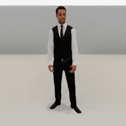
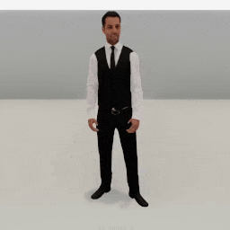
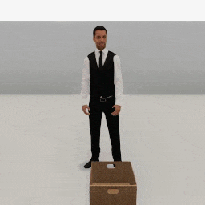
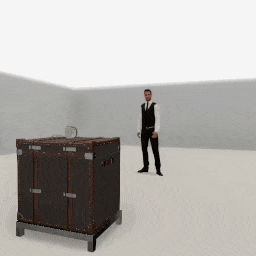
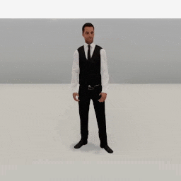
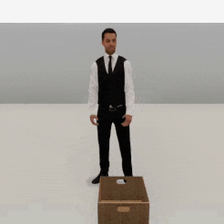
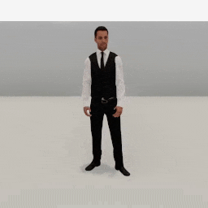

##### Replicants

# Arm articulation

Unlike [movement](movement.md) and [animations](animations.md), which are controlled by pre-recorded animation data, Replicant arm articulation is procedural. It uses inverse kinematic (IK) and the [FinalIK Unity asset](https://root-motion.com/) to solve an end pose, given a target position that a hand is reaching for.

## The `reach_for(target, arm)` action

The Replicant can reach for a target position or object via `reach_for(target, arm)`.

### Reach for a target position

To reach for a target position, set `target` to an x, y, z, dictionary or numpy array, and `arm` to an [`Arm`](../../python/replicant/arm.md) value:

```python
from tdw.controller import Controller
from tdw.tdw_utils import TDWUtils
from tdw.add_ons.replicant import Replicant
from tdw.add_ons.third_person_camera import ThirdPersonCamera
from tdw.add_ons.image_capture import ImageCapture
from tdw.replicant.action_status import ActionStatus
from tdw.replicant.arm import Arm
from tdw.backend.paths import EXAMPLE_CONTROLLER_OUTPUT_PATH

c = Controller()
replicant = Replicant()
camera = ThirdPersonCamera(position={"x": 0, "y": 1.5, "z": 2.1},
                           look_at=replicant.replicant_id,
                           avatar_id="a")
path = EXAMPLE_CONTROLLER_OUTPUT_PATH.joinpath("replicant_reach_for_position")
print(f"Images will be saved to: {path}")
capture = ImageCapture(avatar_ids=[camera.avatar_id], path=path)
c.add_ons.extend([replicant, camera, capture])
c.communicate(TDWUtils.create_empty_room(12, 12))
replicant.reach_for(target={"x": 0.8, "y": 0.9, "z": 0.3}, arm=Arm.right)
while replicant.action.status == ActionStatus.ongoing:
    c.communicate([])
c.communicate([])
c.communicate({"$type": "terminate"})
```

Result:



The Replicant can reach with both hands at the same time. To do this, set  `arm` to a list of arms:

```python
from tdw.controller import Controller
from tdw.tdw_utils import TDWUtils
from tdw.add_ons.replicant import Replicant
from tdw.add_ons.third_person_camera import ThirdPersonCamera
from tdw.add_ons.image_capture import ImageCapture
from tdw.replicant.action_status import ActionStatus
from tdw.replicant.arm import Arm
from tdw.backend.paths import EXAMPLE_CONTROLLER_OUTPUT_PATH

c = Controller()
replicant = Replicant()
camera = ThirdPersonCamera(position={"x": 0, "y": 1.5, "z": 2.1},
                           look_at=replicant.replicant_id,
                           avatar_id="a")
path = EXAMPLE_CONTROLLER_OUTPUT_PATH.joinpath("replicant_reach_for_position_both_hands")
print(f"Images will be saved to: {path}")
capture = ImageCapture(avatar_ids=[camera.avatar_id], path=path)
c.add_ons.extend([replicant, camera, capture])
c.communicate(TDWUtils.create_empty_room(12, 12))
replicant.reach_for(target={"x": 0.8, "y": 0.9, "z": 0.3}, arm=[Arm.left, Arm.right])
while replicant.action.status == ActionStatus.ongoing:
    c.communicate([])
c.communicate([])
c.communicate({"$type": "terminate"})
```



### Reach for a target object

To reach for a target object, set `target` to an object ID integer:

```python
from tdw.controller import Controller
from tdw.tdw_utils import TDWUtils
from tdw.add_ons.replicant import Replicant
from tdw.add_ons.third_person_camera import ThirdPersonCamera
from tdw.add_ons.image_capture import ImageCapture
from tdw.replicant.action_status import ActionStatus
from tdw.replicant.arm import Arm
from tdw.backend.paths import EXAMPLE_CONTROLLER_OUTPUT_PATH

c = Controller()
replicant = Replicant()
camera = ThirdPersonCamera(position={"x": 0, "y": 1.5, "z": 2.5},
                           look_at=replicant.replicant_id,
                           avatar_id="a")
path = EXAMPLE_CONTROLLER_OUTPUT_PATH.joinpath("replicant_reach_for_object")
print(f"Images will be saved to: {path}")
capture = ImageCapture(avatar_ids=[camera.avatar_id], path=path)
c.add_ons.extend([replicant, camera, capture])
# Set the object ID.
object_id = Controller.get_unique_id()
commands = [TDWUtils.create_empty_room(12, 12)]
commands.extend(Controller.get_add_physics_object(model_name="basket_18inx18inx12iin_wicker",
                                                  object_id=object_id,
                                                  position={"x": -0.1, "y": 0, "z": 0.6}))
c.communicate(commands)
replicant.reach_for(target=object_id, arm=Arm.right)
while replicant.action.status == ActionStatus.ongoing:
    c.communicate([])
c.communicate([])
c.communicate({"$type": "terminate"})
```

Result:


**Notice that the Replicant does *not* reach for the center of the object.** This is intentional.

Certain models in TDW have "**affordance points**" that are automatically attached to them upon instantiation. Affordance points don't have meshes, colliders, etc.; they are just an transform with a position and rotation. Affordance points are parented to objects, meaning that when the object moves and rotates, the empty objects will follow within the local coordinate space.

When you call `replicant.reach_for(target, arm)`, the Replicant will always try to reach for the *affordance point closest to the hand*. If there are no affordance points, the Replicant will reach for the *bounds position closest to the hand.*

In the above example, `basket_18inx18inx12iin_wicker` has 4 affordance points, one on each side of the lid. This means that the Replicant will always try to reach for one of the sides of the basket.

Right now, only a small amount of models in TDW have affordance points. To get a list of objects with affordance positions, review `model_record.empty_objects`:

```python
from tdw.librarian import ModelLibrarian

lib = ModelLibrarian()
for record in lib.records:
    if record.do_not_use:
        continue
    if len(record.affordance_points) > 0:
        print(record.name)
```

As with target *positions*, it is possible to reach for target *objects* with both hands. Each hand will aim for the nearest affordance point or bounds position, but will never reach for the same point in space:

```python
from tdw.controller import Controller
from tdw.tdw_utils import TDWUtils
from tdw.add_ons.replicant import Replicant
from tdw.add_ons.third_person_camera import ThirdPersonCamera
from tdw.add_ons.image_capture import ImageCapture
from tdw.replicant.action_status import ActionStatus
from tdw.replicant.arm import Arm
from tdw.backend.paths import EXAMPLE_CONTROLLER_OUTPUT_PATH

c = Controller()
replicant = Replicant()
camera = ThirdPersonCamera(position={"x": 0, "y": 1.5, "z": 2.5},
                           look_at=replicant.replicant_id,
                           avatar_id="a")
path = EXAMPLE_CONTROLLER_OUTPUT_PATH.joinpath("replicant_reach_for_object_two_hands")
print(f"Images will be saved to: {path}")
capture = ImageCapture(avatar_ids=[camera.avatar_id], path=path)
c.add_ons.extend([replicant, camera, capture])
# Set the object ID.
object_id = Controller.get_unique_id()
commands = [TDWUtils.create_empty_room(12, 12)]
commands.extend(Controller.get_add_physics_object(model_name="basket_18inx18inx12iin_wicker",
                                                  object_id=object_id,
                                                  position={"x": -0.1, "y": 0, "z": 0.6}))
c.communicate(commands)
replicant.reach_for(target=object_id, arm=[Arm.left, Arm.right])
while replicant.action.status == ActionStatus.ongoing:
    c.communicate([])
c.communicate([])
c.communicate({"$type": "terminate"})
```

Result:



### Action success and collision detection

The action succeeds if, when it ends, the hand is near the target (see below, `arrived_at`).

The action has several fail states:

- If, at the start of the action, the target is too far away, the action immediately fails with `ActionStatus.cannot_reach`.
- If, at the end of the action, the target is too far away, the action ends with `ActionStatus.failed_to_reach`.
- If, during the action, the Replicant collides with an object, the action ends with `ActionStatus.collision`. To suppress this behavior, set `replicant.collision_detection.objects = False` or add an object ID to `replicant.collision_detection.exclude_objects`

In this example, the Replicant will walk to an object, pick it up, walk away, and drop the object. Notice that we add the trunk's ID to `collision_detection.exclude_objects`. This is because the Replicant's lower arm will collide with the trunk while reaching for the mug. **Unlike most of our examples controllers, this example is a subclass of `Controller`.** This is much closer to how you should structure your controllers. We've written a `do_action()` function to handle the basic Replicant action loop.

```python
from tdw.controller import Controller
from tdw.tdw_utils import TDWUtils
from tdw.add_ons.third_person_camera import ThirdPersonCamera
from tdw.add_ons.image_capture import ImageCapture
from tdw.add_ons.replicant import Replicant
from tdw.replicant.action_status import ActionStatus
from tdw.replicant.arm import Arm
from tdw.backend.paths import EXAMPLE_CONTROLLER_OUTPUT_PATH


class GoToReachFor(Controller):
    def __init__(self, port: int = 1071, check_version: bool = True, launch_build: bool = True):
        super().__init__(port=port, check_version=check_version, launch_build=launch_build)
        # Set the replicant and the object IDs here because we need to reference them elsewhere.
        self.replicant = Replicant()
        self.trunk_id = 1
        self.mug_id = 2

    def do_action(self) -> None:
        while self.replicant.action.status == ActionStatus.ongoing:
            self.communicate([])
        self.communicate([])

    def run(self) -> None:
        camera = ThirdPersonCamera(position={"x": -1.5, "y": 1.175, "z": 5.25},
                                   look_at={"x": 0.5, "y": 1, "z": 0},
                                   avatar_id="a")
        path = EXAMPLE_CONTROLLER_OUTPUT_PATH.joinpath("replicant_go_to_reach")
        print(f"Images will be saved to: {path}")
        capture = ImageCapture(avatar_ids=["a"], path=path)
        self.add_ons.extend([self.replicant, camera, capture])
        # Create the room.
        commands = [TDWUtils.create_empty_room(12, 12)]
        commands.extend(Controller.get_add_physics_object(model_name="trunck",
                                                          object_id=self.trunk_id,
                                                          position={"x": 0, "y": 0, "z": 3},
                                                          kinematic=True))
        commands.extend(Controller.get_add_physics_object(model_name="coffeemug",
                                                          object_id=self.mug_id,
                                                          position={"x": 0, "y": 0.9888946, "z": 3}))
        self.communicate(commands)
        self.replicant.move_to(target=self.trunk_id)
        self.do_action()
        # Ignore the trunk.
        self.replicant.collision_detection.exclude_objects.append(self.trunk_id)
        self.replicant.reach_for(target=self.mug_id, arm=Arm.right)
        self.do_action()
        print(self.replicant.action.status)
        self.communicate({"$type": "terminate"})


if __name__ == "__main__":
    c = GoToReachFor()
    c.run()
```

Result:



Output:

```
ActionStatus.success
```

### The `absolute` parameter

If `target` is a position (a dictionary or a numpy array, as opposed to a position), it defaults to a world space position. It's often useful, however, to set `absolute=False`, which defines `target` as being relative to the Replicant's position (but *not* the Replicant's rotation).

### The `offhand_follows` parameter

If the `arm` parameter is a single value (e.g. `Arm.left`, not `[Arm.left, Arm.right]`), you can set the optional parameter `offhand_follows=True`. This will make the offhand (the opposite of whatever `arm` is set to) follow the primary hand:

```python
from tdw.controller import Controller
from tdw.tdw_utils import TDWUtils
from tdw.add_ons.replicant import Replicant
from tdw.add_ons.third_person_camera import ThirdPersonCamera
from tdw.add_ons.image_capture import ImageCapture
from tdw.replicant.action_status import ActionStatus
from tdw.replicant.arm import Arm
from tdw.backend.paths import EXAMPLE_CONTROLLER_OUTPUT_PATH

c = Controller()
replicant = Replicant()
camera = ThirdPersonCamera(position={"x": 0, "y": 1.5, "z": 2.5},
                           look_at=replicant.replicant_id,
                           avatar_id="a")
path = EXAMPLE_CONTROLLER_OUTPUT_PATH.joinpath("replicant_reach_for_follow")
print(f"Images will be saved to: {path}")
capture = ImageCapture(avatar_ids=[camera.avatar_id], path=path)
c.add_ons.extend([replicant, camera, capture])
c.communicate(TDWUtils.create_empty_room(12, 12))
# Reach for a target with the right hand.
replicant.reach_for(target={"x": 0.6, "y": 1.5, "z": 0.3}, arm=Arm.right)
while replicant.action.status == ActionStatus.ongoing:
    c.communicate([])
c.communicate([])
# Reach for a target with the left hand.
replicant.reach_for(target={"x": -0.4, "y": 1, "z": 0.1}, arm=Arm.left)
while replicant.action.status == ActionStatus.ongoing:
    c.communicate([])
c.communicate([])
# Reach for a target with the right hand and have the left hand follow.
replicant.reach_for(target={"x": 0.8, "y": 0.8, "z": 0.3}, arm=Arm.right, offhand_follows=True)
while replicant.action.status == ActionStatus.ongoing:
    c.communicate([])
c.communicate([])
c.communicate({"$type": "terminate"})
```

Result:



### The `duration` parameter

`duration` is an optional parameter that controls the speed in seconds of the arm motion:

```python
from tdw.controller import Controller
from tdw.tdw_utils import TDWUtils
from tdw.add_ons.replicant import Replicant
from tdw.add_ons.third_person_camera import ThirdPersonCamera
from tdw.add_ons.image_capture import ImageCapture
from tdw.replicant.action_status import ActionStatus
from tdw.replicant.arm import Arm
from tdw.backend.paths import EXAMPLE_CONTROLLER_OUTPUT_PATH

c = Controller()
replicant = Replicant()
camera = ThirdPersonCamera(position={"x": 2, "y": 3, "z": 2.53},
                           look_at=replicant.replicant_id,
                           avatar_id="a")
path = EXAMPLE_CONTROLLER_OUTPUT_PATH.joinpath("replicant_reach_for_object_slow")
print(f"Images will be saved to: {path}")
capture = ImageCapture(avatar_ids=[camera.avatar_id], path=path)
c.add_ons.extend([replicant, camera, capture])
# Set the object ID.
object_id = Controller.get_unique_id()
commands = [TDWUtils.create_empty_room(12, 12)]
commands.extend(Controller.get_add_physics_object(model_name="basket_18inx18inx12iin_wicker",
                                                  object_id=object_id,
                                                  position={"x": -0.1, "y": 0, "z": 0.6}))
c.communicate(commands)
replicant.reach_for(target=object_id,
                    arm=[Arm.left, Arm.right],
                    duration=1.5)
while replicant.action.status == ActionStatus.ongoing:
    c.communicate([])
c.communicate([])
c.communicate({"$type": "terminate"})
```

Result:



### The `arrived_at` parameter

`arrived_at` controls the distance that defines a successful action. If, at the end of the action, the hand is this distance or less from the target position (a position, affordance point, or bounds position), the action is successful.

### The `max_distance` parameter

`max_distance` controls the maximum distance from the hand to the target. If at the start of the action the target is too far away, the action will immediately fail with `ActionStatus.cannot_reach`. You can extend this maximum distance, but the Replicant may behave very strangely:

```python
from tdw.controller import Controller
from tdw.tdw_utils import TDWUtils
from tdw.add_ons.replicant import Replicant
from tdw.add_ons.third_person_camera import ThirdPersonCamera
from tdw.add_ons.image_capture import ImageCapture
from tdw.replicant.action_status import ActionStatus
from tdw.replicant.arm import Arm
from tdw.backend.paths import EXAMPLE_CONTROLLER_OUTPUT_PATH

c = Controller()
replicant = Replicant()
camera = ThirdPersonCamera(position={"x": 3.2, "y": 3, "z": 3.5},
                           look_at=replicant.replicant_id,
                           avatar_id="a")
path = EXAMPLE_CONTROLLER_OUTPUT_PATH.joinpath("replicant_reach_too_far")
print(f"Images will be saved to: {path}")
capture = ImageCapture(avatar_ids=[camera.avatar_id], path=path)
c.add_ons.extend([replicant, camera, capture])
c.communicate([TDWUtils.create_empty_room(12, 12)])
target = {"x": 3, "y": 0.9, "z": 6}
# The target is too far away.
replicant.reach_for(target=target, arm=Arm.right)
while replicant.action.status == ActionStatus.ongoing:
    c.communicate([])
c.communicate([])
print(replicant.action.status)
# Try to reach the target anyway.
replicant.reach_for(target=target,
                    arm=Arm.right,
                    max_distance=8)
while replicant.action.status == ActionStatus.ongoing:
    c.communicate([])
c.communicate([])
print(replicant.action.status)
c.communicate({"$type": "terminate"})
```

Result:


Output:

```
ActionStatus.cannot_reach
ActionStatus.failed_to_reach
```

## The `reset_arm(arm)` action

Reset a Replicant's arm to its neutral position by calling `replicant.reset_arm(arm)`:

```python
from tdw.controller import Controller
from tdw.tdw_utils import TDWUtils
from tdw.add_ons.replicant import Replicant
from tdw.add_ons.third_person_camera import ThirdPersonCamera
from tdw.add_ons.image_capture import ImageCapture
from tdw.replicant.action_status import ActionStatus
from tdw.replicant.arm import Arm
from tdw.backend.paths import EXAMPLE_CONTROLLER_OUTPUT_PATH

c = Controller()
replicant = Replicant()
camera = ThirdPersonCamera(position={"x": 2, "y": 3, "z": 2.53},
                           look_at=replicant.replicant_id,
                           avatar_id="a")
path = EXAMPLE_CONTROLLER_OUTPUT_PATH.joinpath("replicant_reset_arm")
print(f"Images will be saved to: {path}")
capture = ImageCapture(avatar_ids=[camera.avatar_id], path=path)
c.add_ons.extend([replicant, camera, capture])
c.communicate(TDWUtils.create_empty_room(12, 12))
replicant.reach_for(target={"x": 0.8, "y": 0.9, "z": 0.3}, arm=Arm.right)
while replicant.action.status == ActionStatus.ongoing:
    c.communicate([])
c.communicate([])
replicant.reset_arm(arm=Arm.right)
while replicant.action.status == ActionStatus.ongoing:
    c.communicate([])
c.communicate([])
c.communicate({"$type": "terminate"})
```

Result:



The `arm` parameter can be a single value such as `Arm.right` or a list of values, such as `[Arm.left, Arm.right]`, in which case both arms are reset.

### The `duration` parameter

`duration` is an optional parameter that controls the speed in seconds of the arm motion; it works the same way as it does in `reach_for(target, arm)`.

### Action success and collision detection

The action succeeds when the arm(s) finish resetting. The action can end in `ActionStatus.collision`. The collision detection rules for `reset_arm(arm)` are the same as those for `reach_for(target, arm)`; see above for more information.

The action can't end in `ActionStatus.cannot_reach` or `ActionStatus.failed_to_reach` because the Replicant isn't reaching for a target.

## Movement and arm resets

When you call [`move_by(distance)` or `move_to(target)`](movement.md),  the Replicant's arms will automatically reset. This is *not* equivalent to calling `reset_arm(arm)` followed by `move_by(distance)`/`move_to(target)` because the Replicant's arms will move during the start of the walk motion, rather than before the walk motion begins:

```python
from tdw.controller import Controller
from tdw.tdw_utils import TDWUtils
from tdw.add_ons.replicant import Replicant
from tdw.add_ons.third_person_camera import ThirdPersonCamera
from tdw.add_ons.image_capture import ImageCapture
from tdw.replicant.action_status import ActionStatus
from tdw.replicant.arm import Arm
from tdw.backend.paths import EXAMPLE_CONTROLLER_OUTPUT_PATH

c = Controller()
replicant = Replicant()
camera = ThirdPersonCamera(position={"x": 2, "y": 3, "z": 2.53},
                           look_at=replicant.replicant_id,
                           avatar_id="a")
path = EXAMPLE_CONTROLLER_OUTPUT_PATH.joinpath("replicant_reach_for_move")
print(f"Images will be saved to: {path}")
capture = ImageCapture(avatar_ids=[camera.avatar_id], path=path)
c.add_ons.extend([replicant, camera, capture])
c.communicate(TDWUtils.create_empty_room(12, 12))
replicant.reach_for(target={"x": 0.8, "y": 0.9, "z": 0.3}, arm=Arm.right)
while replicant.action.status == ActionStatus.ongoing:
    c.communicate([])
c.communicate([])
replicant.move_by(3)
while replicant.action.status == ActionStatus.ongoing:
    c.communicate([])
c.communicate([])
c.communicate({"$type": "terminate"})

```

Result:


You might want the Replicant to hold a pose with its arms while walking (for example, if it is [holding an object](grasp_drop.md)). If so, you can set the optional parameter `reset_arms=False` for `move_by` or `move_to`:

```python
from tdw.controller import Controller
from tdw.tdw_utils import TDWUtils
from tdw.add_ons.replicant import Replicant
from tdw.add_ons.third_person_camera import ThirdPersonCamera
from tdw.add_ons.image_capture import ImageCapture
from tdw.replicant.action_status import ActionStatus
from tdw.replicant.arm import Arm
from tdw.backend.paths import EXAMPLE_CONTROLLER_OUTPUT_PATH

c = Controller()
replicant = Replicant()
camera = ThirdPersonCamera(position={"x": 2, "y": 3, "z": 2.53},
                           look_at=replicant.replicant_id,
                           avatar_id="a")
path = EXAMPLE_CONTROLLER_OUTPUT_PATH.joinpath("replicant_reach_for_move")
print(f"Images will be saved to: {path}")
capture = ImageCapture(avatar_ids=[camera.avatar_id], path=path)
c.add_ons.extend([replicant, camera, capture])
c.communicate(TDWUtils.create_empty_room(12, 12))
replicant.reach_for(target={"x": 0.8, "y": 0.9, "z": 0.3}, arm=Arm.right)
while replicant.action.status == ActionStatus.ongoing:
    c.communicate([])
c.communicate([])
replicant.move_by(distance=3,
                  reset_arms=False)
while replicant.action.status == ActionStatus.ongoing:
    c.communicate([])
c.communicate([])
c.communicate({"$type": "terminate"})
```

Result:


You can control the speed at which the arms reset by setting the `reset_arms_duration` parameter in `move_by` or `move_to`.

## Low-level description

### The `reach_for(target, arm)` action

`replicant.reach_for(target, arm)` sets `replicant.action` to an [`ReachFor`](../../python/replicant/actions/reach_for.md) action. 

In addition to [the usual `Action` initialization commands](actions.md), `ReachFor` sends [`replicant_reach_for_position`](../../api/command_api.md#replicant_reach_for_position) or [`replicant_reach_for_object`](../../api/command_api.md#replicant_reach_for_object).

The action continues until there is a collision or until `replicant.dynamic.output_action_status != ActionStatus.ongoing` (meaning that the build has signaled that the animation ended).

### The `reset_arm(arm)` action

`replicant.reset_arm(arm)` sets `replicant.action` to an [`ResetArm`](../../python/replicant/actions/reset_arm.md) action. 

In addition to [the usual `Action` initialization commands](actions.md), `ResetArm` sends [`replicant_reset_arm`](../../api/command_api.md#replicant_reset_arm).

The action continues until there is a collision or until `replicant.dynamic.output_action_status == ActionStatus.success` (meaning that the build has signaled that the animation ended).

***

**Next: [Grasp and drop objects](grasp_drop.md)**

[Return to the README](../../../README.md)

***

Example controllers:

- [reach_for_position.py](https://github.com/threedworld-mit/tdw/blob/master/Python/example_controllers/replicant/reach_for_position.py) Reach for a target position.
- [reach_for_object.py](https://github.com/threedworld-mit/tdw/blob/master/Python/example_controllers/replicant/reach_for_object.py) Reach for a target object.
- [reach_too_far.py](https://github.com/threedworld-mit/tdw/blob/master/Python/example_controllers/replicant/reach_too_far.py) Reach for a target that is too far away.
- [reset_arm.py](https://github.com/threedworld-mit/tdw/blob/master/Python/example_controllers/replicant/reset_arm.py) Reach for a target position and then reset the arm.
- [reach_for_move.py](https://github.com/threedworld-mit/tdw/blob/master/Python/example_controllers/replicant/reach_for_move.py) Reach for a target position and then move forward, resetting the arm.
- [reach_for_follow.py](https://github.com/threedworld-mit/tdw/blob/master/Python/example_controllers/replicant/reach_for_follow.py) Reach for a target position and have the offhand follow the main hand.

Command API:

- [`replicant_reach_for_position`](../../api/command_api.md#replicant_reach_for_position)
- [`replicant_reach_for_object`](../../api/command_api.md#replicant_reach_for_object)
- [`replicant_reset_arm`](../../api/command_api.md#replicant_reset_arm)

Python API:

- [`Replicant`](../../python/add_ons/replicant.md)
- [`Arm`](../../python/replicant/arm.md)
- [`CollisionDetection`](../../python/replicant/collision_detection.md)
- [`ModelRecord`](../../python/librarian/model_librarian.md)
- [`ReachFor`](../../python/replicant/actions/reach_for.md)
- [`ResetArm`](../../python/replicant/actions/reset_arm.md)
