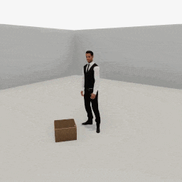
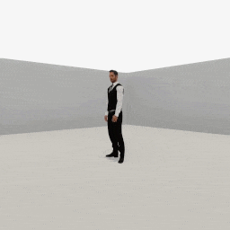

##### Replicants

# Arm articulation, pt. 3: Advanced topics

*Replicant arm articulation is a complex topic. [Part 1](arm_articulation_1.md) covers basic arm articulation actions. [Part 2](arm_articulation_2.md) covers grasping and dropping. This document covers more advanced examples that use some additional optional parameters. [Part 4](arm_articulation_4.md) describes a relatively complex use-case: stacking objects on top of each other.*

This document describes how to use the Replicant API's more advanced arm articulation features. All of these features can be found in the actions you're now familiar with (`reach_for(target, arm)`, `grasp(target, arm)` and `drop(arm)`) by setting optional parameters.

## When to set optional parameters

**There is no bounded solution for when to set optional parameters.** There is no way to determine using a simple algorithm which optional parameter, if any, is correct for any given situation, because "correctness" is impossible to define. It is often possible for a Replicant to achieve a desired behavior without using an optional parameters, or by using several different combinations. It is up to the user or the training system to decide how to best use the full capabilities of the Replicant arm articulation API.

## `reach_for(target, arm)` and make one hand follow the other

During a `reach_for(target, arm)` action, If the `arm` parameter is a single value (e.g. `Arm.left`, not `[Arm.left, Arm.right]`), you can set the optional parameter `offhand_follows=True`. This will make the offhand (the opposite of whatever `arm` is set to) follow the primary hand:

```python
from tdw.controller import Controller
from tdw.tdw_utils import TDWUtils
from tdw.add_ons.replicant import Replicant
from tdw.add_ons.third_person_camera import ThirdPersonCamera
from tdw.add_ons.image_capture import ImageCapture
from tdw.replicant.action_status import ActionStatus
from tdw.replicant.arm import Arm
from tdw.backend.paths import EXAMPLE_CONTROLLER_OUTPUT_PATH

c = Controller()
replicant = Replicant()
camera = ThirdPersonCamera(position={"x": 0, "y": 1.5, "z": 2.5},
                           look_at=replicant.replicant_id,
                           avatar_id="a")
path = EXAMPLE_CONTROLLER_OUTPUT_PATH.joinpath("replicant_reach_for_follow")
print(f"Images will be saved to: {path}")
capture = ImageCapture(avatar_ids=[camera.avatar_id], path=path)
c.add_ons.extend([replicant, camera, capture])
c.communicate(TDWUtils.create_empty_room(12, 12))
# Reach for a target with the right hand.
replicant.reach_for(target={"x": 0.6, "y": 1.5, "z": 0.3}, arm=Arm.right)
while replicant.action.status == ActionStatus.ongoing:
    c.communicate([])
c.communicate([])
# Reach for a target with the left hand.
replicant.reach_for(target={"x": -0.4, "y": 1, "z": 0.1}, arm=Arm.left)
while replicant.action.status == ActionStatus.ongoing:
    c.communicate([])
c.communicate([])
# Reach for a target with the right hand and have the left hand follow.
replicant.reach_for(target={"x": 0.8, "y": 0.8, "z": 0.3}, arm=Arm.right, offhand_follows=True)
while replicant.action.status == ActionStatus.ongoing:
    c.communicate([])
c.communicate([])
c.communicate({"$type": "terminate"})
```

Result:


## `grasp(target, arm)` and rotate the object

A grasped object will continuously rotate relative to the hand grasping it. By default, the rotation is 90 degrees along the relative pitch axis.

The optional `angle` parameter controls the angle and the optional `axis` parameter controls the axis. The `axis` parameter is a string: `"pitch"`, `"yaw"`, or `"roll"`.

The optional `relative_to_hand` parameter sets whether the rotation is relative to the hand (True) or relative to the Replicant( False). 

If you set either `angle` *or* `axis` to None, the object will maintain its initial rotation even as the hand rotates and the `relative_to_hand` parameter will be ignored.

Some scenarios in which you might want to adjust these parameters:

- If you want the Replicant to hold a staff, set `relative_to_hand=True` so that the angle of the staff is relative to the angle of the wrist.
- If you want the Replicant to hold an object parallel to the floor, set `angle=0`, `axis="pitch"`, and `relative_to_hand=False`.
- If you want to rotate the object using low-level commands such as `rotate_object_by`, set `angle=None` and `axis=None`.

In this example, the Replicant grasps the object in three trials: In the first trial, `angle` and `axis` are set and the rotation is relative to the hand. In the second trial, `angle` and `axis` are set and the rotation is relative to the Replicant. In the third trial, `angle` and `axis` are set the None:

```python
from typing import Optional
from tdw.controller import Controller
from tdw.tdw_utils import TDWUtils
from tdw.add_ons.replicant import Replicant
from tdw.add_ons.third_person_camera import ThirdPersonCamera
from tdw.add_ons.image_capture import ImageCapture
from tdw.replicant.action_status import ActionStatus
from tdw.replicant.arm import Arm
from tdw.backend.paths import EXAMPLE_CONTROLLER_OUTPUT_PATH


class GraspRotate(Controller):
    def __init__(self, port: int = 1071, check_version: bool = True, launch_build: bool = True):
        super().__init__(port=port, check_version=check_version, launch_build=launch_build)
        self.replicant = Replicant()
        self.camera = ThirdPersonCamera(position={"x": -2.4, "y": 2, "z": 3.2},
                                        look_at=self.replicant.replicant_id,
                                        avatar_id="a")
        path = EXAMPLE_CONTROLLER_OUTPUT_PATH.joinpath("replicant_grasp_rotate")
        print(f"Images will be saved to: {path}")
        self.capture = ImageCapture(avatar_ids=[self.camera.avatar_id], path=path)
        self.add_ons.extend([self.replicant, self.camera, self.capture])

    def do_action(self):
        while self.replicant.action.status == ActionStatus.ongoing:
            self.communicate([])
        self.communicate([])

    def trial(self, angle: Optional[float], axis: Optional[str], relative_to_hand: bool):
        # Reset the add-ons.
        self.replicant.reset()
        self.camera.initialized = False
        self.capture.initialized = False
        # Load the scene.
        object_id = Controller.get_unique_id()
        commands = [{"$type": "load_scene",
                     "scene_name": "ProcGenScene"},
                    TDWUtils.create_empty_room(12, 12)]
        commands.extend(Controller.get_add_physics_object(model_name="basket_18inx18inx12iin_wicker",
                                                          object_id=object_id,
                                                          position={"x": 0.2, "y": 0, "z": 0.7},
                                                          rotation={"x": 0, "y": 40, "z": 0}))
        self.communicate(commands)
        self.replicant.reach_for(target=object_id, arm=Arm.right)
        self.do_action()
        self.replicant.grasp(target=object_id, arm=Arm.right, relative_to_hand=relative_to_hand, axis=axis, angle=angle)
        self.do_action()
        self.replicant.reach_for(target={"x": 0.1, "y": 1.1, "z": 0.6}, arm=Arm.right, absolute=False)
        self.do_action()


if __name__ == "__main__":
    c = GraspRotate()
    c.trial(angle=10, axis="pitch", relative_to_hand=True)
    c.trial(angle=10, axis="pitch", relative_to_hand=False)
    c.trial(angle=None, axis=None, relative_to_hand=False)
    c.communicate({"$type": "terminate"})
```

Result:



## `grasp(target, arm)` and offset the object

By default, a grasped object sets its [grasped affordance point](arm_articulation_1.md) (i.e. its pivot) to the same position as the hand holding the object.

For some objects, especially boxier ones that might collide with the Replicant's lower arm, you might want to offset the distance from the pivot to the hand by setting the optional `offset` parameter, for example: `grasp(target, arm, offset=0.3)`. `offset` is a distance. The direction of the offset is always the local up vector from the hand.

## Set the `drop(arm)`  offset

When the Replicant drops an object, the object can optionally be positioned at an offset before falling. This is controlled by the optional `offset` parameter, which can be either a float, dictionary, or numpy array. By default, `offset` is set to `0.1`.

- If `offset` is a float, it is a distance along the object's forward directional vector: `replicant.drop(arm=Arm.right, offset=0.1)`. If you want the object to fall directly downward, set `offset=0`. 
- If `offset` is a dictionary or numpy array, it is a world space position. `replicant.drop(arm=Arm.right, offset={"x": 0, "y": 1.1, "z": 0})`. If you need to object to fall onto a target position, set `offset={"x": position["x"], "y": y, "z": position["z"]}` where `position` is the target position and `y` is the current y coordinate of the object.

## `reach_for(target, arm)` and offset the target by a held object

In many scenarios, you might want the target position to change if the Replicant is holding an object. For example, if you want the Replicant to place a plate on a table, then you will want the Replicant to move the *plate* to the target position rather than the *hand*. You can achieve this by setting two optional parameters in the `reach_for()` action: `from_held` and `held_point`.

`from_held` is a boolean that by default is False. If True, the Replicant will offset the action's target position by a point on the held object. If the hand isn't holding an object, this is ignored.

`held_point` is a string describing a bounds position such as `"bottom"`, `"top"`, etc. that will be used to calculate the offset from the hand. It defaults to `"bottom"` and is only used if `from_held=True` (and if the Replicant is actually holding an object). In the above scenario, where we want the Replicant to place a plate on a table,  we probably want to set `held_point="bottom"`. 

In this example, the Replicant will grasp an object and then reach for the same positioning but applying different offsets per trial. For more information regarding the `grasp()` action, read [the previous document in this lesson](arm_articulation_2.md).

```python
from tdw.controller import Controller
from tdw.tdw_utils import TDWUtils
from tdw.add_ons.replicant import Replicant
from tdw.add_ons.third_person_camera import ThirdPersonCamera
from tdw.add_ons.image_capture import ImageCapture
from tdw.replicant.action_status import ActionStatus
from tdw.replicant.arm import Arm
from tdw.backend.paths import EXAMPLE_CONTROLLER_OUTPUT_PATH


class ReachForOffset(Controller):
    def __init__(self, port: int = 1071, check_version: bool = True, launch_build: bool = True):
        super().__init__(port=port, check_version=check_version, launch_build=launch_build)
        self.replicant = Replicant()
        self.camera = ThirdPersonCamera(position={"x": -2.4, "y": 2, "z": 3.2},
                                        look_at=self.replicant.replicant_id,
                                        avatar_id="a")
        path = EXAMPLE_CONTROLLER_OUTPUT_PATH.joinpath("replicant_reach_for_offset")
        print(f"Images will be saved to: {path}")
        self.capture = ImageCapture(avatar_ids=[self.camera.avatar_id], path=path)
        self.add_ons.extend([self.replicant, self.camera, self.capture])

    def do_action(self):
        while self.replicant.action.status == ActionStatus.ongoing:
            self.communicate([])
        self.communicate([])

    def trial(self, from_held: bool, held_point: str):
        # Reset the add-ons.
        self.replicant.reset()
        self.camera.initialized = False
        self.capture.initialized = False
        # Load the scene.
        object_id = Controller.get_unique_id()
        commands = [{"$type": "load_scene",
                     "scene_name": "ProcGenScene"},
                    TDWUtils.create_empty_room(12, 12)]
        commands.extend(Controller.get_add_physics_object(model_name="basket_18inx18inx12iin_wicker",
                                                          object_id=object_id,
                                                          position={"x": 0.2, "y": 0, "z": 0.7},
                                                          rotation={"x": 0, "y": 40, "z": 0}))
        self.communicate(commands)
        self.replicant.reach_for(target=object_id, arm=Arm.right)
        self.do_action()
        self.replicant.grasp(target=object_id, arm=Arm.right, relative_to_hand=False, axis="pitch", angle=0)
        self.do_action()
        self.replicant.reach_for(target={"x": 0.1, "y": 1.1, "z": 0.6}, arm=Arm.right, absolute=False,
                                 from_held=from_held, held_point=held_point)
        self.do_action()


if __name__ == "__main__":
    c = ReachForOffset()
    c.trial(from_held=False, held_point="")
    c.trial(from_held=True, held_point="bottom")
    c.trial(from_held=True, held_point="top")
    c.communicate({"$type": "terminate"})
```

Result:


## Subdivide a `reach_for(target, arm)` action using an IK Plan

In many cases, it's not desirable for the Replicant to simply reach towards a target position. For example, if the Replicant is [grasping an object](arm_articulation_2.md) that is on the floor and wants to put the object on a kitchen counter, it shouldn't move its hand directly towards the surface of the counter because the hand will collide with a cabinet door along the way.

The best way to solve this is to subdivide a single motion into multiple motions. In TDW, this subdivided motion is handled using an IkPlan. To set the plan for the action, set the optional `plan` parameter to a [`IkPlanType`](../../python/replicant/ik_plans/ik_plan_type.md) value. For example: `plan=IkPlanType.vertical_horizontal`.

In the example, there are two trials. In both trials, the Replicant reaches for a mug and [grasps it](arm_articulation_2.md) and tries to drop the mug on the table. If the hand or arm collides with the table, the trial ends in failure. In the first trial, the Replicant doesn't set the `plan` parameter. In the second trial, the Replicant uses `IkPlanType.vertical_horizontal`, thereby splitting the motion into vertical and horizontal components.

```python
from typing import Optional
from tdw.controller import Controller
from tdw.tdw_utils import TDWUtils
from tdw.add_ons.third_person_camera import ThirdPersonCamera
from tdw.add_ons.image_capture import ImageCapture
from tdw.add_ons.replicant import Replicant
from tdw.replicant.action_status import ActionStatus
from tdw.replicant.arm import Arm
from tdw.replicant.ik_plans.ik_plan_type import IkPlanType
from tdw.backend.paths import EXAMPLE_CONTROLLER_OUTPUT_PATH


class ReachForWithPlan(Controller):
    """
    An example of the difference between a simple `reach_for()` motion and a `reach_for()` motion with a plan.
    """

    def __init__(self, port: int = 1071, check_version: bool = True, launch_build: bool = True):
        super().__init__(port=port, check_version=check_version, launch_build=launch_build)
        self.replicant = Replicant()
        self.camera = ThirdPersonCamera(position={"x": -3.5, "y": 1.175, "z": 3},
                                        avatar_id="a",
                                        look_at=self.replicant.replicant_id)
        path = EXAMPLE_CONTROLLER_OUTPUT_PATH.joinpath("replicant_reach_for_with_plan")
        print(f"Images will be saved to: {path}")
        self.capture = ImageCapture(avatar_ids=["a"], path=path)
        self.add_ons.extend([self.replicant, self.camera, self.capture])

    def do_action(self) -> None:
        while self.replicant.action.status == ActionStatus.ongoing:
            self.communicate([])
        self.communicate([])

    def trial(self, plan: Optional[IkPlanType]):
        self.replicant.reset()
        self.camera.initialized = False
        self.capture.initialized = False
        table_id = 1
        mug_id = 2
        table_z = 3
        commands = [{"$type": "load_scene",
                     "scene_name": "ProcGenScene"},
                    TDWUtils.create_empty_room(12, 12)]
        commands.extend(Controller.get_add_physics_object(model_name="small_table_green_marble",
                                                          object_id=table_id,
                                                          position={"x": 0, "y": 0, "z": table_z},
                                                          kinematic=True))
        commands.extend(Controller.get_add_physics_object(model_name="coffeemug",
                                                          object_id=mug_id,
                                                          position={"x": 0, "y": 0, "z": table_z - 0.4}))
        self.communicate(commands)
        # Move to the trunk.
        self.replicant.move_to(target=mug_id)
        self.do_action()
        # Reach for an grasp the mug.
        self.replicant.reach_for(target=mug_id, arm=Arm.right)
        self.do_action()
        self.replicant.grasp(target=mug_id, arm=Arm.right)
        self.do_action()
        # Reach above the trunk. Use the `plan`, which may be None.
        self.replicant.reach_for(target={"x": 0, "y": 1.1, "z": table_z},
                                 arm=Arm.right,
                                 plan=plan,
                                 from_held=True)
        self.do_action()
        # If the reach_for() action failed, stop here.
        if self.replicant.action.status != ActionStatus.success:
            return self.replicant.action.status
        # Drop the object on the trunk.
        self.replicant.drop(arm=Arm.right, max_num_frames=200)
        self.do_action()
        return self.replicant.action.status


if __name__ == "__main__":
    c = ReachForWithPlan()
    for p in [None, IkPlanType.vertical_horizontal]:
        s = c.trial(plan=p)
        print(s)
    c.communicate({"$type": "terminate"})
```

Result:



Output:

```
ActionStatus.collision
ActionStatus.success
```

***

**Next: [Arm articulation, pt. 4: Stacking objects](arm_articulation_4.md)**

[Return to the README](../../../README.md)

***

Example controllers:

- [reach_for_follow.py](https://github.com/threedworld-mit/tdw/blob/master/Python/example_controllers/replicant/reach_for_follow.py) Reach for a target position and have the offhand follow the main hand.
- [reach_for_offset.py](https://github.com/threedworld-mit/tdw/blob/master/Python/example_controllers/replicant/reach_for_offset.py) A minimal example of how to reach for a position that is offset by a held object.
- [reach_for_with_plan.py](https://github.com/threedworld-mit/tdw/blob/master/Python/example_controllers/replicant/reach_for_with_plan.py) An example of the difference between a `reach_for()` action with and without a plan.

Python API:

- [`Replicant`](../../python/add_ons/replicant.md)
- [`Arm`](../../python/replicant/arm.md)
- [`ReachFor`](../../python/replicant/actions/reach_for.md)
- [`ReachForWithPlan`](../../python/replicant/actions/reach_for_with_plan.md)
- [`IkPlanType`](../../python/replicant/ik_plans/ik_plan_type.md)
- [`IkPlan`](../../python/replicant/ik_plans/ik_plan.md)
- [`VerticalHorizontal`](../../python/replicant/ik_plans/vertical_horizontal.md)
