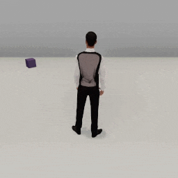

##### Replicants

# Arm articulation, pt. 4: Stacking objects

*Replicant arm articulation is a complex topic. [Part 1](arm_articulation_1.md) covers basic arm articulation actions. [Part 2](arm_articulation_2.md) covers grasping and dropping. [Part 3](arm_articulation_3.md) covers more advanced examples that use some additional optional parameters. This document describes a relatively complex use-case: stacking objects on top of each other.*

This document describes a common use-case for the Replicant: stacking objects on top of each other and an example controller: `tdw/example_controllers/replicant/stack_objects.py`. Because it is a relatively long Python script, it won't be included in this document.

If you run the `stack_objects.py`, this is the result:

## Design

`stack_objects.py` utilizes nearly all of the advanced arm articulation features described in the previous documents:

- When the Replicant grasps an object, it sets the object's rotation relative to its hand per communicate() call (`angle`, `axis`, and `relative_to_hand` parameters). This will allow the object to remain at an appropriate angle.
- The Replicant resets the arm holding the object to a "neutral holding position" prior to carrying the object to the stack, relative to itself rather than the world (`absolute=False`).
- To place the object on the stack, the Replicant uses an IK plan to subdivide the motion into vertical and horizontal components (the `plan` parameter). Without this, the hand would approach the stack at a diagonal and possibly knock over the objects. The target position also needs to be offset from the held object, so the `from_held` and `held_point` parameters are set.
- When the object is dropped, it might be at a slight offset from the desired target position. This is due to limitations in the current accuracy of the Replicant's IK system, which we intend to address in future updates. For now, the `offset` parameter is used to nudge the object into the right position.

`stack_objects.py` also uses API features and design principles found elsewhere in the Replicant documentation:

- The [`arrived_by` parameter of the move actions](movement.md) is set to ensure that the Replicant is at a reasonable distance from the target; we don't want the Replicant to collide with any objects or be so close to the stack that it knocks the stack over.
- The controller uses enum values to describe different "states" for the Replicant. This is described in more depth in [Custom Actions](custom_actions.md), where enum values are used to manage the behavior of a single action. Here, enum values are used for the Replicant's overall behavior in the trial, but the design principles are the same.

## Limitations and possible improvements

**`stack_objects.py` is not meant to be an example of an actual use-case.** It has many limitations, all of which are *deliberate*. `stack_objects.py` is meant to be an example of how the Replicant API's advanced features can yield relatively sophisticated behavior; the controller doesn't attempt to solve any of the other problems an actual use-case would have to handle.

These are just some of the problems, as well as  possible improvements:

### 1. Lack of motion planning

In `stack_objects.py`, the Replicant uses a simple state machine but doesn't actually plan any actions. In an actual use-case, the agent would have to be trained to be responsive to a variety of scenarios.

If an action fails in `stack_objects.py` (e.g. the Replicant fails to reach for a target), a warning message is printed and the controller hangs. For the sake of this example, it's enough to show where in the controller the Replicant might fail an action. In an actual use-case, the Replicant needs to be able to do something to recover from a failed action, such as attempting to move to a better position to reach for a target.

`stack_objects.py` doesn't handle navigation or collision detection. The Replicant moves in a straight line towards each object without checking for obstacles. In this controller, all of the objects are in a circle around the stack position so the Replicant will never collide with any object. An actual use-case would have to have navigation planning. 

To learn more about collision detection, [read this](collision_detection.md) (an overview of Replicant collision detection) and [this](movement.md) (the Movement document, which also describes collision detection while moving). To learn more about navigation, [read this](navigation.md).

### 2. A raycast is used to determine the height of the stack

The Replicant needs to know the height of the stack in order to reach over it, and the controller needs to know the height of the stack to determine if the Replicant successfully placed an object on the stack. In both cases, the controller [raycasts](../semantic_states/raycast.md) from above the stack to determine its height. This is an adequate shortcut for this example but it's a fairly naïve solution. 

- If the Replicant is allowed to move closer to the stack, it is possible for the Replicant to lean over it, in which case the raycast would hit the Replicant, not the stack.
- If there are any objects over the stack (for example, if the stack is under a table), the raycast hit the overhanging object.
- If the Replicant places an object on top of the stack and it starts to fall over, the controller might not know that. The raycast may occur while the object is still in a valid position, and this controller will accordingly decide that the Replicant successfully placed an object on the stack.

A far better way to handle the stack's height would be to use the Replicants [image and depth map data](output_data.md) plus motion planning, but that would be well beyond the scope of this example controller.

### 3. There is no bounded answer to when to use the optional parameters

In `stack_objects.py`, the Replicant doesn't use every optional parameter at every possible opportunity. For example, when it reaches for an object on the *ground*, this is a simple `reach_for(target, arm)` action. But when it reaches above the stack of objects, the agent performs a more complex `reach_for(target, arm, from_held, held_point, plan)` action.

There is no bounded answer to when to use the optional parameters, which can make it relatively challenging to design a training controller that can actually utilize them. This problem is described in more depth [here](arm_articulation_3.md). 

One way you could sidestep these problems would be to narrowly define the possible arm motions a Replicant can do. In this example, you could make two new reach-for actions: `ResetArmToHoldingObject` and `ReachAboveStack`. Combined with the generic `reach_for(target, arm)` action that the Replicant uses to reach for an object on the ground, these three motions are all you need to stack objects. If you need additional arm motion actions, you could explicitly define them as well.

***

**Next: [Head rotation](head_rotation.md)**

[Return to the README](../../../README.md)

***

Example controllers:

- [stack_objects.py](https://github.com/threedworld-mit/tdw/blob/master/Python/example_controllers/replicant/stack_objects.py)