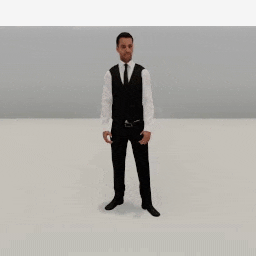

##### Replicants

# Custom actions

[Replicant actions](actions.md) are designed to be easily subclassed. This document will cover two basic strategies for creating custom actions, as well as how to improve [the previous NavMesh example.](navigation.md)

## 1. How to create a minimal `DoNothing` action

Every action needs to be a subclass of [`Action`](../../python/replicant/actions/action.md) or a subclass of one of its subclasses. Every action needs to define `get_initialization_commands(resp, static, dynamic, image_frequency)` and `get_ongoing_commands(resp, static, dynamic)`.

This is a minimal action:

```python
from typing import List
from tdw.replicant.actions.action import Action
from tdw.replicant.action_status import ActionStatus
from tdw.replicant.replicant_static import ReplicantStatic
from tdw.replicant.replicant_dynamic import ReplicantDynamic
from tdw.replicant.image_frequency import ImageFrequency


class DoNothing(Action):
    def get_initialization_commands(self, resp: List[bytes], static: ReplicantStatic, dynamic: ReplicantDynamic,
                                    image_frequency: ImageFrequency) -> List[dict]:
        commands = super().get_initialization_commands(resp=resp, static=static, dynamic=dynamic,
                                                       image_frequency=image_frequency)
        return commands

    def get_ongoing_commands(self, resp: List[bytes], static: ReplicantStatic, dynamic: ReplicantDynamic) -> List[dict]:
        self.status = ActionStatus.success
        commands = super().get_ongoing_commands(resp=resp, static=static, dynamic=dynamic)
        return commands
```

- In both functions, `resp` is the latest response from the build. Many actions need this to parse arbitrary output data. `static` is the Replicant's [`ReplicantStatic`](../../python/replicant/replicant_static.md) and `dynamic` is the Replicant's [`ReplicantDynamic`](../../python/replicant/replicant_dynamic.md); these will be handled within the `Replicant` add-on.
- *Always* add `commands = super().get_initialization_commands(resp=resp, static=static, dynamic=dynamic, image_frequency=image_frequency)`. This will set up the camera, image capture, and "Replicant step" correctly.
- *Always* add `commands = super().get_ongoing_commands(resp=resp, static=static, dynamic=dynamic, image_frequency=image_frequency)`. This will set up "Replicant step" correctly.
- In `ongoing_commands(resp, static, dynamic)`, we want the command to end immediately in success, so we added `self.status = ActionStatus.success`.

The "Replicant step" refers to a command that always gets sent from every action on every `communicate()` call: [`replicant_step`](../../api/command_api.md). This command forces the Replicant's underlying [IK system](arm_articulation.md) to sync with its [animation system](animations.md). If you don't call `commands = super().get_initialization_commands()`, `commands = super().get_ongoing_commands()`, etc., your action won't send `replicant_step` and there will likely be bugs due to the IK system desyncing.

You can optionally add `get_end_commands(resp, static, dynamic, image_frequency)`. *This is not necessary.* You only need to add it if you need the action to send extra commands when it ends. This function always gets called when an action ends, regardless of whether it succeeds:

```python
from typing import List
from tdw.replicant.actions.action import Action
from tdw.replicant.action_status import ActionStatus
from tdw.replicant.replicant_static import ReplicantStatic
from tdw.replicant.replicant_dynamic import ReplicantDynamic
from tdw.replicant.image_frequency import ImageFrequency


class DoNothing(Action):
    def get_initialization_commands(self, resp: List[bytes], static: ReplicantStatic, dynamic: ReplicantDynamic,
                                    image_frequency: ImageFrequency) -> List[dict]:
        commands = super().get_initialization_commands(resp=resp, static=static, dynamic=dynamic,
                                                       image_frequency=image_frequency)
        return commands

    def get_ongoing_commands(self, resp: List[bytes], static: ReplicantStatic, dynamic: ReplicantDynamic) -> List[dict]:
        self.status = ActionStatus.success
        commands = super().get_ongoing_commands(resp=resp, static=static, dynamic=dynamic)
        return commands
    
    def get_end_commands(self, resp: List[bytes], static: ReplicantStatic, dynamic: ReplicantDynamic,
                         image_frequency: ImageFrequency) -> List[dict]:
        commands = super().get_end_commands(resp=resp, static=static, dynamic=dynamic, image_frequency=image_frequency)
        return commands
```

To add this action do a controller, simply manually assign `replicant.action = DoNothing()`:

```python
from typing import List
from tdw.tdw_utils import TDWUtils
from tdw.controller import Controller
from tdw.add_ons.replicant import Replicant
from tdw.replicant.actions.action import Action
from tdw.replicant.action_status import ActionStatus
from tdw.replicant.replicant_static import ReplicantStatic
from tdw.replicant.replicant_dynamic import ReplicantDynamic
from tdw.replicant.image_frequency import ImageFrequency


class DoNothing(Action):
    def get_initialization_commands(self, resp: List[bytes], static: ReplicantStatic, dynamic: ReplicantDynamic,
                                    image_frequency: ImageFrequency) -> List[dict]:
        commands = super().get_initialization_commands(resp=resp, static=static, dynamic=dynamic,
                                                       image_frequency=image_frequency)
        return commands

    def get_ongoing_commands(self, resp: List[bytes], static: ReplicantStatic, dynamic: ReplicantDynamic) -> List[dict]:
        self.status = ActionStatus.success
        commands = super().get_ongoing_commands(resp=resp, static=static, dynamic=dynamic)
        return commands
    
    def get_end_commands(self, resp: List[bytes], static: ReplicantStatic, dynamic: ReplicantDynamic,
                         image_frequency: ImageFrequency) -> List[dict]:
        commands = super().get_end_commands(resp=resp, static=static, dynamic=dynamic, image_frequency=image_frequency)
        return commands


if __name__ == "__main__":
    c = Controller()
    replicant = Replicant()
    c.add_ons.append(replicant)
    c.communicate(TDWUtils.create_empty_room(12, 12))
    replicant.action = DoNothing()
    while replicant.action.status == ActionStatus.ongoing:
        c.communicate([])
    c.communicate([])
    print(replicant.action.status)
    c.communicate({"$type": "terminate"})
```

Output:

```
ActionStatus.success
```

You can wrap the new `DoNothing` action in a Replicant function such as `replicant.do_nothing()`. This is totally optional, though. If you wish to do this, create a custom subclass of Replicant and add your function:

```python
from typing import List
from tdw.tdw_utils import TDWUtils
from tdw.controller import Controller
from tdw.add_ons.replicant import Replicant
from tdw.replicant.actions.action import Action
from tdw.replicant.action_status import ActionStatus
from tdw.replicant.replicant_static import ReplicantStatic
from tdw.replicant.replicant_dynamic import ReplicantDynamic
from tdw.replicant.image_frequency import ImageFrequency


class DoNothing(Action):
    def get_initialization_commands(self, resp: List[bytes], static: ReplicantStatic, dynamic: ReplicantDynamic,
                                    image_frequency: ImageFrequency) -> List[dict]:
        commands = super().get_initialization_commands(resp=resp, static=static, dynamic=dynamic,
                                                       image_frequency=image_frequency)
        return commands

    def get_ongoing_commands(self, resp: List[bytes], static: ReplicantStatic, dynamic: ReplicantDynamic) -> List[dict]:
        self.status = ActionStatus.success
        commands = super().get_ongoing_commands(resp=resp, static=static, dynamic=dynamic)
        return commands
    
    def get_end_commands(self, resp: List[bytes], static: ReplicantStatic, dynamic: ReplicantDynamic,
                         image_frequency: ImageFrequency) -> List[dict]:
        commands = super().get_end_commands(resp=resp, static=static, dynamic=dynamic, image_frequency=image_frequency)
        return commands
    

class MyReplicant(Replicant):
    def do_nothing(self) -> None:
        self.action = DoNothing()


if __name__ == "__main__":
    c = Controller()
    replicant = MyReplicant()
    c.add_ons.append(replicant)
    c.communicate(TDWUtils.create_empty_room(12, 12))
    replicant.do_nothing()
    while replicant.action.status == ActionStatus.ongoing:
        c.communicate([])
    c.communicate([])
    print(replicant.action.status)
    c.communicate({"$type": "terminate"})
```

## 2. How to create an action using a state machine and create a `Clap` action

Now we're going to define a much more complicated action: `Clap`, which tells the Replicant to clap its hands.

### 2.1 Create the state machine

We're going to use a *state machine* to handle the motion. A state machine is a basic concept in algorithms that just means that the action has been divided into discrete *states*. In this case, there are three states:

1. The Replicant raises its hands.
2. The Replicant brings its hands together.
3. The Replicant pulls its hands apart.

When state 1 ends, state 2 begins. When state 2 ends, state 3 begins. When state 3 ends, the action ends.

To start, we'll define our state machine as a subclass of `Enum`:

```python
from enum import Enum

class ClapState(Enum):
    raising_hands = 1
    coming_together = 2
    pulling_apart = 4
```

### 2.2 Create the `Clap` constructor

Now we're going to start to write our `Clap` action. Instead of being a subclass of `Action`, this will be a subclass of [`ArmMotion`](../../python/replicant/actions/arm_motion.md), the abstract class used by [`ReachFor`](../../python/replicant/actions/reach_for.md) and [`ResetArm`](../../python/replicant/actions/reset_arm.md). We want to subclass `ArmMotion` because it automatically handles [collision detection](collision_detection.md) for us while the arms are moving:

```python
from enum import Enum
from tdw.replicant.actions.arm_motion import ArmMotion
from tdw.replicant.replicant_dynamic import ReplicantDynamic
from tdw.replicant.collision_detection import CollisionDetection
from tdw.replicant.arm import Arm


class ClapState(Enum):
    raising_hands = 1
    coming_together = 2
    pulling_apart = 4


class Clap(ArmMotion):
    """
    Clap your hands.
    """
    
    def __init__(self, dynamic: ReplicantDynamic, collision_detection: CollisionDetection):
        super().__init__(arms=[Arm.left, Arm.right], dynamic=dynamic, collision_detection=collision_detection,
                         duration=0.1, previous=None)
        self.clap_state: ClapState = ClapState.raising_hands
```

- We need to call `super().__init__(...)` because that will call the constructor for `ArmMotion` and set up the rest of the action correctly. We've set `arms` to both arms because you need both hands to clap, and `duration` to a fast speed.
- `self.clap_state` will manage the state machine of this action. When the action begins, the state is `raising_hands`.

### 2.3 Define helper functions

We're going to use a few helper functions that will be used throughout the rest of the function.

First, we need a function that defines the position where the clap will occur. This should be at chest-height, in front of the Replicant:

```python
from enum import Enum
import numpy as np
from tdw.replicant.actions.arm_motion import ArmMotion
from tdw.replicant.replicant_dynamic import ReplicantDynamic
from tdw.replicant.collision_detection import CollisionDetection
from tdw.replicant.arm import Arm


class ClapState(Enum):
    raising_hands = 1
    coming_together = 2
    pulling_apart = 4


class Clap(ArmMotion):
    """
    Clap your hands.
    """

    def __init__(self, dynamic: ReplicantDynamic, collision_detection: CollisionDetection):
        super().__init__(arms=[Arm.left, Arm.right], dynamic=dynamic, collision_detection=collision_detection,
                         duration=0.1, previous=None)
        self.clap_state: ClapState = ClapState.raising_hands

    @staticmethod
    def get_clap_position(dynamic: ReplicantDynamic) -> np.ndarray:
        # Get a position in front of the Replicant.
        position = dynamic.transform.position.copy()
        # Move the position in front of the Replicant.
        position += dynamic.transform.forward * 0.4
        # Set the height of the position.
        position[1] = 1.5
        return position
```

Next, we need a function for the initial positions of the hands. We'll get the "clap position" and then rotate it -90 degrees and 90 degrees for the left and right hands. Then, we'll return two [`replicant_reach_for_position`](../../api/command_api.md#replicant_reach_for_position) commands:

```python
from enum import Enum
import numpy as np
from tdw.replicant.actions.arm_motion import ArmMotion
from tdw.replicant.replicant_dynamic import ReplicantDynamic
from tdw.replicant.collision_detection import CollisionDetection
from tdw.replicant.arm import Arm


class ClapState(Enum):
    raising_hands = 1
    coming_together = 2
    pulling_apart = 4


class Clap(ArmMotion):
    """
    Clap your hands.
    """

    def __init__(self, dynamic: ReplicantDynamic, collision_detection: CollisionDetection):
        super().__init__(arms=[Arm.left, Arm.right], dynamic=dynamic, collision_detection=collision_detection,
                         duration=0.1, previous=None)
        self.clap_state: ClapState = ClapState.raising_hands

    @staticmethod
    def get_clap_position(dynamic: ReplicantDynamic) -> np.ndarray:
        # Get a position in front of the Replicant.
        position = dynamic.transform.position.copy()
        # Move the position in front of the Replicant.
        position += dynamic.transform.forward * 0.4
        # Set the height of the position.
        position[1] = 1.5
        return position
    
    def get_initial_position_commands(self, static: ReplicantStatic, dynamic: ReplicantDynamic) -> List[dict]:
        # Get the position.
        position = Clap.get_clap_position(dynamic=dynamic)
        origin = dynamic.transform.position.copy()
        origin[1] = position[1]
        forward = dynamic.transform.forward * 0.4
        # Rotate the position to the side.
        left = TDWUtils.rotate_position_around(position=position,
                                               origin=origin,
                                               angle=-90)
        # Move the position forward.
        left += forward
        # Rotate the position to the side.
        right = TDWUtils.rotate_position_around(position=position,
                                                origin=origin,
                                                angle=90)
        # Move the position forward.
        right += forward
        commands = []
        # Reach for the initial positions.
        for arm, position in zip(self.arms, [left, right]):
            commands.append({"$type": "replicant_reach_for_position",
                             "id": static.replicant_id,
                             "position": TDWUtils.array_to_vector3(position),
                             "duration": self.duration,
                             "arm": arm.name})
        return commands
```

### 2.4 Define `get_initialization_commands()`

As with all actions, we need to define `get_initialization_commands(resp, static, dynamic, image_frequency)`. In this case, we'll get the standard initialization commands with `super()` and then extend that list with `get_initial_position_commands(static, dynamic)`:

```python
from typing import List
from enum import Enum
import numpy as np
from tdw.replicant.actions.arm_motion import ArmMotion
from tdw.replicant.replicant_static import ReplicantStatic
from tdw.replicant.replicant_dynamic import ReplicantDynamic
from tdw.replicant.collision_detection import CollisionDetection
from tdw.replicant.arm import Arm
from tdw.replicant.image_frequency import ImageFrequency


class ClapState(Enum):
    raising_hands = 1
    coming_together = 2
    pulling_apart = 4


class Clap(ArmMotion):
    """
    Clap your hands.
    """

    def __init__(self, dynamic: ReplicantDynamic, collision_detection: CollisionDetection):
        super().__init__(arms=[Arm.left, Arm.right], dynamic=dynamic, collision_detection=collision_detection,
                         duration=0.1, previous=None)
        self.clap_state: ClapState = ClapState.raising_hands
        
    def get_initialization_commands(self, resp: List[bytes], static: ReplicantStatic, dynamic: ReplicantDynamic,
                                    image_frequency: ImageFrequency) -> List[dict]:
        # Get the standard initialization commands.
        commands = super().get_initialization_commands(resp=resp, static=static, dynamic=dynamic,
                                                       image_frequency=image_frequency)
        # Get the initial position of each hand.
        commands.extend(self.get_initial_position_commands(static=static, dynamic=dynamic))
        return commands

    @staticmethod
    def get_clap_position(dynamic: ReplicantDynamic) -> np.ndarray:
        # Get a position in front of the Replicant.
        position = dynamic.transform.position.copy()
        # Move the position in front of the Replicant.
        position += dynamic.transform.forward * 0.4
        # Set the height of the position.
        position[1] = 1.5
        return position

    def get_initial_position_commands(self, static: ReplicantStatic, dynamic: ReplicantDynamic) -> List[dict]:
        # Get the position.
        position = Clap.get_clap_position(dynamic=dynamic)
        origin = dynamic.transform.position.copy()
        origin[1] = position[1]
        forward = dynamic.transform.forward * 0.4
        # Rotate the position to the side.
        left = TDWUtils.rotate_position_around(position=position,
                                               origin=origin,
                                               angle=-90)
        # Move the position forward.
        left += forward
        # Rotate the position to the side.
        right = TDWUtils.rotate_position_around(position=position,
                                                origin=origin,
                                                angle=90)
        # Move the position forward.
        right += forward
        commands = []
        # Reach for the initial positions.
        for arm, position in zip(self.arms, [left, right]):
            commands.append({"$type": "replicant_reach_for_position",
                             "id": static.replicant_id,
                             "position": TDWUtils.array_to_vector3(position),
                             "duration": self.duration,
                             "arm": arm.name})
        return commands
```

### 2.5 Define `get_ongoing_commands()`

This is where most of any action's logic is handled. This action gets call on every `communicate()` call. We'll use it to evaluate the current state of the Replicant and update the state if needed.

First, we'll call `super()`, which, because this is a subclass of `ArmMotion`, will check for collisions:

```
    def get_ongoing_commands(self, resp: List[bytes], static: ReplicantStatic, dynamic: ReplicantDynamic) -> List[dict]:
        # Continue the action, checking for collisions.
        commands = super().get_ongoing_commands(resp=resp, static=static, dynamic=dynamic)
```

If `self.status != ActionStatus.ongoing`, that doesn't mean that action has *actually* ended; it just means that the current *motion* has ended. Every time the Replicant finishes reaching for a target, the build will signal that the motion is complete. We're going to use that information to check whether we need to start the next *clap state*:

```
    def get_ongoing_commands(self, resp: List[bytes], static: ReplicantStatic, dynamic: ReplicantDynamic) -> List[dict]:
        # Continue the action, checking for collisions.
        commands = super().get_ongoing_commands(resp=resp, static=static, dynamic=dynamic)
        # The motion ended. Decide if we need to do more motions.
        # It's ok in this case if the motion ends in failed_to_reach because we don't need it to be precise.
        if self.status == ActionStatus.success or self.status == ActionStatus.failed_to_reach:
```

The initial clap state is `raising_hands`. If the *motion* ended and the *state* is `raising_hands`, then we need to set our *status* to `ongoing` and the *state* to `coming_together`. We also need to reach for a new target position:

```
    def get_ongoing_commands(self, resp: List[bytes], static: ReplicantStatic, dynamic: ReplicantDynamic) -> List[dict]:
        # Continue the action, checking for collisions.
        commands = super().get_ongoing_commands(resp=resp, static=static, dynamic=dynamic)
        # The motion ended. Decide if we need to do more motions.
        # It's ok in this case if the motion ends in failed_to_reach because we don't need it to be precise.
        if self.status == ActionStatus.success or self.status == ActionStatus.failed_to_reach:
            # We're done raising the hands. Bring the hands together.
            if self.clap_state == ClapState.raising_hands:
                # The action is ongoing.
                self.status = ActionStatus.ongoing
                # The state is coming together.
                self.clap_state = ClapState.coming_together
                # Get a position in front of the Replicant.
                position = self.get_clap_position(dynamic=dynamic)
                # Tell both hands to reach for the target position.
                commands = []
                for arm in self.arms:
                    commands.append({"$type": "replicant_reach_for_position",
                                     "id": static.replicant_id,
                                     "position": TDWUtils.array_to_vector3(position),
                                     "duration": self.duration,
                                     "arm": arm.name})
```

If the *motion* ends and the *state* is `coming_together`, then it's time to pull the hands apart:

```
    def get_ongoing_commands(self, resp: List[bytes], static: ReplicantStatic, dynamic: ReplicantDynamic) -> List[dict]:
        # Continue the action, checking for collisions.
        commands = super().get_ongoing_commands(resp=resp, static=static, dynamic=dynamic)
        # The motion ended. Decide if we need to do more motions.
        # It's ok in this case if the motion ends in failed_to_reach because we don't need it to be precise.
        if self.status == ActionStatus.success or self.status == ActionStatus.failed_to_reach:
            # We're done raising the hands. Bring the hands together.
            if self.clap_state == ClapState.raising_hands:
                # The action is ongoing.
                self.status = ActionStatus.ongoing
                # The state is coming together.
                self.clap_state = ClapState.coming_together
                # Get a position in front of the Replicant.
                position = self.get_clap_position(dynamic=dynamic)
                # Tell both hands to reach for the target position.
                commands = []
                for arm in self.arms:
                    commands.append({"$type": "replicant_reach_for_position",
                                     "id": static.replicant_id,
                                     "position": TDWUtils.array_to_vector3(position),
                                     "duration": self.duration,
                                     "arm": arm.name})
            # We're done moving the hands together. Bring the hands apart again.
            elif self.clap_state == ClapState.coming_together:
                # The action is ongoing.
                self.status = ActionStatus.ongoing
                # The state is pulling apart.
                self.clap_state = ClapState.pulling_apart
                # Reach for the initial positions.
                commands.extend(self.get_initial_position_commands(static=static, dynamic=dynamic))
```

If the *motion* ends and the *state* is `pulling_apart`, then the action is done.

### 2.6 Use `Clap` in a controller

We'll assign and run `Clap` the same way we assigned and ran `DoNothing`:

```python
from typing import List
from enum import Enum
import numpy as np
from tdw.tdw_utils import TDWUtils
from tdw.controller import Controller
from tdw.add_ons.third_person_camera import ThirdPersonCamera
from tdw.add_ons.image_capture import ImageCapture
from tdw.backend.paths import EXAMPLE_CONTROLLER_OUTPUT_PATH
from tdw.add_ons.replicant import Replicant
from tdw.replicant.actions.arm_motion import ArmMotion
from tdw.replicant.action_status import ActionStatus
from tdw.replicant.replicant_static import ReplicantStatic
from tdw.replicant.replicant_dynamic import ReplicantDynamic
from tdw.replicant.collision_detection import CollisionDetection
from tdw.replicant.arm import Arm
from tdw.replicant.image_frequency import ImageFrequency


class ClapState(Enum):
    raising_hands = 1
    coming_together = 2
    pulling_apart = 4


class Clap(ArmMotion):
    """
    Clap your hands.
    """

    def __init__(self, dynamic: ReplicantDynamic, collision_detection: CollisionDetection):
        super().__init__(arms=[Arm.left, Arm.right], dynamic=dynamic, collision_detection=collision_detection,
                         duration=0.1, previous=None)
        self.clap_state: ClapState = ClapState.raising_hands

    def get_initialization_commands(self, resp: List[bytes], static: ReplicantStatic, dynamic: ReplicantDynamic,
                                    image_frequency: ImageFrequency) -> List[dict]:
        # Get the standard initialization commands.
        commands = super().get_initialization_commands(resp=resp, static=static, dynamic=dynamic,
                                                       image_frequency=image_frequency)
        # Get the initial position of each hand.
        commands.extend(self.get_initial_position_commands(static=static, dynamic=dynamic))
        return commands

    def get_ongoing_commands(self, resp: List[bytes], static: ReplicantStatic, dynamic: ReplicantDynamic) -> List[dict]:
        # Continue the action, checking for collisions.
        commands = super().get_ongoing_commands(resp=resp, static=static, dynamic=dynamic)
        # The motion ended. Decide if we need to do more motions.
        # It's ok in this case if the motion ends in failed_to_reach because we don't need it to be precise.
        if self.status == ActionStatus.success or self.status == ActionStatus.failed_to_reach:
            # We're done raising the hands. Bring the hands together.
            if self.clap_state == ClapState.raising_hands:
                # The action is ongoing.
                self.status = ActionStatus.ongoing
                # The state is coming together.
                self.clap_state = ClapState.coming_together
                # Get a position in front of the Replicant.
                position = self.get_clap_position(dynamic=dynamic)
                # Tell both hands to reach for the target position.
                commands = []
                for arm in self.arms:
                    commands.append({"$type": "replicant_reach_for_position",
                                     "id": static.replicant_id,
                                     "position": TDWUtils.array_to_vector3(position),
                                     "duration": self.duration,
                                     "arm": arm.name})
            # We're done moving the hands together. Bring the hands apart again.
            elif self.clap_state == ClapState.coming_together:
                # The action is ongoing.
                self.status = ActionStatus.ongoing
                # The state is pulling apart.
                self.clap_state = ClapState.pulling_apart
                # Reach for the initial positions.
                commands.extend(self.get_initial_position_commands(static=static, dynamic=dynamic))
            # If the motion is successful and the state is `pulling_apart`, then we're done.
            elif self.clap_state == ClapState.pulling_apart:
                self.status = ActionStatus.success
        return commands

    @staticmethod
    def get_clap_position(dynamic: ReplicantDynamic) -> np.ndarray:
        # Get a position in front of the Replicant.
        position = dynamic.transform.position.copy()
        # Move the position in front of the Replicant.
        position += dynamic.transform.forward * 0.4
        # Set the height of the position.
        position[1] = 1.5
        return position

    def get_initial_position_commands(self, static: ReplicantStatic, dynamic: ReplicantDynamic) -> List[dict]:
        # Get the position.
        position = Clap.get_clap_position(dynamic=dynamic)
        origin = dynamic.transform.position.copy()
        origin[1] = position[1]
        forward = dynamic.transform.forward * 0.4
        # Rotate the position to the side.
        left = TDWUtils.rotate_position_around(position=position,
                                               origin=origin,
                                               angle=-90)
        # Move the position forward.
        left += forward
        # Rotate the position to the side.
        right = TDWUtils.rotate_position_around(position=position,
                                                origin=origin,
                                                angle=90)
        # Move the position forward.
        right += forward
        commands = []
        # Reach for the initial positions.
        for arm, position in zip(self.arms, [left, right]):
            commands.append({"$type": "replicant_reach_for_position",
                             "id": static.replicant_id,
                             "position": TDWUtils.array_to_vector3(position),
                             "duration": self.duration,
                             "arm": arm.name})
        return commands


if __name__ == "__main__":
    c = Controller()
    replicant = Replicant()
    camera = ThirdPersonCamera(position={"x": 0, "y": 1.5, "z": 2.5},
                               look_at=replicant.replicant_id,
                               avatar_id="a")
    path = EXAMPLE_CONTROLLER_OUTPUT_PATH.joinpath("replicant_clap")
    print(f"Images will be saved to: {path}")
    capture = ImageCapture(avatar_ids=[camera.avatar_id], path=path)
    c.add_ons.extend([replicant, camera, capture])
    c.communicate(TDWUtils.create_empty_room(12, 12))
    replicant.action = Clap(dynamic=replicant.dynamic, collision_detection=replicant.collision_detection)
    while replicant.action.status == ActionStatus.ongoing:
        c.communicate([])
    c.communicate([])
    print(replicant.action.status)
    c.communicate({"$type": "terminate"})
```

Result:



## 3. How to perform actions within actions and create a `Navigate` action

It's often useful to perform existing actions within actions. [`MoveTo`](../../python/replicant/actions/move_to.md), for example, first does a [`TurnTo`](../../python/replicant/actions/turn_to.md)  action followed by a [`MoveBy`](../../python/replicant/actions/move_by.md) action (and it uses a state machine to decide which action to perform). For the sake of clarity, we'll differentiate between the "parent action" and "child action" but these are informal terms. The parent action is the one being assigned to `replicant.action` and the child action is being referenced within the parent action. There can be multiple child actions in a list but only one should be referenced per `communicate()` call.

Referencing a child action within a parent action is simple:

- Within the parent action's `get_initialization_commands()`, function, append the commands from `child.get_initialization_commands()`. 
- Within the parent action's `get_ongoing_commands()`, function, append the commands from `child.get_ongoing_commands()`.  If needed, reference `child.status` as well.
- If needed, within the parent action's `get_end_commands()`, function, append the commands from `child.get_end_commands()`.

In this example, we'll define a `Navigate` action. This will be similar to [the previous NavMesh example](navigation.md) but with one big difference: by handling the motion in an action, we can detach it from the standard `do_action()` loop, meaning that the action can be interrupted and that it can be used in a [multi-agent simulation](multiple_replicants.md).

### 3.1 Create the state machine

Once again, we'll define a state machine:

```python
from enum import Enum

class NavigateState(Enum):
    getting_path = 1
    navigating = 2
```

### 3.2  Create the `Navigate` constructor

The `Navigate` constructor is much more complex than the `Clap` constructor:

- We have two parameters: `target` and `collision_detection`.
  - The `target` is declared as `target: Union[Dict[str, float], np.ndarray]`, which includes [type hinting](https://docs.python.org/3/library/typing.html). This is strictly optional but it can be useful when working in certain IDEs that will warn you about incorrect types. In this case, `target` can be a dictionary or a numpy array. `self.target` will be a dictionary.
  - `collision_detection` is a [`CollisionDetection`](../../python/replicant/collision_detection.md) object.

```python
from enum import Enum
from typing import Union, Dict
import numpy as np
from tdw.tdw_utils import TDWUtils
from tdw.replicant.actions.action import Action
from tdw.replicant.collision_detection import CollisionDetection


class NavigateState(Enum):
    getting_path = 1
    navigating = 2


class Navigate(Action):
    """
    Navigate using a NavMeshPath and multiple MoveTo child actions.
    """

    def __init__(self, target: Union[Dict[str, float], np.ndarray], collision_detection: CollisionDetection):
        super().__init__()
        # My collision detection. This will be used to instantiate MoveTo child actions.
        self.collision_detection: CollisionDetection = collision_detection
        # Convert the target position to a dictionary if needed.
        if isinstance(target, np.ndarray):
            self.target: Dict[str, float] = TDWUtils.array_to_vector3(target)
        elif isinstance(target, dict):
            self.target = target
        else:
            raise Exception(target)
```

This sort of type hinting and type checking using `isinstance()` is totally optional. You could simplify this and just assume that the user is always going to set `target` to an x, y, z dictionary.

We have additional fields to declare:

- `self.navigation_state` is our state machine flag.
- `self.path` is the NavMesh path. Initially, it will be empty.
- `self.path_index` is the current index in `self.path`. Initially, it will be 1 (because element 0 is always the Replicant's current position).
- `self.move_to` is the *child action.* It is a [`MoveTo`](../../python/replicant/actions/move_to.md) that will be continuously re-instantiated every time we need to move to a new position.
- `self.image_frequency` will be set in `get_initialization_commands()`. We need this for later, when we re-instantiate our child object and call `get_initialization_commands(resp, static, dynamic, image_frequency)` within `get_ongoing_commands(resp, static, dynamic)`, which *doesn't* have an `image_frequency` parameter.
- For the sake of navigating a NavMesh, we want to disable [obstacle detection](movement.md) and re-enable it at the end of `Navigate`. So, we'll store the current obstacle detection rules in `self.original_avoid`

This is the completed constructor:

```python
from enum import Enum
from typing import Union, Dict, Optional
import numpy as np
from tdw.tdw_utils import TDWUtils
from tdw.replicant.actions.action import Action
from tdw.replicant.actions.move_to import MoveTo
from tdw.replicant.collision_detection import CollisionDetection
from tdw.replicant.image_frequency import ImageFrequency


class NavigateState(Enum):
    getting_path = 1
    navigating = 2


class Navigate(Action):
    """
    Navigate using a NavMeshPath and multiple MoveTo child actions.
    """

    def __init__(self, target: Union[Dict[str, float], np.ndarray], collision_detection: CollisionDetection):
        super().__init__()
        # My collision detection. This will be used to instantiate MoveTo child actions.
        self.collision_detection: CollisionDetection = collision_detection
        # Convert the target position to a dictionary if needed.
        if isinstance(target, np.ndarray):
            self.target: Dict[str, float] = TDWUtils.array_to_vector3(target)
        elif isinstance(target, dict):
            self.target = target
        else:
            raise Exception(target)
        # We are getting the path.
        self.navigate_state: NavigateState = NavigateState.getting_path
        # My path.
        self.path: np.ndarray = np.zeros(shape=0)
        # The index of the current waypoint in the path. The point at index=0 is the current position.
        self.path_index: int = 1
        # My MoveTo action.
        self.move_to: Optional[MoveTo] = None
        # The ImageFrequency. This will be used to instantiate MoveTo child actions.
        # This will be set in get_initialization_commands()
        self.image_frequency: ImageFrequency = ImageFrequency.once
        # Don't try to detect obstacles while pathfinding.
        self.original_avoid: bool = self.collision_detection.avoid
        self.collision_detection.avoid = False
```

### 3.3 Define helper functions

We'll define one helper function, which will instantiate a new [`MoveTo`](../../python/replicant/actions/move_to.md), update the path index, and return the child action's initialization commands:

```python
from enum import Enum
from typing import List, Union, Dict, Optional
import numpy as np
from tdw.tdw_utils import TDWUtils
from tdw.replicant.actions.action import Action
from tdw.replicant.actions.move_to import MoveTo
from tdw.replicant.replicant_static import ReplicantStatic
from tdw.replicant.replicant_dynamic import ReplicantDynamic
from tdw.replicant.collision_detection import CollisionDetection
from tdw.replicant.image_frequency import ImageFrequency


class NavigateState(Enum):
    getting_path = 1
    navigating = 2


class Navigate(Action):
    """
    Navigate using a NavMeshPath and multiple MoveTo child actions.
    """

    def __init__(self, target: Union[Dict[str, float], np.ndarray], collision_detection: CollisionDetection):
        super().__init__()
        # My collision detection. This will be used to instantiate MoveTo child actions.
        self.collision_detection: CollisionDetection = collision_detection
        # Convert the target position to a dictionary if needed.
        if isinstance(target, np.ndarray):
            self.target: Dict[str, float] = TDWUtils.array_to_vector3(target)
        elif isinstance(target, dict):
            self.target = target
        else:
            raise Exception(target)
        # We are getting the path.
        self.navigate_state: NavigateState = NavigateState.getting_path
        # My path.
        self.path: np.ndarray = np.zeros(shape=0)
        # The index of the current waypoint in the path. The point at index=0 is the current position.
        self.path_index: int = 1
        # My MoveTo action.
        self.move_to: Optional[MoveTo] = None
        # The ImageFrequency. This will be used to instantiate MoveTo child actions.
        # This will be set in get_initialization_commands()
        self.image_frequency: ImageFrequency = ImageFrequency.once
        # Don't try to detect obstacles while pathfinding.
        self.original_avoid: bool = self.collision_detection.avoid
        self.collision_detection.avoid = False
        
    def set_move_to(self, resp: List[bytes], static: ReplicantStatic, dynamic: ReplicantDynamic) -> List[dict]:
        # Set the action.
        self.move_to = MoveTo(target=self.path[self.path_index],
                              collision_detection=self.collision_detection,
                              reset_arms=True,
                              reset_arms_duration=0.25,
                              arrived_at=0.1,
                              max_walk_cycles=100,
                              bounds_position="center",
                              previous=None)
        # Update the path index
        self.path_index += 1
        # Return the initialization commands.
        return self.move_to.get_initialization_commands(resp=resp, static=static, dynamic=dynamic,
                                                        image_frequency=self.image_frequency)
```

### 3.4 Define `get_initialization_commands()`

`Navigate.get_initialization_commands()` *does not* initialize its child action. This is because we need to first get path data from the build. We'll also store the `image_frequency` value for future use:

```python
from enum import Enum
from typing import List, Union, Dict, Optional
import numpy as np
from tdw.tdw_utils import TDWUtils
from tdw.replicant.actions.action import Action
from tdw.replicant.actions.move_to import MoveTo
from tdw.replicant.replicant_static import ReplicantStatic
from tdw.replicant.replicant_dynamic import ReplicantDynamic
from tdw.replicant.collision_detection import CollisionDetection
from tdw.replicant.image_frequency import ImageFrequency


class NavigateState(Enum):
    getting_path = 1
    navigating = 2


class Navigate(Action):
    """
    Navigate using a NavMeshPath and multiple MoveTo child actions.
    """

    def __init__(self, target: Union[Dict[str, float], np.ndarray], collision_detection: CollisionDetection):
        super().__init__()
        # My collision detection. This will be used to instantiate MoveTo child actions.
        self.collision_detection: CollisionDetection = collision_detection
        # Convert the target position to a dictionary if needed.
        if isinstance(target, np.ndarray):
            self.target: Dict[str, float] = TDWUtils.array_to_vector3(target)
        elif isinstance(target, dict):
            self.target = target
        else:
            raise Exception(target)
        # We are getting the path.
        self.navigate_state: NavigateState = NavigateState.getting_path
        # My path.
        self.path: np.ndarray = np.zeros(shape=0)
        # The index of the current waypoint in the path. The point at index=0 is the current position.
        self.path_index: int = 1
        # My MoveTo action.
        self.move_to: Optional[MoveTo] = None
        # The ImageFrequency. This will be used to instantiate MoveTo child actions.
        # This will be set in get_initialization_commands()
        self.image_frequency: ImageFrequency = ImageFrequency.once
        # Don't try to detect obstacles while pathfinding.
        self.original_avoid: bool = self.collision_detection.avoid
        self.collision_detection.avoid = False
    
    def get_initialization_commands(self, resp: List[bytes], static: ReplicantStatic, dynamic: ReplicantDynamic,
                                    image_frequency: ImageFrequency) -> List[dict]:
        # Remember the ImageFrequency because we'll need it to instantiate MoveTo child actions.
        self.image_frequency = image_frequency
        # Get the usual initialization commands.
        commands = super().get_initialization_commands(resp=resp, static=static, dynamic=dynamic,
                                                       image_frequency=image_frequency)
        # Request a NavMeshPath. Set the path's ID to the Replicant's ID so we know whose path this is.
        commands.append({"$type": "send_nav_mesh_path",
                         "origin": TDWUtils.array_to_vector3(dynamic.transform.position),
                         "destination": self.target,
                         "id": static.replicant_id})
        return commands

    def set_move_to(self, resp: List[bytes], static: ReplicantStatic, dynamic: ReplicantDynamic) -> List[dict]:
        # Set the action.
        self.move_to = MoveTo(target=self.path[self.path_index],
                              collision_detection=self.collision_detection,
                              reset_arms=True,
                              reset_arms_duration=0.25,
                              arrived_at=0.1,
                              max_walk_cycles=100,
                              bounds_position="center",
                              previous=None)
        # Update the path index
        self.path_index += 1
        # Return the initialization commands.
        return self.move_to.get_initialization_commands(resp=resp, static=static, dynamic=dynamic,
                                                        image_frequency=self.image_frequency)
```

### 2.5 Define `get_ongoing_commands()`

If the state is `getting_path`, cache the NavMeshPath path data and instantiate the first `MoveTo` child action. Set the state to `navigating`:

```
    def get_ongoing_commands(self, resp: List[bytes], static: ReplicantStatic, dynamic: ReplicantDynamic) -> List[dict]:
        # Get my path.
        if self.navigate_state == NavigateState.getting_path:
            # We are now navigating.
            self.navigate_state = NavigateState.navigating
            # Parse the output data.
            for i in range(len(resp) - 1):
                r_id = OutputData.get_data_type_id(resp[i])
                # Got NavMeshPath data.
                if r_id == "path":
                    path = NavMeshPath(resp[i])
                    # This is my path.
                    if path.get_id() == static.replicant_id:
                        # We failed to pathfind to this destination.
                        if path.get_state() != "complete":
                            self.status = ActionStatus.failed_to_move
                            return super().get_ongoing_commands(resp=resp, static=static, dynamic=dynamic)
                        # This is a valid path.
                        else:
                            self.path = path.get_path()
                            # Start moving.
                            return self.set_move_to(resp=resp, static=static, dynamic=dynamic)
```

If the state is `navigating`, call `self.move_to.get_ongoing_commands()`. This will return commands as well as update `self.move_to.status`:

- If `self.move_to.status == ActionStatus.ongoing`, return the commands without updating anything.
- If `self.move_to.status == ActionStatus.success`, one of two things will happen:
  - If `self.path_index == self.path.shape[0]`, this was the final waypoint in the path. We're done! Set `self.status = ActionStatus.success`
  - Otherwise: Instantiate a new `MoveTo` child action and append its initialization commands. Notice that we haven't updated `self.status`, which is still `ActionStatus.ongoing`.
- Otherwise: The `MoveTo` action failed, which means that this action failed. Set `self.status = self.move_to.status` to get the fail status.

```python
from enum import Enum
from typing import List, Union, Dict, Optional
import numpy as np
from tdw.tdw_utils import TDWUtils
from tdw.output_data import OutputData, NavMeshPath
from tdw.replicant.actions.action import Action
from tdw.replicant.actions.move_to import MoveTo
from tdw.replicant.action_status import ActionStatus
from tdw.replicant.replicant_static import ReplicantStatic
from tdw.replicant.replicant_dynamic import ReplicantDynamic
from tdw.replicant.collision_detection import CollisionDetection
from tdw.replicant.image_frequency import ImageFrequency


class NavigateState(Enum):
    getting_path = 1
    navigating = 2


class Navigate(Action):
    """
    Navigate using a NavMeshPath and multiple MoveTo child actions.
    """

    def __init__(self, target: Union[Dict[str, float], np.ndarray], collision_detection: CollisionDetection):
        super().__init__()
        # My collision detection. This will be used to instantiate MoveTo child actions.
        self.collision_detection: CollisionDetection = collision_detection
        # Convert the target position to a dictionary if needed.
        if isinstance(target, np.ndarray):
            self.target: Dict[str, float] = TDWUtils.array_to_vector3(target)
        elif isinstance(target, dict):
            self.target = target
        else:
            raise Exception(target)
        # We are getting the path.
        self.navigate_state: NavigateState = NavigateState.getting_path
        # My path.
        self.path: np.ndarray = np.zeros(shape=0)
        # The index of the current waypoint in the path. The point at index=0 is the current position.
        self.path_index: int = 1
        # My MoveTo action.
        self.move_to: Optional[MoveTo] = None
        # The ImageFrequency. This will be used to instantiate MoveTo child actions.
        # This will be set in get_initialization_commands()
        self.image_frequency: ImageFrequency = ImageFrequency.once
        # Don't try to detect obstacles while pathfinding.
        self.original_avoid: bool = self.collision_detection.avoid
        self.collision_detection.avoid = False

    def get_initialization_commands(self, resp: List[bytes], static: ReplicantStatic, dynamic: ReplicantDynamic,
                                    image_frequency: ImageFrequency) -> List[dict]:
        # Remember the ImageFrequency because we'll need it to instantiate MoveTo child actions.
        self.image_frequency = image_frequency
        # Get the usual initialization commands.
        commands = super().get_initialization_commands(resp=resp, static=static, dynamic=dynamic,
                                                       image_frequency=image_frequency)
        # Request a NavMeshPath. Set the path's ID to the Replicant's ID so we know whose path this is.
        commands.append({"$type": "send_nav_mesh_path",
                         "origin": TDWUtils.array_to_vector3(dynamic.transform.position),
                         "destination": self.target,
                         "id": static.replicant_id})
        return commands
    
    def get_ongoing_commands(self, resp: List[bytes], static: ReplicantStatic, dynamic: ReplicantDynamic) -> List[dict]:
        # Get my path.
        if self.navigate_state == NavigateState.getting_path:
            # We are now navigating.
            self.navigate_state = NavigateState.navigating
            # Parse the output data.
            for i in range(len(resp) - 1):
                r_id = OutputData.get_data_type_id(resp[i])
                # Got NavMeshPath data.
                if r_id == "path":
                    path = NavMeshPath(resp[i])
                    # This is my path.
                    if path.get_id() == static.replicant_id:
                        # We failed to pathfind to this destination.
                        if path.get_state() != "complete":
                            self.status = ActionStatus.failed_to_move
                            return super().get_ongoing_commands(resp=resp, static=static, dynamic=dynamic)
                        # This is a valid path.
                        else:
                            self.path = path.get_path()
                            # Start moving.
                            return self.set_move_to(resp=resp, static=static, dynamic=dynamic)
        # Continue to navigate.
        else:
            # Get the child action's ongoing commands. This will also update the child action's status.
            commands = self.move_to.get_ongoing_commands(resp=resp, static=static, dynamic=dynamic)
            # The child action ended in success. Check if this is the last waypoint.
            if self.move_to.status == ActionStatus.success:
                # We arrived at the destination.
                if self.path_index >= self.path.shape[0]:
                    self.status = ActionStatus.success
                    return commands
                # Move to the next waypoint.
                else:
                    # End the current move_to action.
                    commands.extend(self.move_to.get_end_commands(resp=resp, static=static, dynamic=dynamic,
                                                                  image_frequency=self.image_frequency))
                    # Start a new move_to action. Append the new child action's initialization commands.
                    commands.extend(self.set_move_to(resp=resp, static=static, dynamic=dynamic))
            # The action ended in failure.
            elif self.move_to.status != ActionStatus.ongoing:
                self.status = self.move_to.status
            return commands

    def set_move_to(self, resp: List[bytes], static: ReplicantStatic, dynamic: ReplicantDynamic) -> List[dict]:
        # Set the action.
        self.move_to = MoveTo(target=self.path[self.path_index],
                              collision_detection=self.collision_detection,
                              reset_arms=True,
                              reset_arms_duration=0.25,
                              arrived_at=0.1,
                              max_walk_cycles=100,
                              bounds_position="center",
                              previous=None)
        # Update the path index
        self.path_index += 1
        # Return the initialization commands.
        return self.move_to.get_initialization_commands(resp=resp, static=static, dynamic=dynamic,
                                                        image_frequency=self.image_frequency)
```

### 3.6 Define `get_end_commands()`

Unlike in `Clap`, we need to define `get_end_commands()` in `Navigate`. This is because the final `MoveTo` child action needs to stop the current walk animation:

```python
from enum import Enum
from typing import List, Union, Dict, Optional
import numpy as np
from tdw.tdw_utils import TDWUtils
from tdw.output_data import OutputData, NavMeshPath
from tdw.replicant.actions.action import Action
from tdw.replicant.actions.move_to import MoveTo
from tdw.replicant.action_status import ActionStatus
from tdw.replicant.replicant_static import ReplicantStatic
from tdw.replicant.replicant_dynamic import ReplicantDynamic
from tdw.replicant.collision_detection import CollisionDetection
from tdw.replicant.image_frequency import ImageFrequency


class NavigateState(Enum):
    getting_path = 1
    navigating = 2


class Navigate(Action):
    """
    Navigate using a NavMeshPath and multiple MoveTo child actions.
    """

    def __init__(self, target: Union[Dict[str, float], np.ndarray], collision_detection: CollisionDetection):
        super().__init__()
        # My collision detection. This will be used to instantiate MoveTo child actions.
        self.collision_detection: CollisionDetection = collision_detection
        # Convert the target position to a dictionary if needed.
        if isinstance(target, np.ndarray):
            self.target: Dict[str, float] = TDWUtils.array_to_vector3(target)
        elif isinstance(target, dict):
            self.target = target
        else:
            raise Exception(target)
        # We are getting the path.
        self.navigate_state: NavigateState = NavigateState.getting_path
        # My path.
        self.path: np.ndarray = np.zeros(shape=0)
        # The index of the current waypoint in the path. The point at index=0 is the current position.
        self.path_index: int = 1
        # My MoveTo action.
        self.move_to: Optional[MoveTo] = None
        # The ImageFrequency. This will be used to instantiate MoveTo child actions.
        # This will be set in get_initialization_commands()
        self.image_frequency: ImageFrequency = ImageFrequency.once
        # Don't try to detect obstacles while pathfinding.
        self.original_avoid: bool = self.collision_detection.avoid
        self.collision_detection.avoid = False

    def get_initialization_commands(self, resp: List[bytes], static: ReplicantStatic, dynamic: ReplicantDynamic,
                                    image_frequency: ImageFrequency) -> List[dict]:
        # Remember the ImageFrequency because we'll need it to instantiate MoveTo child actions.
        self.image_frequency = image_frequency
        # Get the usual initialization commands.
        commands = super().get_initialization_commands(resp=resp, static=static, dynamic=dynamic,
                                                       image_frequency=image_frequency)
        # Request a NavMeshPath. Set the path's ID to the Replicant's ID so we know whose path this is.
        commands.append({"$type": "send_nav_mesh_path",
                         "origin": TDWUtils.array_to_vector3(dynamic.transform.position),
                         "destination": self.target,
                         "id": static.replicant_id})
        return commands

    def get_ongoing_commands(self, resp: List[bytes], static: ReplicantStatic, dynamic: ReplicantDynamic) -> List[dict]:
        # Get my path.
        if self.navigate_state == NavigateState.getting_path:
            # We are now navigating.
            self.navigate_state = NavigateState.navigating
            # Parse the output data.
            for i in range(len(resp) - 1):
                r_id = OutputData.get_data_type_id(resp[i])
                # Got NavMeshPath data.
                if r_id == "path":
                    path = NavMeshPath(resp[i])
                    # This is my path.
                    if path.get_id() == static.replicant_id:
                        # We failed to pathfind to this destination.
                        if path.get_state() != "complete":
                            self.status = ActionStatus.failed_to_move
                        # This is a valid path.
                        else:
                            self.path = path.get_path()
                            # Start moving.
                            return self.set_move_to(resp=resp, static=static, dynamic=dynamic)
        # Continue to navigate.
        else:
            # Get the child action's ongoing commands. This will also update the child action's status.
            commands = self.move_to.get_ongoing_commands(resp=resp, static=static, dynamic=dynamic)
            # The child action ended in success. Check if this is the last waypoint.
            if self.move_to.status == ActionStatus.success:
                # We arrived at the destination.
                if self.path_index >= self.path.shape[0]:
                    self.status = ActionStatus.success
                    return commands
                # Move to the next waypoint.
                else:
                    # End the current move_to action.
                    commands.extend(self.move_to.get_end_commands(resp=resp, static=static, dynamic=dynamic,
                                                                  image_frequency=self.image_frequency))
                    # Start a new move_to action. Append the new child action's initialization commands.
                    commands.extend(self.set_move_to(resp=resp, static=static, dynamic=dynamic))
            # The action ended in failure.
            elif self.move_to.status != ActionStatus.ongoing:
                self.status = self.move_to.status
            return commands
    
    def get_end_commands(self, resp: List[bytes], static: ReplicantStatic, dynamic: ReplicantDynamic,
                         image_frequency: ImageFrequency) -> List[dict]:
        # Reset obstacle avoidance.
        self.collision_detection.avoid = self.original_avoid
        # Get end commands.
        if self.move_to is not None:
            return self.move_to.get_end_commands(resp=resp, static=static, dynamic=dynamic,
                                                 image_frequency=image_frequency)
        else:
            return super().get_end_commands(resp=resp, static=static, dynamic=dynamic,
                                            image_frequency=image_frequency)

    def set_move_to(self, resp: List[bytes], static: ReplicantStatic, dynamic: ReplicantDynamic) -> List[dict]:
        # Set the action.
        self.move_to = MoveTo(target=self.path[self.path_index],
                              collision_detection=self.collision_detection,
                              reset_arms=True,
                              reset_arms_duration=0.25,
                              arrived_at=0.1,
                              max_walk_cycles=100,
                              bounds_position="center",
                              previous=None)
        # Update the path index
        self.path_index += 1
        # Return the initialization commands.
        return self.move_to.get_initialization_commands(resp=resp, static=static, dynamic=dynamic,
                                                        image_frequency=self.image_frequency)
```

### 3.7 Use `Navigate` in a controller

Finally, we can use `Navigate` in a controller. This is similar to `pathfind.py` [in the previous document](navigation.md) but it uses a `Navigate` action instead of embedding the behavior in the controller itself:

```python
from enum import Enum
from typing import List, Union, Dict, Optional
import numpy as np
from tdw.tdw_utils import TDWUtils
from tdw.controller import Controller
from tdw.output_data import OutputData, NavMeshPath
from tdw.add_ons.third_person_camera import ThirdPersonCamera
from tdw.add_ons.image_capture import ImageCapture
from tdw.backend.paths import EXAMPLE_CONTROLLER_OUTPUT_PATH
from tdw.add_ons.replicant import Replicant
from tdw.replicant.actions.action import Action
from tdw.replicant.actions.move_to import MoveTo
from tdw.replicant.action_status import ActionStatus
from tdw.replicant.replicant_static import ReplicantStatic
from tdw.replicant.replicant_dynamic import ReplicantDynamic
from tdw.replicant.collision_detection import CollisionDetection
from tdw.replicant.image_frequency import ImageFrequency


class NavigateState(Enum):
    getting_path = 1
    navigating = 2


class Navigate(Action):
    """
    Navigate using a NavMeshPath and multiple MoveTo child actions.
    """

    def __init__(self, target: Union[Dict[str, float], np.ndarray], collision_detection: CollisionDetection):
        super().__init__()
        # My collision detection. This will be used to instantiate MoveTo child actions.
        self.collision_detection: CollisionDetection = collision_detection
        # Convert the target position to a dictionary if needed.
        if isinstance(target, np.ndarray):
            self.target: Dict[str, float] = TDWUtils.array_to_vector3(target)
        elif isinstance(target, dict):
            self.target = target
        else:
            raise Exception(target)
        # We are getting the path.
        self.navigate_state: NavigateState = NavigateState.getting_path
        # My path.
        self.path: np.ndarray = np.zeros(shape=0)
        # The index of the current waypoint in the path. The point at index=0 is the current position.
        self.path_index: int = 1
        # My MoveTo action.
        self.move_to: Optional[MoveTo] = None
        # The ImageFrequency. This will be used to instantiate MoveTo child actions.
        # This will be set in get_initialization_commands()
        self.image_frequency: ImageFrequency = ImageFrequency.once
        # Don't try to detect obstacles while pathfinding.
        self.original_avoid: bool = self.collision_detection.avoid
        self.collision_detection.avoid = False

    def get_initialization_commands(self, resp: List[bytes], static: ReplicantStatic, dynamic: ReplicantDynamic,
                                    image_frequency: ImageFrequency) -> List[dict]:
        # Remember the ImageFrequency because we'll need it to instantiate MoveTo child actions.
        self.image_frequency = image_frequency
        # Get the usual initialization commands.
        commands = super().get_initialization_commands(resp=resp, static=static, dynamic=dynamic,
                                                       image_frequency=image_frequency)
        # Request a NavMeshPath. Set the path's ID to the Replicant's ID so we know whose path this is.
        commands.append({"$type": "send_nav_mesh_path",
                         "origin": TDWUtils.array_to_vector3(dynamic.transform.position),
                         "destination": self.target,
                         "id": static.replicant_id})
        return commands

    def get_ongoing_commands(self, resp: List[bytes], static: ReplicantStatic, dynamic: ReplicantDynamic) -> List[dict]:
        # Get my path.
        if self.navigate_state == NavigateState.getting_path:
            # We are now navigating.
            self.navigate_state = NavigateState.navigating
            # Parse the output data.
            for i in range(len(resp) - 1):
                r_id = OutputData.get_data_type_id(resp[i])
                # Got NavMeshPath data.
                if r_id == "path":
                    path = NavMeshPath(resp[i])
                    # This is my path.
                    if path.get_id() == static.replicant_id:
                        # We failed to pathfind to this destination.
                        if path.get_state() != "complete":
                            self.status = ActionStatus.failed_to_move
                        # This is a valid path.
                        else:
                            self.path = path.get_path()
                            # Start moving.
                            return self.set_move_to(resp=resp, static=static, dynamic=dynamic)
        # Continue to navigate.
        else:
            # Get the child action's ongoing commands. This will also update the child action's status.
            commands = self.move_to.get_ongoing_commands(resp=resp, static=static, dynamic=dynamic)
            # The child action ended in success. Check if this is the last waypoint.
            if self.move_to.status == ActionStatus.success:
                # We arrived at the destination.
                if self.path_index >= self.path.shape[0]:
                    self.status = ActionStatus.success
                    return commands
                # Move to the next waypoint.
                else:
                    # End the current move_to action.
                    commands.extend(self.move_to.get_end_commands(resp=resp, static=static, dynamic=dynamic,
                                                                  image_frequency=self.image_frequency))
                    # Start a new move_to action. Append the new child action's initialization commands.
                    commands.extend(self.set_move_to(resp=resp, static=static, dynamic=dynamic))
            # The action ended in failure.
            elif self.move_to.status != ActionStatus.ongoing:
                self.status = self.move_to.status
            return commands

    def get_end_commands(self, resp: List[bytes], static: ReplicantStatic, dynamic: ReplicantDynamic,
                         image_frequency: ImageFrequency) -> List[dict]:
        # Reset obstacle avoidance.
        self.collision_detection.avoid = self.original_avoid
        # Get end commands.
        if self.move_to is not None:
            return self.move_to.get_end_commands(resp=resp, static=static, dynamic=dynamic,
                                                 image_frequency=image_frequency)
        else:
            return super().get_end_commands(resp=resp, static=static, dynamic=dynamic,
                                            image_frequency=image_frequency)

    def set_move_to(self, resp: List[bytes], static: ReplicantStatic, dynamic: ReplicantDynamic) -> List[dict]:
        # Set the action.
        self.move_to = MoveTo(target=self.path[self.path_index],
                              collision_detection=self.collision_detection,
                              reset_arms=True,
                              reset_arms_duration=0.25,
                              arrived_at=0.1,
                              max_walk_cycles=100,
                              bounds_position="center",
                              previous=None)
        # Update the path index
        self.path_index += 1
        # Return the initialization commands.
        return self.move_to.get_initialization_commands(resp=resp, static=static, dynamic=dynamic,
                                                        image_frequency=self.image_frequency)


class Pathfind(Controller):
    """
    An example of how to utilize the NavMesh to pathfind.
    """

    def __init__(self, port: int = 1071, check_version: bool = True, launch_build: bool = True):
        super().__init__(port=port, check_version=check_version, launch_build=launch_build)
        self.replicant = Replicant(position={"x": 0.1, "y": 0, "z": -5})
        self.camera: ThirdPersonCamera = ThirdPersonCamera(position={"x": 0, "y": 13.8, "z": 0},
                                                           look_at={"x": 0, "y": 0, "z": 0},
                                                           avatar_id="a")
        path = EXAMPLE_CONTROLLER_OUTPUT_PATH.joinpath("replicant_navigate")
        print(f"Images will be saved to: {path}")
        self.capture: ImageCapture = ImageCapture(avatar_ids=["a"], path=path)
        self.add_ons.extend([self.replicant, self.camera, self.capture])
        # Set the object IDs.
        self.trunk_id = Controller.get_unique_id()
        self.chair_id = Controller.get_unique_id()
        self.table_id = Controller.get_unique_id()
        self.rocking_horse_id = Controller.get_unique_id()

    def init_scene(self):
        # Load the scene.
        # Bake the NavMesh.
        # Add objects to the scene and add NavMesh obstacles.
        self.communicate([{"$type": "load_scene",
                           "scene_name": "ProcGenScene"},
                          TDWUtils.create_empty_room(12, 12),
                          {"$type": "bake_nav_mesh"},
                          Controller.get_add_object(model_name="trunck",
                                                    object_id=self.trunk_id,
                                                    position={"x": 1.5, "y": 0, "z": 0}),
                          {"$type": "make_nav_mesh_obstacle",
                           "id": self.trunk_id,
                           "carve_type": "stationary"},
                          Controller.get_add_object(model_name="chair_billiani_doll",
                                                    object_id=self.chair_id,
                                                    position={"x": -2.25, "y": 0, "z": 2.5},
                                                    rotation={"x": 0, "y": 20, "z": 0}),
                          {"$type": "make_nav_mesh_obstacle",
                           "id": self.chair_id,
                           "carve_type": "stationary"},
                          Controller.get_add_object(model_name="live_edge_coffee_table",
                                                    object_id=self.table_id,
                                                    position={"x": 0.2, "y": 0, "z": -2.25},
                                                    rotation={"x": 0, "y": 20, "z": 0}),
                          {"$type": "make_nav_mesh_obstacle",
                           "id": self.table_id,
                           "carve_type": "stationary"},
                          Controller.get_add_object(model_name="rh10",
                                                    object_id=self.rocking_horse_id,
                                                    position={"x": -1, "y": 0, "z": 1.5}),
                          {"$type": "make_nav_mesh_obstacle",
                           "id": self.rocking_horse_id,
                           "carve_type": "stationary"}])

    def do_action(self) -> None:
        while self.replicant.action.status == ActionStatus.ongoing:
            self.communicate([])
        self.communicate([])

    def end(self) -> None:
        self.communicate({"$type": "terminate"})


if __name__ == "__main__":
    c = Pathfind()
    # Initialize the scene.
    c.init_scene()
    # Navigate to a destination.
    c.replicant.action = Navigate(target={"x": 0, "y": 0, "z": 4},
                                  collision_detection=c.replicant.collision_detection)
    c.do_action()
    print(c.replicant.action.status)
    # End the simulation.
    c.end()
```

Result:


### 3.8 Room for improvement?

- The `Navigate` action could be improved. There could be ways to interrupt navigation or to re-path. This won't be covered in this tutorial.
- The controller is still using a `do_action()` loop that, while simple, makes it impossible to handle multi-agent simulations. This will be revised in the next document.

***

**Next: [Multiple Replicants](multiple_replicants.md)**

[Return to the README](../../../README.md)

***

Example controllers:

- [minimal_custom_action.py](https://github.com/threedworld-mit/tdw/blob/master/Python/example_controllers/replicant/minimal_custom_action.py) A minimal custom action.
- [clap.py](https://github.com/threedworld-mit/tdw/blob/master/Python/example_controllers/replicant/clap.py) Clap your hands.
- [navigate.py](https://github.com/threedworld-mit/tdw/blob/master/Python/example_controllers/replicant/navigate.py) Navigate using a NavMeshPath and multiple MoveTo child actions.

Command API:

- [`replicant_step`](../../api/command_api.md)
- [`bake_nav_mesh`](../../api/command_api.md#bake_nav_mesh)
- [`make_nav_mesh_obstacle`](../../api/command_api.md#make_nav_mesh_obstacle)
- [`send_nav_mesh_path`](../../api/command_api.md#send_nav_mesh_path)

Output Data API:

- [`NavMeshPath`](../../api/output_data.md#NavMeshPath)

Python API:

- [`Replicant`](../../python/add_ons/replicant.md)
- [`Action`](../../python/replicant/actions/action.md)
- [`MoveTo`](../../python/replicant/actions/move_to.md)