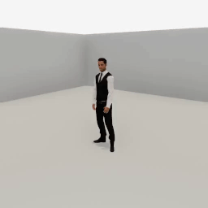
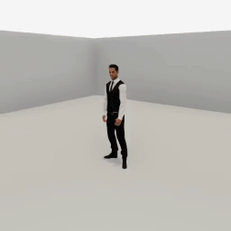
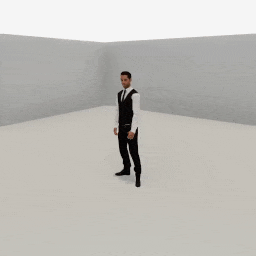

##### Replicants

# Grasp and drop objects

The Replicant can grasp and drop objects. Each hand can grasp exactly one object at a time.

## The `grasp(target, arm)` action

`grasp(target, arm)` will tell the Replicant to grasp an object. **This is a non-physics, non-motion. The Replicant WILL NOT bend its arm towards the target.** To properly grasp, first call [`reach_for(target, arm)`](arm_articulation.md), *then* `grasp(target, arm)`.

When a Replicant grasps an object, the object becomes kinematic and continuously tracks the Replicant's hand. If the object [contains other objects](../semantic_states/containment.md), those objects will also become kinematic and will be parented to the root grasped object:

```python
from tdw.controller import Controller
from tdw.tdw_utils import TDWUtils
from tdw.add_ons.replicant import Replicant
from tdw.add_ons.third_person_camera import ThirdPersonCamera
from tdw.add_ons.image_capture import ImageCapture
from tdw.replicant.action_status import ActionStatus
from tdw.replicant.arm import Arm
from tdw.backend.paths import EXAMPLE_CONTROLLER_OUTPUT_PATH


def do_action():
    """
    A helper function to handle the basic Replicant action loop.
    """

    while replicant.action.status == ActionStatus.ongoing:
        c.communicate([])
    c.communicate([])


c = Controller()
replicant = Replicant()
camera = ThirdPersonCamera(position={"x": -2.4, "y": 2, "z": 3.2},
                           look_at=replicant.replicant_id,
                           avatar_id="a")
path = EXAMPLE_CONTROLLER_OUTPUT_PATH.joinpath("replicant_grasp_basket_with_object")
print(f"Images will be saved to: {path}")
capture = ImageCapture(avatar_ids=[camera.avatar_id], path=path)
c.add_ons.extend([replicant, camera, capture])
object_id = Controller.get_unique_id()
commands = [TDWUtils.create_empty_room(12, 12)]
commands.extend(Controller.get_add_physics_object(model_name="basket_18inx18inx12iin_wicker",
                                                  object_id=object_id,
                                                  position={"x": -2, "y": 0, "z": 2}))
commands.extend(Controller.get_add_physics_object(model_name="vase_02",
                                                  object_id=Controller.get_unique_id(),
                                                  position={"x": -2, "y": 0.1, "z": 2}))
c.communicate(commands)
replicant.move_to(target=object_id)
do_action()
replicant.reach_for(target=object_id, arm=Arm.right)
do_action()
replicant.grasp(target=object_id, arm=Arm.right)
do_action()
replicant.reach_for(target={"x": 0.4, "y": 1.1, "z": 0.4}, arm=Arm.right, absolute=False)
do_action()
c.communicate({"$type": "terminate"})

```

Result:



### The target position

The Replicant will grasp the target at a position defined by the build using affordance points and bounds positions. This is identical to the system used for `reach_for(target, arm)`, which you can read about [here](arm_articulation.md).

### Grasp an object with both hands

The grasped object tracks exactly one hand, as defined by the `arm` parameter. Grasping an object with *both* hands is more of an apparent motion than a real one; you can set the offhand to follow the hand holding the object by setting `reach_for(target, arm, offhand_follows=True)`:

```python
from tdw.controller import Controller
from tdw.tdw_utils import TDWUtils
from tdw.add_ons.replicant import Replicant
from tdw.add_ons.third_person_camera import ThirdPersonCamera
from tdw.add_ons.image_capture import ImageCapture
from tdw.replicant.action_status import ActionStatus
from tdw.replicant.arm import Arm
from tdw.backend.paths import EXAMPLE_CONTROLLER_OUTPUT_PATH


def do_action():
    """
    A helper function to handle the basic Replicant action loop.
    """

    while replicant.action.status == ActionStatus.ongoing:
        c.communicate([])
    c.communicate([])


c = Controller()
replicant = Replicant()
camera = ThirdPersonCamera(position={"x": -2.4, "y": 2, "z": 3.2},
                           look_at=replicant.replicant_id,
                           avatar_id="a")
path = EXAMPLE_CONTROLLER_OUTPUT_PATH.joinpath("replicant_grasp_basket_with_object_both_hands")
print(f"Images will be saved to: {path}")
capture = ImageCapture(avatar_ids=[camera.avatar_id], path=path)
c.add_ons.extend([replicant, camera, capture])
object_id = Controller.get_unique_id()
commands = [TDWUtils.create_empty_room(12, 12)]
commands.extend(Controller.get_add_physics_object(model_name="basket_18inx18inx12iin_wicker",
                                                  object_id=object_id,
                                                  position={"x": -2, "y": 0, "z": 2}))
commands.extend(Controller.get_add_physics_object(model_name="vase_02",
                                                  object_id=Controller.get_unique_id(),
                                                  position={"x": -2, "y": 0.1, "z": 2}))
c.communicate(commands)
replicant.move_to(target=object_id)
do_action()
# Reach with both hands.
replicant.reach_for(target=object_id, arm=[Arm.right, Arm.left])
do_action()
# Grasp with the right hand.
replicant.grasp(target=object_id, arm=Arm.right)
do_action()
# Reach for a target position with the right hand; the left hand will follow.
replicant.reach_for(target={"x": 0, "y": 1.1, "z": 0.4}, arm=Arm.right, absolute=False, offhand_follows=True)
do_action()
c.communicate({"$type": "terminate"})
```

Result:



### The `angle` and `axis` parameters

A grasped object will continuously rotate relative to the hand grasping it. By default, the rotation is 90 degrees along the relative pitch axis.

The optional `angle` parameter controls the angle and the optional `axis` parameter controls the axis. The `axis` parameter is a string: `"pitch"`, `"yaw"`, or `"roll"`.

This example sets the basket to continuously rotate 45 degrees along the roll axis:

```python
from tdw.controller import Controller
from tdw.tdw_utils import TDWUtils
from tdw.add_ons.replicant import Replicant
from tdw.add_ons.third_person_camera import ThirdPersonCamera
from tdw.add_ons.image_capture import ImageCapture
from tdw.replicant.action_status import ActionStatus
from tdw.replicant.arm import Arm
from tdw.backend.paths import EXAMPLE_CONTROLLER_OUTPUT_PATH


def do_action():
    """
    A helper function to handle the basic Replicant action loop.
    """

    while replicant.action.status == ActionStatus.ongoing:
        c.communicate([])
    c.communicate([])


c = Controller()
replicant = Replicant()
camera = ThirdPersonCamera(position={"x": -2.4, "y": 2, "z": 3.2},
                           look_at=replicant.replicant_id,
                           avatar_id="a")
path = EXAMPLE_CONTROLLER_OUTPUT_PATH.joinpath("replicant_grasp_basket_with_object_roll")
print(f"Images will be saved to: {path}")
capture = ImageCapture(avatar_ids=[camera.avatar_id], path=path)
c.add_ons.extend([replicant, camera, capture])
object_id = Controller.get_unique_id()
commands = [TDWUtils.create_empty_room(12, 12)]
commands.extend(Controller.get_add_physics_object(model_name="basket_18inx18inx12iin_wicker",
                                                  object_id=object_id,
                                                  position={"x": -2, "y": 0, "z": 2}))
commands.extend(Controller.get_add_physics_object(model_name="vase_02",
                                                  object_id=Controller.get_unique_id(),
                                                  position={"x": -2, "y": 0.1, "z": 2}))
c.communicate(commands)
replicant.move_to(target=object_id)
do_action()
replicant.reach_for(target=object_id, arm=Arm.right)
do_action()
replicant.grasp(target=object_id,
                arm=Arm.right,
                angle=45,
                axis="yaw")
do_action()
replicant.reach_for(target={"x": 0.4, "y": 1.1, "z": 0.4}, arm=Arm.right, absolute=False)
do_action()
c.communicate({"$type": "terminate"})
```

Result:



If you set either `angle` *or* `axis` to None, the object will maintain its initial rotation even as the hand rotates:

```python
from tdw.controller import Controller
from tdw.tdw_utils import TDWUtils
from tdw.add_ons.replicant import Replicant
from tdw.add_ons.third_person_camera import ThirdPersonCamera
from tdw.add_ons.image_capture import ImageCapture
from tdw.replicant.action_status import ActionStatus
from tdw.replicant.arm import Arm
from tdw.backend.paths import EXAMPLE_CONTROLLER_OUTPUT_PATH

"""
Grasp a basket containing an object.
"""


def do_action():
    """
    A helper function to handle the basic Replicant action loop.
    """

    while replicant.action.status == ActionStatus.ongoing:
        c.communicate([])
    c.communicate([])


c = Controller()
replicant = Replicant()
camera = ThirdPersonCamera(position={"x": -2.4, "y": 2, "z": 3.2},
                           look_at=replicant.replicant_id,
                           avatar_id="a")
path = EXAMPLE_CONTROLLER_OUTPUT_PATH.joinpath("replicant_grasp_basket_with_object_no_rotate")
print(f"Images will be saved to: {path}")
capture = ImageCapture(avatar_ids=[camera.avatar_id], path=path)
c.add_ons.extend([replicant, camera, capture])
object_id = Controller.get_unique_id()
commands = [TDWUtils.create_empty_room(12, 12)]
commands.extend(Controller.get_add_physics_object(model_name="basket_18inx18inx12iin_wicker",
                                                  object_id=object_id,
                                                  position={"x": -2, "y": 0, "z": 2}))
commands.extend(Controller.get_add_physics_object(model_name="vase_02",
                                                  object_id=Controller.get_unique_id(),
                                                  position={"x": -2, "y": 0.1, "z": 2}))
c.communicate(commands)
replicant.move_to(target=object_id)
do_action()
replicant.reach_for(target=object_id, arm=Arm.right)
do_action()
replicant.grasp(target=object_id,
                arm=Arm.right,
                angle=None)
do_action()
replicant.reach_for(target={"x": 0.4, "y": 1.1, "z": 0.4}, arm=Arm.right, absolute=False)
do_action()
c.communicate({"$type": "terminate"})
```

Result:


### Low-level description

